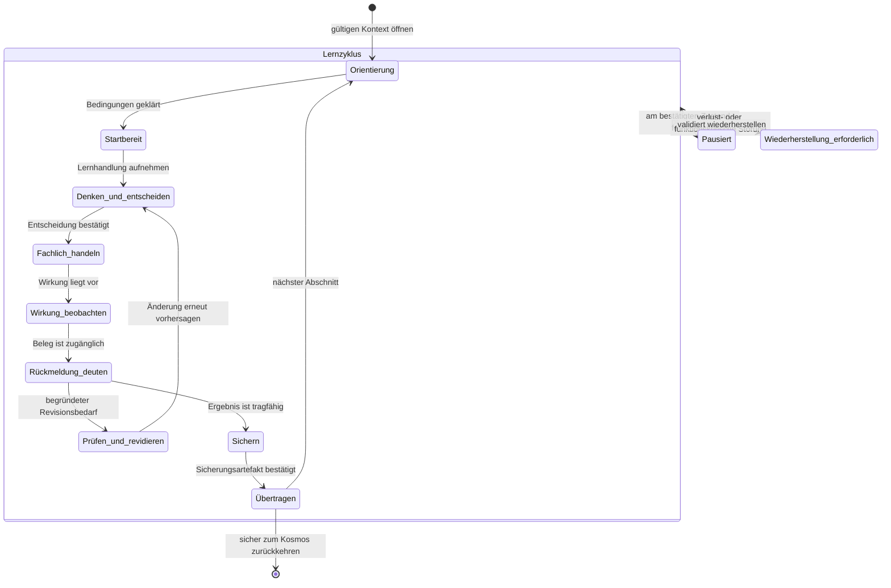

# IuM-Lernwerk – Produktarchitektur, Navigation und Lernreise

- **Task:** LXP02 Produktarchitektur Navigation und Lernreise spezifizieren
- **Status:** in Ausarbeitung; noch nicht schriftlich freigegeben
- **Fassung:** 0.1
- **Datum:** 4. August 2026
- **Geltungsbereich:** IuM-Lernwerk, Gymnasium Baden-Württemberg, Klassen 5–7, Niveau E
- **Ausgangsstand:** lokaler `main` auf `daad655`; `origin/main` auf `3498838`
- **Arbeitsgrenze:** codefreie Produktarchitektur; keine Produktimplementierung

## Entscheidung und Zweck

LXP02 übersetzt die freigegebene LXP01-Experience-Strategie in einen einzigen widerspruchsfreien Architekturvertrag für den Lernwerk-Kosmos, den Modulstart, das Lernstudio, die Sicherung, die Lehrkraftspur und die spätere Wiederaufnahme.

Die Produktarchitektur trennt zwei komplementäre Räume:

1. Der **Lernwerk-Kosmos** trägt Überblick, Zusammenhang, Auswahl, Voraussetzungen und Rückkehr.
2. Das **Lernstudio** trägt innerhalb eines Moduls die fokussierte, lehrkraftorchestrierte Folge fachlicher Lernhandlungen.

Beide Räume verwenden dieselben Lernobjekte, Zustände und Begriffe. Die Architektur beschreibt ihre fachliche Bedeutung, Informationsverantwortung, Übergänge und Ausfallgrenzen. Sie beschreibt weder Bildschirmaufteilungen noch Komponenten oder technische Router.

Der normative Lernhandlungsloop bleibt vollständig erhalten:

```text
orientieren
→ Vorwissen oder Erwartung aktivieren
→ denken und entscheiden
→ fachlich handeln
→ Wirkung oder Ergebnis beobachten
→ Rückmeldung interpretieren
→ prüfen und revidieren
→ sichern und übertragen
→ später wiederanknüpfen
```

## Status, Geltungsbereich und Nicht-Ziele

Diese Spezifikation ist ausschließlich Produktarchitekturarbeit. Sie legt Informationsobjekte, Zustände, Rollen, Begriffe, Navigationsbedeutungen, Übergänge, Persistenz- und Wiederherstellungsverhalten sowie prüfbare Qualitätsgrenzen fest.

Bis zur ausdrücklichen schriftlichen Freigabe trägt sie den Arbeitsstatus `in Ausarbeitung`. Ein technisch grüner Stand, ein vollständiger Walkthrough oder ein lokaler Commit ändert diesen Status nicht selbstständig.

Nicht Gegenstand und nicht freigegeben sind:

- Produktcode oder Änderungen an Anwendungen, Paketen, Fixtures und Tests;
- konkrete Wireframes, Seitengestaltung oder visuelle Detailgestaltung;
- Moodboard, Marken-, Typografie-, Farb-, Illustrations- oder CSS-Entscheidungen;
- Komponenten-APIs, Router-, State- oder Frameworkentscheidungen;
- eine vollständige Designsystemtaxonomie;
- Neufassung oder kosmetische Überarbeitung von IUM-5-CORE-05;
- LXP03-Experience-Entwürfe oder LXP04-Design- und Interaktionssystem;
- neue Curriculumzuordnung, Niveaudifferenzierung oder automatische Personalisierung;
- Preview, Deployment, Pilotierung, reale Geräteprüfung, LMS-Einbindung oder Release;
- Konten, Klassenverwaltung, Backend, zentrale Diagnostik, Telemetrie oder personenbezogene Lernanalyse.

LXP02 darf fachliche Architekturentscheidungen nicht an spätere visuelle Gestaltung delegieren. Es muss zugleich offenlassen, wie diese Verträge in LXP03 konkret dargestellt und in LXP04 als wiederverwendbares System ausgeformt werden.

## Normative Eingaben und Vorrangregel

### Quellen der Wahrheit

| Rang | Normative Eingabe | Funktion in LXP02 |
|---:|---|---|
| 1 | ausdrückliche schriftliche Nutzerentscheidungen | höchste Projektentscheidung; eine neuere ausdrückliche Entscheidung schlägt ältere Dokumentation |
| 2 | LXP01-Spezifikation `2026-08-04-ium-learning-experience-production-design.md`, schriftlich freigegeben | Experience-Nordstern, Lernhandlungsloop, drei Referenzsituationen, acht Qualitätsdimensionen und globale Anti-Patterns |
| 3 | Gesamtdesign `2026-07-27-ium-lernwerk-gesamtdesign.md` | Produktzweck, Curriculumrolle, Lehrkraftorchestrierung, Offenheit, Local First, Offline und Lizenzgrenzen |
| 4 | Plattformbericht `docs/platform/implementation-report.md` | belegte technische Ausgangsgrenze; keine Experience- oder Gerätefreigabe |
| 5 | IUM5-Moduldesign `2026-08-03-ium-5-core-05-moduldesign.md` | fachlicher Stresstest für die Architektur; keine UI- oder Produktfreigabe |
| 6 | diese LXP02-Spezifikation | nach schriftlicher Freigabe normativer Architekturvertrag für LXP03 und LXP04 |

### Vorrang- und Konfliktregel

- LXP02 darf LXP01 nicht stillschweigend abschwächen.
- Bei einem Widerspruch zwischen einem fachlichen Moduldetail und dem freigegebenen Experience-Vertrag gilt der Experience-Vertrag; das Moduldetail wird als späterer Neufassungsbedarf markiert.
- Belegte Plattformmechanismen begrenzen die technische Realisierbarkeit, bestimmen aber nicht die Produktarchitektur.
- Wo LXP02 eine Entscheidung bewusst offenlässt, benennt es Eigentümerphase, Entscheidungskriterium und Rückfallgrenze.
- Jede Architekturentscheidung muss mindestens einer der drei Referenzsituationen und einer Qualitätsdimension prüfbar zugeordnet werden.

## LXP02-Ergebnisvertrag

### Statuswerte der Matrix

Während der Ausarbeitung sind ausschließlich `specified`, `open-decision` und `not-applicable-with-rationale` zulässig. Vor dem schriftlichen Review muss jede Zeile `specified` sein oder eine belegte spätere Eigentümerphase mit Begründung ausweisen.

| **LXP02-ID** | erforderliches Ergebnis | normative Eingabe | Spezifikationsabschnitt | Referenzsituationsprüfung | Reviewevidenz | Status |
|---|---|---|---|---|---|---|
| LXP02-01 | Informationsarchitektur des Kosmos | LXP01 §§ 8, 11, 15, 24, 30 | Informationsarchitektur des Lernwerk-Kosmos | Referenzsituationen 1–3 | Objektvertrag, Kosmos-Sichten, Übergabe- und Navigationsinvarianten | open-decision |
| LXP02-02 | Modulstart und Startboard | LXP01 §§ 10.1, 11.2, 21, 30 | Modulstart, Startboard und Wiedereinstieg | Referenzsituation 1 | Einstiegsmatrix, Startboard-Vertrag und Zwei-Spuren-Walkthrough | open-decision |
| LXP02-03 | Zustandsmodell des Lernstudios | LXP01 §§ 9, 10, 11.3, 22, 30 | Zustandsmodell des Lernstudios | Referenzsituation 2 | Zustandsvokabular, Übergangstabelle und Zustandsdiagramm | open-decision |
| LXP02-04 | Navigation zwischen Lernphasen und Unterrichtseinheiten | LXP01 §§ 14, 15, 17, 30 | Lernphasen- und Unterrichtseinheitsnavigation | Referenzsituationen 1–3 | Bedeutungsvertrag aller Navigationshandlungen und Schutz ungesicherter Arbeit | open-decision |
| LXP02-05 | Gesamtkarte und progressive Offenlegung | LXP01 §§ 8.1, 15, 21–24, 29–30 | Gesamtkarte und progressive Offenlegung | Referenzsituationen 1–3 | Informationsklassen je Lernzustand und Widerspruchsentscheidung | open-decision |
| LXP02-06 | Neu-, Fortsetzungs- und Wiedereinstieg | LXP01 §§ 10.8, 17, 21, 23, 30 | Modulstart, Startboard und Wiedereinstieg | Referenzsituationen 1 und 3 | fünf Einstiegsmodi, sechs Fortsetzungsfälle und Wiederherstellungsregeln | open-decision |
| LXP02-07 | Sicherungsraum und Belegkarte | LXP01 §§ 10.7, 11.4, 16–17, 23–24, 30 | Fachlicher Fortschritt, Sicherungsraum und Belegkarte | Referenzsituation 3 | Fortschrittssignale, Belegkartengrammatik und Export-/Löschvertrag | open-decision |
| LXP02-08 | Lehrkraftspur | LXP01 §§ 11.5, 12.2, 18, 21–24, 30 | Lehrkraftspur und Unterrichtsorchestrierung | Referenzsituationen 1–3 | Phasen- und Interventionsverträge ohne Telemetrie | open-decision |
| LXP02-09 | Local-First-, Offline- und Fehlerzustände | LXP01 §§ 17, 20, 21–24, 30 | Local First, Offline, Fehler und Wiederherstellung | Referenzsituationen 1–3 | Schweregradmodell und Fallmatrix mit Erhaltungs- und Rückfallregeln | open-decision |
| LXP02-10 | Rollen- und Sozialformwechsel | LXP01 §§ 12, 18, 21–24, 30 | Rollen- und Sozialformwechsel | Referenzsituationen 1–3 | Übergabeverträge für Einzel-, Partner-, Gruppen- und Plenumsarbeit | open-decision |
| LXP02-11 | Begriffs- und Beschriftungsvertrag | LXP01 §§ 2, 10–20, 24–30 | Kontrollierter Begriffs- und Beschriftungsvertrag | Referenzsituationen 1–3 | kontrollierte Begriffstabelle und Konsistenzprüfung | open-decision |
| LXP02-12 | Abgrenzung zu LXP03, LXP04 und Produktimplementierung | LXP01 §§ 3, 27, 30–34 | Abgrenzung und Übergabe an LXP03 und LXP04 | Referenzsituationen 1–3 | Positiv-/Negativscope und Eigentümermatrix der Folgephasen | open-decision |

## Begriffs- und Entscheidungsledger

### Ledger-Regel

Der Begriffsledger ist die einzige Quelle für bevorzugte deutschsprachige Produktbegriffe. Neue Synonyme dürfen nicht lokal in Tabellen oder Walkthroughs eingeführt werden. Der Entscheidungsledger hält kleinere Architekturentscheidungen mit Begründung und späterem Prüfpfad fest. Materielle Änderungen des Produktcharakters benötigen ein gebündeltes Nutzerreview.

### Initiale Begriffe

| Konzept-ID | bevorzugter Begriff | vorläufige Bedeutung | verworfene oder zu prüfende Synonyme | Status |
|---|---|---|---|---|
| TERM-SPACE-COSMOS | Lernwerk-Kosmos | globaler Raum für Überblick, Zusammenhang, Auswahl und Rückkehr | Portal, Startseite, Bibliothek als gleichrangige Produktbegriffe | specified |
| TERM-SPACE-STUDIO | Lernstudio | fokussierter Arbeitsraum innerhalb eines Moduls | Werkstatt als globaler Raum, Kursraum | specified |
| TERM-SPACE-SECURE | Sicherungsraum | Raum für ausgewählte Belege, Revision, Transfer und Wiederaufnahme | Portfolio, Ablage, Archiv | open-decision |
| TERM-SPACE-TEACHER | Lehrkraftspur | rollenbezogene Orchestrierungsinformation zu denselben Lernhandlungen | Lehrkräftedashboard, Adminbereich | specified |
| TERM-OBJECT-MODULE | Modul | fachlich und curricular verantwortete, wiederaufnehmbare Lerneinheit | Kurs, Kapitel | specified |
| TERM-OBJECT-PATH | Lernpfad | begründete Folge von Unterrichtseinheiten und Lernphasen innerhalb eines Moduls; modulübergreifende Anschlüsse bleiben typisierte Beziehungen | Route, Journey | specified |
| TERM-OBJECT-EVIDENCE | Belegkarte | knapper, lokal gehaltener Beleg aus realem Produkt, Beobachtung und Revision | Badge, Kompetenzkarte, Lernpass | specified |
| TERM-OBJECT-REGION | Themenregion | lernendenseitige Kosmosordnung für einen zusammenhängenden Gegenstandsbereich | Curriculumregion, Fachgebiet, Lernstrang als gleichrangiges Label | specified |
| TERM-OBJECT-FAMILY | Modulfamilie | Gruppe fachlich verwandter Module mit gemeinsamem Gegenstand oder Anschluss | Sammlung, Paket, Kursreihe | specified |
| TERM-OBJECT-LESSON | Unterrichtseinheit | didaktisch verantworteter Zeit- und Handlungsabschnitt eines Lernpfads | UE nur als fachinterne Kurzform, Lektion, Stunde | specified |
| TERM-OBJECT-PHASE | Lernphase | fachlich-didaktische Funktion innerhalb einer Unterrichtseinheit | Abschnitt, Etappe, Station | specified |
| TERM-OBJECT-ACTION | Lernhandlung | kleinste fachlich vollständige Denk-, Prüf-, Herstellungs- oder Revisionshandlung | Aufgabe, Schritt oder Aktivität ohne Funktionsklärung | specified |
| TERM-OBJECT-SECURING | Sicherungsartefakt | lokal gehaltenes, ausgewähltes Ergebnis einer Lernhandlung mit Anschlussfunktion | Abgabe, Nachweis, Datei als generischer Oberbegriff | specified |
| LS-ORIENT | Orientierung | Ziel, Kontext, Position, Voraussetzung und nächsten sinnvollen Einstieg verstehen | Willkommen, Intro, Startseite | specified |
| LS-READY | Startbereit | Ziel, notwendige Voraussetzungen, Verfügbarkeit und Startfolgen sind geklärt | freigeschaltet, bereit ohne Bedingung | specified |
| LS-DECIDE | Denken und entscheiden | Erwartung, Vorhersage, Einordnung, Strategie oder Qualitätsentscheidung bilden | Eingabe, Aufgabe bearbeiten | specified |
| LS-ACT | Fachlich handeln | ein Modell, Produkt oder Prüfobjekt gezielt verändern oder ausführen | klicken, interagieren, spielen | specified |
| LS-OBSERVE | Wirkung beobachten | Ergebnis, Zustandsänderung oder Beleg wahrnehmen und mit der Handlung verbinden | Ergebnis ansehen ohne fachliche Funktion | specified |
| LS-INTERPRET | Rückmeldung deuten | Beobachtung mit Erwartung und Kriterium vergleichen und nächsten Prüfschritt bestimmen | richtig/falsch, Auswertung | specified |
| LS-REVISE | Prüfen und revidieren | eine begründete Änderung wählen, durchführen und erneut prüfbar machen | korrigieren, noch einmal versuchen | specified |
| LS-SECURE | Sichern | Kernaussage, Beleg, Revision und Grenze als anschlussfähigen Stand bestätigen | abschließen, abgeben | specified |
| LS-TRANSFER | Übertragen | das gesicherte Konzept auf eine veränderte Beziehung oder einen neuen Fall anwenden | Bonus, Zusatzaufgabe | specified |
| LS-PAUSE | Pausiert | einen bestätigten Zwischenstand verlassen und den Rückkehrpunkt verständlich bewahren | beendet, abgebrochen | specified |
| LS-RECOVER | Wiederherstellung erforderlich | nach technischer oder versionsbezogener Störung den erhaltbaren Stand und sichere Optionen klären | Fehlerseite, kaputt | specified |

### Initiale Entscheidungen

| Entscheidungs-ID | Entscheidung | Begründung | Folgeprüfung | Status |
|---|---|---|---|---|
| DEC-LXP02-001 | Kosmos und Lernstudio bleiben getrennte, aber begrifflich und objektseitig verbundene Räume. | Das senkt Navigationslast im Lernstudio, ohne Überblick und Modularität zu verlieren. | alle drei Referenzsituationen; Q1, Q2 und Q5 | beschlossen durch LXP01 |
| DEC-LXP02-002 | Zustände beschreiben Lernbedeutung, nicht Seiten, Komponenten oder Klickereignisse. | Die Architektur muss fachliche Kontinuität tragen und implementierungsneutral bleiben. | Referenzsituation 2; Q1, Q4 und Q7 | specified |
| DEC-LXP02-003 | Fortschritt entsteht ausschließlich aus fachlich bedeutsamen Handlungen oder gesicherten Ergebnissen. | Klick-, Zeit- und Rangdaten widersprechen dem Experience- und Datenschutzvertrag. | Referenzsituationen 2 und 3; Q3, Q5 und Q8 | beschlossen durch LXP01 |
| DEC-LXP02-004 | Lehrkraftspur und Lernendenspur verwenden dieselben Objekte, Zustände und Beschriftungen. | Unterrichtsorchestrierung darf kein zweites Produkt oder eine parallele Taxonomie erzeugen. | alle drei Referenzsituationen; Q6 | beschlossen durch LXP01 |
| DEC-LXP02-005 | `Themenregion` ist der sichtbare Oberbegriff im Kosmos; curriculare Lernstränge sind zugeordnete Lehrkraftmetadaten. | Eine zweite, nur für Lehrkräfte sichtbare Inhaltshierarchie würde Start, Rückkehr und Unterrichtsgespräch auseinanderführen. | Kosmos-Vertrag und alle drei Referenzsituationen; Q1 und Q6 | specified |
| DEC-LXP02-006 | Bei einem lehrkraftgeleiteten Ziel besitzt der gemeinsame Unterrichtsstart Primat; ein abweichender lokaler Fortsetzungspunkt wird sichtbar geparkt und bleibt später unverändert erreichbar. | Unterrichtskoordination darf lokalen Lernstand weder überschreiben noch unbemerkt mit einem anderen Pfad verschmelzen. | Referenzsituationen 1 und 3; Q5, Q6 und Q8 | specified |
| DEC-LXP02-007 | Das Lernstudio verwendet elf fachliche Zustände einschließlich `Startbereit`, `Pausiert` und `Wiederherstellung erforderlich`; Zustände bilden keine Seiten oder Komponenten ab. | Die Schwelle zum Lernen, verlustfreie Unterbrechung und Recovery benötigen eine eigene verständliche Bedeutung, ohne Klickereignisse zu modellieren. | Referenzsituationen 1–3; Q1, Q4, Q5 und Q8 | specified |

## Informationsarchitektur des Lernwerk-Kosmos

### Architekturprinzip und Eigentumsregel

Der Lernwerk-Kosmos ist kein Dateiverzeichnis und keine freie Materialsammlung. Er ist der globale Orientierungs- und Auswahlraum eines fachlich geordneten Lernwerks. Seine primäre Eigentumskette lautet:

```text
Lernwerk-Kosmos
└─ Themenregion
   └─ Modulfamilie
      └─ Modul
         └─ Lernpfad
            └─ Unterrichtseinheit
               └─ Lernphase
                  └─ Lernhandlung
                     └─ Sicherungsartefakt
```

Querverbindungen wie Voraussetzung, Kernweg, späterer Anschluss, Transfer oder curriculare Lernstränge sind benannte Beziehungen. Sie erzeugen keine zweite Eigentumshierarchie. Jedes Objekt hat genau einen primären Elternkontext, darf aber mehrere ausdrücklich typisierte Querverbindungen besitzen.

### Objektvertrag

| Objekt | Zweck | lernendensichtbare Identität | Orchestrierungsdaten für Lehrkräfte | primärer Elternkontext | zulässige Kinder | Eintrittshandlung | lokaler Lernstand |
|---|---|---|---|---|---|---|---|
| Lernwerk-Kosmos | Gesamtüberblick, Zusammenhang, Auswahl, Wiederaufnahme und lokale Datenhoheit | Name des Lernwerks, Jahrgangsbezug, Themenregionen, aktuelle und letzte Arbeiten | Geltungsbereich, curriculare Abdeckung, Arbeitsstand, Lizenz- und Einsatzgrenzen | keiner | Themenregionen | Themenregion erkunden, Arbeit fortsetzen oder vorbereiteten Startpunkt öffnen | kein globaler Kompetenz- oder Abschlussstand; nur lokale Verweise auf aktuelle und letzte Arbeiten |
| Themenregion | einen fachlich zusammenhängenden Gegenstandsbereich verständlich ordnen | verständlicher Gegenstand, Leitfrage, Jahrgangs- und Anschlussrahmen | curriculare Lernstränge, Pflicht-/Wahlanteile, Progressionsbezug und Abdeckungsstatus | Lernwerk-Kosmos | Modulfamilien | Modulfamilie auswählen oder empfohlenen Anschluss prüfen | kein eigener Fortschrittswert; aktuelle Module dürfen abgeleitet sichtbar sein |
| Modulfamilie | verwandte Module vergleichbar machen und ihre Beziehungen erklären | gemeinsamer Gegenstand, Unterschiede, Voraussetzungen und typische Lernprodukte | Modulrollen, Zeitkorridore, Curriculumbezüge, Varianten und Abhängigkeiten | Themenregion | Module | Module vergleichen oder ein geeignetes Modul öffnen | kein eigener Stand; letzte Arbeit in enthaltenen Modulen darf abgeleitet werden |
| Modul | eine fachlich und curricular verantwortete, wiederaufnehmbare Lerneinheit bündeln | Titel, Leitfrage, Lernprodukt, Voraussetzungen, Zeitkorridor, Arbeitsstand und Anschlüsse | Modul-ID/-version, Curriculumvertrag, Unterrichtsvarianten, Material-, Offline- und Statusgrenzen | Modulfamilie | Lernpfade | Startboard öffnen | Fortsetzungspunkt, kompatible Version und gesicherte Artefakte; niemals Kompetenzwert |
| Lernpfad | eine begründete Folge von Unterrichtseinheiten für einen Einsatzweg ordnen | Zweck, regulärer oder begründet alternativer Weg, Gesamtkarte und aktueller Anschluss | Zeitmodell, Pfadbedingungen, gemeinsame Haltepunkte, optionale Vertiefung und Fallbacks | Modul | Unterrichtseinheiten | neue oder fortzusetzende Unterrichtseinheit auswählen beziehungsweise lehrkraftgeleitet öffnen | aktueller Pfad und letzte sinnvoll abgeschlossene Funktion; kein Prozentwert aus Seitenbesuchen |
| Unterrichtseinheit | einen didaktisch verantworteten Zeit- und Handlungsabschnitt tragen | heutige Leitfrage, erwarteter Zwischenstand, Zeitkorridor und Sozialform | Lernfunktion, Verlaufsoptionen, Material, Haltepunkte und Sicherungsziel | Lernpfad | Lernphasen | Startboard des Abschnitts bestätigen und erste Lernphase beginnen | aktueller Eintritt, sinnvoll abgeschlossene Lernphase und offener Sicherungsbedarf |
| Lernphase | eine fachlich-didaktische Funktion innerhalb der Unterrichtseinheit erfüllen | Funktionslabel, aktuelles Ziel, erwartetes Ergebnis und Anschluss | Phasenfunktion, Zeitkorridor, typische Vorstellungen, Interventionen und Übergangsbedingung | Unterrichtseinheit | Lernhandlungen | nächste fachlich sinnvolle Lernhandlung aufnehmen | nur fachlich begründeter Zustand wie Erwartung formuliert, erprobt, revidiert oder gesichert |
| Lernhandlung | eine fachlich vollständige Denk-, Entscheidungs-, Prüf-, Herstellungs- oder Revisionshandlung ausführen | eindeutiger Auftrag, relevante Repräsentationen, Kriterium und nächster Prüfschritt | Lernfunktion, erwartbare Abweichung, Hilfe, Beobachtungsanlass und Haltepunkt | Lernphase | Sicherungsartefakte | Handlung beginnen, fortsetzen, prüfen oder revidieren | erforderliche Produktspuren und Zustand für verlustfreie Fortsetzung; keine Klick- oder Versuchshistorie |
| Sicherungsartefakt | einen von der lernenden Person ausgewählten fachlichen Stand für Vergleich, Transfer und Wiedereinstieg halten | Kontext, Entscheidung/Modell, Beobachtung, Revision, Kernaussage und Anschluss | fachliche Kriterien, Gesprächsfunktion, Wiederaufnahme- und Exportoption | erzeugende Lernhandlung | keine Eigentumskinder; typisierte Bezüge auf Transfer- und spätere Lernhandlungen | ansehen, vergleichen, revidieren, bewusst exportieren oder für Transfer verwenden | Artefaktinhalt, Schemaversion und nur für Wiederherstellung nötige Zeit-/Versionsangaben |

#### Objektinvarianten und Fehlerkriterien

- Ein Objekt ist ungültig, wenn Lernende seinen Zweck, Elternkontext oder nächsten sinnvollen Eintritt nicht bestimmen können.
- Ein Objekt ist ungültig, wenn Lehrkräfte für denselben Inhalt eine abweichende Taxonomie oder ein anderes Phasenlabel benötigen.
- Ein lokaler Stand ist ungültig, wenn er aus Zeit, Klicks, Scrolltiefe, Hilfenutzung, Fehlversuchen oder einer abgeleiteten Personenbewertung besteht.
- Eine Querverbindung ist ungültig, wenn sie wie eine Eigentumsbeziehung erscheint, aber keine eindeutige Rückkehr zum primären Elternkontext erlaubt.
- Ein Sicherungsartefakt darf auf andere Lernhandlungen verweisen, bleibt aber dem erzeugenden Kontext und der lernenden Person auf dem lokalen Gerät zugeordnet.

### Informationsverantwortungen der Kosmos-Sichten

Eine Kosmos-Sicht ist eine Informationsverantwortung, kein festgelegter Bildschirm. Mehrere Verantwortungen dürfen später in einer konkreten Darstellung verbunden werden, sofern ihre Fragen und Rückwege erhalten bleiben.

| Sicht | beantwortete Frage | Mindestinformation | primäre Handlung | zulässige Nebenhandlungen | Leerzustand | Offlinezustand | Rückweg |
|---|---|---|---|---|---|---|---|
| Überblick und Orientierung | Welche fachlichen Bereiche und Lernwege gehören zum Lernwerk, und wo kann ich sinnvoll beginnen? | Themenregionen, empfohlene Kernanschlüsse, Jahrgangsbezug, Voraussetzungen, Modulstatus und Bedeutung lokaler Arbeit | Themenregion oder aktuellen Anschluss öffnen | Hilfe, Accessibility, Lizenz-/Statusgrenze, lokale Arbeit aufrufen | erklärt den noch nicht verfügbaren Geltungsbereich, ohne leere Fortschrittsanzeige oder erfundene Empfehlungen | zeigt nur nachweislich lokal verfügbare Regionen/Module als offline bereit und markiert übrige als nicht verfügbar | Ausgangspunkt des Kosmos; vorheriger Modulkontext bleibt als Rückkehrziel erhalten |
| Suchen und Filtern | Welche vorhandenen Module passen zu einem bekannten Gegenstand, Jahrgang, Lernprodukt oder Einsatzbedarf? | kontrollierte Suchbegriffe, aktive Einschränkungen, Trefferbegründung, Voraussetzungen und Offlinebereitschaft | passenden Modultreffer öffnen | Filter zurücksetzen, Module vergleichen, Elternregion öffnen | benennt, welche Einschränkungen zu keinem Treffer führen, und bietet Rücksetzen statt inhaltlicher Erfindung | durchsucht den bekannten Katalog, kennzeichnet aber nicht lokal verfügbare Inhalte ehrlich | zur vorherigen Kosmos-Sicht mit erhaltenem Suchkontext oder zur Elternregion |
| Modulvergleich | Welches von wenigen fachlich verwandten Modulen passt zu Ziel, Zeit und Voraussetzungen? | Leitfrage, Lernprodukt, Voraussetzung, Zeitkorridor, Modulrolle, Arbeitsstand, Offlinebereitschaft und Anschluss | ein Modulstartboard öffnen | Vergleich verlassen, Voraussetzung öffnen, Lehrkraftinformationen bedarfsgerecht erweitern | erklärt, warum aktuell kein vergleichbares Modul vorliegt; erzeugt keine Rangliste | Vergleich bleibt lesbar, Start ist nur für vollständig verfügbare Inhalte möglich | zur Modulfamilie mit erhaltenem Vergleichskontext |
| Aktuelle und letzte Arbeiten | Wo kann ich eine fachlich begonnene oder gesicherte Arbeit sinnvoll fortsetzen? | Modul, Lernpfad, letzter sinnvoller Schritt, letzter gesicherter Stand, Versions-/Wiederherstellungsstatus | validierte Fortsetzung öffnen | Startboard ansehen, Sicherungsartefakt prüfen, lokale Daten verwalten | erklärt, dass noch keine lokale Arbeit vorliegt, und führt zurück zu Themenregionen | zeigt ausschließlich tatsächlich lokale Stände und ihre verfügbare Inhaltsbasis | zum vorherigen Kosmos-Kontext; Fortsetzung öffnet zuerst den Wiedereinstiegsvertrag |
| Vorbereiteter Startpunkt | Welche Unterrichtseinheit oder Lernphase soll jetzt gemeinsam beginnen, und was muss ich bestätigen? | Zielobjekt, Lehrkraftquelle als Unterrichtskontext, Leitfrage, Zeit, Sozialform, Material, Offlinebereitschaft und abweichender lokaler Stand | Startboard für das Zielobjekt öffnen | Elternmodul prüfen, lokalen Stand vergleichen, Start abbrechen | erklärt ungültigen oder nicht mehr verfügbaren Startpunkt und bietet den Elternkontext | Start nur, wenn Zielinhalt vollständig lokal verfügbar ist; sonst sichere Alternative oder Abbruch | zum Ursprung des Direktlinks oder zum Elternmodul, ohne lokalen Stand zu verändern |
| Hilfe, Accessibility und lokale Daten | Wie bediene ich das Lernwerk gleichwertig und wie kontrolliere ich meine lokalen Arbeiten? | verständliche Bedienhilfe, Tastatur-/Touch-/Textpfade, Anzeige-/Bewegungsoptionen, Speicherstatus, Export, Import und Löschung | konkretes Hilfs- oder Datenanliegen ausführen | zum aktuellen Lernkontext zurückkehren, Sensibilitätshinweise öffnen | keine lokal gespeicherten Arbeiten wird als normaler Zustand erklärt | alle lokal ausführbaren Kontrollen bleiben verfügbar; netzabhängige Hilfe wird als solche gekennzeichnet | exakt zum zuvor aktiven Kontext und möglichst zur auslösenden Handlung zurück |

Suchen und Filtern bleibt erhalten, weil ein wachsender offener Kosmos ohne gezielten Zugang unzumutbar wäre. Es darf jedoch weder algorithmische Personalisierung noch eine aus Nutzung abgeleitete Empfehlung erzeugen. Ein Filter reduziert Sichtbarkeit nach ausdrücklich gewählten Sachmerkmalen; er verändert keine Lernpfade oder lokalen Stände.

### Übergabevertrag vom Kosmos zum Lernstudio

Die Übergabe ist ein konzeptioneller Vertrag, kein URL-, Router- oder Datenbankschema. Vor dem Eintritt werden Ziel, Modus, Verfügbarkeit und möglicher Konflikt mit lokalem Stand geklärt.

| Übergabefeld | Bedeutung | lernendensichtbar | lehrkraftsichtbar | lokal persistent | nur Sitzung |
|---|---|:---:|:---:|:---:|:---:|
| ausgewähltes Modul | fachlicher und versionierter Zielkontext | ja | ja | ja, als Fortsetzungsbezug | nein |
| beabsichtigter Lernpfad | regulärer oder ausdrücklich gewählter Einsatzweg | ja | ja | ja, nach bestätigtem Start | bis zur Bestätigung |
| Unterrichtseinheit-/Lernphasenziel | aktueller gemeinsamer oder individueller Zielabschnitt | ja | ja | ja, sobald fachlich aufgenommen | bis zur Bestätigung |
| Startmodus | Neueinstieg, lehrkraftgeleiteter Start, Fortsetzung, Wiedereinstieg oder Wiederherstellung | ja | ja | nur resultierender Fortsetzungszustand | ja |
| Sozialform | Einzel-, Partner-, Gruppen- oder Plenumsphase | ja | ja | nein, sofern sie nicht für eine offene Übergabe nötig ist | ja |
| Zeitkorridor | realistische Unterrichtszeit für den Zielabschnitt | ja | ja | nein | ja |
| lokale Fortsetzung | letzter sinnvoller Schritt, gesicherter Stand, Version und Konfliktstatus | ja, zusammengefasst | nur im Unterrichtsgespräch oder durch lernendenseitige Auswahl; keine Fernsicht | ja | nein |
| Offlinebereitschaft | belegte lokale Verfügbarkeit des für den Zielabschnitt benötigten Kerns | ja | ja | technischer Verfügbarkeitsstand, keine Lernanalyse | aktueller Prüfstatus |
| Herkunft und Rückkehr | Kosmos-Sicht, Elternkontext oder ausdrücklich vorbereiteter Direktstart | ja als verständliche Rückkehrbedeutung | ja | nein | ja |

Ein Übergabefeld darf nur persistiert werden, wenn es fachliche Kontinuität oder Wiederherstellung trägt. Die Lehrkraftsicht entsteht aus demselben Inhaltsvertrag und aus gewöhnlicher Unterrichtsbeobachtung; sie erhält keinen Zugriff auf lokale Produktspuren eines fremden Geräts.

### Globale Navigationsinvarianten

| NAV-ID | normative Invariante | prüfbarer Fehlerfall |
|---|---|---|
| NAV-G-01 | Ein Wechsel des globalen Raums verwirft, überschreibt oder bestätigt lokale Arbeit niemals stillschweigend. | Nach Rückkehr ist ein ungesicherter oder zuletzt bestätigter fachlicher Stand ohne ausdrückliche Entscheidung verändert oder verloren. |
| NAV-G-02 | Die Rückkehr zum Kosmos bewahrt Modul, Lernpfad, Unterrichtseinheit und offenen Sicherungsbedarf als Elternkontext. | Der Kosmos zeigt nur eine generische Startlage und kann den vorherigen Modulkontext nicht benennen. |
| NAV-G-03 | Globale Navigation bleibt erreichbar, besitzt aber im Lernstudio kein gleiches Informationsprimat wie die aktuelle Lernhandlung. | Eine globale Auswahl konkurriert in Benennung, Fokusreihenfolge oder Ankündigung mit der fachlichen Primärhandlung. |
| NAV-G-04 | Jeder Direkteinstieg besitzt einen rekonstruierbaren Elternkontext und einen sicheren Abbruch-/Rückweg. | Ein Direktlink endet bei Abbruch in einem unbestimmten Zustand oder zwingt zum Start. |
| NAV-G-05 | `Browser-Zurück` bedeutet zeitliche Rückkehr im Nutzungspfad; `zurück` bedeutet den benannten fachlichen Vorgängerkontext; `zum Kosmos` bedeutet Wechsel in den globalen Überblick. | Zwei dieser Handlungen tragen dieselbe Beschriftung, führen unerwartet zum selben Ziel oder verlieren Kontext. |
| NAV-G-06 | Browser-Zurück, explizites Zurück und Wechsel zum Kosmos schützen ungesicherte Arbeit gleichwertig und kündigen notwendige Bestätigung vor dem Verlassen an. | Nur einer der drei Wege schützt einen noch nicht persistent bestätigten fachlichen Stand. |
| NAV-G-07 | Offline-Navigation behauptet Verfügbarkeit nur nach positiver lokaler Prüfung des benötigten Inhalts und der Kernassets. | Ein Modul oder Zielabschnitt erscheint startbereit, obwohl eine erforderliche Ressource nicht lokal vorhanden ist. |
| NAV-G-08 | Ein nicht verfügbares Offlineziel bietet Elternkontext, verständlichen Grund und sichere Alternative, verändert aber keinen Lernstand. | Das Öffnen erzeugt einen falschen Fortschritt, einen leeren Modulstand oder eine Sackgasse. |
| NAV-G-09 | Hilfe-, Accessibility- und Datenwege kehren zum auslösenden Lernkontext und, wo technisch möglich, zur auslösenden Handlung zurück. | Nach einer Hilfs- oder Datenhandlung muss die aktuelle Lernphase neu gesucht oder aus dem Gedächtnis rekonstruiert werden. |

### Kosmos-Vertragsprüfung

Der Kosmos-Vertrag besteht nur, wenn:

- Lernende für jedes geöffnete Objekt Ziel, Elternkontext, Voraussetzungen und Rückkehr benennen können;
- Lehrkräfte dasselbe Modul, denselben Lernpfad und dieselbe Lernphase ohne Paralleltaxonomie vorbereiten und starten können;
- lokale Fortsetzung sichtbar, aber nicht als Kompetenzprofil oder Rang dargestellt wird;
- nicht verfügbare Offlineziele ehrlich begrenzt und ohne Zustandsmutation abgefangen werden;
- `Browser-Zurück`, `zurück` und `zum Kosmos` in Bedeutung und Schutzverhalten unterscheidbar bleiben;
- ein Einstieg in das Lernstudio erst nach geklärtem Ziel, Startmodus, lokalen Konflikten und Offlinebereitschaft erfolgt.

## Modulstart, Startboard und Wiedereinstieg

### Funktion des Startboards

Das Startboard ist der verbindliche Orientierungszustand vor Beginn oder Wiederaufnahme eines Lernabschnitts. Es ist kein Werbeauftakt und keine vollständige Modulkarte. Es bringt Kosmoskontext, Unterrichtsziel, lokale Kontinuität und technische Bereitschaft in eine entscheidbare Form.

Das Startboard darf erst ins Lernstudio übergeben, wenn Zielobjekt, Startmodus, notwendige Sozialform/Materialien, lokale Fortsetzungskonflikte und Offlinebereitschaft geklärt sind. Eine bloße Navigation auf die Moduladresse erzeugt noch keinen Lernfortschritt und keinen neuen lokalen Arbeitsstand.

### Fünf Einstiegsmodi

| Einstiegsmodus | Auslöser | vertrauenswürdiger Kontext | zu bestätigende Information | primäre Handlung | Abbruch-/Rückweg | Bedingung für Fortsetzung |
|---|---|---|---|---|---|---|
| Neueinstieg | Lernende Person öffnet ein noch nicht begonnenes Modul aus Themenregion, Modulfamilie oder Vergleich | versionierter Modulvertrag, Elternkontext, Voraussetzungen und positiv geprüfte Inhaltsverfügbarkeit | Leitfrage, Lernprodukt, Voraussetzung, Zeitkorridor, erster Abschnitt, Sozialform/Material und Offlinebereitschaft | `neu beginnen` | `zur Modulfamilie` oder benannter Kosmoskontext; es entsteht kein lokaler Stand | Voraussetzungen sind verstanden oder lehrkraftseitig geklärt; benötigter Kerninhalt ist verfügbar; erster Lernabschnitt ist eindeutig |
| lehrkraftgeleiteter Start | vorbereiteter Direktstart oder im Unterricht benannter Zielabschnitt wird geöffnet | gültiges Modul-/Phasenziel aus demselben Inhaltsvertrag; Lehrkraftquelle ist Kontext, keine Identität oder Fernsteuerung | gemeinsames Ziel, aktueller Abschnitt, Zeit, Sozialform, Material, Abweichung vom lokalen Fortsetzungspunkt und Rückweg | `zum gemeinsamen Start` | `Start abbrechen` führt zum Elternmodul oder Direktstart-Ursprung, ohne lokalen Stand zu verändern | Zielinhalt ist verfügbar; ein abweichender lokaler Stand wurde sichtbar geparkt; Startentscheidung ist bestätigt |
| Fortsetzung auf demselben Gerät | Kosmos oder Startboard findet genau einen gültigen lokalen Fortsetzungspunkt | vollständig validierter lokaler Zustand, passende Modul- und Schemaversion, bestätigte Produktspuren | letzter sinnvoller Schritt, offener Auftrag, letzter gesicherter Stand, aktuelles Ziel und Offlinebereitschaft | `fortsetzen` | `Startboard ansehen` oder `zum Kosmos`; lokaler Stand bleibt unverändert | Zustand und Inhalt sind kompatibel; keine offene Wiederherstellungs- oder Sicherungsentscheidung blockiert |
| Wiedereinstieg nach längerer Unterbrechung | lokaler Zustand ist gültig, aber Kontext muss fachlich rekonstruiert werden | validierter lokaler Zustand, Elternkontext, letzte bestätigte Belegkarte und aktueller Inhaltsvertrag | „Darum geht es“, „Hier warst du“, letzter gesicherter Stand, offene fachliche Entscheidung, nächster Schritt und optional Gesamtkarte | `wieder einsteigen` | `später fortsetzen` oder `zum Kosmos`; keine Dringlichkeit oder Streak | ein knapper aktiver Erinnerungsimpuls ist bearbeitet, sofern die Lernfunktion Abruf verlangt; sonst gelten die Fortsetzungsbedingungen |
| Wiederherstellung | Offline-, Update-, Speicher-, Import- oder Versionsstörung verhindert direkte Fortsetzung | letzter bestätigter lokaler Stand oder validierte Exportdatei, unveränderte Altversion, bekannte Inhalts-/Schemaversion und Fehlerklasse | betroffene Arbeit, erhaltener Stand, nicht wiederherstellbarer Anteil, sichere Optionen und Folgen jeder Wahl | `wiederherstellen`, `alte Fassung fortsetzen` oder `Export sichern` je Fall | `abbrechen und Stand erhalten`; niemals automatischer Reset | eine verlustfreie Fortsetzung ist belegt oder die lernende Person hat eine verständliche, nicht rückgängig gemachte Recovery-Entscheidung getroffen |

`Neueinstieg`, `Fortsetzung`, `Wiedereinstieg` und `Wiederherstellung` sind keine Synonyme. `Fortsetzung` nimmt einen verständlichen gültigen Stand direkt wieder auf; `Wiedereinstieg` rekonstruiert zusätzlich den fachlichen Kontext; `Wiederherstellung` behandelt eine technische oder versionsbezogene Störung.

### Informationsvertrag des Startboards

| Frage in Lernendensprache | verpflichtende Antwort | Sichtbarkeitsklasse | Steuerungsrecht |
|---|---|---|---|
| Worum geht es? | Leitfrage oder verständliche Herausforderung und Einordnung in das Modul | immer im Orientierungskern | inhaltlich durch Modulvertrag; Lehrkraft darf rahmen, nicht durch anderes Ziel ersetzen |
| Was kann ich danach tun oder erklären? | beobachtbare fachliche Handlungsfähigkeit und erwartetes Lern- oder Zwischenprodukt | immer im Orientierungskern | durch Lernzielvertrag; keine Kompetenzstufe oder Erfolgsprognose |
| Wo bin ich jetzt? | Themenregion, Modul, Lernpfad und aktuelle Unterrichtseinheit/Lernphase in knapper Form | immer im Orientierungskern | aus Objektvertrag; nicht lehrkraftabhängig |
| Was ist die nächste sinnvolle Handlung? | genau eine primäre fachliche Start-, Fortsetzungs-, Wiedereinstiegs- oder Recovery-Handlung | immer dominant | der Einstiegsmodus bestimmt das Verb; die Lehrkraft darf den gemeinsamen Zielabschnitt setzen |
| Wie viel Unterrichtszeit ist vorgesehen? | realistischer Korridor für den aktuellen Abschnitt, keine individuelle Restzeitprognose | immer für den aktuellen Abschnitt sichtbar; Pfaddetails erweiterbar | Lehrkraft wählt unter freigegebenen Zeitpfaden und macht Abweichungen sichtbar |
| Welches Material und welche Sozialform brauche ich? | benötigtes Gerät/Material und Einzel-, Partner-, Gruppen- oder Plenumsform einschließlich nächstem Wechsel | sichtbar, sobald für den Start handlungsrelevant | Lehrkraft wählt unter den fachlich erlaubten Optionen; Wert bleibt für Lernende sichtbar |
| Ist der benötigte Inhalt offline verfügbar? | ehrlicher Bereitschaftsstatus für den Zielabschnitt, nicht bloß allgemeiner Onlinestatus | bei positiver Bereitschaft kompakt; bei Einschränkung entscheidungsnah oder blockierend | System prüft lokal; Lehrkraft kann nur eine fachlich vorgesehene Alternative wählen |
| Welche lokale Arbeit wird verwendet oder wiederhergestellt? | letzter sinnvoller Schritt, letzter gesicherter Stand, Versionsstatus und gegebenenfalls geparkter Konflikt | bei vorhandenem Stand immer knapp sichtbar; Details erweiterbar | lernende Person entscheidet über Import, Wiederherstellung, Verwerfen oder späteres Fortsetzen; keine Fernsicht der Lehrkraft |
| Wie kehre ich ohne Verlust zurück? | benanntes Rückkehrziel, Speicher-/Sicherungsbedarf und Verhalten bei Abbruch | immer in verständlicher Kurzform | durch Navigationsvertrag; nicht deaktivierbar |

#### Informationspriorität

1. **Immer dominant:** fachliche Leitfrage, erwartete Handlungsfähigkeit, aktuelle Position und nächste sinnvolle Handlung.
2. **Immer vorhanden, aber nach Bedarf kompakt:** Zeitkorridor, Sozialform, Material, Rückkehr und positiver Offline-/Speicherstatus.
3. **Progressiv verfügbar:** Gesamtkarte, Voraussetzungen im Detail, vollständige Lehrkraftbegründung, Lizenz-/Quellenangaben, Datenformat- und Versionsdetails.
4. **Lehrkraftgesteuert, aber lernendensichtbar:** gemeinsamer Zielabschnitt, regulärer/erweiterter Zeitpfad, Sozialform, bereitgestelltes Material und gemeinsamer Auftakt.
5. **Nie wegen Offenlegungslogik verborgen:** Datenverlustgefahr, inkompatibler Stand, fehlender Kerninhalt, irreversible Löschung, abweichendes Lehrkraftziel oder ein Rückweg mit Folgen für ungesicherte Arbeit.

Das Startboard ist fehlerhaft, wenn technische Normalzustände die Leitfrage verdrängen, mehrere gleichgewichtige Startaktionen erscheinen oder Lernende die Folgen von Start, Fortsetzung und Abbruch nicht unterscheiden können.

### Fortsetzungs-, Konflikt- und Versionsfälle

| Fall | sichtbare Bedeutung | primäre Handlung | zulässiger Resume-Punkt | erhaltener Stand | verbotenes Verhalten |
|---|---|---|---|---|---|
| kein lokaler Stand | „Du beginnst diesen Lernweg neu.“ | `neu beginnen` | erster fachlich vorgesehener Abschnitt | keiner; Stand entsteht erst nach tatsächlicher Aufnahme einer Lernhandlung | leeren Fortschritt oder Abschlusswerte anlegen; einen Start vortäuschen |
| genau ein gültiger Fortsetzungsstand | „Hier hast du zuletzt fachlich sinnvoll weitergearbeitet.“ | `fortsetzen` | letzter bestätigter sinnvoller Schritt, nicht letzte URL oder letzter Klick | Ausgangs-/Produktstand, Beleg und offene Handlung | automatisch in die zuletzt besuchte Oberfläche springen, wenn deren Lernkontext nicht mehr gültig ist |
| Lernphase abgeschlossen, Sicherung offen | „Die Arbeit ist fachlich erprobt; die Sicherung ist noch offen.“ | `Sicherung fortsetzen` | Beginn der Sicherung mit Vergleich von Produkt, Beobachtung und Kriterium | abgeschlossene Phase, Produkt- und Revisionsstand | Phase als vollständig gesichert markieren oder direkt zu Transfer/folgender Einheit springen |
| ältere kompatible Inhaltsversion | „Dein Stand kann mit dieser Fassung weiterverwendet werden.“ | `Stand prüfen und fortsetzen` | fachlich entsprechender Schritt nach deterministischer, verlustfreier Migration | Original bleibt bis bestätigter Migration/Export wiederherstellbar | still migrieren, Feldverluste verschweigen oder alten Stand überschreiben, bevor Validierung und Bestätigung abgeschlossen sind |
| inkompatibler oder beschädigter Stand | „Dieser Stand kann nicht sicher übernommen werden.“ | `Export sichern` oder fallbezogen `Wiederherstellung öffnen` | nur nach vollständiger Validierung einer sicheren Alternative; sonst kein Resume | unveränderte Eingabe-/Importdatei und letzter bestätigter aktiver Stand | Teilimport, automatische Zusammenführung, Reset, fehlerhafte Daten ausführen oder aktiven Stand mutieren |
| Lehrkraftziel weicht vom lokalen Punkt ab | „Die Klasse startet heute hier; deine bisherige Arbeit bleibt erhalten.“ | `zum gemeinsamen Start` | lehrkraftgeleitetes Ziel als neuer Unterrichtskontext; lokaler Punkt wird geparkt | bisheriger Fortsetzungspunkt, Belege und offene Sicherung bleiben separat erreichbar | lokalen Punkt überschreiben, automatisch abschließen oder zwei Pfade ohne explizite fachliche Regel zusammenführen |

Ein `geparkter` Stand ist kein Abbruch und kein negativer Fortschritt. Er bleibt als klar benannter Fortsetzungspunkt erhalten, bis er fachlich wiederaufgenommen, bewusst exportiert oder ausdrücklich gelöscht wird.

### Wiedereinstiegsorientierung

Vor dem Wiederaufnehmen werden höchstens sechs Informationsgruppen benötigt:

1. **Ziel und Kontext:** Leitfrage sowie aktuelle Unterrichtseinheit/Lernphase.
2. **Letzte sinnvolle Handlung:** nicht letzte Seite, sondern letzter fachlich bestätigter Zustand.
3. **Letzter gesicherter Stand:** Kernaussage oder Belegkarte in Kurzform.
4. **Offene Entscheidung:** genau die Denk-, Prüf-, Revisions- oder Sicherungshandlung, die noch aussteht.
5. **Nächster Schritt:** ein primärer, ergebnisbezogener Handlungsaufruf.
6. **Recovery-Hinweis:** nur wenn Version, Offlinebestand oder lokales Speichern die Fortsetzung tatsächlich beeinflusst.

Erweiterbar bleiben Gesamtkarte, vollständiges Sicherungsartefakt, Voraussetzungen, frühere bestätigte Fassungen, technische Versionsdetails und Lehrkraftinformationen. Nicht angeboten werden Prozentwerte, Streaks, Bearbeitungsdauer, Dringlichkeit aus verstrichener Zeit oder eine vollständige Versuchschronik.

Wenn aktiver Abruf lernfunktional ist, zeigt der Wiedereinstieg zunächst eine kurze veränderte Frage zum letzten gesicherten Konzept und danach den vorhandenen Stand zum Vergleich. Er darf den gesicherten Inhalt nicht als Gedächtnistest verbergen, wenn dies die sichere Fortsetzung blockiert.

### Zwei-Spuren-Walkthrough Referenzsituation 1

| Moment | Lernende sehen | Lernende entscheiden/tun | Systemreaktion | Lehrkraft sieht/kann tun | lokaler Stand | Fehlerwiederherstellung | Qualitätsdimensionen |
|---|---|---|---|---|---|---|---|
| Kosmosorientierung | Themenregion, passende Modulfamilie, Modul-Leitfrage, Voraussetzungen und vorhandene lokale Arbeit | Modul öffnen oder vorbereiteten Startpunkt wählen | bewahrt Elternkontext und prüft Zielinhalt lokal | ordnet dasselbe Modul curricular ein und bereitet gemeinsamen Zielabschnitt vor | nur Verweise auf vorhandene Arbeiten; kein neuer Stand | nicht verfügbares Offlineziel bleibt im Kosmos mit Grund und Alternative | Q1 Lernhandlungs-Klarheit, Q2 kognitive Ökonomie, Q6 Lehrkraftorchestrierung |
| Startboard – neuer Start | Leitfrage, erwartetes Produkt, Position, Zeit, Sozialform, Material, Offlinebereitschaft und `neu beginnen` | Startbedingungen verstehen und neuen Lernweg beginnen | legt erst mit Aufnahme der ersten Lernhandlung einen lokalen Fortsetzungspunkt an | rahmt Leitfrage, wählt erlaubten Zeitpfad und nennt ersten Haltepunkt | noch leer, dann Modul-/Pfad-/Phasenbezug ohne Kompetenzwert | fehlender Kerninhalt blockiert Start; Elternkontext bleibt erreichbar | Q1, Q3 Agency und Motivation, Q7 Accessibility und Gleichwertigkeit, Q8 Resilienz |
| Startboard – gemeinsamer Start bei vorhandenem Stand | gemeinsamen Zielabschnitt und Hinweis auf erhaltene frühere Arbeit | `zum gemeinsamen Start` bestätigen oder zum Elternkontext zurückkehren | parkt abweichenden Fortsetzungspunkt, führt keine Zusammenführung aus | startet die Klasse mit demselben Phasenlabel; sieht keine privaten Produktdaten | alter Stand unverändert; gemeinsamer Zielkontext getrennt bestätigt | bei Konflikt oder Versionsfehler öffnet Recovery statt Überschreiben | Q5 Fortschritt und Kontinuität, Q6, Q8 |
| gemeinsamer Impuls | Leitfrage, aktuelle Lernhandlung, erwartbaren Zwischenstand und Rollen | hören, vergleichen, kurze Erwartung bilden | hält Startboard-Kontext und öffnet erst die fachlich notwendige Handlung | setzt Auftakt, Sozialform und gemeinsame Rückfrage | flüchtige Erwartung nur, soweit für Fortsetzung fachlich nötig | technischer Ausfall erlaubt lehrkraftgeführten Impuls; kein falscher Digitalfortschritt | Q1, Q2, Q3, Q6 |
| Erwartung aktivieren | knappen Vorwissens-/Vorhersageauftrag mit Kriterium | fachliche Erwartung auswählen, ordnen oder knapp formulieren | bestätigt die Denkhandlung ohne Bewertung oder Profilbildung | beobachtet gewöhnlichen Unterricht und kann einen frischen Kurzfall geben | nur bestätigte aufgabenbezogene Erwartung, wenn der Lernzyklus sie benötigt | Eingabe bleibt editierbar; Speicherausfall bietet flüchtige Fortsetzung plus Exportoption | Q3, Q4 Feedback und Revision, Q6, Q8 |
| Übergang ins Lernstudio | Ziel, aktuelle Handlung, notwendige Repräsentation, Qualitätskriterium und Rückkehrbedeutung | erste fokussierte Studiohandlung aufnehmen | übergibt validierten Ziel-/Startkontext und setzt Fokus auf die neue Lernfunktion | nennt Haltepunkt und mögliche Hilfe mit denselben Begriffen | aktueller Lernzustand und letzter bestätigter Stand | Übergabefehler kehrt verlustfrei zum bestätigten Startboard zurück | Q1, Q2, Q7, Q8 |
| spätere Fortsetzung | „Hier warst du“, letzter gesicherter Stand, offener Auftrag und `fortsetzen` | direkt fortsetzen oder Details/Gesamtkarte öffnen | rekonstruiert den letzten sinnvollen Zustand, nicht die letzte URL | kann ohne Telemetrie denselben Abschnitt ansagen oder Rückfrage anbieten | validierter lokaler Fortsetzungspunkt | inkompatibler Stand bleibt unverändert und führt zur Wiederherstellung | Q1, Q5, Q6, Q7, Q8 |
| Wiedereinstieg nach Unterbrechung | Ziel, letzte Handlung, Belegkarte in Kurzform, neue Abruffrage und nächsten Schritt | Konzept aktiv abrufen, vergleichen und `wieder einsteigen` | verbindet gesicherten Stand mit einer veränderten nächsten Handlung | plant Wiederaufnahme oder gemeinsamen Vergleich ohne Personenhistorie | alter Beleg plus neuer bestätigter Anschluss; keine Zeit-/Streakdaten | Recovery-Hinweis erscheint nur bei tatsächlicher Einschränkung | Q3, Q5, Q6, Q8 |

Der Walkthrough fällt durch, wenn Lernende Leitfrage, Position, nächste Handlung oder Rückweg nicht benennen können; wenn die Lehrkraft andere Phasenbegriffe benötigt; wenn Offline- oder Versionsstatus irreführt; oder wenn ein abweichender lokaler Stand ohne ausdrückliche Entscheidung verändert wird.

## Zustandsmodell des Lernstudios

### Bedeutung und Granularität

Ein Lernstudio-Zustand beschreibt die fachliche Bedeutung der aktuell dominanten Lernhandlung. Er ist weder Seite noch URL, Komponente, Dialog, Fokusposition oder einzelnes Ereignis. Mehrere technische Interaktionen dürfen denselben Lernzustand realisieren; ein Zustandswechsel ist nur gerechtfertigt, wenn sich Ziel, Denkfunktion, zulässige Handlung oder notwendiger Kontext fachlich ändert.

| Zustands-ID | bevorzugtes Zustandslabel | fachliche Bedeutung | notwendiger Eintrittsnachweis | möglicher Abschlussnachweis |
|---|---|---|---|---|
| LS-ORIENT | Orientierung | Lernende verstehen Leitfrage, Produkt, Position, Voraussetzung und Rückweg. | gültiger Kosmos-/Direktstart- oder Wiederaufnahmekontext | Ziel, Position und nächster Schritt sind benennbar |
| LS-READY | Startbereit | Zielinhalt, Startmodus, Material/Sozialform, lokale Konflikte und Offlinebereitschaft sind geklärt. | vollständig entscheidbares Startboard | bestätigter Eintritt in die erste Denkhandlung |
| LS-DECIDE | Denken und entscheiden | Eine fachliche Erwartung, Vorhersage, Einordnung, Strategie oder Qualitätsentscheidung entsteht vor der Wirkung. | verständlicher Auftrag, relevante Eingabe und bekanntes Kriterium | bestätigte Entscheidung in der für die Lernhandlung nötigen Form |
| LS-ACT | Fachlich handeln | Die lernende Person verändert, erstellt, prüft oder führt ein fachliches Objekt gezielt aus. | erforderliche Vorhersage/Entscheidung liegt vor; Werkzeug und Wirkung sind zugeordnet | Handlung erzeugt beobachtbaren Zustand oder Beleg |
| LS-OBSERVE | Wirkung beobachten | Ergebnis, Zustandsänderung oder relevante Abweichung wird wahrgenommen und der auslösenden Handlung zugeordnet. | fachliche Wirkung oder valider Fehlerzustand liegt vor | Beobachtung und betroffene Stelle sind zugänglich |
| LS-INTERPRET | Rückmeldung deuten | Beobachtung wird mit Erwartung, Modell und Qualitätskriterium verglichen. | Erwartung und beobachtbarer Beleg sind unterscheidbar | nächster Prüfschritt, tragfähiges Ergebnis oder begründeter Revisionsbedarf ist bestimmt |
| LS-REVISE | Prüfen und revidieren | Eine Hypothese führt zu einer gezielten Änderung; Ausgangs- und Revisionsstand bleiben vergleichbar. | lokalisierte Abweichung oder Qualitätslücke und Reparatur-/Verbesserungshypothese | veränderter prüfbarer Stand und Begründung der Änderung |
| LS-SECURE | Sichern | Aus Produkt, Beleg, Rückmeldung und Revision entsteht ein anschlussfähiges Sicherungsartefakt. | interpretierter und gegebenenfalls revidierter fachlicher Stand | bestätigte Kernaussage, Beleg, Grenze und Wiedervorlagepunkt |
| LS-TRANSFER | Übertragen | Ein gesichertes Konzept wird auf einen veränderten Fall oder eine neue Beziehung angewendet. | gesichertes Ergebnis und verständliche Veränderung des Falls | begründete Transferantwort und benannter Anschluss |
| LS-PAUSE | Pausiert | Der Lernzyklus ist bewusst unterbrochen; letzter bestätigter und offener Stand sind klar. | Speichern/Export oder verständliche flüchtige Fortsetzung ist geklärt | derselbe fachliche Zustand kann wiederaufgenommen oder sicher verlassen werden |
| LS-RECOVER | Wiederherstellung erforderlich | Eine technische, lokale oder versionsbezogene Störung verlangt vor weiterem Lernen eine Recovery-Entscheidung. | konkrete Störung und erhaltener Stand sind bekannt | validierter Stand ist wiederhergestellt oder eine sichere Alternative ausdrücklich gewählt |

### Übergangstabelle

| Ausgangszustand (from state) | Ereignis oder Lernhandlung | Bedingung (guard) | dominant sichtbarer Bereich | Rückmeldung | lokale Persistenz | Lehrkrafthinweis | Offlineverhalten | Wiederherstellung | Zielzustand (to state) |
|---|---|---|---|---|---|---|---|---|---|
| kein aktiver Lernzustand | gültigen Modul-/Abschnittskontext öffnen | Elternkontext und Inhaltsvertrag sind verfügbar | Leitfrage, Position, Startmodus und nächster Orientierungsbedarf | Kontext wurde geöffnet; noch kein Lernfortschritt | kein neuer Stand vor fachlicher Aufnahme | Einstieg, Voraussetzung und erster Haltepunkt | nur lokal belegte Inhalte als startfähig | ungültiger Kontext führt zum Elternobjekt | LS-ORIENT |
| LS-ORIENT | Startbedingungen klären | Ziel, Position, Voraussetzung, Rückweg, Material/Sozialform, Konflikt- und Offlinezustand sind verständlich | Startentscheidung und notwendige Bedingungen | nennt verbleibende Bedingung oder bestätigt Startbereitschaft | bestätigter Startkontext, keine Kompetenzableitung | gemeinsamen Auftakt und Zielabschnitt bestätigen | fehlender Kerninhalt verhindert Startbereitschaft | offene Störung führt zu LS-RECOVER | LS-READY |
| LS-READY | erste Denkhandlung aufnehmen | Startmodus ist bestätigt; keine blockierende Recovery-Entscheidung offen | aktueller Auftrag, Eingabe, Kriterium und relevante Repräsentation | benennt Zweck der Denkhandlung, ohne Wirkung vorwegzunehmen | aktueller Abschnitt und Zustand | Impuls oder Rollenauftrag geben | vollständig verfügbarer Zielabschnitt erforderlich | Rückkehr zu LS-ORIENT ohne Verlust | LS-DECIDE |
| LS-DECIDE | Erwartung, Vorhersage oder Strategie bestätigen | für die Lernhandlung erforderliche Entscheidung ist vollständig, aber nicht auf Richtigkeit bewertet | fachliche Aktion und betroffene Repräsentation | bestätigt Eingabebereitschaft, nicht Leistung | nur fachlich benötigte bestätigte Erwartung | Entscheidung durch Rückfrage aktivieren, nicht vorsagen | Aktion nur bei lokal verfügbarer Kernfunktion | ungesicherte Entscheidung bleibt editierbar oder wird exportierbar | LS-ACT |
| LS-ACT | Modell/Produkt verändern oder Prüfung ausführen | erforderliche Entscheidung liegt vor; Handlung ist zulässig und reversibel oder folgenklar | Werkzeug, betroffene Darstellung und aktueller Handlungsauftrag | macht Zustandswechsel oder validen Fehler fachlich sichtbar | bestätigte Produktänderung nach erfolgreichem lokalen Schreiben | beobachten, nicht über Gerätedaten überwachen | lokale Kernfunktion führt identisch aus; sonst handlungseinschränkender Zustand | letzter bestätigter Stand bleibt autoritativ | LS-OBSERVE |
| LS-OBSERVE | Wirkung oder erste Abweichung vollständig erfassen | Ergebnis ist textlich/semantisch zugänglich und der Handlung zugeordnet | beobachtbarer Zustand, relevanter Beleg und Erwartung in unterscheidbarer Form | lokalisiert Ergebnis, verrät aber nicht automatisch die Lösung | ausgewählte/benötigte Belegspur, keine Vollhistorie | Vergleichsfrage oder gemeinsamer Halt möglich | gespeicherter Beleg bleibt verfügbar; externe Ergänzung darf Kernvergleich nicht blockieren | fehlender Beleg führt zu erneutem sicheren Beobachten | LS-INTERPRET |
| LS-INTERPRET | Abweichung oder Qualitätslücke bestimmen und Hypothese bilden | Erwartung, Beobachtung und Kriterium wurden verglichen; Änderung ist fachlich begründet | Vergleich, betroffene Stelle, Kriterium und strategische Hilfe | bietet nächsten Prüfschritt statt Urteil | Hypothese nur, soweit für Revision/Sicherung erforderlich | Rückfrage zur ersten Abweichung oder anonymisierter Kurzfall | vollständig lokal möglich; Lösung nicht wegen Offlinezustand vorwegnehmen | letzter interpretierbarer Beleg bleibt erhalten | LS-REVISE |
| LS-REVISE | gezielte Änderung bestätigen | Ausgangsstand, Beleg, Hypothese und Revision bleiben unterscheidbar; neue Wirkung wurde noch nicht vorweggenommen | veränderter Stand, Begründung und neue Erwartungsfrage | bestätigt Prüfbarkeit, nicht Korrektheit | revidierter Entwurf zusätzlich zum freigegebenen Ausgangsstand | erneute Vorhersage oder Qualitätsfrage anstoßen | lokale Revision bleibt möglich; fehlende Ausführung begrenzt nur Prüfung | Rückkehr zum letzten bestätigten Revisionsstand | LS-DECIDE |
| LS-INTERPRET | Ergebnis als tragfähig für Sicherung auswählen | Kriterium ist erfüllt oder Modellgrenze bewusst benannt; keine notwendige Revision offen | Produkt, Beleg, Interpretation und Sicherungsauftrag | benennt, was gesichert wird und was offen bleibt | ausgewählter Beleg und Sicherungsentwurf | Sicherung vorbereiten oder gemeinsame Konsolidierung setzen | Sicherung lokal möglich; Export ist nicht Voraussetzung | unvollständiger Entwurf bleibt offen, nicht abgeschlossen | LS-SECURE |
| LS-SECURE | Sicherungsartefakt bestätigen | Kernaussage, Beleg, Revision, Kriterium und Modellgrenze sind fachlich verbunden | Belegkarte und veränderter Transferfall | bestätigt Sicherung als fachlichen Stand, nicht Kompetenzurteil | bestätigtes Sicherungsartefakt und Wiedervorlagepunkt | gemeinsame Sicherung und Transferfrage | vollständig lokal; bewusster Export optional | fehlgeschlagenes Speichern hält LS-SECURE offen | LS-TRANSFER |
| LS-TRANSFER | Transferfall abschließen und Anschluss bestimmen | gesichertes Konzept wurde auf eine relevante veränderte Beziehung angewendet | Transferbegründung, Grenze und nächster Anschluss | unterscheidet tragfähige Übertragung von bloßer Wiederholung | bestätigte Transferantwort nur bei fachlicher Anschlussfunktion | Konsolidierung, nächstes Modul oder spätere Wiedervorlage | Offlineziel muss lokal verfügbar sein; sonst Anschluss nur vormerken | letzter gesicherter Stand bleibt fortsetzbar | LS-ORIENT des nächsten Abschnitts |
| LS-TRANSFER | Modul/Abschnitt bewusst verlassen | Sicherungsartefakt, Transferstand und nächster Wiedereinstieg sind geklärt | Rückkehrbedeutung und nächster Anschluss | bestätigt sicheren Ausstieg ohne Badge oder Abschlussrang | Fortsetzungspunkt oder abgeschlossenes Sicherungsartefakt | nächste gemeinsame Wiederaufnahme benennen | Rückkehr zum lokal verfügbaren Kosmos; nicht verfügbare Anschlüsse markiert | bei Speicherrisiko kein Ausstieg ohne Entscheidung | Kosmos/Startboard |
| jeder Zustand im Lernzyklus | `pausieren` oder sicherer Unterrichtsunterbruch | letzter bestätigter Stand ist bekannt; unbestätigte Arbeit wird gesichert, exportiert oder ausdrücklich flüchtig belassen | letzter Stand, offene Handlung, Speicherstatus und Rückkehrpunkt | erklärt, was erhalten ist und was offen bleibt | minimaler Fortsetzungszustand | Pausen-/Stundenende und nächste Aufnahme ansagen | offline ohne Einschränkung möglich, sofern lokale Speicherung bestätigt ist | Speicherproblem führt zu LS-RECOVER | LS-PAUSE |
| LS-PAUSE | `fortsetzen` | Inhalt, Version und lokaler Stand sind weiterhin kompatibel; Kontext wurde knapp rekonstruiert | Ziel, letzter Stand und offene Handlung | bestätigt Rückkehr in denselben fachlichen Zustand | keine neue Historie; bestehender Stand bleibt | gemeinsame Phase erneut rahmen, falls nötig | nur lokal verfügbarer Zielzustand | Versions-/Speicherproblem führt zu LS-RECOVER | zuvor bestätigter Lernzustand |
| jeder Zustand im Lernzyklus | wiederherstellbare technische oder versionsbezogene Störung | direkte Weiterarbeit wäre unehrlich, verlustgefährdend oder fachlich unvollständig | betroffene Arbeit, erhaltener Stand, Schwere und sichere Optionen | erklärt Ursache, Folgen und Recovery statt generischem Fehler | letzter bestätigter Stand bleibt autoritativ | technische Alternative oder späteren Wiedereinstieg koordinieren | alte lokal nutzbare Fassung bleibt, wenn sicher; fehlender Kern blockiert | Fallvertrag der Resilienzmatrix | LS-RECOVER |
| LS-RECOVER | `wiederherstellen`, sichere Alternative oder `abbrechen und Stand erhalten` | Ergebnis ist vollständig validiert; keine stillschweigende Mutation | wiederhergestellter Zielzustand und verbleibende Einschränkung | bestätigt konkret erhaltene Arbeit | atomar bestätigter Stand; fehlerhafte Quelle bleibt getrennt | Lernphase mit gleichem Label wieder aufnehmen | Offlinealternative muss fachlich und technisch ehrlich sein | bei erneutem Fehler bleibt LS-RECOVER ohne Zustandsverlust | zuvor bestätigter Lernzustand oder LS-PAUSE |

`jeder Zustand im Lernzyklus` umfasst LS-ORIENT bis LS-TRANSFER, nicht LS-PAUSE oder LS-RECOVER. Die Rückkehr aus Pause oder Recovery erfolgt nicht zu einer letzten URL, sondern zum fachlich zuletzt bestätigten Zustand.

### Verbotene Übergänge

| verbotener Übergang | Grund | notwendige Alternative |
|---|---|---|
| LS-DECIDE → LS-ACT ohne erforderliche Vorhersage/Entscheidung | Wirkung würde die Denkhandlung vorwegnehmen und Trial-and-error fördern | fehlende Entscheidungsinformation verständlich benennen und in LS-DECIDE bleiben |
| LS-ACT → LS-REVISE ohne LS-OBSERVE und LS-INTERPRET | Änderung wäre nicht an Beleg, erste Abweichung oder Kriterium gebunden | Wirkung zugänglich machen und Vergleich durchführen |
| LS-OBSERVE → LS-SECURE ohne Rückmeldung zu deuten | ein Ergebnis würde ohne fachliche Einordnung als tragfähig gelten | Erwartung, Beobachtung und Kriterium vergleichen |
| LS-INTERPRET → LS-TRANSFER ohne gesichertes Ergebnis | Transfer hätte keinen stabilen Begriffs- oder Beleganker | Sicherungsartefakt erstellen und bestätigen |
| beliebiger Zustand → nächster Zustand nach Zeitablauf | Zeit ist Unterrichtsplanung, kein Lernnachweis | Zeitüberschreitung anzeigen, pausieren oder Lehrkraftentscheidung ermöglichen |
| beliebiger Zustand → „abgeschlossen“ nach Klick, Seitenbesuch oder grünem Systemstatus | Aktivität oder Technik wird fälschlich als Lernen bewertet | fachlich bedeutsames Signal oder Sicherungsartefakt verlangen |
| LS-RECOVER → Lernzyklus mit teilvalidiertem, automatisch zusammengeführtem oder überschriebenem Stand | Datenverlust und fachliche Inkonsistenz wären nicht kontrollierbar | atomar validieren, Original erhalten und Entscheidung erklären |
| lehrkraftgeleiteter Phasensprung → neuer Lernzustand ohne Kontext- und Sicherungsprüfung | Orchestrierung würde lokale Arbeit und notwendige Voraussetzungen verdecken | Ziel, Grund, Folgen und geparkten Stand am Startboard/Phasenübergang bestätigen |

### Konzeptuelles Zustandsdiagramm

Das Mermaid-Diagramm bildet fachliche Zustände und Übergänge ab. Es legt weder visuelle Anordnung noch eine technische Zustandsbibliothek fest.



Jede Diagrammkante entspricht einer Zeile der Übergangstabelle. Die Sammelkanten `Lernzyklus → Pausiert/Wiederherstellung erforderlich` und zurück stehen für die dort ausdrücklich geregelten generischen Übergänge.

## Lernphasen- und Unterrichtseinheitsnavigation

### Bedeutungsvertrag der Navigationshandlungen

| Navigationshandlung | fachliche Bedeutung | verfügbar, wenn | sichtbar erhaltener Kontext | Bestätigung erforderlich | Schutz ungesicherter Arbeit |
|---|---|---|---|---|---|
| nächste Lernhandlung | führt zur nächsten fachlich begründeten Denk-, Handlungs-, Prüf- oder Sicherungsfunktion | Guard des Zielzustands erfüllt und nächster Schritt eindeutig | Ziel, Phase, relevantes Produkt/Kriterium und Grund des Übergangs | nur bei irreversibler Wirkung, Phasen-/Sozialformwechsel oder offenem Sicherungsbedarf | kein Übergang bei fehlendem Pflichtbeleg; letzter bestätigter Stand bleibt |
| zurück | führt zum benannten fachlichen Vorgängerkontext, nicht pauschal zur letzten URL | Vorgängerkontext ist rekonstruierbar | aktuelle Position, Rückkehrziel und Auswirkung auf offene Arbeit | wenn die aktuelle unbestätigte Änderung sonst verlassen würde | Änderung sichern, verwerfen oder abbrechen; Standard ist abbrechen/erhalten |
| Phasenübersicht | erklärt Funktion, Status und Anschluss der Lernphasen der aktuellen Unterrichtseinheit | immer erreichbar, außer eine sicherheits-/datenschutzkritische Entscheidung benötigt zuerst Aufmerksamkeit | aktuelles Ziel, markierte Phase, offener Sicherungsbedarf | Sprung nur nach eigener Sprungprüfung | Öffnen verändert nichts; Sprung parkt oder sichert Stand ausdrücklich |
| Gesamtkarte | zeigt Modul, Lernpfad, Unterrichtseinheiten, Lernphasen, aktuelle Position, gemeinsame Haltepunkte und Anschlüsse | jederzeit erreichbar; bei blockierendem Recovery-Zustand zunächst nur lesbar | aktuelle Lernhandlung bleibt als Rückkehranker | kein Lesen; jede Zielwahl folgt dem Ziel- und Guardvertrag | rein orientierend; kein Fortschritt und keine Mutation durch Kartenansicht |
| Unterrichtseinheitsgrenze | beendet einen Zeit-/Handlungsabschnitt und eröffnet den nächsten mit neuer Ziel-, Zeit-, Material- und Sozialformklärung | Sicherungsziel ist erfüllt oder offener Sicherungsbedarf ausdrücklich geparkt | bisheriges Sicherungsartefakt, Anschluss und nächster Abschnitt | immer, wenn Ziel, Material, Sozialform oder lokaler Stand wechselt | offene Arbeit wird gesichert/geparkt; nie automatischer Timerwechsel |
| pausieren und verlassen | bewahrt fachlichen Stand und macht Rückkehr verständlich | jederzeit, sofern eine Recovery-Entscheidung nicht zuerst geklärt werden muss | letzter bestätigter Stand, offene Handlung, Speicherstatus und Rückkehrpunkt | bei flüchtigem oder ungesichertem Stand | bestätigtes lokales Schreiben, bewusster Export oder verständliche flüchtige Fortsetzung |
| fortsetzen | kehrt zum fachlich zuletzt bestätigten Zustand zurück | Version, Inhalt und Zustand sind kompatibel | Ziel, letzter Beleg, offene Handlung und aktueller Abschnitt | bei Wiedereinstieg/Versionsänderung, nicht bei unveränderter Kurzpause | kein Überschreiben; fehlerhafte Fortsetzung führt zu Recovery |
| lehrkraftgeleiteter Phasensprung | setzt einen gemeinsamen Unterrichtskontext innerhalb erlaubter Pfade, ohne individuellen Stand zu bewerten | Zielphase fachlich zulässig, verfügbar und im Unterricht erklärt | Grund, Ziel, Voraussetzungen, Auswirkungen und geparkter eigener Stand | immer durch die lernende Person am Gerät; keine Fernsteuerung | lokaler Stand bleibt separat; Sprung schließt oder bewertet nichts automatisch |

Die Beschriftung der nächsten Lernhandlung nennt ihr Ergebnis, etwa `Vorhersage festhalten`, `Lauf prüfen`, `Revision sichern` oder `Transfer begründen`. Das generische Wort `weiter` darf nur als kurze Ergänzung verwendet werden, wenn die fachliche Wirkung unmittelbar verständlich bleibt.

### Gesamtkarte

Die Gesamtkarte ist die stabile Orientierungsrepräsentation des Moduls. Sie zeigt:

- Modul und aktiven Lernpfad;
- Unterrichtseinheiten in ihrer fachlichen Funktion;
- Lernphasen mit aktuellem Zustand, erfüllten fachlichen Signalen und offenem Sicherungsbedarf;
- gemeinsame Haltepunkte, notwendige Sozialformwechsel und bewusste Wahl-/Vertiefungsstellen;
- Voraussetzungen, Rücksprünge, spätere Wiedervorlagen und Anschlussmodule;
- Offline- oder Versionsgrenzen nur dort, wo sie einen Zielabschnitt betreffen.

Sie zeigt nicht alle Aufgaben, Bedienelemente, Hilfen, Eingaben oder technischen Zustände gleichzeitig. Ein Status in der Gesamtkarte bedeutet `noch nicht aufgenommen`, `aktuell`, `fachlich bearbeitet`, `Sicherung offen`, `gesichert`, `für später markiert` oder `nicht verfügbar mit Grund`; er bedeutet keine Kompetenzstufe.

Die Karte ist fehlerhaft, wenn sie zum permanenten zweiten Arbeitsraum wird, einen Prozentfortschritt suggeriert, ein Ziel ohne Elternkontext öffnet oder notwendige Übergangsbedingungen verschweigt.

## Gesamtkarte und progressive Offenlegung

### Informationsvertrag je Lernzustand

| Lernzustand | jetzt dominant | sichtbar gehaltener Kontext | erweiterbare Unterstützung | bis zur fachlichen Relevanz bewusst nicht verfügbar | niemals verborgen |
|---|---|---|---|---|---|
| LS-ORIENT | Leitfrage, Lernprodukt, Position und Start-/Wiedereinstiegsentscheidung | Elternkontext, Zeit, Sozialform, Offlinebereitschaft und Rückweg | Gesamtkarte, Voraussetzungen, Lehrkraft- und Dateninformationen | Werkzeuge, Rückmeldung, Lösung und spätere Transferaufgaben | Konflikt mit lokalem Stand, fehlender Kerninhalt, Datenverlust-/Löschfolge |
| LS-READY | bestätigte Startbedingungen und erste Denkhandlung | Ziel, Abschnitt, Kriterium und Rückkehr | Beispiel der Aufgabenform, Bedienhilfe und Gesamtkarte | Wirkung, Ergebnis, Feedback und spätere Werkzeuge | offene Voraussetzung, Speicher-/Offlineeinschränkung und Folgen des Starts |
| LS-DECIDE | Auftrag, relevante Eingabe, Modell/Kriterium und Entscheidung | Ziel, Phase und betroffene Repräsentation | Begriffshilfe, strategischer Hinweis und gleichwertiger Bedienpfad | beobachtete Wirkung, Ergebnisrückmeldung und vollständige Lösung | erforderliche Information für die Entscheidung, Speicherstatus bei Risiko |
| LS-ACT | Werkzeug, fachliches Objekt, auslösende Handlung und betroffene Darstellung | Ziel, bestätigte Entscheidung, Kriterium und Undo-/Abbruchbedeutung | Bedienhilfe und fachlich passende Stütze | Transfer, Sicherung und nicht aktuelle Werkzeuge | Wirkungskanal, Folgen irreversibler Handlung, relevanter Speicherstatus |
| LS-OBSERVE | Ergebnis/Zustandsänderung, auslösender Schritt und relevanter Beleg | Erwartung, Ziel, Kriterium und aktueller Objektzustand | schrittweise/textliche Darstellung und Vergleichshilfe | Reparaturvorschlag, vollständige Lösung und Transfer | Fehlerbedeutung, betroffene Stelle, gleichwertige Darstellung |
| LS-INTERPRET | Vergleich von Erwartung, Beobachtung und Kriterium sowie nächster Prüfschritt | Ausgangsstand, Beleg, Ziel und Modellgrenze | strategischer Hinweis, Beispiel erst nach begründeter Eskalation | noch nicht begründete Revision und spätere Transferlösung | Bedeutung des Feedbacks, Recovery und offener Sicherungsbedarf |
| LS-REVISE | Hypothese, gezielte Änderung, Ausgangs- und Revisionsstand | Beleg, Kriterium, Ziel und nächste Prüfbedingung | Stütze zur ersten Abweichung und editierbarer vorheriger Stand | Transfer, Abschlussurteil und konkurrierende Folgeaufgaben | Undo/Rückkehr, Speicherstatus und Unterschied der Fassungen |
| LS-SECURE | Kernaussage, ausgewählter Beleg, Revision, Kriterium und Modellgrenze | Lernfrage, Produktentwicklung und Wiedervorlagezweck | Sicherungsraum, Exportinformation und gemeinsame Gesprächsfrage | nächster Transferfall bis zur bestätigten Sicherung | ungesicherte Felder, lokale Datenhoheit, Export-/Löschfolgen |
| LS-TRANSFER | veränderter Fall, gesichertes Konzept, Begründungsauftrag und Anschluss | Belegkarte, Modellgrenze, aktueller Lernpfad | Vergleichsfälle, Gesamtkarte und spätere Wiedervorlage | unverbundene Module und dekorative Abschlussmechanismen | Unterschied zum Ausgangsfall, Rückkehr und Speicherstatus |
| LS-PAUSE | erhaltener Stand, offene Handlung und `fortsetzen` | Ziel, Elternkontext und Rückkehrpunkt | Gesamtkarte, Export und Wiedereinstiegshilfe | Werkzeuge der pausierten Handlung bis zur Fortsetzung | flüchtiger/gespeicherter Status, Datenverlustgefahr, Löschfolge |
| LS-RECOVER | betroffene Arbeit, erhaltener Stand, Ursache und sichere Recovery-Optionen | Ziel, letzter bestätigter Zustand und Elternkontext | technische Details, Export und Lehrkraft-Fallback | Lernaktionen, deren Integrität oder Datenbasis nicht gesichert ist | Schweregrad, Folgen, Fokus, Statusmeldung, Abbruch und Originalerhalt |

### Invarianten progressiver Offenlegung

- Aktuelles Ziel, relevante Eingabe, betroffene Repräsentation, fachliche Bedeutung der Rückmeldung, Fehlerwiederherstellung und handlungsrelevanter Speicherstatus dürfen niemals verborgen werden.
- Eine Information darf erst später dominant werden, aber ihr späterer Ort und die Bedingung ihrer Verfügbarkeit müssen vorher verständlich sein, wenn dies eine Entscheidung beeinflusst.
- Verborgene oder eingeklappte Information darf keinen Verlust des Tastatur-, Touch- oder Assistive-Technology-Kontexts verursachen.
- Gesamtkarte und Phasenübersicht sind jederzeit orientierend erreichbar, werden aber nicht parallel zum primären Arbeitsraum vorgelesen oder fokussiert.
- Progressive Offenlegung darf keine fachliche Voraussetzung, kein Kriterium und keine irreversible Folge nachträglich offenbaren.
- Technisch ausgeblendete Inhalte dürfen nicht die einzige Speicherung einer bereits erzeugten Lernendenarbeit darstellen.

### IUM5-Stresstest des Zustandsmodells

IUM-5-CORE-05 ist fachlicher Prüfgegenstand, nicht Experience-Vorlage. Der folgende Durchlauf verändert keine IUM5-Datei.

| IUM5-Lernmoment | LXP02-Zustand/Übergang | Guard und sichtbarer Kern | Persistenz | Ergebnis des Stresstests |
|---|---|---|---|---|
| Lieferauftrag, Leitfrage und erster Studioeintritt | LS-ORIENT → LS-READY → LS-DECIDE | Ziel, Produkt, Befehlssprache, Zeit/Sozialform und Offlinekern sind geklärt | Modul-/Pfad-/Phasenbezug | passt; Startboard muss die heutige Unterrichtseinheit statt die vollständige Moduloberfläche priorisieren |
| ersten Algorithmus entwerfen | LS-DECIDE/LS-ACT innerhalb einer fachlich vollständigen Entwurfshandlung | Kartenfall, Qualitätskriterien und erlaubte Befehle; keine Wirkung vor Ausführung | bestätigte Ausgangsfassung | passt mit Architekturkorrektur: Entwurf ist Produktbildung, die spätere Ausführung bleibt durch neue Vorhersage geschützt |
| Endposition, Blickrichtung und Auftragserfolg vorhersagen | LS-DECIDE → LS-ACT | strukturierte, unbewertete Vorhersage ist vollständig | fachlich benötigte Vorhersage | passt und versiegelt den verbotenen Übergang `Ausführen ohne Vorhersage` |
| deterministisch schrittweise ausführen | LS-ACT → LS-OBSERVE | aktueller Befehl, betroffener Zustand und textlich gleichwertige Wirkung | ausgewählte Laufspur, keine Versuchsvollhistorie | passt; automatische Animation darf die schrittweise Beobachtung nicht ersetzen |
| Laufspur und erste Abweichung beobachten | LS-OBSERVE → LS-INTERPRET | Erwartung, aktueller/erster abweichender Schritt und Kriterium bleiben vergleichbar | bestätigte Belegspur | passt; Fehlerfarbe allein wäre unzulässig |
| Rückmeldung interpretieren und Reparaturhypothese bilden | LS-INTERPRET → LS-REVISE | Ergebnis, erste Abweichung, strategischer nächster Prüfschritt, keine Sofortlösung | kurze Hypothese nur soweit erforderlich | passt zum IUM5-Rückmeldungsvertrag |
| gezielt ändern | LS-REVISE → LS-DECIDE | Ausgangsstand, Beleg, Änderung und neue Erwartung bleiben unterscheidbar | revidierte Fassung neben Ausgangsfassung | passt; generisches „noch einmal“ wäre ein Legacy-Verstoß |
| erneut vorhersagen und ausführen | LS-DECIDE → LS-ACT → LS-OBSERVE → LS-INTERPRET | inhaltliche Revision verlangt neue Vorhersage; Ergebnis wird erneut verglichen | aktualisierte bestätigte Belegspur, keine Vollhistorie | passt; Wiederholung darf den Guard nicht umgehen |
| Kernaussage, Schleifenentscheidung und Beleg sichern | LS-INTERPRET → LS-SECURE | Ergebnis ist gedeutet; Revision, Kriterium und Modellgrenze sind verbunden | Sicherungsartefakt/Belegkarte | passt; `grüner Lauf` allein ist keine Sicherung |
| Algorithmus-Lupe auf veränderte Systeme anwenden | LS-SECURE → LS-TRANSFER | gesichertes Konzept wird außerhalb des Roboterkontexts angewendet | begründete Transferantwort | passt; Transfer muss vom Sicherungsakt getrennt bleiben |

#### Festgestellte Legacy-Themen

1. Die IUM5-Spezifikation beschreibt Ausführungsraum, Editor, Vorhersage, Laufspur, Revision, Sicherung und Transfer räumlich in einer zusammenhängenden Oberflächenarchitektur. LXP02 korrigiert dies normativ: Die Elemente werden je Lernzustand priorisiert und nicht allein durch räumliches Darunterstellen offengelegt. Konkrete Realisierung gehört LXP03/LXP04; Neufassung des Moduls LXP05.
2. Der bestehende lange Modulpfad behandelt Unterrichtseinheiten und Abschnittsnamen stärker als fachliche Lernzustände. LXP02 ersetzt dies für spätere Neufassung durch Zustandslabel, Handlungsziele und Guards; Bestandsdateien bleiben unverändert.
3. IUM5s Vorhersage-, Laufspur-, Hypothesen-, Revisions- und Transferlogik ist fachlich kompatibel und wird nicht abgeschwächt. Sie ist der positive Belastungstest für die generische Zustandsfolge.

Der Stresstest fällt durch, wenn eine erforderliche Vorhersage umgangen, Rückmeldung als Lösung gezeigt, Revision ohne Beleg durchgeführt, Sicherung aus einem Systemstatus abgeleitet oder Transfer ohne bestätigtes Sicherungsartefakt geöffnet werden kann.
