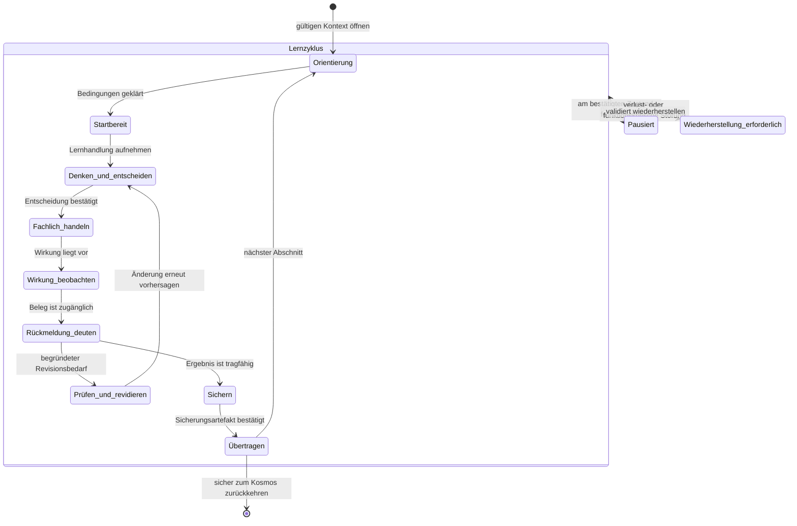

# IuM-Lernwerk – Produktarchitektur, Navigation und Lernreise

- **Task:** LXP02 Produktarchitektur Navigation und Lernreise spezifizieren
- **Status:** schriftlich freigegeben
- **Fassung:** 1.0
- **Datum:** 4. August 2026
- **Freigabe:** 5. August 2026 durch ausdrückliche schriftliche Nutzerantwort
- **Geltungsbereich:** IuM-Lernwerk, Gymnasium Baden-Württemberg, Klassen 5–7, Niveau E
- **Ausgangsstand:** lokaler `main` auf `daad655`; `origin/main` auf `3498838`
- **Arbeitsgrenze:** codefreie Produktarchitektur; keine Produktimplementierung

## Entscheidung und Zweck

LXP02 übersetzt die freigegebene LXP01-Experience-Strategie in einen einzigen widerspruchsfreien Architekturvertrag für den Lernwerk-Kosmos, den Modulstart, das Lernstudio, die Sicherung, die Lehrkraftspur und die spätere Wiederaufnahme.

Die Produktarchitektur trennt zwei komplementäre Räume:

1. Der **Lernwerk-Kosmos** trägt Überblick, Zusammenhang, Auswahl, Voraussetzungen und Rückkehr.
2. Das **Lernstudio** trägt innerhalb eines Moduls die fokussierte, lehrkraftorchestrierte Folge fachlicher Lernhandlungen.

Beide Räume verwenden dieselben Lernobjekte, Zustände und Begriffe. Die Architektur beschreibt ihre fachliche Bedeutung, Informationsverantwortung, Übergänge und Ausfallgrenzen. Sie beschreibt weder Bildschirmaufteilungen noch Komponenten oder technische Router.

Der normative Lernhandlungsloop bleibt vollständig erhalten:

```text
orientieren
→ Vorwissen oder Erwartung aktivieren
→ denken und entscheiden
→ fachlich handeln
→ Wirkung oder Ergebnis beobachten
→ Rückmeldung interpretieren
→ prüfen und revidieren
→ sichern und übertragen
→ später wiederanknüpfen
```

## Status, Geltungsbereich und Nicht-Ziele

Diese Spezifikation ist ausschließlich Produktarchitekturarbeit. Sie legt Informationsobjekte, Zustände, Rollen, Begriffe, Navigationsbedeutungen, Übergänge, Persistenz- und Wiederherstellungsverhalten sowie prüfbare Qualitätsgrenzen fest.

Die Spezifikation wurde am 5. August 2026 ausdrücklich schriftlich durch den Nutzer freigegeben. Sie ist damit der normative Produktarchitekturvertrag für die nachfolgenden Experience-Entwürfe. Die Freigabe öffnet ausschließlich die separate Planung von LXP03; sie ist keine Freigabe für LXP03-Ergebnisse, LXP04, Produktimplementierung, Preview, Deployment, Pilotierung, LMS oder Release.

Nicht Gegenstand und nicht freigegeben sind:

- Produktcode oder Änderungen an Anwendungen, Paketen, Fixtures und Tests;
- konkrete Wireframes, Seitengestaltung oder visuelle Detailgestaltung;
- Moodboard, Marken-, Typografie-, Farb-, Illustrations- oder CSS-Entscheidungen;
- Komponenten-APIs, Router-, State- oder Frameworkentscheidungen;
- eine vollständige Designsystemtaxonomie;
- Neufassung oder kosmetische Überarbeitung von IUM-5-CORE-05;
- LXP03-Experience-Entwürfe oder LXP04-Design- und Interaktionssystem;
- neue Curriculumzuordnung, Niveaudifferenzierung oder automatische Personalisierung;
- Preview, Deployment, Pilotierung, reale Geräteprüfung, LMS-Einbindung oder Release;
- Konten, Klassenverwaltung, Backend, zentrale Diagnostik, Telemetrie oder personenbezogene Lernanalyse.

LXP02 darf fachliche Architekturentscheidungen nicht an spätere visuelle Gestaltung delegieren. Es muss zugleich offenlassen, wie diese Verträge in LXP03 konkret dargestellt und in LXP04 als wiederverwendbares System ausgeformt werden.

## Normative Eingaben und Vorrangregel

### Quellen der Wahrheit

| Rang | Normative Eingabe | Funktion in LXP02 |
|---:|---|---|
| 1 | ausdrückliche schriftliche Nutzerentscheidungen | höchste Projektentscheidung; eine neuere ausdrückliche Entscheidung schlägt ältere Dokumentation |
| 2 | LXP01-Spezifikation `2026-08-04-ium-learning-experience-production-design.md`, schriftlich freigegeben | Experience-Nordstern, Lernhandlungsloop, drei Referenzsituationen, acht Qualitätsdimensionen und globale Anti-Patterns |
| 3 | Gesamtdesign `2026-07-27-ium-lernwerk-gesamtdesign.md` | Produktzweck, Curriculumrolle, Lehrkraftorchestrierung, Offenheit, Local First, Offline und Lizenzgrenzen |
| 4 | Plattformbericht `docs/platform/implementation-report.md` | belegte technische Ausgangsgrenze; keine Experience- oder Gerätefreigabe |
| 5 | IUM5-Moduldesign `2026-08-03-ium-5-core-05-moduldesign.md` | fachlicher Stresstest für die Architektur; keine UI- oder Produktfreigabe |
| 6 | diese LXP02-Spezifikation | nach schriftlicher Freigabe normativer Architekturvertrag für LXP03 und LXP04 |

### Vorrang- und Konfliktregel

- LXP02 darf LXP01 nicht stillschweigend abschwächen.
- Bei einem Widerspruch zwischen einem fachlichen Moduldetail und dem freigegebenen Experience-Vertrag gilt der Experience-Vertrag; das Moduldetail wird als späterer Neufassungsbedarf markiert.
- Belegte Plattformmechanismen begrenzen die technische Realisierbarkeit, bestimmen aber nicht die Produktarchitektur.
- Wo LXP02 eine Entscheidung bewusst offenlässt, benennt es Eigentümerphase, Entscheidungskriterium und Rückfallgrenze.
- Jede Architekturentscheidung muss mindestens einer der drei Referenzsituationen und einer Qualitätsdimension prüfbar zugeordnet werden.

## LXP02-Ergebnisvertrag

### Statuswerte der Matrix

Während der Ausarbeitung sind ausschließlich `specified`, `open-decision` und `not-applicable-with-rationale` zulässig. Vor dem schriftlichen Review muss jede Zeile `specified` sein oder eine belegte spätere Eigentümerphase mit Begründung ausweisen.

| **LXP02-ID** | erforderliches Ergebnis | normative Eingabe | Spezifikationsabschnitt | Referenzsituationsprüfung | Reviewevidenz | Status |
|---|---|---|---|---|---|---|
| LXP02-01 | Informationsarchitektur des Kosmos | LXP01 §§ 8, 11, 15, 24, 30 | Informationsarchitektur des Lernwerk-Kosmos | Referenzsituationen 1–3 | Objektvertrag, Kosmos-Sichten, Übergabe- und Navigationsinvarianten | specified |
| LXP02-02 | Modulstart und Startboard | LXP01 §§ 10.1, 11.2, 21, 30 | Modulstart, Startboard und Wiedereinstieg | Referenzsituation 1 | Einstiegsmatrix, Startboard-Vertrag und Zwei-Spuren-Walkthrough | specified |
| LXP02-03 | Zustandsmodell des Lernstudios | LXP01 §§ 9, 10, 11.3, 22, 30 | Zustandsmodell des Lernstudios | Referenzsituation 2 | Zustandsvokabular, Übergangstabelle und Zustandsdiagramm | specified |
| LXP02-04 | Navigation zwischen Lernphasen und Unterrichtseinheiten | LXP01 §§ 14, 15, 17, 30 | Lernphasen- und Unterrichtseinheitsnavigation | Referenzsituationen 1–3 | Bedeutungsvertrag aller Navigationshandlungen und Schutz ungesicherter Arbeit | specified |
| LXP02-05 | Gesamtkarte und progressive Offenlegung | LXP01 §§ 8.1, 15, 21–24, 29–30 | Gesamtkarte und progressive Offenlegung | Referenzsituationen 1–3 | Informationsklassen je Lernzustand und Widerspruchsentscheidung | specified |
| LXP02-06 | Neu-, Fortsetzungs- und Wiedereinstieg | LXP01 §§ 10.8, 17, 21, 23, 30 | Modulstart, Startboard und Wiedereinstieg | Referenzsituationen 1 und 3 | fünf Einstiegsmodi, sechs Fortsetzungsfälle und Wiederherstellungsregeln | specified |
| LXP02-07 | Sicherungsraum und Belegkarte | LXP01 §§ 10.7, 11.4, 16–17, 23–24, 30 | Fachlicher Fortschritt, Sicherungsraum und Belegkarte | Referenzsituation 3 | Fortschrittssignale, Belegkartengrammatik und Export-/Löschvertrag | specified |
| LXP02-08 | Lehrkraftspur | LXP01 §§ 11.5, 12.2, 18, 21–24, 30 | Lehrkraftspur und Unterrichtsorchestrierung | Referenzsituationen 1–3 | Phasen- und Interventionsverträge ohne Telemetrie | specified |
| LXP02-09 | Local-First-, Offline- und Fehlerzustände | LXP01 §§ 17, 20, 21–24, 30 | Local First, Offline, Fehler und Wiederherstellung | Referenzsituationen 1–3 | Schweregradmodell und Fallmatrix mit Erhaltungs- und Rückfallregeln | specified |
| LXP02-10 | Rollen- und Sozialformwechsel | LXP01 §§ 12, 18, 21–24, 30 | Rollen- und Sozialformwechsel | Referenzsituationen 1–3 | Übergabeverträge für Einzel-, Partner-, Gruppen- und Plenumsarbeit | specified |
| LXP02-11 | Begriffs- und Beschriftungsvertrag | LXP01 §§ 2, 10–20, 24–30 | Kontrollierter Begriffs- und Beschriftungsvertrag | Referenzsituationen 1–3 | kontrollierte Begriffstabelle und Konsistenzprüfung | specified |
| LXP02-12 | Abgrenzung zu LXP03, LXP04 und Produktimplementierung | LXP01 §§ 3, 27, 30–34 | Abgrenzung und Übergabe an LXP03 und LXP04 | Referenzsituationen 1–3 | Positiv-/Negativscope und Eigentümermatrix der Folgephasen | specified |

## Begriffs- und Entscheidungsledger

### Ledger-Regel

Der Begriffsledger ist die einzige Quelle für bevorzugte deutschsprachige Produktbegriffe. Neue Synonyme dürfen nicht lokal in Tabellen oder Walkthroughs eingeführt werden. Der Entscheidungsledger hält kleinere Architekturentscheidungen mit Begründung und späterem Prüfpfad fest. Materielle Änderungen des Produktcharakters benötigen ein gebündeltes Nutzerreview.

### Initiale Begriffe

| Konzept-ID | bevorzugter Begriff | vorläufige Bedeutung | verworfene oder zu prüfende Synonyme | Status |
|---|---|---|---|---|
| TERM-SPACE-COSMOS | Lernwerk-Kosmos | globaler Raum für Überblick, Zusammenhang, Auswahl und Rückkehr | Portal, Startseite, Bibliothek als gleichrangige Produktbegriffe | specified |
| TERM-SPACE-STUDIO | Lernstudio | fokussierter Arbeitsraum innerhalb eines Moduls | Werkstatt als globaler Raum, Kursraum | specified |
| TERM-SPACE-SECURE | Sicherungsraum | lokaler, auf den Lernweg begrenzter Raum zum Prüfen, Vergleichen, Revidieren, Exportieren und Wiederverwenden ausgewählter Belegkarten | Portfolio, Ablage, Archiv, Bewertungsordner | specified |
| TERM-SPACE-TEACHER | Lehrkraftspur | rollenbezogene Orchestrierungsinformation zu denselben Lernhandlungen | Lehrkräftedashboard, Adminbereich | specified |
| TERM-OBJECT-MODULE | Modul | fachlich und curricular verantwortete, wiederaufnehmbare Lerneinheit | Kurs, Kapitel | specified |
| TERM-OBJECT-PATH | Lernpfad | begründete Folge von Unterrichtseinheiten und Lernphasen innerhalb eines Moduls; modulübergreifende Anschlüsse bleiben typisierte Beziehungen | Route, Journey | specified |
| TERM-OBJECT-EVIDENCE | Belegkarte | knapper, lokal gehaltener Beleg aus realem Produkt, Beobachtung und Revision | Badge, Kompetenzkarte, Lernpass | specified |
| TERM-OBJECT-REGION | Themenregion | lernendenseitige Kosmosordnung für einen zusammenhängenden Gegenstandsbereich | Curriculumregion, Fachgebiet, Lernstrang als gleichrangiges Label | specified |
| TERM-OBJECT-FAMILY | Modulfamilie | Gruppe fachlich verwandter Module mit gemeinsamem Gegenstand oder Anschluss | Sammlung, Paket, Kursreihe | specified |
| TERM-OBJECT-LESSON | Unterrichtseinheit | didaktisch verantworteter Zeit- und Handlungsabschnitt eines Lernpfads | UE nur als fachinterne Kurzform, Lektion, Stunde | specified |
| TERM-OBJECT-PHASE | Lernphase | fachlich-didaktische Funktion innerhalb einer Unterrichtseinheit | Abschnitt, Etappe, Station | specified |
| TERM-OBJECT-ACTION | Lernhandlung | kleinste fachlich vollständige Denk-, Prüf-, Herstellungs- oder Revisionshandlung | Aufgabe, Schritt oder Aktivität ohne Funktionsklärung | specified |
| TERM-OBJECT-SECURING | Sicherungsartefakt | lokal gehaltenes, ausgewähltes Ergebnis einer Lernhandlung mit Anschlussfunktion | Abgabe, Nachweis, Datei als generischer Oberbegriff | specified |
| LS-ORIENT | Orientierung | Ziel, Kontext, Position, Voraussetzung und nächsten sinnvollen Einstieg verstehen | Willkommen, Intro, Startseite | specified |
| LS-READY | Startbereit | Ziel, notwendige Voraussetzungen, Verfügbarkeit und Startfolgen sind geklärt | freigeschaltet, bereit ohne Bedingung | specified |
| LS-DECIDE | Denken und entscheiden | Erwartung, Vorhersage, Einordnung, Strategie oder Qualitätsentscheidung bilden | Eingabe, Aufgabe bearbeiten | specified |
| LS-ACT | Fachlich handeln | ein Modell, Produkt oder Prüfobjekt gezielt verändern oder ausführen | klicken, interagieren, spielen | specified |
| LS-OBSERVE | Wirkung beobachten | Ergebnis, Zustandsänderung oder Beleg wahrnehmen und mit der Handlung verbinden | Ergebnis ansehen ohne fachliche Funktion | specified |
| LS-INTERPRET | Rückmeldung deuten | Beobachtung mit Erwartung und Kriterium vergleichen und nächsten Prüfschritt bestimmen | richtig/falsch, Auswertung | specified |
| LS-REVISE | Prüfen und revidieren | eine begründete Änderung wählen, durchführen und erneut prüfbar machen | korrigieren, noch einmal versuchen | specified |
| LS-SECURE | Sichern | Kernaussage, Beleg, Revision und Grenze als anschlussfähigen Stand bestätigen | abschließen, abgeben | specified |
| LS-TRANSFER | Übertragen | das gesicherte Konzept auf eine veränderte Beziehung oder einen neuen Fall anwenden | Bonus, Zusatzaufgabe | specified |
| LS-PAUSE | Pausiert | einen bestätigten Zwischenstand verlassen und den Rückkehrpunkt verständlich bewahren | beendet, abgebrochen | specified |
| LS-RECOVER | Wiederherstellung erforderlich | nach technischer oder versionsbezogener Störung den erhaltbaren Stand und sichere Optionen klären | Fehlerseite, kaputt | specified |

### Initiale Entscheidungen

| Entscheidungs-ID | Entscheidung | Begründung | Folgeprüfung | Status |
|---|---|---|---|---|
| DEC-LXP02-001 | Kosmos und Lernstudio bleiben getrennte, aber begrifflich und objektseitig verbundene Räume. | Das senkt Navigationslast im Lernstudio, ohne Überblick und Modularität zu verlieren. | alle drei Referenzsituationen; Q1, Q2 und Q5 | beschlossen durch LXP01 |
| DEC-LXP02-002 | Zustände beschreiben Lernbedeutung, nicht Seiten, Komponenten oder Klickereignisse. | Die Architektur muss fachliche Kontinuität tragen und implementierungsneutral bleiben. | Referenzsituation 2; Q1, Q4 und Q7 | specified |
| DEC-LXP02-003 | Fortschritt entsteht ausschließlich aus fachlich bedeutsamen Handlungen oder gesicherten Ergebnissen. | Klick-, Zeit- und Rangdaten widersprechen dem Experience- und Datenschutzvertrag. | Referenzsituationen 2 und 3; Q3, Q5 und Q8 | beschlossen durch LXP01 |
| DEC-LXP02-004 | Lehrkraftspur und Lernendenspur verwenden dieselben Objekte, Zustände und Beschriftungen. | Unterrichtsorchestrierung darf kein zweites Produkt oder eine parallele Taxonomie erzeugen. | alle drei Referenzsituationen; Q6 | beschlossen durch LXP01 |
| DEC-LXP02-005 | `Themenregion` ist der sichtbare Oberbegriff im Kosmos; curriculare Lernstränge sind zugeordnete Lehrkraftmetadaten. | Eine zweite, nur für Lehrkräfte sichtbare Inhaltshierarchie würde Start, Rückkehr und Unterrichtsgespräch auseinanderführen. | Kosmos-Vertrag und alle drei Referenzsituationen; Q1 und Q6 | specified |
| DEC-LXP02-006 | Bei einem lehrkraftgeleiteten Ziel besitzt der gemeinsame Unterrichtsstart Primat; ein abweichender lokaler Fortsetzungspunkt wird sichtbar geparkt und bleibt später unverändert erreichbar. | Unterrichtskoordination darf lokalen Lernstand weder überschreiben noch unbemerkt mit einem anderen Pfad verschmelzen. | Referenzsituationen 1 und 3; Q5, Q6 und Q8 | specified |
| DEC-LXP02-007 | Das Lernstudio verwendet elf fachliche Zustände einschließlich `Startbereit`, `Pausiert` und `Wiederherstellung erforderlich`; Zustände bilden keine Seiten oder Komponenten ab. | Die Schwelle zum Lernen, verlustfreie Unterbrechung und Recovery benötigen eine eigene verständliche Bedeutung, ohne Klickereignisse zu modellieren. | Referenzsituationen 1–3; Q1, Q4, Q5 und Q8 | specified |
| DEC-LXP02-008 | Ein Fortschrittssignal ist ein fachlich bedeutsamer, belegter Stand und bleibt vom aktuellen Lernzustand getrennt. | Ein Lernzustand kann geöffnet sein, ohne dass eine Fähigkeit oder ein Ergebnis gesichert wurde; Navigation darf keinen Fortschritt erzeugen. | Referenzsituationen 1–3; Q3, Q4 und Q5 | specified |
| DEC-LXP02-009 | Jedes dauerhaft gehaltene Sicherungsartefakt folgt der Belegkartengrammatik; Rohprodukte werden referenziert statt als zweite Chronik dupliziert. | Eine gemeinsame Grammatik trägt Wiederaufnahme und Transfer, ohne Portfolio-Plattform oder Versuchshistorie zu werden. | Referenzsituation 3; Q4, Q5 und Q8 | specified |
| DEC-LXP02-010 | Lehrkraftimpulse steuern Unterricht und bereiten Ziele vor, verändern aber kein Lernendengerät aus der Ferne; Phasen- und Sozialformwechsel werden lokal bestätigt. | Lehrkraftorchestrierung muss ohne Konto, Klassenliste, Backend, Fernsteuerung oder personenbezogene Telemetrie funktionieren. | alle drei Referenzsituationen; Q6 und Q8 | specified |
| DEC-LXP02-011 | Gemeinsame Anzeige verwendet neutrale Fälle oder ausdrücklich von Lernenden ausgewählte Ausschnitte; private lokale Artefakte bleiben standardmäßig lokal. | Fachlicher Vergleich darf keine persönliche Offenlegung oder verdeckte Abgabe erzwingen. | alle drei Referenzsituationen; Q3, Q6 und Q8 | specified |
| DEC-LXP02-012 | Resilienzschwere richtet sich nach Handlungs-, Daten-, Sicherheits- und Datenschutzfolge, nicht nach technischem Fehlercode. | Derselbe technische Befund kann den Lernweg unverändert lassen, eine Alternative verlangen oder eine bewusste Unterbrechung erzwingen. | alle drei Referenzsituationen; Q7 und Q8 | specified |
| DEC-LXP02-013 | Der kontrollierte Begriffs- und Beschriftungsvertrag ist für Lernenden-, Lehrkraft-, Recovery- und Accessibility-Pfade gemeinsam verbindlich. | Stabile outcome-orientierte Begriffe reduzieren Gedächtnislast und verhindern widersprüchliche Handlungsfolgen. | alle drei Referenzsituationen; Q1, Q2, Q6 und Q7 | specified |

## Informationsarchitektur des Lernwerk-Kosmos

### Architekturprinzip und Eigentumsregel

Der Lernwerk-Kosmos ist kein Dateiverzeichnis und keine freie Materialsammlung. Er ist der globale Orientierungs- und Auswahlraum eines fachlich geordneten Lernwerks. Seine primäre Eigentumskette lautet:

```text
Lernwerk-Kosmos
└─ Themenregion
   └─ Modulfamilie
      └─ Modul
         └─ Lernpfad
            └─ Unterrichtseinheit
               └─ Lernphase
                  └─ Lernhandlung
                     └─ Sicherungsartefakt
```

Querverbindungen wie Voraussetzung, Kernweg, späterer Anschluss, Transfer oder curriculare Lernstränge sind benannte Beziehungen. Sie erzeugen keine zweite Eigentumshierarchie. Jedes Objekt hat genau einen primären Elternkontext, darf aber mehrere ausdrücklich typisierte Querverbindungen besitzen.

### Objektvertrag

| Objekt | Zweck | lernendensichtbare Identität | Orchestrierungsdaten für Lehrkräfte | primärer Elternkontext | zulässige Kinder | Eintrittshandlung | lokaler Lernstand |
|---|---|---|---|---|---|---|---|
| Lernwerk-Kosmos | Gesamtüberblick, Zusammenhang, Auswahl, Wiederaufnahme und lokale Datenhoheit | Name des Lernwerks, Jahrgangsbezug, Themenregionen, aktuelle und letzte Arbeiten | Geltungsbereich, curriculare Abdeckung, Arbeitsstand, Lizenz- und Einsatzgrenzen | keiner | Themenregionen | Themenregion erkunden, Arbeit fortsetzen oder vorbereiteten Startpunkt öffnen | kein globaler Kompetenz- oder Abschlussstand; nur lokale Verweise auf aktuelle und letzte Arbeiten |
| Themenregion | einen fachlich zusammenhängenden Gegenstandsbereich verständlich ordnen | verständlicher Gegenstand, Leitfrage, Jahrgangs- und Anschlussrahmen | curriculare Lernstränge, Pflicht-/Wahlanteile, Progressionsbezug und Abdeckungsstatus | Lernwerk-Kosmos | Modulfamilien | Modulfamilie auswählen oder empfohlenen Anschluss prüfen | kein eigener Fortschrittswert; aktuelle Module dürfen abgeleitet sichtbar sein |
| Modulfamilie | verwandte Module vergleichbar machen und ihre Beziehungen erklären | gemeinsamer Gegenstand, Unterschiede, Voraussetzungen und typische Lernprodukte | Modulrollen, Zeitkorridore, Curriculumbezüge, Varianten und Abhängigkeiten | Themenregion | Module | Module vergleichen oder ein geeignetes Modul öffnen | kein eigener Stand; letzte Arbeit in enthaltenen Modulen darf abgeleitet werden |
| Modul | eine fachlich und curricular verantwortete, wiederaufnehmbare Lerneinheit bündeln | Titel, Leitfrage, Lernprodukt, Voraussetzungen, Zeitkorridor, Arbeitsstand und Anschlüsse | Modul-ID/-version, Curriculumvertrag, Unterrichtsvarianten, Material-, Offline- und Statusgrenzen | Modulfamilie | Lernpfade | Startboard öffnen | Fortsetzungspunkt, kompatible Version und gesicherte Artefakte; niemals Kompetenzwert |
| Lernpfad | eine begründete Folge von Unterrichtseinheiten für einen Einsatzweg ordnen | Zweck, regulärer oder begründet alternativer Weg, Gesamtkarte und aktueller Anschluss | Zeitmodell, Pfadbedingungen, gemeinsame Haltepunkte, optionale Vertiefung und Fallbacks | Modul | Unterrichtseinheiten | neue oder fortzusetzende Unterrichtseinheit auswählen beziehungsweise lehrkraftgeleitet öffnen | aktueller Pfad und letzte sinnvoll abgeschlossene Funktion; kein Prozentwert aus Seitenbesuchen |
| Unterrichtseinheit | einen didaktisch verantworteten Zeit- und Handlungsabschnitt tragen | heutige Leitfrage, erwarteter Zwischenstand, Zeitkorridor und Sozialform | Lernfunktion, Verlaufsoptionen, Material, Haltepunkte und Sicherungsziel | Lernpfad | Lernphasen | Startboard des Abschnitts bestätigen und erste Lernphase beginnen | aktueller Eintritt, sinnvoll abgeschlossene Lernphase und offener Sicherungsbedarf |
| Lernphase | eine fachlich-didaktische Funktion innerhalb der Unterrichtseinheit erfüllen | Funktionslabel, aktuelles Ziel, erwartetes Ergebnis und Anschluss | Phasenfunktion, Zeitkorridor, typische Vorstellungen, Interventionen und Übergangsbedingung | Unterrichtseinheit | Lernhandlungen | nächste fachlich sinnvolle Lernhandlung aufnehmen | nur fachlich begründeter Zustand wie Erwartung formuliert, erprobt, revidiert oder gesichert |
| Lernhandlung | eine fachlich vollständige Denk-, Entscheidungs-, Prüf-, Herstellungs- oder Revisionshandlung ausführen | eindeutiger Auftrag, relevante Repräsentationen, Kriterium und nächster Prüfschritt | Lernfunktion, erwartbare Abweichung, Hilfe, Beobachtungsanlass und Haltepunkt | Lernphase | Sicherungsartefakte | Handlung beginnen, fortsetzen, prüfen oder revidieren | erforderliche Produktspuren und Zustand für verlustfreie Fortsetzung; keine Klick- oder Versuchshistorie |
| Sicherungsartefakt | einen von der lernenden Person ausgewählten fachlichen Stand für Vergleich, Transfer und Wiedereinstieg halten | Kontext, Entscheidung/Modell, Beobachtung, Revision, Kernaussage und Anschluss | fachliche Kriterien, Gesprächsfunktion, Wiederaufnahme- und Exportoption | erzeugende Lernhandlung | keine Eigentumskinder; typisierte Bezüge auf Transfer- und spätere Lernhandlungen | ansehen, vergleichen, revidieren, bewusst exportieren oder für Transfer verwenden | Artefaktinhalt, Schemaversion und nur für Wiederherstellung nötige Zeit-/Versionsangaben |

#### Objektinvarianten und Fehlerkriterien

- Ein Objekt ist ungültig, wenn Lernende seinen Zweck, Elternkontext oder nächsten sinnvollen Eintritt nicht bestimmen können.
- Ein Objekt ist ungültig, wenn Lehrkräfte für denselben Inhalt eine abweichende Taxonomie oder ein anderes Phasenlabel benötigen.
- Ein lokaler Stand ist ungültig, wenn er aus Zeit, Klicks, Scrolltiefe, Hilfenutzung, Fehlversuchen oder einer abgeleiteten Personenbewertung besteht.
- Eine Querverbindung ist ungültig, wenn sie wie eine Eigentumsbeziehung erscheint, aber keine eindeutige Rückkehr zum primären Elternkontext erlaubt.
- Ein Sicherungsartefakt darf auf andere Lernhandlungen verweisen, bleibt aber dem erzeugenden Kontext und der lernenden Person auf dem lokalen Gerät zugeordnet.

### Informationsverantwortungen der Kosmos-Sichten

Eine Kosmos-Sicht ist eine Informationsverantwortung, kein festgelegter Bildschirm. Mehrere Verantwortungen dürfen später in einer konkreten Darstellung verbunden werden, sofern ihre Fragen und Rückwege erhalten bleiben.

| Sicht | beantwortete Frage | Mindestinformation | primäre Handlung | zulässige Nebenhandlungen | Leerzustand | Offlinezustand | Rückweg |
|---|---|---|---|---|---|---|---|
| Überblick und Orientierung | Welche fachlichen Bereiche und Lernwege gehören zum Lernwerk, und wo kann ich sinnvoll beginnen? | Themenregionen, empfohlene Kernanschlüsse, Jahrgangsbezug, Voraussetzungen, Modulstatus und Bedeutung lokaler Arbeit | Themenregion oder aktuellen Anschluss öffnen | Hilfe, Accessibility, Lizenz-/Statusgrenze, lokale Arbeit aufrufen | erklärt den noch nicht verfügbaren Geltungsbereich, ohne leere Fortschrittsanzeige oder erfundene Empfehlungen | zeigt nur nachweislich lokal verfügbare Regionen/Module als offline bereit und markiert übrige als nicht verfügbar | Ausgangspunkt des Kosmos; vorheriger Modulkontext bleibt als Rückkehrziel erhalten |
| Suchen und Filtern | Welche vorhandenen Module passen zu einem bekannten Gegenstand, Jahrgang, Lernprodukt oder Einsatzbedarf? | kontrollierte Suchbegriffe, aktive Einschränkungen, Trefferbegründung, Voraussetzungen und Offlinebereitschaft | passenden Modultreffer öffnen | Filter zurücksetzen, Module vergleichen, Elternregion öffnen | benennt, welche Einschränkungen zu keinem Treffer führen, und bietet Rücksetzen statt inhaltlicher Erfindung | durchsucht den bekannten Katalog, kennzeichnet aber nicht lokal verfügbare Inhalte ehrlich | zur vorherigen Kosmos-Sicht mit erhaltenem Suchkontext oder zur Elternregion |
| Modulvergleich | Welches von wenigen fachlich verwandten Modulen passt zu Ziel, Zeit und Voraussetzungen? | Leitfrage, Lernprodukt, Voraussetzung, Zeitkorridor, Modulrolle, Arbeitsstand, Offlinebereitschaft und Anschluss | ein Modulstartboard öffnen | Vergleich verlassen, Voraussetzung öffnen, Lehrkraftinformationen bedarfsgerecht erweitern | erklärt, warum aktuell kein vergleichbares Modul vorliegt; erzeugt keine Rangliste | Vergleich bleibt lesbar, Start ist nur für vollständig verfügbare Inhalte möglich | zur Modulfamilie mit erhaltenem Vergleichskontext |
| Aktuelle und letzte Arbeiten | Wo kann ich eine fachlich begonnene oder gesicherte Arbeit sinnvoll fortsetzen? | Modul, Lernpfad, letzter sinnvoller Schritt, letzter gesicherter Stand, Versions-/Wiederherstellungsstatus | validierte Fortsetzung öffnen | Startboard ansehen, Sicherungsartefakt prüfen, lokale Daten verwalten | erklärt, dass noch keine lokale Arbeit vorliegt, und führt zurück zu Themenregionen | zeigt ausschließlich tatsächlich lokale Stände und ihre verfügbare Inhaltsbasis | zum vorherigen Kosmos-Kontext; Fortsetzung öffnet zuerst den Wiedereinstiegsvertrag |
| Vorbereiteter Startpunkt | Welche Unterrichtseinheit oder Lernphase soll jetzt gemeinsam beginnen, und was muss ich bestätigen? | Zielobjekt, Lehrkraftquelle als Unterrichtskontext, Leitfrage, Zeit, Sozialform, Material, Offlinebereitschaft und abweichender lokaler Stand | Startboard für das Zielobjekt öffnen | Elternmodul prüfen, lokalen Stand vergleichen, Start abbrechen | erklärt ungültigen oder nicht mehr verfügbaren Startpunkt und bietet den Elternkontext | Start nur, wenn Zielinhalt vollständig lokal verfügbar ist; sonst sichere Alternative oder Abbruch | zum Ursprung des Direktlinks oder zum Elternmodul, ohne lokalen Stand zu verändern |
| Hilfe, Accessibility und lokale Daten | Wie bediene ich das Lernwerk gleichwertig und wie kontrolliere ich meine lokalen Arbeiten? | verständliche Bedienhilfe, Tastatur-/Touch-/Textpfade, Anzeige-/Bewegungsoptionen, Speicherstatus, Export, Import und Löschung | konkretes Hilfs- oder Datenanliegen ausführen | zum aktuellen Lernkontext zurückkehren, Sensibilitätshinweise öffnen | keine lokal gespeicherten Arbeiten wird als normaler Zustand erklärt | alle lokal ausführbaren Kontrollen bleiben verfügbar; netzabhängige Hilfe wird als solche gekennzeichnet | exakt zum zuvor aktiven Kontext und möglichst zur auslösenden Handlung zurück |

Suchen und Filtern bleibt erhalten, weil ein wachsender offener Kosmos ohne gezielten Zugang unzumutbar wäre. Es darf jedoch weder algorithmische Personalisierung noch eine aus Nutzung abgeleitete Empfehlung erzeugen. Ein Filter reduziert Sichtbarkeit nach ausdrücklich gewählten Sachmerkmalen; er verändert keine Lernpfade oder lokalen Stände.

### Übergabevertrag vom Kosmos zum Lernstudio

Die Übergabe ist ein konzeptioneller Vertrag, kein URL-, Router- oder Datenbankschema. Vor dem Eintritt werden Ziel, Modus, Verfügbarkeit und möglicher Konflikt mit lokalem Stand geklärt.

| Übergabefeld | Bedeutung | lernendensichtbar | lehrkraftsichtbar | lokal persistent | nur Sitzung |
|---|---|:---:|:---:|:---:|:---:|
| ausgewähltes Modul | fachlicher und versionierter Zielkontext | ja | ja | ja, als Fortsetzungsbezug | nein |
| beabsichtigter Lernpfad | regulärer oder ausdrücklich gewählter Einsatzweg | ja | ja | ja, nach bestätigtem Start | bis zur Bestätigung |
| Unterrichtseinheit-/Lernphasenziel | aktueller gemeinsamer oder individueller Zielabschnitt | ja | ja | ja, sobald fachlich aufgenommen | bis zur Bestätigung |
| Startmodus | Neueinstieg, lehrkraftgeleiteter Start, Fortsetzung, Wiedereinstieg oder Wiederherstellung | ja | ja | nur resultierender Fortsetzungszustand | ja |
| Sozialform | Einzel-, Partner-, Gruppen- oder Plenumsphase | ja | ja | nein, sofern sie nicht für eine offene Übergabe nötig ist | ja |
| Zeitkorridor | realistische Unterrichtszeit für den Zielabschnitt | ja | ja | nein | ja |
| lokale Fortsetzung | letzter sinnvoller Schritt, gesicherter Stand, Version und Konfliktstatus | ja, zusammengefasst | nur im Unterrichtsgespräch oder durch lernendenseitige Auswahl; keine Fernsicht | ja | nein |
| Offlinebereitschaft | belegte lokale Verfügbarkeit des für den Zielabschnitt benötigten Kerns | ja | ja | technischer Verfügbarkeitsstand, keine Lernanalyse | aktueller Prüfstatus |
| Herkunft und Rückkehr | Kosmos-Sicht, Elternkontext oder ausdrücklich vorbereiteter Direktstart | ja als verständliche Rückkehrbedeutung | ja | nein | ja |

Ein Übergabefeld darf nur persistiert werden, wenn es fachliche Kontinuität oder Wiederherstellung trägt. Die Lehrkraftsicht entsteht aus demselben Inhaltsvertrag und aus gewöhnlicher Unterrichtsbeobachtung; sie erhält keinen Zugriff auf lokale Produktspuren eines fremden Geräts.

### Globale Navigationsinvarianten

| NAV-ID | normative Invariante | prüfbarer Fehlerfall |
|---|---|---|
| NAV-G-01 | Ein Wechsel des globalen Raums verwirft, überschreibt oder bestätigt lokale Arbeit niemals stillschweigend. | Nach Rückkehr ist ein ungesicherter oder zuletzt bestätigter fachlicher Stand ohne ausdrückliche Entscheidung verändert oder verloren. |
| NAV-G-02 | Die Rückkehr zum Kosmos bewahrt Modul, Lernpfad, Unterrichtseinheit und offenen Sicherungsbedarf als Elternkontext. | Der Kosmos zeigt nur eine generische Startlage und kann den vorherigen Modulkontext nicht benennen. |
| NAV-G-03 | Globale Navigation bleibt erreichbar, besitzt aber im Lernstudio kein gleiches Informationsprimat wie die aktuelle Lernhandlung. | Eine globale Auswahl konkurriert in Benennung, Fokusreihenfolge oder Ankündigung mit der fachlichen Primärhandlung. |
| NAV-G-04 | Jeder Direkteinstieg besitzt einen rekonstruierbaren Elternkontext und einen sicheren Abbruch-/Rückweg. | Ein Direktlink endet bei Abbruch in einem unbestimmten Zustand oder zwingt zum Start. |
| NAV-G-05 | `Browser-Zurück` bedeutet zeitliche Rückkehr im Nutzungspfad; `zurück` bedeutet den benannten fachlichen Vorgängerkontext; `zum Kosmos` bedeutet Wechsel in den globalen Überblick. | Zwei dieser Handlungen tragen dieselbe Beschriftung, führen unerwartet zum selben Ziel oder verlieren Kontext. |
| NAV-G-06 | Browser-Zurück, explizites Zurück und Wechsel zum Kosmos schützen ungesicherte Arbeit gleichwertig und kündigen notwendige Bestätigung vor dem Verlassen an. | Nur einer der drei Wege schützt einen noch nicht persistent bestätigten fachlichen Stand. |
| NAV-G-07 | Offline-Navigation behauptet Verfügbarkeit nur nach positiver lokaler Prüfung des benötigten Inhalts und der Kernassets. | Ein Modul oder Zielabschnitt erscheint startbereit, obwohl eine erforderliche Ressource nicht lokal vorhanden ist. |
| NAV-G-08 | Ein nicht verfügbares Offlineziel bietet Elternkontext, verständlichen Grund und sichere Alternative, verändert aber keinen Lernstand. | Das Öffnen erzeugt einen falschen Fortschritt, einen leeren Modulstand oder eine Sackgasse. |
| NAV-G-09 | Hilfe-, Accessibility- und Datenwege kehren zum auslösenden Lernkontext und, wo technisch möglich, zur auslösenden Handlung zurück. | Nach einer Hilfs- oder Datenhandlung muss die aktuelle Lernphase neu gesucht oder aus dem Gedächtnis rekonstruiert werden. |

### Kosmos-Vertragsprüfung

Der Kosmos-Vertrag besteht nur, wenn:

- Lernende für jedes geöffnete Objekt Ziel, Elternkontext, Voraussetzungen und Rückkehr benennen können;
- Lehrkräfte dasselbe Modul, denselben Lernpfad und dieselbe Lernphase ohne Paralleltaxonomie vorbereiten und starten können;
- lokale Fortsetzung sichtbar, aber nicht als Kompetenzprofil oder Rang dargestellt wird;
- nicht verfügbare Offlineziele ehrlich begrenzt und ohne Zustandsmutation abgefangen werden;
- `Browser-Zurück`, `zurück` und `zum Kosmos` in Bedeutung und Schutzverhalten unterscheidbar bleiben;
- ein Einstieg in das Lernstudio erst nach geklärtem Ziel, Startmodus, lokalen Konflikten und Offlinebereitschaft erfolgt.

## Modulstart, Startboard und Wiedereinstieg

### Funktion des Startboards

Das Startboard ist der verbindliche Orientierungszustand vor Beginn oder Wiederaufnahme eines Lernabschnitts. Es ist kein Werbeauftakt und keine vollständige Modulkarte. Es bringt Kosmoskontext, Unterrichtsziel, lokale Kontinuität und technische Bereitschaft in eine entscheidbare Form.

Das Startboard darf erst ins Lernstudio übergeben, wenn Zielobjekt, Startmodus, notwendige Sozialform/Materialien, lokale Fortsetzungskonflikte und Offlinebereitschaft geklärt sind. Eine bloße Navigation auf die Moduladresse erzeugt noch keinen Lernfortschritt und keinen neuen lokalen Arbeitsstand.

### Fünf Einstiegsmodi

| Einstiegsmodus | Auslöser | vertrauenswürdiger Kontext | zu bestätigende Information | primäre Handlung | Abbruch-/Rückweg | Bedingung für Fortsetzung |
|---|---|---|---|---|---|---|
| Neueinstieg | Lernende Person öffnet ein noch nicht begonnenes Modul aus Themenregion, Modulfamilie oder Vergleich | versionierter Modulvertrag, Elternkontext, Voraussetzungen und positiv geprüfte Inhaltsverfügbarkeit | Leitfrage, Lernprodukt, Voraussetzung, Zeitkorridor, erster Abschnitt, Sozialform/Material und Offlinebereitschaft | `neu beginnen` | `zur Modulfamilie` oder benannter Kosmoskontext; es entsteht kein lokaler Stand | Voraussetzungen sind verstanden oder lehrkraftseitig geklärt; benötigter Kerninhalt ist verfügbar; erster Lernabschnitt ist eindeutig |
| lehrkraftgeleiteter Start | vorbereiteter Direktstart oder im Unterricht benannter Zielabschnitt wird geöffnet | gültiges Modul-/Phasenziel aus demselben Inhaltsvertrag; Lehrkraftquelle ist Kontext, keine Identität oder Fernsteuerung | gemeinsames Ziel, aktueller Abschnitt, Zeit, Sozialform, Material, Abweichung vom lokalen Fortsetzungspunkt und Rückweg | `zum gemeinsamen Start` | `Start abbrechen` führt zum Elternmodul oder Direktstart-Ursprung, ohne lokalen Stand zu verändern | Zielinhalt ist verfügbar; ein abweichender lokaler Stand wurde sichtbar geparkt; Startentscheidung ist bestätigt |
| Fortsetzung auf demselben Gerät | Kosmos oder Startboard findet genau einen gültigen lokalen Fortsetzungspunkt | vollständig validierter lokaler Zustand, passende Modul- und Schemaversion, bestätigte Produktspuren | letzter sinnvoller Schritt, offener Auftrag, letzter gesicherter Stand, aktuelles Ziel und Offlinebereitschaft | `fortsetzen` | `Startboard ansehen` oder `zum Kosmos`; lokaler Stand bleibt unverändert | Zustand und Inhalt sind kompatibel; keine offene Wiederherstellungs- oder Sicherungsentscheidung blockiert |
| Wiedereinstieg nach längerer Unterbrechung | lokaler Zustand ist gültig, aber Kontext muss fachlich rekonstruiert werden | validierter lokaler Zustand, Elternkontext, letzte bestätigte Belegkarte und aktueller Inhaltsvertrag | „Darum geht es“, „Hier warst du“, letzter gesicherter Stand, offene fachliche Entscheidung, nächster Schritt und optional Gesamtkarte | `wieder einsteigen` | `später fortsetzen` oder `zum Kosmos`; keine Dringlichkeit oder Streak | ein knapper aktiver Erinnerungsimpuls ist bearbeitet, sofern die Lernfunktion Abruf verlangt; sonst gelten die Fortsetzungsbedingungen |
| Wiederherstellung | Offline-, Update-, Speicher-, Import- oder Versionsstörung verhindert direkte Fortsetzung | letzter bestätigter lokaler Stand oder validierte Exportdatei, unveränderte Altversion, bekannte Inhalts-/Schemaversion und Fehlerklasse | betroffene Arbeit, erhaltener Stand, nicht wiederherstellbarer Anteil, sichere Optionen und Folgen jeder Wahl | `wiederherstellen`, `alte Fassung fortsetzen` oder `Export sichern` je Fall | `abbrechen und Stand erhalten`; niemals automatischer Reset | eine verlustfreie Fortsetzung ist belegt oder die lernende Person hat eine verständliche, nicht rückgängig gemachte Recovery-Entscheidung getroffen |

`Neueinstieg`, `Fortsetzung`, `Wiedereinstieg` und `Wiederherstellung` sind keine Synonyme. `Fortsetzung` nimmt einen verständlichen gültigen Stand direkt wieder auf; `Wiedereinstieg` rekonstruiert zusätzlich den fachlichen Kontext; `Wiederherstellung` behandelt eine technische oder versionsbezogene Störung.

### Informationsvertrag des Startboards

| Frage in Lernendensprache | verpflichtende Antwort | Sichtbarkeitsklasse | Steuerungsrecht |
|---|---|---|---|
| Worum geht es? | Leitfrage oder verständliche Herausforderung und Einordnung in das Modul | immer im Orientierungskern | inhaltlich durch Modulvertrag; Lehrkraft darf rahmen, nicht durch anderes Ziel ersetzen |
| Was kann ich danach tun oder erklären? | beobachtbare fachliche Handlungsfähigkeit und erwartetes Lern- oder Zwischenprodukt | immer im Orientierungskern | durch Lernzielvertrag; keine Kompetenzstufe oder Erfolgsprognose |
| Wo bin ich jetzt? | Themenregion, Modul, Lernpfad und aktuelle Unterrichtseinheit/Lernphase in knapper Form | immer im Orientierungskern | aus Objektvertrag; nicht lehrkraftabhängig |
| Was ist die nächste sinnvolle Handlung? | genau eine primäre fachliche Start-, Fortsetzungs-, Wiedereinstiegs- oder Recovery-Handlung | immer dominant | der Einstiegsmodus bestimmt das Verb; die Lehrkraft darf den gemeinsamen Zielabschnitt setzen |
| Wie viel Unterrichtszeit ist vorgesehen? | realistischer Korridor für den aktuellen Abschnitt, keine individuelle Restzeitprognose | immer für den aktuellen Abschnitt sichtbar; Pfaddetails erweiterbar | Lehrkraft wählt unter freigegebenen Zeitpfaden und macht Abweichungen sichtbar |
| Welches Material und welche Sozialform brauche ich? | benötigtes Gerät/Material und Einzel-, Partner-, Gruppen- oder Plenumsform einschließlich nächstem Wechsel | sichtbar, sobald für den Start handlungsrelevant | Lehrkraft wählt unter den fachlich erlaubten Optionen; Wert bleibt für Lernende sichtbar |
| Ist der benötigte Inhalt offline verfügbar? | ehrlicher Bereitschaftsstatus für den Zielabschnitt, nicht bloß allgemeiner Onlinestatus | bei positiver Bereitschaft kompakt; bei Einschränkung entscheidungsnah oder blockierend | System prüft lokal; Lehrkraft kann nur eine fachlich vorgesehene Alternative wählen |
| Welche lokale Arbeit wird verwendet oder wiederhergestellt? | letzter sinnvoller Schritt, letzter gesicherter Stand, Versionsstatus und gegebenenfalls geparkter Konflikt | bei vorhandenem Stand immer knapp sichtbar; Details erweiterbar | lernende Person entscheidet über Import, Wiederherstellung, Verwerfen oder späteres Fortsetzen; keine Fernsicht der Lehrkraft |
| Wie kehre ich ohne Verlust zurück? | benanntes Rückkehrziel, Speicher-/Sicherungsbedarf und Verhalten bei Abbruch | immer in verständlicher Kurzform | durch Navigationsvertrag; nicht deaktivierbar |

#### Informationspriorität

1. **Immer dominant:** fachliche Leitfrage, erwartete Handlungsfähigkeit, aktuelle Position und nächste sinnvolle Handlung.
2. **Immer vorhanden, aber nach Bedarf kompakt:** Zeitkorridor, Sozialform, Material, Rückkehr und positiver Offline-/Speicherstatus.
3. **Progressiv verfügbar:** Gesamtkarte, Voraussetzungen im Detail, vollständige Lehrkraftbegründung, Lizenz-/Quellenangaben, Datenformat- und Versionsdetails.
4. **Lehrkraftgesteuert, aber lernendensichtbar:** gemeinsamer Zielabschnitt, regulärer/erweiterter Zeitpfad, Sozialform, bereitgestelltes Material und gemeinsamer Auftakt.
5. **Nie wegen Offenlegungslogik verborgen:** Datenverlustgefahr, inkompatibler Stand, fehlender Kerninhalt, irreversible Löschung, abweichendes Lehrkraftziel oder ein Rückweg mit Folgen für ungesicherte Arbeit.

Das Startboard ist fehlerhaft, wenn technische Normalzustände die Leitfrage verdrängen, mehrere gleichgewichtige Startaktionen erscheinen oder Lernende die Folgen von Start, Fortsetzung und Abbruch nicht unterscheiden können.

### Fortsetzungs-, Konflikt- und Versionsfälle

| Fall | sichtbare Bedeutung | primäre Handlung | zulässiger Resume-Punkt | erhaltener Stand | verbotenes Verhalten |
|---|---|---|---|---|---|
| kein lokaler Stand | „Du beginnst diesen Lernweg neu.“ | `neu beginnen` | erster fachlich vorgesehener Abschnitt | keiner; Stand entsteht erst nach tatsächlicher Aufnahme einer Lernhandlung | leeren Fortschritt oder Abschlusswerte anlegen; einen Start vortäuschen |
| genau ein gültiger Fortsetzungsstand | „Hier hast du zuletzt fachlich sinnvoll weitergearbeitet.“ | `fortsetzen` | letzter bestätigter sinnvoller Schritt, nicht letzte URL oder letzter Klick | Ausgangs-/Produktstand, Beleg und offene Handlung | automatisch in die zuletzt besuchte Oberfläche springen, wenn deren Lernkontext nicht mehr gültig ist |
| Lernphase abgeschlossen, Sicherung offen | „Die Arbeit ist fachlich erprobt; die Sicherung ist noch offen.“ | `Sicherung fortsetzen` | Beginn der Sicherung mit Vergleich von Produkt, Beobachtung und Kriterium | abgeschlossene Phase, Produkt- und Revisionsstand | Phase als vollständig gesichert markieren oder direkt zu Transfer/folgender Einheit springen |
| ältere kompatible Inhaltsversion | „Dein Stand kann mit dieser Fassung weiterverwendet werden.“ | `Stand prüfen und fortsetzen` | fachlich entsprechender Schritt nach deterministischer, verlustfreier Migration | Original bleibt bis bestätigter Migration/Export wiederherstellbar | still migrieren, Feldverluste verschweigen oder alten Stand überschreiben, bevor Validierung und Bestätigung abgeschlossen sind |
| inkompatibler oder beschädigter Stand | „Dieser Stand kann nicht sicher übernommen werden.“ | `Export sichern` oder fallbezogen `Wiederherstellung öffnen` | nur nach vollständiger Validierung einer sicheren Alternative; sonst kein Resume | unveränderte Eingabe-/Importdatei und letzter bestätigter aktiver Stand | Teilimport, automatische Zusammenführung, Reset, fehlerhafte Daten ausführen oder aktiven Stand mutieren |
| Lehrkraftziel weicht vom lokalen Punkt ab | „Die Klasse startet heute hier; deine bisherige Arbeit bleibt erhalten.“ | `zum gemeinsamen Start` | lehrkraftgeleitetes Ziel als neuer Unterrichtskontext; lokaler Punkt wird geparkt | bisheriger Fortsetzungspunkt, Belege und offene Sicherung bleiben separat erreichbar | lokalen Punkt überschreiben, automatisch abschließen oder zwei Pfade ohne explizite fachliche Regel zusammenführen |

Ein `geparkter` Stand ist kein Abbruch und kein negativer Fortschritt. Er bleibt als klar benannter Fortsetzungspunkt erhalten, bis er fachlich wiederaufgenommen, bewusst exportiert oder ausdrücklich gelöscht wird.

### Wiedereinstiegsorientierung

Vor dem Wiederaufnehmen werden höchstens sechs Informationsgruppen benötigt:

1. **Ziel und Kontext:** Leitfrage sowie aktuelle Unterrichtseinheit/Lernphase.
2. **Letzte sinnvolle Handlung:** nicht letzte Seite, sondern letzter fachlich bestätigter Zustand.
3. **Letzter gesicherter Stand:** Kernaussage oder Belegkarte in Kurzform.
4. **Offene Entscheidung:** genau die Denk-, Prüf-, Revisions- oder Sicherungshandlung, die noch aussteht.
5. **Nächster Schritt:** ein primärer, ergebnisbezogener Handlungsaufruf.
6. **Recovery-Hinweis:** nur wenn Version, Offlinebestand oder lokales Speichern die Fortsetzung tatsächlich beeinflusst.

Erweiterbar bleiben Gesamtkarte, vollständiges Sicherungsartefakt, Voraussetzungen, frühere bestätigte Fassungen, technische Versionsdetails und Lehrkraftinformationen. Nicht angeboten werden Prozentwerte, Streaks, Bearbeitungsdauer, Dringlichkeit aus verstrichener Zeit oder eine vollständige Versuchschronik.

Wenn aktiver Abruf lernfunktional ist, zeigt der Wiedereinstieg zunächst eine kurze veränderte Frage zum letzten gesicherten Konzept und danach den vorhandenen Stand zum Vergleich. Er darf den gesicherten Inhalt nicht als Gedächtnistest verbergen, wenn dies die sichere Fortsetzung blockiert.

### Zwei-Spuren-Walkthrough Referenzsituation 1

| Moment | Lernende sehen | Lernende entscheiden/tun | Systemreaktion | Lehrkraft sieht/kann tun | lokaler Stand | Fehlerwiederherstellung | Qualitätsdimensionen |
|---|---|---|---|---|---|---|---|
| Kosmosorientierung | Themenregion, passende Modulfamilie, Modul-Leitfrage, Voraussetzungen und vorhandene lokale Arbeit | Modul öffnen oder vorbereiteten Startpunkt wählen | bewahrt Elternkontext und prüft Zielinhalt lokal | ordnet dasselbe Modul curricular ein und bereitet gemeinsamen Zielabschnitt vor | nur Verweise auf vorhandene Arbeiten; kein neuer Stand | nicht verfügbares Offlineziel bleibt im Kosmos mit Grund und Alternative | Q1 Lernhandlungs-Klarheit, Q2 kognitive Ökonomie, Q6 Lehrkraftorchestrierung |
| Startboard – neuer Start | Leitfrage, erwartetes Produkt, Position, Zeit, Sozialform, Material, Offlinebereitschaft und `neu beginnen` | Startbedingungen verstehen und neuen Lernweg beginnen | legt erst mit Aufnahme der ersten Lernhandlung einen lokalen Fortsetzungspunkt an | rahmt Leitfrage, wählt erlaubten Zeitpfad und nennt ersten Haltepunkt | noch leer, dann Modul-/Pfad-/Phasenbezug ohne Kompetenzwert | fehlender Kerninhalt blockiert Start; Elternkontext bleibt erreichbar | Q1, Q3 Agency und Motivation, Q7 Accessibility und Gleichwertigkeit, Q8 Resilienz |
| Startboard – gemeinsamer Start bei vorhandenem Stand | gemeinsamen Zielabschnitt und Hinweis auf erhaltene frühere Arbeit | `zum gemeinsamen Start` bestätigen oder zum Elternkontext zurückkehren | parkt abweichenden Fortsetzungspunkt, führt keine Zusammenführung aus | startet die Klasse mit demselben Phasenlabel; sieht keine privaten Produktdaten | alter Stand unverändert; gemeinsamer Zielkontext getrennt bestätigt | bei Konflikt oder Versionsfehler öffnet Recovery statt Überschreiben | Q5 Fortschritt und Kontinuität, Q6, Q8 |
| gemeinsamer Impuls | Leitfrage, aktuelle Lernhandlung, erwartbaren Zwischenstand und Rollen | hören, vergleichen, kurze Erwartung bilden | hält Startboard-Kontext und öffnet erst die fachlich notwendige Handlung | setzt Auftakt, Sozialform und gemeinsame Rückfrage | flüchtige Erwartung nur, soweit für Fortsetzung fachlich nötig | technischer Ausfall erlaubt lehrkraftgeführten Impuls; kein falscher Digitalfortschritt | Q1, Q2, Q3, Q6 |
| Erwartung aktivieren | knappen Vorwissens-/Vorhersageauftrag mit Kriterium | fachliche Erwartung auswählen, ordnen oder knapp formulieren | bestätigt die Denkhandlung ohne Bewertung oder Profilbildung | beobachtet gewöhnlichen Unterricht und kann einen frischen Kurzfall geben | nur bestätigte aufgabenbezogene Erwartung, wenn der Lernzyklus sie benötigt | Eingabe bleibt editierbar; Speicherausfall bietet flüchtige Fortsetzung plus Exportoption | Q3, Q4 Feedback und Revision, Q6, Q8 |
| Übergang ins Lernstudio | Ziel, aktuelle Handlung, notwendige Repräsentation, Qualitätskriterium und Rückkehrbedeutung | erste fokussierte Studiohandlung aufnehmen | übergibt validierten Ziel-/Startkontext und setzt Fokus auf die neue Lernfunktion | nennt Haltepunkt und mögliche Hilfe mit denselben Begriffen | aktueller Lernzustand und letzter bestätigter Stand | Übergabefehler kehrt verlustfrei zum bestätigten Startboard zurück | Q1, Q2, Q7, Q8 |
| spätere Fortsetzung | „Hier warst du“, letzter gesicherter Stand, offener Auftrag und `fortsetzen` | direkt fortsetzen oder Details/Gesamtkarte öffnen | rekonstruiert den letzten sinnvollen Zustand, nicht die letzte URL | kann ohne Telemetrie denselben Abschnitt ansagen oder Rückfrage anbieten | validierter lokaler Fortsetzungspunkt | inkompatibler Stand bleibt unverändert und führt zur Wiederherstellung | Q1, Q5, Q6, Q7, Q8 |
| Wiedereinstieg nach Unterbrechung | Ziel, letzte Handlung, Belegkarte in Kurzform, neue Abruffrage und nächsten Schritt | Konzept aktiv abrufen, vergleichen und `wieder einsteigen` | verbindet gesicherten Stand mit einer veränderten nächsten Handlung | plant Wiederaufnahme oder gemeinsamen Vergleich ohne Personenhistorie | alter Beleg plus neuer bestätigter Anschluss; keine Zeit-/Streakdaten | Recovery-Hinweis erscheint nur bei tatsächlicher Einschränkung | Q3, Q5, Q6, Q8 |

Der Walkthrough fällt durch, wenn Lernende Leitfrage, Position, nächste Handlung oder Rückweg nicht benennen können; wenn die Lehrkraft andere Phasenbegriffe benötigt; wenn Offline- oder Versionsstatus irreführt; oder wenn ein abweichender lokaler Stand ohne ausdrückliche Entscheidung verändert wird.

## Zustandsmodell des Lernstudios

### Bedeutung und Granularität

Ein Lernstudio-Zustand beschreibt die fachliche Bedeutung der aktuell dominanten Lernhandlung. Er ist weder Seite noch URL, Komponente, Dialog, Fokusposition oder einzelnes Ereignis. Mehrere technische Interaktionen dürfen denselben Lernzustand realisieren; ein Zustandswechsel ist nur gerechtfertigt, wenn sich Ziel, Denkfunktion, zulässige Handlung oder notwendiger Kontext fachlich ändert.

| Zustands-ID | bevorzugtes Zustandslabel | fachliche Bedeutung | notwendiger Eintrittsnachweis | möglicher Abschlussnachweis |
|---|---|---|---|---|
| LS-ORIENT | Orientierung | Lernende verstehen Leitfrage, Produkt, Position, Voraussetzung und Rückweg. | gültiger Kosmos-/Direktstart- oder Wiederaufnahmekontext | Ziel, Position und nächster Schritt sind benennbar |
| LS-READY | Startbereit | Zielinhalt, Startmodus, Material/Sozialform, lokale Konflikte und Offlinebereitschaft sind geklärt. | vollständig entscheidbares Startboard | bestätigter Eintritt in die erste Denkhandlung |
| LS-DECIDE | Denken und entscheiden | Eine fachliche Erwartung, Vorhersage, Einordnung, Strategie oder Qualitätsentscheidung entsteht vor der Wirkung. | verständlicher Auftrag, relevante Eingabe und bekanntes Kriterium | bestätigte Entscheidung in der für die Lernhandlung nötigen Form |
| LS-ACT | Fachlich handeln | Die lernende Person verändert, erstellt, prüft oder führt ein fachliches Objekt gezielt aus. | erforderliche Vorhersage/Entscheidung liegt vor; Werkzeug und Wirkung sind zugeordnet | Handlung erzeugt beobachtbaren Zustand oder Beleg |
| LS-OBSERVE | Wirkung beobachten | Ergebnis, Zustandsänderung oder relevante Abweichung wird wahrgenommen und der auslösenden Handlung zugeordnet. | fachliche Wirkung oder valider Fehlerzustand liegt vor | Beobachtung und betroffene Stelle sind zugänglich |
| LS-INTERPRET | Rückmeldung deuten | Beobachtung wird mit Erwartung, Modell und Qualitätskriterium verglichen. | Erwartung und beobachtbarer Beleg sind unterscheidbar | nächster Prüfschritt, tragfähiges Ergebnis oder begründeter Revisionsbedarf ist bestimmt |
| LS-REVISE | Prüfen und revidieren | Eine Hypothese führt zu einer gezielten Änderung; Ausgangs- und Revisionsstand bleiben vergleichbar. | lokalisierte Abweichung oder Qualitätslücke und Reparatur-/Verbesserungshypothese | veränderter prüfbarer Stand und Begründung der Änderung |
| LS-SECURE | Sichern | Aus Produkt, Beleg, Rückmeldung und Revision entsteht ein anschlussfähiges Sicherungsartefakt. | interpretierter und gegebenenfalls revidierter fachlicher Stand | bestätigte Kernaussage, Beleg, Grenze und Wiedervorlagepunkt |
| LS-TRANSFER | Übertragen | Ein gesichertes Konzept wird auf einen veränderten Fall oder eine neue Beziehung angewendet. | gesichertes Ergebnis und verständliche Veränderung des Falls | begründete Transferantwort und benannter Anschluss |
| LS-PAUSE | Pausiert | Der Lernzyklus ist bewusst unterbrochen; letzter bestätigter und offener Stand sind klar. | Speichern/Export oder verständliche flüchtige Fortsetzung ist geklärt | derselbe fachliche Zustand kann wiederaufgenommen oder sicher verlassen werden |
| LS-RECOVER | Wiederherstellung erforderlich | Eine technische, lokale oder versionsbezogene Störung verlangt vor weiterem Lernen eine Recovery-Entscheidung. | konkrete Störung und erhaltener Stand sind bekannt | validierter Stand ist wiederhergestellt oder eine sichere Alternative ausdrücklich gewählt |

### Übergangstabelle

| Ausgangszustand (from state) | Ereignis oder Lernhandlung | Bedingung (guard) | dominant sichtbarer Bereich | Rückmeldung | lokale Persistenz | Lehrkrafthinweis | Offlineverhalten | Wiederherstellung | Zielzustand (to state) |
|---|---|---|---|---|---|---|---|---|---|
| kein aktiver Lernzustand | gültigen Modul-/Abschnittskontext öffnen | Elternkontext und Inhaltsvertrag sind verfügbar | Leitfrage, Position, Startmodus und nächster Orientierungsbedarf | Kontext wurde geöffnet; noch kein Lernfortschritt | kein neuer Stand vor fachlicher Aufnahme | Einstieg, Voraussetzung und erster Haltepunkt | nur lokal belegte Inhalte als startfähig | ungültiger Kontext führt zum Elternobjekt | LS-ORIENT |
| LS-ORIENT | Startbedingungen klären | Ziel, Position, Voraussetzung, Rückweg, Material/Sozialform, Konflikt- und Offlinezustand sind verständlich | Startentscheidung und notwendige Bedingungen | nennt verbleibende Bedingung oder bestätigt Startbereitschaft | bestätigter Startkontext, keine Kompetenzableitung | gemeinsamen Auftakt und Zielabschnitt bestätigen | fehlender Kerninhalt verhindert Startbereitschaft | offene Störung führt zu LS-RECOVER | LS-READY |
| LS-READY | erste Denkhandlung aufnehmen | Startmodus ist bestätigt; keine blockierende Recovery-Entscheidung offen | aktueller Auftrag, Eingabe, Kriterium und relevante Repräsentation | benennt Zweck der Denkhandlung, ohne Wirkung vorwegzunehmen | aktueller Abschnitt und Zustand | Impuls oder Rollenauftrag geben | vollständig verfügbarer Zielabschnitt erforderlich | Rückkehr zu LS-ORIENT ohne Verlust | LS-DECIDE |
| LS-DECIDE | Erwartung, Vorhersage oder Strategie bestätigen | für die Lernhandlung erforderliche Entscheidung ist vollständig, aber nicht auf Richtigkeit bewertet | fachliche Aktion und betroffene Repräsentation | bestätigt Eingabebereitschaft, nicht Leistung | nur fachlich benötigte bestätigte Erwartung | Entscheidung durch Rückfrage aktivieren, nicht vorsagen | Aktion nur bei lokal verfügbarer Kernfunktion | ungesicherte Entscheidung bleibt editierbar oder wird exportierbar | LS-ACT |
| LS-ACT | Modell/Produkt verändern oder Prüfung ausführen | erforderliche Entscheidung liegt vor; Handlung ist zulässig und reversibel oder folgenklar | Werkzeug, betroffene Darstellung und aktueller Handlungsauftrag | macht Zustandswechsel oder validen Fehler fachlich sichtbar | bestätigte Produktänderung nach erfolgreichem lokalen Schreiben | beobachten, nicht über Gerätedaten überwachen | lokale Kernfunktion führt identisch aus; sonst handlungseinschränkender Zustand | letzter bestätigter Stand bleibt autoritativ | LS-OBSERVE |
| LS-OBSERVE | Wirkung oder erste Abweichung vollständig erfassen | Ergebnis ist textlich/semantisch zugänglich und der Handlung zugeordnet | beobachtbarer Zustand, relevanter Beleg und Erwartung in unterscheidbarer Form | lokalisiert Ergebnis, verrät aber nicht automatisch die Lösung | ausgewählte/benötigte Belegspur, keine Vollhistorie | Vergleichsfrage oder gemeinsamer Halt möglich | gespeicherter Beleg bleibt verfügbar; externe Ergänzung darf Kernvergleich nicht blockieren | fehlender Beleg führt zu erneutem sicheren Beobachten | LS-INTERPRET |
| LS-INTERPRET | Abweichung oder Qualitätslücke bestimmen und Hypothese bilden | Erwartung, Beobachtung und Kriterium wurden verglichen; Änderung ist fachlich begründet | Vergleich, betroffene Stelle, Kriterium und strategische Hilfe | bietet nächsten Prüfschritt statt Urteil | Hypothese nur, soweit für Revision/Sicherung erforderlich | Rückfrage zur ersten Abweichung oder anonymisierter Kurzfall | vollständig lokal möglich; Lösung nicht wegen Offlinezustand vorwegnehmen | letzter interpretierbarer Beleg bleibt erhalten | LS-REVISE |
| LS-REVISE | gezielte Änderung bestätigen | Ausgangsstand, Beleg, Hypothese und Revision bleiben unterscheidbar; neue Wirkung wurde noch nicht vorweggenommen | veränderter Stand, Begründung und neue Erwartungsfrage | bestätigt Prüfbarkeit, nicht Korrektheit | revidierter Entwurf zusätzlich zum freigegebenen Ausgangsstand | erneute Vorhersage oder Qualitätsfrage anstoßen | lokale Revision bleibt möglich; fehlende Ausführung begrenzt nur Prüfung | Rückkehr zum letzten bestätigten Revisionsstand | LS-DECIDE |
| LS-INTERPRET | Ergebnis als tragfähig für Sicherung auswählen | Kriterium ist erfüllt oder Modellgrenze bewusst benannt; keine notwendige Revision offen | Produkt, Beleg, Interpretation und Sicherungsauftrag | benennt, was gesichert wird und was offen bleibt | ausgewählter Beleg und Sicherungsentwurf | Sicherung vorbereiten oder gemeinsame Konsolidierung setzen | Sicherung lokal möglich; Export ist nicht Voraussetzung | unvollständiger Entwurf bleibt offen, nicht abgeschlossen | LS-SECURE |
| LS-SECURE | Sicherungsartefakt bestätigen | Kernaussage, Beleg, Revision, Kriterium und Modellgrenze sind fachlich verbunden | Belegkarte und veränderter Transferfall | bestätigt Sicherung als fachlichen Stand, nicht Kompetenzurteil | bestätigtes Sicherungsartefakt und Wiedervorlagepunkt | gemeinsame Sicherung und Transferfrage | vollständig lokal; bewusster Export optional | fehlgeschlagenes Speichern hält LS-SECURE offen | LS-TRANSFER |
| LS-TRANSFER | Transferfall abschließen und Anschluss bestimmen | gesichertes Konzept wurde auf eine relevante veränderte Beziehung angewendet | Transferbegründung, Grenze und nächster Anschluss | unterscheidet tragfähige Übertragung von bloßer Wiederholung | bestätigte Transferantwort nur bei fachlicher Anschlussfunktion | Konsolidierung, nächstes Modul oder spätere Wiedervorlage | Offlineziel muss lokal verfügbar sein; sonst Anschluss nur vormerken | letzter gesicherter Stand bleibt fortsetzbar | LS-ORIENT des nächsten Abschnitts |
| LS-TRANSFER | Modul/Abschnitt bewusst verlassen | Sicherungsartefakt, Transferstand und nächster Wiedereinstieg sind geklärt | Rückkehrbedeutung und nächster Anschluss | bestätigt sicheren Ausstieg ohne Badge oder Abschlussrang | Fortsetzungspunkt oder abgeschlossenes Sicherungsartefakt | nächste gemeinsame Wiederaufnahme benennen | Rückkehr zum lokal verfügbaren Kosmos; nicht verfügbare Anschlüsse markiert | bei Speicherrisiko kein Ausstieg ohne Entscheidung | Kosmos/Startboard |
| jeder Zustand im Lernzyklus | `pausieren` oder sicherer Unterrichtsunterbruch | letzter bestätigter Stand ist bekannt; unbestätigte Arbeit wird gesichert, exportiert oder ausdrücklich flüchtig belassen | letzter Stand, offene Handlung, Speicherstatus und Rückkehrpunkt | erklärt, was erhalten ist und was offen bleibt | minimaler Fortsetzungszustand | Pausen-/Stundenende und nächste Aufnahme ansagen | offline ohne Einschränkung möglich, sofern lokale Speicherung bestätigt ist | Speicherproblem führt zu LS-RECOVER | LS-PAUSE |
| LS-PAUSE | `fortsetzen` | Inhalt, Version und lokaler Stand sind weiterhin kompatibel; Kontext wurde knapp rekonstruiert | Ziel, letzter Stand und offene Handlung | bestätigt Rückkehr in denselben fachlichen Zustand | keine neue Historie; bestehender Stand bleibt | gemeinsame Phase erneut rahmen, falls nötig | nur lokal verfügbarer Zielzustand | Versions-/Speicherproblem führt zu LS-RECOVER | zuvor bestätigter Lernzustand |
| jeder Zustand im Lernzyklus | wiederherstellbare technische oder versionsbezogene Störung | direkte Weiterarbeit wäre unehrlich, verlustgefährdend oder fachlich unvollständig | betroffene Arbeit, erhaltener Stand, Schwere und sichere Optionen | erklärt Ursache, Folgen und Recovery statt generischem Fehler | letzter bestätigter Stand bleibt autoritativ | technische Alternative oder späteren Wiedereinstieg koordinieren | alte lokal nutzbare Fassung bleibt, wenn sicher; fehlender Kern blockiert | Fallvertrag der Resilienzmatrix | LS-RECOVER |
| LS-RECOVER | `wiederherstellen`, sichere Alternative oder `abbrechen und Stand erhalten` | Ergebnis ist vollständig validiert; keine stillschweigende Mutation | wiederhergestellter Zielzustand und verbleibende Einschränkung | bestätigt konkret erhaltene Arbeit | atomar bestätigter Stand; fehlerhafte Quelle bleibt getrennt | Lernphase mit gleichem Label wieder aufnehmen | Offlinealternative muss fachlich und technisch ehrlich sein | bei erneutem Fehler bleibt LS-RECOVER ohne Zustandsverlust | zuvor bestätigter Lernzustand oder LS-PAUSE |

`jeder Zustand im Lernzyklus` umfasst LS-ORIENT bis LS-TRANSFER, nicht LS-PAUSE oder LS-RECOVER. Die Rückkehr aus Pause oder Recovery erfolgt nicht zu einer letzten URL, sondern zum fachlich zuletzt bestätigten Zustand.

### Verbotene Übergänge

| verbotener Übergang | Grund | notwendige Alternative |
|---|---|---|
| LS-DECIDE → LS-ACT ohne erforderliche Vorhersage/Entscheidung | Wirkung würde die Denkhandlung vorwegnehmen und Trial-and-error fördern | fehlende Entscheidungsinformation verständlich benennen und in LS-DECIDE bleiben |
| LS-ACT → LS-REVISE ohne LS-OBSERVE und LS-INTERPRET | Änderung wäre nicht an Beleg, erste Abweichung oder Kriterium gebunden | Wirkung zugänglich machen und Vergleich durchführen |
| LS-OBSERVE → LS-SECURE ohne Rückmeldung zu deuten | ein Ergebnis würde ohne fachliche Einordnung als tragfähig gelten | Erwartung, Beobachtung und Kriterium vergleichen |
| LS-INTERPRET → LS-TRANSFER ohne gesichertes Ergebnis | Transfer hätte keinen stabilen Begriffs- oder Beleganker | Sicherungsartefakt erstellen und bestätigen |
| beliebiger Zustand → nächster Zustand nach Zeitablauf | Zeit ist Unterrichtsplanung, kein Lernnachweis | Zeitüberschreitung anzeigen, pausieren oder Lehrkraftentscheidung ermöglichen |
| beliebiger Zustand → „abgeschlossen“ nach Klick, Seitenbesuch oder grünem Systemstatus | Aktivität oder Technik wird fälschlich als Lernen bewertet | fachlich bedeutsames Signal oder Sicherungsartefakt verlangen |
| LS-RECOVER → Lernzyklus mit teilvalidiertem, automatisch zusammengeführtem oder überschriebenem Stand | Datenverlust und fachliche Inkonsistenz wären nicht kontrollierbar | atomar validieren, Original erhalten und Entscheidung erklären |
| lehrkraftgeleiteter Phasensprung → neuer Lernzustand ohne Kontext- und Sicherungsprüfung | Orchestrierung würde lokale Arbeit und notwendige Voraussetzungen verdecken | Ziel, Grund, Folgen und geparkten Stand am Startboard/Phasenübergang bestätigen |

### Konzeptuelles Zustandsdiagramm

Das Mermaid-Diagramm bildet fachliche Zustände und Übergänge ab. Es legt weder visuelle Anordnung noch eine technische Zustandsbibliothek fest.



Jede Diagrammkante entspricht einer Zeile der Übergangstabelle. Die Sammelkanten `Lernzyklus → Pausiert/Wiederherstellung erforderlich` und zurück stehen für die dort ausdrücklich geregelten generischen Übergänge.

## Lernphasen- und Unterrichtseinheitsnavigation

### Bedeutungsvertrag der Navigationshandlungen

| Navigationshandlung | fachliche Bedeutung | verfügbar, wenn | sichtbar erhaltener Kontext | Bestätigung erforderlich | Schutz ungesicherter Arbeit |
|---|---|---|---|---|---|
| nächste Lernhandlung | führt zur nächsten fachlich begründeten Denk-, Handlungs-, Prüf- oder Sicherungsfunktion | Guard des Zielzustands erfüllt und nächster Schritt eindeutig | Ziel, Phase, relevantes Produkt/Kriterium und Grund des Übergangs | nur bei irreversibler Wirkung, Phasen-/Sozialformwechsel oder offenem Sicherungsbedarf | kein Übergang bei fehlendem Pflichtbeleg; letzter bestätigter Stand bleibt |
| zurück | führt zum benannten fachlichen Vorgängerkontext, nicht pauschal zur letzten URL | Vorgängerkontext ist rekonstruierbar | aktuelle Position, Rückkehrziel und Auswirkung auf offene Arbeit | wenn die aktuelle unbestätigte Änderung sonst verlassen würde | Änderung sichern, verwerfen oder abbrechen; Standard ist abbrechen/erhalten |
| Phasenübersicht | erklärt Funktion, Status und Anschluss der Lernphasen der aktuellen Unterrichtseinheit | immer erreichbar, außer eine sicherheits-/datenschutzkritische Entscheidung benötigt zuerst Aufmerksamkeit | aktuelles Ziel, markierte Phase, offener Sicherungsbedarf | Sprung nur nach eigener Sprungprüfung | Öffnen verändert nichts; Sprung parkt oder sichert Stand ausdrücklich |
| Gesamtkarte | zeigt Modul, Lernpfad, Unterrichtseinheiten, Lernphasen, aktuelle Position, gemeinsame Haltepunkte und Anschlüsse | jederzeit erreichbar; bei blockierendem Recovery-Zustand zunächst nur lesbar | aktuelle Lernhandlung bleibt als Rückkehranker | kein Lesen; jede Zielwahl folgt dem Ziel- und Guardvertrag | rein orientierend; kein Fortschritt und keine Mutation durch Kartenansicht |
| Unterrichtseinheitsgrenze | beendet einen Zeit-/Handlungsabschnitt und eröffnet den nächsten mit neuer Ziel-, Zeit-, Material- und Sozialformklärung | Sicherungsziel ist erfüllt oder offener Sicherungsbedarf ausdrücklich geparkt | bisheriges Sicherungsartefakt, Anschluss und nächster Abschnitt | immer, wenn Ziel, Material, Sozialform oder lokaler Stand wechselt | offene Arbeit wird gesichert/geparkt; nie automatischer Timerwechsel |
| pausieren und verlassen | bewahrt fachlichen Stand und macht Rückkehr verständlich | jederzeit, sofern eine Recovery-Entscheidung nicht zuerst geklärt werden muss | letzter bestätigter Stand, offene Handlung, Speicherstatus und Rückkehrpunkt | bei flüchtigem oder ungesichertem Stand | bestätigtes lokales Schreiben, bewusster Export oder verständliche flüchtige Fortsetzung |
| fortsetzen | kehrt zum fachlich zuletzt bestätigten Zustand zurück | Version, Inhalt und Zustand sind kompatibel | Ziel, letzter Beleg, offene Handlung und aktueller Abschnitt | bei Wiedereinstieg/Versionsänderung, nicht bei unveränderter Kurzpause | kein Überschreiben; fehlerhafte Fortsetzung führt zu Recovery |
| lehrkraftgeleiteter Phasensprung | setzt einen gemeinsamen Unterrichtskontext innerhalb erlaubter Pfade, ohne individuellen Stand zu bewerten | Zielphase fachlich zulässig, verfügbar und im Unterricht erklärt | Grund, Ziel, Voraussetzungen, Auswirkungen und geparkter eigener Stand | immer durch die lernende Person am Gerät; keine Fernsteuerung | lokaler Stand bleibt separat; Sprung schließt oder bewertet nichts automatisch |

Die Beschriftung der nächsten Lernhandlung nennt ihr Ergebnis, etwa `Vorhersage festhalten`, `Lauf prüfen`, `Revision sichern` oder `Transfer begründen`. Das generische Wort `weiter` darf nur als kurze Ergänzung verwendet werden, wenn die fachliche Wirkung unmittelbar verständlich bleibt.

### Gesamtkarte

Die Gesamtkarte ist die stabile Orientierungsrepräsentation des Moduls. Sie zeigt:

- Modul und aktiven Lernpfad;
- Unterrichtseinheiten in ihrer fachlichen Funktion;
- Lernphasen mit aktuellem Zustand, erfüllten fachlichen Signalen und offenem Sicherungsbedarf;
- gemeinsame Haltepunkte, notwendige Sozialformwechsel und bewusste Wahl-/Vertiefungsstellen;
- Voraussetzungen, Rücksprünge, spätere Wiedervorlagen und Anschlussmodule;
- Offline- oder Versionsgrenzen nur dort, wo sie einen Zielabschnitt betreffen.

Sie zeigt nicht alle Aufgaben, Bedienelemente, Hilfen, Eingaben oder technischen Zustände gleichzeitig. Ein Status in der Gesamtkarte bedeutet `noch nicht aufgenommen`, `aktuell`, `fachlich bearbeitet`, `Sicherung offen`, `gesichert`, `für später markiert` oder `nicht verfügbar mit Grund`; er bedeutet keine Kompetenzstufe.

Die Karte ist fehlerhaft, wenn sie zum permanenten zweiten Arbeitsraum wird, einen Prozentfortschritt suggeriert, ein Ziel ohne Elternkontext öffnet oder notwendige Übergangsbedingungen verschweigt.

## Gesamtkarte und progressive Offenlegung

### Informationsvertrag je Lernzustand

| Lernzustand | jetzt dominant | sichtbar gehaltener Kontext | erweiterbare Unterstützung | bis zur fachlichen Relevanz bewusst nicht verfügbar | niemals verborgen |
|---|---|---|---|---|---|
| LS-ORIENT | Leitfrage, Lernprodukt, Position und Start-/Wiedereinstiegsentscheidung | Elternkontext, Zeit, Sozialform, Offlinebereitschaft und Rückweg | Gesamtkarte, Voraussetzungen, Lehrkraft- und Dateninformationen | Werkzeuge, Rückmeldung, Lösung und spätere Transferaufgaben | Konflikt mit lokalem Stand, fehlender Kerninhalt, Datenverlust-/Löschfolge |
| LS-READY | bestätigte Startbedingungen und erste Denkhandlung | Ziel, Abschnitt, Kriterium und Rückkehr | Beispiel der Aufgabenform, Bedienhilfe und Gesamtkarte | Wirkung, Ergebnis, Feedback und spätere Werkzeuge | offene Voraussetzung, Speicher-/Offlineeinschränkung und Folgen des Starts |
| LS-DECIDE | Auftrag, relevante Eingabe, Modell/Kriterium und Entscheidung | Ziel, Phase und betroffene Repräsentation | Begriffshilfe, strategischer Hinweis und gleichwertiger Bedienpfad | beobachtete Wirkung, Ergebnisrückmeldung und vollständige Lösung | erforderliche Information für die Entscheidung, Speicherstatus bei Risiko |
| LS-ACT | Werkzeug, fachliches Objekt, auslösende Handlung und betroffene Darstellung | Ziel, bestätigte Entscheidung, Kriterium und Undo-/Abbruchbedeutung | Bedienhilfe und fachlich passende Stütze | Transfer, Sicherung und nicht aktuelle Werkzeuge | Wirkungskanal, Folgen irreversibler Handlung, relevanter Speicherstatus |
| LS-OBSERVE | Ergebnis/Zustandsänderung, auslösender Schritt und relevanter Beleg | Erwartung, Ziel, Kriterium und aktueller Objektzustand | schrittweise/textliche Darstellung und Vergleichshilfe | Reparaturvorschlag, vollständige Lösung und Transfer | Fehlerbedeutung, betroffene Stelle, gleichwertige Darstellung |
| LS-INTERPRET | Vergleich von Erwartung, Beobachtung und Kriterium sowie nächster Prüfschritt | Ausgangsstand, Beleg, Ziel und Modellgrenze | strategischer Hinweis, Beispiel erst nach begründeter Eskalation | noch nicht begründete Revision und spätere Transferlösung | Bedeutung des Feedbacks, Recovery und offener Sicherungsbedarf |
| LS-REVISE | Hypothese, gezielte Änderung, Ausgangs- und Revisionsstand | Beleg, Kriterium, Ziel und nächste Prüfbedingung | Stütze zur ersten Abweichung und editierbarer vorheriger Stand | Transfer, Abschlussurteil und konkurrierende Folgeaufgaben | Undo/Rückkehr, Speicherstatus und Unterschied der Fassungen |
| LS-SECURE | Kernaussage, ausgewählter Beleg, Revision, Kriterium und Modellgrenze | Lernfrage, Produktentwicklung und Wiedervorlagezweck | Sicherungsraum, Exportinformation und gemeinsame Gesprächsfrage | nächster Transferfall bis zur bestätigten Sicherung | ungesicherte Felder, lokale Datenhoheit, Export-/Löschfolgen |
| LS-TRANSFER | veränderter Fall, gesichertes Konzept, Begründungsauftrag und Anschluss | Belegkarte, Modellgrenze, aktueller Lernpfad | Vergleichsfälle, Gesamtkarte und spätere Wiedervorlage | unverbundene Module und dekorative Abschlussmechanismen | Unterschied zum Ausgangsfall, Rückkehr und Speicherstatus |
| LS-PAUSE | erhaltener Stand, offene Handlung und `fortsetzen` | Ziel, Elternkontext und Rückkehrpunkt | Gesamtkarte, Export und Wiedereinstiegshilfe | Werkzeuge der pausierten Handlung bis zur Fortsetzung | flüchtiger/gespeicherter Status, Datenverlustgefahr, Löschfolge |
| LS-RECOVER | betroffene Arbeit, erhaltener Stand, Ursache und sichere Recovery-Optionen | Ziel, letzter bestätigter Zustand und Elternkontext | technische Details, Export und Lehrkraft-Fallback | Lernaktionen, deren Integrität oder Datenbasis nicht gesichert ist | Schweregrad, Folgen, Fokus, Statusmeldung, Abbruch und Originalerhalt |

### Invarianten progressiver Offenlegung

- Aktuelles Ziel, relevante Eingabe, betroffene Repräsentation, fachliche Bedeutung der Rückmeldung, Fehlerwiederherstellung und handlungsrelevanter Speicherstatus dürfen niemals verborgen werden.
- Eine Information darf erst später dominant werden, aber ihr späterer Ort und die Bedingung ihrer Verfügbarkeit müssen vorher verständlich sein, wenn dies eine Entscheidung beeinflusst.
- Verborgene oder eingeklappte Information darf keinen Verlust des Tastatur-, Touch- oder Assistive-Technology-Kontexts verursachen.
- Gesamtkarte und Phasenübersicht sind jederzeit orientierend erreichbar, werden aber nicht parallel zum primären Arbeitsraum vorgelesen oder fokussiert.
- Progressive Offenlegung darf keine fachliche Voraussetzung, kein Kriterium und keine irreversible Folge nachträglich offenbaren.
- Technisch ausgeblendete Inhalte dürfen nicht die einzige Speicherung einer bereits erzeugten Lernendenarbeit darstellen.

### IUM5-Stresstest des Zustandsmodells

IUM-5-CORE-05 ist fachlicher Prüfgegenstand, nicht Experience-Vorlage. Der folgende Durchlauf verändert keine IUM5-Datei.

| IUM5-Lernmoment | LXP02-Zustand/Übergang | Guard und sichtbarer Kern | Persistenz | Ergebnis des Stresstests |
|---|---|---|---|---|
| Lieferauftrag, Leitfrage und erster Studioeintritt | LS-ORIENT → LS-READY → LS-DECIDE | Ziel, Produkt, Befehlssprache, Zeit/Sozialform und Offlinekern sind geklärt | Modul-/Pfad-/Phasenbezug | passt; Startboard muss die heutige Unterrichtseinheit statt die vollständige Moduloberfläche priorisieren |
| ersten Algorithmus entwerfen | LS-DECIDE/LS-ACT innerhalb einer fachlich vollständigen Entwurfshandlung | Kartenfall, Qualitätskriterien und erlaubte Befehle; keine Wirkung vor Ausführung | bestätigte Ausgangsfassung | passt mit Architekturkorrektur: Entwurf ist Produktbildung, die spätere Ausführung bleibt durch neue Vorhersage geschützt |
| Endposition, Blickrichtung und Auftragserfolg vorhersagen | LS-DECIDE → LS-ACT | strukturierte, unbewertete Vorhersage ist vollständig | fachlich benötigte Vorhersage | passt und versiegelt den verbotenen Übergang `Ausführen ohne Vorhersage` |
| deterministisch schrittweise ausführen | LS-ACT → LS-OBSERVE | aktueller Befehl, betroffener Zustand und textlich gleichwertige Wirkung | ausgewählte Laufspur, keine Versuchsvollhistorie | passt; automatische Animation darf die schrittweise Beobachtung nicht ersetzen |
| Laufspur und erste Abweichung beobachten | LS-OBSERVE → LS-INTERPRET | Erwartung, aktueller/erster abweichender Schritt und Kriterium bleiben vergleichbar | bestätigte Belegspur | passt; Fehlerfarbe allein wäre unzulässig |
| Rückmeldung interpretieren und Reparaturhypothese bilden | LS-INTERPRET → LS-REVISE | Ergebnis, erste Abweichung, strategischer nächster Prüfschritt, keine Sofortlösung | kurze Hypothese nur soweit erforderlich | passt zum IUM5-Rückmeldungsvertrag |
| gezielt ändern | LS-REVISE → LS-DECIDE | Ausgangsstand, Beleg, Änderung und neue Erwartung bleiben unterscheidbar | revidierte Fassung neben Ausgangsfassung | passt; generisches „noch einmal“ wäre ein Legacy-Verstoß |
| erneut vorhersagen und ausführen | LS-DECIDE → LS-ACT → LS-OBSERVE → LS-INTERPRET | inhaltliche Revision verlangt neue Vorhersage; Ergebnis wird erneut verglichen | aktualisierte bestätigte Belegspur, keine Vollhistorie | passt; Wiederholung darf den Guard nicht umgehen |
| Kernaussage, Schleifenentscheidung und Beleg sichern | LS-INTERPRET → LS-SECURE | Ergebnis ist gedeutet; Revision, Kriterium und Modellgrenze sind verbunden | Sicherungsartefakt/Belegkarte | passt; `grüner Lauf` allein ist keine Sicherung |
| Algorithmus-Lupe auf veränderte Systeme anwenden | LS-SECURE → LS-TRANSFER | gesichertes Konzept wird außerhalb des Roboterkontexts angewendet | begründete Transferantwort | passt; Transfer muss vom Sicherungsakt getrennt bleiben |

#### Festgestellte Legacy-Themen

1. Die IUM5-Spezifikation beschreibt Ausführungsraum, Editor, Vorhersage, Laufspur, Revision, Sicherung und Transfer räumlich in einer zusammenhängenden Oberflächenarchitektur. LXP02 korrigiert dies normativ: Die Elemente werden je Lernzustand priorisiert und nicht allein durch räumliches Darunterstellen offengelegt. Konkrete Realisierung gehört LXP03/LXP04; Neufassung des Moduls LXP05.
2. Der bestehende lange Modulpfad behandelt Unterrichtseinheiten und Abschnittsnamen stärker als fachliche Lernzustände. LXP02 ersetzt dies für spätere Neufassung durch Zustandslabel, Handlungsziele und Guards; Bestandsdateien bleiben unverändert.
3. IUM5s Vorhersage-, Laufspur-, Hypothesen-, Revisions- und Transferlogik ist fachlich kompatibel und wird nicht abgeschwächt. Sie ist der positive Belastungstest für die generische Zustandsfolge.

Der Stresstest fällt durch, wenn eine erforderliche Vorhersage umgangen, Rückmeldung als Lösung gezeigt, Revision ohne Beleg durchgeführt, Sicherung aus einem Systemstatus abgeleitet oder Transfer ohne bestätigtes Sicherungsartefakt geöffnet werden kann.

## Fachlicher Fortschritt, Sicherungsraum und Belegkarte

### Trennung von Zustand, Fortschritt und Sicherung

- **Lernzustand** bezeichnet die aktuell dominante fachliche Funktion im Lernstudio.
- **Fortschrittssignal** bezeichnet einen nachvollziehbaren, fachlich bedeutsamen Stand, der aus einer Lernhandlung oder einem gesicherten Ergebnis stammt.
- **Sicherungsartefakt** bezeichnet den lokal gehaltenen fachlichen Inhalt; die **Belegkarte** ist seine normalisierte, anschlussfähige Grammatik.

Das Öffnen eines Lernzustands erzeugt kein Fortschrittssignal. Ein Fortschrittssignal erzeugt keine Note, Kompetenzstufe, Rangposition oder Prognose. Eine Belegkarte darf nur aus tatsächlich erzeugten Produktspuren, Beobachtungen, Interpretationen und Revisionen entstehen.

### Zulässige fachliche Fortschrittssignale

| Signal-ID | fachliches Signal | Evidenzquelle | Bedeutung für Lernende | Verwendung durch Lehrkräfte | lokale Persistenz | Verfall/Versionsverhalten | manuell revidierbar |
|---|---|---|---|---|---|---|:---:|
| PROG-ORIENTED | Ziel und Position geklärt | bestätigter Start-/Wiedereinstiegskontext; Lernende können Ziel, Position und nächsten Schritt benennen | „Ich weiß, woran ich jetzt arbeite und wie ich zurückkehre.“ | gemeinsamen Start und Haltepunkt rahmen; kein Vorwissensurteil | nur aktueller Fortsetzungskontext, kein dauerhaftes Leistungsmerkmal | verfällt bei geändertem Ziel-/Pfadvertrag und wird neu geklärt | ja, durch Rückkehr zur Orientierung |
| PROG-EXPECTATION | Erwartung oder Hypothese formuliert | bestätigte strukturierte Vorhersage, Einordnung oder Reparaturhypothese | „Meine Ausgangsidee ist festgehalten und kann geprüft werden.“ | Vergleichs- und Rückfrageanlass im Unterricht, nicht zentral einsehbar | nur wenn für späteren Vergleich/Revision erforderlich | an Aufgaben-/Schemaversion gebunden; inkompatible Form bleibt als unveränderter Altbeleg | ja, als neue Fassung; Ausgangsidee bleibt für den Vergleich erhalten |
| PROG-MODEL-TESTED | Modell, Produkt oder Strategie erprobt | validierte Handlung plus ausgewählter beobachtbarer Effekt/Testfall | „Ich habe meine Idee an einem nachvollziehbaren Fall geprüft.“ | Produkt/Beleg im Gespräch beobachten oder durch Lernende zeigen lassen | ausgewählter Test und fachlich nötiger Produktstand; keine Versuchsvollhistorie | Test gilt nur für den benannten Fall und die kompatible Inhaltsversion | ja, durch neuen ausdrücklich ausgewählten Testbeleg |
| PROG-EFFECT-INTERPRETED | Wirkung oder Rückmeldung gedeutet | Vergleich von Erwartung, Beobachtung und Kriterium mit benanntem nächsten Prüfschritt | „Ich kann erklären, was das Ergebnis für meine Idee bedeutet.“ | begriffliche Rückfrage, gemeinsamer Vergleich oder frischer Kurzfall | Interpretation nur, wenn sie Sicherung/Revision trägt | bleibt mit Quellenbeleg versioniert; bei geänderter Semantik prüfpflichtig | ja, mit begründeter neuer Interpretation |
| PROG-REVISION-JUSTIFIED | Abweichungsursache gezielt revidiert | Ausgangsstand, lokalisierter Beleg, Hypothese, Änderung und erneute Prüfung | „Meine Änderung bezieht sich auf die gefundene Ursache und ist geprüft.“ | Revisionsqualität anhand fachlicher Kriterien besprechen | eine freigegebene Ausgangs- und Revisionsfassung plus Beleg | inkompatible Versionen werden nicht automatisch verglichen oder migriert | ja; neue Revision ergänzt/ersetzt die bestätigte Revision nach bewusster Auswahl |
| PROG-EXPLANATION-SECURED | Erklärung oder Kernaussage gesichert | bestätigte Belegkarte mit Kernaussage, Beleg, Kriterium und Modellgrenze | „Ich kann meine Aussage mit einem Beleg verbinden und ihre Grenze nennen.“ | gemeinsame Sicherung, Gespräch oder spätere Abruffrage | bestätigte Belegkarte und Wiedervorlagepunkt | bleibt bis bewusster Löschung; Inhaltsänderung kennzeichnet Prüfbedarf, nicht automatische Ungültigkeit | ja, als neue bestätigte Kartenfassung mit nachvollziehbarem Bezug |
| PROG-TRANSFER-JUSTIFIED | Konzept begründet übertragen | veränderter Fall, angewendetes gesichertes Konzept, Begründung und benannte Grenze | „Ich kann das Konzept in einer veränderten Beziehung nutzen.“ | Transfergespräch, nächste Unterrichtseinheit oder späterer Anschluss | nur fachlich benötigte bestätigte Transferantwort | an Fall-/Konzeptversion gebunden; veralteter Anschluss wird sichtbar markiert | ja, durch neuen Transferbeleg; alte Fassung bleibt bis Bestätigung erhalten |
| PROG-REENTRY-MARKED | sinnvoller Wiedervorlagepunkt gesetzt | gesichertes Artefakt plus nächster fachlicher Abruf-/Anschlussvertrag | „Ich weiß, woran ich später wiederanknüpfe.“ | nächste Stunde oder Modulverbindung vorbereiten | Verweis auf Belegkarte, Zielabschnitt und offene Handlung | wird bei entfallenem Ziel nicht umgebogen, sondern als nicht verfügbar mit Grund markiert | ja, durch bewusste Wahl eines anderen fachlich zulässigen Anschlusses |

Nicht zulässig sind Signale aus Klickzahl, Seitenzahl, Scrollposition, Bearbeitungszeit, Zahl der Versuche, Hilfenutzung, Rang, Klassendurchschnitt, automatisch inferierter Fähigkeit oder einem pauschalen `fertig`. Ein Zeitkorridor unterstützt Unterrichtsplanung, ist aber kein Fortschrittssignal.

### Verantwortungen und Grenzen des Sicherungsraums

Der Sicherungsraum ermöglicht:

1. ausgewählte Belegkarten im aktuellen Lernweg zu prüfen;
2. Ausgangs- und Revisionsstand fachlich zu vergleichen;
3. eine noch offene Sicherung gezielt zu vervollständigen oder zu revidieren;
4. einen bestätigten Beleg für Transfer oder Wiedereinstieg wiederzuverwenden;
5. Belegkarten bewusst zu exportieren, validiert zu re-importieren oder ausdrücklich zu löschen.

Der Sicherungsraum ist keine Portfolio-Plattform, kein soziales Profil, kein zentraler Abgabeort, keine Bewertungsdatenbank und keine chronologische Aktivitätsübersicht. Er besitzt keine Freigabe-, Like-, Kommentar-, Rang- oder Hintergrundsynchronisationsfunktion. Lehrkräfte erhalten keinen Fernzugriff; Lernende können ein Produkt bewusst zeigen oder exportieren.

### Zustände des Sicherungsraums

| Zustand | sichtbare Bedeutung | primäre Handlung | erhaltene Daten | erlaubter Anschluss | verbotene Interpretation |
|---|---|---|---|---|---|
| leer | Für diesen Lernweg wurde noch kein Sicherungsartefakt bestätigt. | zur aktuellen Lernhandlung oder zum ersten Sicherungsanlass zurückkehren | keiner; kein leerer Kartenplatz als Fortschritt | LS-INTERPRET/LS-SECURE oder Kosmos | „0 %“, fehlende Kompetenz oder Versäumnis |
| teilweise | Ein Produkt/Beleg liegt vor, aber Kernaussage, Revision, Kriterium oder Grenze ist noch offen. | `Sicherung fortsetzen` | alle bestätigten Teilfelder und referenzierten Rohprodukte | LS-SECURE; bei fachlichem Bedarf zurück zu LS-REVISE | abgeschlossen, abgabefähig oder automatisch mangelhaft |
| vollständig | Die erforderlichen Felder der konkreten Lernhandlungsart sind bestätigt. | `für Transfer verwenden`, `revidieren` oder `exportieren` | bestätigte Belegkarte und nötige Rohproduktreferenzen | LS-TRANSFER, Wiedereinstieg oder bewusster Export | Kompetenzniveau, Note oder endgültig unveränderliche Fassung |
| inkompatible Version | Karte und aktueller Inhalts-/Schemavertrag können nicht sicher gemeinsam verwendet werden. | `Export sichern` oder `Wiederherstellung prüfen` | Originalkarte unverändert und aktiver Stand getrennt | LS-RECOVER; nur nach vollständiger Migration wieder LS-SECURE | automatische Migration, Teilübernahme oder inhaltliche Ungültigkeit ohne Prüfung |
| offline | Alle lokal vorhandenen Kartenfunktionen bleiben nutzbar; netzabhängige Anschlüsse sind begrenzt. | lokal prüfen, revidieren, exportieren oder verfügbaren Transfer öffnen | bestätigte lokale Karten und Rohproduktreferenzen | lokal verfügbarer Lern-/Transferweg | allgemeine Offlinebereitschaft, wenn ein Zielasset fehlt |

Eine „vollständige“ Belegkarte ist vollständig relativ zu ihrer Lernhandlungsart, nicht zum gesamten Modul oder zu einer Person.

### Belegkartengrammatik

`Belegkarte` bezeichnet hier einen semantischen Inhaltsvertrag, keine visuell vorweggenommene Kartenkomponente.

| Feld-ID | Inhalt | Ursprung | Bearbeitungsrecht | Erforderlichkeit | Datenschutz-/Versionsregel |
|---|---|---|---|---|---|
| EVC-CONTEXT | Modul, Unterrichtseinheit/Lernphase, Leitfrage und fachlicher Anlass | aus validiertem Inhaltsvertrag; Kontextbezeichnung systemseitig | Kontext nicht frei umdeuten; Lernfrage nur innerhalb angebotener fachlicher Variante wählen | immer | keine Namen, Klassen- oder Gerätekennungen; Modul-/Inhaltsversion mitführen |
| EVC-CLAIM | eigene Entscheidung, Hypothese, Einordnung oder Modell | lernendenseitig erzeugt | lernendenseitig editierbar; strukturierte Auswahl oder knapper Text | je Lernhandlungsart; immer bei Vorhersage, Urteil oder Modellbildung | kein persönlicher Offenlegungszwang; Freitext nur fachlich erforderlich |
| EVC-ACTION | ausgeführte Handlung oder verwendeter Test | aus bestätigter Lernhandlung und statischem Fallvertrag | fachliche Auswahl/Parameter editierbar; Systembezeichnung nicht | bei erprobender, herstellender oder prüfender Handlung | kein Klickprotokoll; nur der für den Beleg ausgewählte Test |
| EVC-EFFECT | beobachteter Effekt, Zustand oder relevante Abweichung | systemseitig aus derselben semantischen Quelle oder lernendenseitig bei nichtautomatisierbarem Produkt | lernendenseitige Auswahl des relevanten Belegs; Fachzustand nicht frei fälschen | bei Handlung mit beobachtbarer Wirkung | keine Vollhistorie; Quellen-/Szenarioversion mitführen |
| EVC-INTERPRET | Bedeutung der Rückmeldung im Verhältnis zu Erwartung und Kriterium | lernendenseitige Interpretation, durch strukturierte fachliche Prompts gestützt | lernendenseitig revidierbar | bei Prüfung, Feedback oder Revision | kein Personenurteil; automatisierte Rückmeldung bleibt getrennt vom Lernendentext |
| EVC-REVISION | Ausgangsstand, gezielte Änderung und Begründung | bestätigte Produktfassungen plus lernendenseitige Begründung | Änderung und Begründung lernendenseitig; System hält Fassungsbezug | bei zentraler Revisionshandlung; sonst ausdrücklich `nicht erforderlich` | höchstens die fachlich freigegebene Vergleichsfassung, keine Versuchschronik |
| EVC-CONCLUSION | gesicherte Kernaussage, Qualitätskriterium und Modellgrenze | lernendenseitig bestätigt aus Produkt/Beleg und gemeinsamer Sicherung | lernendenseitig editier- und erneut bestätigbar | immer für vollständige Karte | pauschale Kompetenzformeln und persönliche Reflexionspflicht ausgeschlossen |
| EVC-TRANSFER | Verbindung zu verändertem Fall, späterem Abruf oder Anschlussmodul | lernendenseitige Transferantwort plus validierter Anschlussvertrag | Antwort lernendenseitig; Anschlussbezeichnung systemseitig | bei Transferkarte oder Wiedervorlage; sonst offen zulässig | kein automatisches Empfehlen aus Nutzungsverhalten |
| EVC-RECOVERY | lokale Karten-ID, Schema-/Inhaltsversion und nur erforderlicher Bestätigungszeitpunkt | systemseitig für Konfliktklärung und Wiederherstellung | nicht fachlich editierbar; durch Export transparent | immer technisch, im Normalbetrieb nachrangig | Zeitpunkt dient ausschließlich Fassungs-/Recovery-Reihenfolge, nie Bearbeitungsanalyse |

#### Pflichtfelder nach Lernhandlungsart

| Lernhandlungsart | Kontext | Entscheidung/Modell | Handlung/Test | Effekt | Interpretation | Revision | Kernaussage/Grenze | Transfer |
|---|:---:|:---:|:---:|:---:|:---:|:---:|:---:|:---:|
| Vorhersagen und prüfen | erforderlich | erforderlich | erforderlich | erforderlich | erforderlich | falls Abweichung zentral ist | erforderlich bei Sicherung | optional bis Transferphase |
| Herstellen und revidieren | erforderlich | erforderlich als Entwurf/Modell | erforderlich | erforderlich als Qualitätsbeleg | erforderlich | erforderlich | erforderlich | optional bis Transferphase |
| Analysieren und beurteilen | erforderlich | erforderlich als Einordnung/Urteil | erforderlich als Analysehandlung | erforderlich als Quelle/Beleg | erforderlich | falls Urteil revidiert wird | erforderlich | optional bis Transferphase |
| Sichern und übertragen | erforderlich | referenziert aus Vorarbeit | referenziert | referenziert | erforderlich | referenziert oder `nicht erforderlich` mit Grund | erforderlich | erforderlich |

Kein Kartentyp verlangt persönliche Gefühle, private Erfahrungen, Identitätsangaben oder sensibles Freitextmaterial. Eine persönliche Reflexion darf nur freiwillig und außerhalb des persistenten Pflichtvertrags angeboten werden, wenn sie für die Fachhandlung nicht erforderlich ist.

### Export, Löschung und Re-Import

| Vorgang | notwendige Bestätigung und Sprache | Sensibilität/Dateihoheit | Kompatibilitätsprüfung | Fehlererklärung | Wiederherstellungspfad |
|---|---|---|---|---|---|
| Export | bewusstes `Belegkarten exportieren`; vor Erzeugung werden Umfang, Modul, lokale Quelle und enthaltene Freitextfelder genannt | „Die Datei gehört dir. Sie verlässt dieses Gerät nur durch deine Handlung. Prüfe vor dem Teilen, ob dein Text persönliche Angaben enthält.“ | Export enthält Schema-, Modul- und Inhaltsversion sowie prüfbare Integrität; kein Upload | unterbrochener Download nennt, ob keine oder eine vollständige Datei erzeugt wurde | identischer kopierbarer Inhalt oder erneuter Export; lokaler Stand bleibt unverändert |
| Löschung einzelner Karte | eindeutiges `Belegkarte löschen` mit Kartenkontext; Standardaktion ist Abbrechen | Hinweis: lokal gelöscht, auf diesem Gerät nicht aus einem Server wiederherstellbar; vorheriger Export wird optional angeboten | Zielkarte und abhängige Wiedervorlagen werden vor Bestätigung benannt | Löschfehler behauptet keinen Erfolg und erhält den bestätigten Stand | Abbrechen, Export, erneuter Versuch; nach bestätigter Löschung nur eigener externer Export als Quelle |
| Löschung des Modulstands | nennt Modul, Zahl/Art der Karten und offene Arbeit; keine Sammelbestätigung mit anderem Zweck | lokale Datenhoheit und irreversible Folge werden verständlich erklärt | vollständiger Zielumfang wird unmittelbar vor atomarer Löschung neu gelesen | Teil- oder Scheinlöschung ist unzulässig; Ergebnis wird nachgelesen | Abbrechen, vorher exportieren oder nach Fehler unveränderten Stand weiterverwenden |
| Re-Import | Datei wählen, Validierungsergebnis und Vorschau prüfen, dann `validierten Stand übernehmen` | Datei bleibt lokal; keine zentrale Prüfung oder Übertragung | Größe, Syntax, Identitätsfelder, Modul, Schema, Zukunftsversion, Migration und Integrität vollständig vor Mutation prüfen | nennt genauen Abweisungsgrund ohne Teilübernahme; fremde/fehlerhafte Datei bleibt unverändert | aktuellen Stand exportieren, Import abbrechen, kompatible Datei wählen; Übernahme ersetzt atomar den ausgewählten Modulstand, verschmilzt nie automatisch |

Export und Re-Import werden ausschließlich durch Lernende oder im gemeinsamen Unterricht mit deren sichtbarer Handlung ausgelöst. Hintergrundsynchronisation, automatische Cloudkopie, zentrale Abgabe oder stilles Teilen sind ausgeschlossen.

### Wiederverwendung im Lernweg

Eine Belegkarte kann für Transfer oder Wiedereinstieg referenziert werden, wenn:

- die lernende Person die konkrete Karte auswählt;
- Ziel und Zweck der Wiederverwendung sichtbar sind;
- Quellkontext, Kernaussage und Modellgrenze erhalten bleiben;
- der Zielabschnitt dieselbe oder ausdrücklich anschlussfähige Fachbedeutung verwendet;
- eine Versionseinschränkung den Quellbeleg nicht still umdeutet.

Wiederverwendung kopiert keine gesamte Bearbeitungshistorie. Sie legt im Zielkontext einen Verweis oder eine bewusst bestätigte Arbeitskopie an und verändert die Quellkarte nicht.

### Walkthrough Referenzsituation 3 – Sicherung, Transfer und Wiedereinstieg

| Moment | Lernzustand | Lernende sehen/handeln | Systemreaktion | Lehrkraftschluss und Folge | lokaler Stand | Offline-/Fehlerwiederherstellung |
|---|---|---|---|---|---|---|
| Revisionsvergleich | LS-INTERPRET → LS-SECURE | Ausgangsprodukt, ausgewählten Beleg, gezielte Revision und Kriterium vergleichen | erzeugt Belegkartenentwurf aus bestätigten Spuren, keine neue Vollverschriftlichung | führt Vergleich an anonymisiertem/neutralem Beispiel und klärt Begriff | Ausgangs- und Revisionsfassung plus Beleg, keine Versuchshistorie | fehlender Schreibzugriff hält Entwurf offen und bietet bewussten Export |
| Kernaussage sichern | LS-SECURE | Kernaussage, Beleg und Modellgrenze bestätigen oder fachlich revidieren | prüft nur Vollständigkeit/Vertrag, vergibt kein Urteil und kein Badge | bündelt gemeinsame Sicherung; Lernende bestätigen eigenen lokalen Stand | vollständige Belegkarte mit Recovery-Version | Speicherausfall meldet betroffene Felder; letzter bestätigter Stand bleibt |
| Transfer verbinden | LS-SECURE → LS-TRANSFER | veränderten Fall bearbeiten und erklären, wie das gesicherte Konzept trägt oder an Grenze kommt | hält Quellkarte und Transferantwort unterscheidbar | moderiert frischen Transferfall ohne Personendashboard | bestätigte Transferverbindung zur Karte | nicht lokal verfügbarer Transfer wird vorgemerkt oder durch fachlich vorgesehene lokale Alternative ersetzt |
| bewusster Export | LS-TRANSFER | Umfang und Sensibilität prüfen und optional exportieren | erzeugt ausschließlich auf Anforderung versionierte lokale Datei | entscheidet mit der Klasse, ob ein Export unterrichtlich nötig ist; erhält keine automatische Kopie | Karte bleibt unverändert; Exportereignis wird nicht als Verhalten protokolliert | unterbrochener Export bietet identischen kopierbaren Inhalt oder Wiederholung |
| Pause und Ausstieg | LS-TRANSFER → LS-PAUSE/Kosmos | gesicherten Stand, nächsten Wiedervorlagepunkt und Rückweg bestätigen | setzt Fortsetzung auf nächsten Abruf, nicht auf Seitenende | nennt gemeinsamen Abschluss und nächste Unterrichtseinheit | Belegkarte, Transfer und Anschluss; keine Restzeit/Prozentzahl | bei unsicherem Speichern kein stiller Ausstieg; Export/Abbruch möglich |
| späterer Wiedereinstieg | LS-ORIENT → LS-DECIDE | Belegkarte in Kurzform, aktive Abruffrage und neuen veränderten Fall bearbeiten | zeigt alten Stand erst nach/mit aktiver Erinnerung; hält neue Antwort getrennt | startet die Folgeeinheit mit gleichem Begriff und gemeinsamer Rückfrage | alter Beleg plus neuer Anschlussbeleg | inkompatible Version führt zu LS-RECOVER und erhält Originalkarte |
| Lehrkraft-Follow-up | LS-DECIDE/LS-ACT | eigenen Beleg bei Bedarf zeigen oder neutralen Fall bearbeiten | keine zentrale Sammlung, kein Personenvergleich | beobachtet Produkte/Gespräche, nutzt frischen Kurzfall und entscheidet über weitere Sicherung | nur lernendenseitig ausgewählte neue Spur | Geräteausfall führt zu neutralem gemeinsamen Fall; keine erfundene persönliche Evidenz |

Der Walkthrough fällt durch, wenn Sicherung nur `fertig` bedeutet, Transfer lediglich das Oberflächendekor wechselt, persönlicher Freitext verlangt wird, Export automatisch erfolgt, die Lehrkraft personenbezogene Systemdaten benötigt oder ein Versionsfehler eine Karte still verwirft.

## Lehrkraftspur und Unterrichtsorchestrierung

### Rollen- und Produktgrenze

Die Lehrkraftspur ist eine rollenbezogene Lesart derselben Module, Lernpfade, Unterrichtseinheiten, Lernphasen, Lernhandlungen, Zustände, Fortschrittssignale und Sicherungsartefakte. Sie ist kein zweites Produkt und kein Lehrkräftedashboard. Ihr aktueller Abschnitt bezieht sich stets auf das gleiche Zustandslabel wie der Lernendenpfad.

Die Lehrkraftspur darf bereitstellen:

- Curriculum- und Progressionsbezug, Lernziel und Lernfunktion;
- Leitfrage, erwartetes Lernprodukt und Qualitätskriterien;
- typische Vorstellungen, Fehler und fachliche Modellgrenzen;
- Zeitkorridor, Materialbedarf, Offlinebereitschaft und vorgesehene Sozialformen;
- gemeinsame Haltepunkte, Fragen, Hilfen, neutrale Kurzfälle und Fallbacks;
- zulässige Phasen-/Pfadvarianten, Sicherung und spätere Wiedervorlage.

Sie darf nicht bereitstellen oder implizieren:

- Konten, Klassenlisten, personenbezogene Historien oder zentrale Lernstände;
- Liveansichten von Geräten, Klick-, Zeit-, Fehler- oder Hilfestatistiken;
- automatische Gruppierung, Diagnosen, Kompetenzprofile, Ranking oder Prognosen;
- Fernsteuerung, automatisches Abschließen, Bewerten oder Umschreiben lokaler Lernendenarbeit.

### Lehrkraftspur nach Unterrichtsphase

| Unterrichtsphase | Orchestrierungsverantwortung | vor dem Unterricht sichtbar | während der aktuellen Lernhandlung sichtbar | nur bei Bedarf | gewöhnlich verfügbare Evidenz ohne Telemetrie |
|---|---|---|---|---|---|
| Vorbereitung | Ziel, Pfad, Zeit, Material, Geräte-/Offlinegrenzen und Haltepunkte prüfen | Curriculumbezug, Lernprodukt, Voraussetzungen, Zeitpfade, Sozialformoptionen, Material, Offlinecheck, typische Vorstellungen, neutraler Kurzfall | aktueller Einstieg und erster gemeinsamer Haltepunkt | Hintergrund, Quellen, Lizenz, alternative Pfade und technische Details | Modulvertrag, eigene fachliche Prüfung und vorbereitete neutrale Fälle; keine Klassendaten |
| Start | Leitfrage rahmen, Zielabschnitt und Rollen transparent setzen | Startboardvertrag, Impuls, Vorwissens-/Erwartungshandlung, erster Haltepunkt | gleiches Lernziel, Phasenlabel, Zeitkorridor, Sozialform und Startaktion wie bei Lernenden | Voraussetzungen und Fallbacks | mündliche Antworten, sichtbare gemeinsame Modelle, Handzeichen oder kurze Partnererklärung |
| Beobachtung | fachliche Produkte, Erklärungen und Interaktionen im Raum wahrnehmen | erwartbare Produktspuren, Qualitätskriterien und Beobachtungsfragen | aktueller Lernzustand, mögliche Abweichung, passende Rückfrage und nächster Haltepunkt | frischer Kurzfall bei fehlender oder unklarer Evidenz | Lernendenaussage, bewusst gezeigtes lokales Produkt, Gespräch, Laufspur am Gerät; keine Fernsicht |
| Intervention | mit minimaler fachlicher Unterstützung den Lernzyklus erhalten | Interventionsvertrag, Auslöser, Folgen, Ausstiegskriterium | zur aktuellen Lernhandlung passende Rückfrage/Hilfe mit gleichem Label | vollständiges Beispiel nur nach fachlich begründeter Eskalation | beobachtbare Schwierigkeit, Frage, Produkt oder Unterrichtsdynamik; kein Personenprofil |
| Übergang | Phase, Sozialform oder gemeinsamen Haltepunkt verständlich wechseln | zulässige Zielphase, Voraussetzungen, Zeit, Rollen, Schutz offener Arbeit | Grund, Ziel, gemeinsame Handlung, lokale Bestätigung und Rückkehr | Alternativpfad/Fallback | mündliche Bereitschaft, sichtbare Sicherung oder lokal bestätigter Übergang; kein zentraler Status |
| Sicherung | Produkt, Beleg, Begriff, Kriterium und Modellgrenze gemeinsam konsolidieren | Sicherungsziel, Gesprächsstruktur, neutrale/ausgewählte Beispiele, Transferfall | LS-SECURE/LS-TRANSFER, gemeinsame Frage und Kartenfelder | Muster-/Gegenbeispiel und späterer Abruf | bewusst gezeigte Belegkarte, Tafel-/Gesprächsergebnis und frischer Transferfall |
| Nachbereitung und Wiedereinstieg | nächsten Abruf, Anschluss und notwendige Revision des Unterrichts planen | erwarteter Sicherungsstand, Wiedervorlagepunkt, Anschlussmodul und offene Produktfrage | Startboard der Folgeeinheit mit gleichem Ziel-/Phasenbegriff | eigener Unterrichtsvermerk außerhalb des Lernendensystems | nichtpersonale Unterrichtsbeobachtung und freiwillig/bewusst exportiertes Produkt; keine automatische Sammlung |

„Während sichtbar“ bedeutet bereitgestellte Orchestrierungsinformation, nicht ein automatisch erkannter Klassenstatus. Die Lehrkraft entscheidet auf Basis des Unterrichts, welche Information sie benötigt.

### Interventionsverträge

| Intervention | im gewöhnlichen Unterricht beobachtbarer Auslöser | Lehrkrafthandlung | lernendensichtbare Folge | erhaltener lokaler Stand | Ausstiegskriterium |
|---|---|---|---|---|---|
| aktuelles Ziel klären | Lernende können Auftrag, Ziel oder Qualitätskriterium nicht benennen | Leitfrage und Produktbezug erneut rahmen; eine Rückfrage stellen | Ziel/Kriterium wird im aktuellen Zustand erneut dominant, keine Rückstufung | alle Produktspuren und aktueller Zustand | Lernende können nächste fachliche Handlung und Kriterium benennen |
| für gemeinsamen Vergleich pausieren | mehrere Produkte/Äußerungen zeigen eine gemeinsame begriffliche Frage oder einen ergiebigen Kontrast | Klasse verbal zum Haltepunkt rufen; neutralen/ausgewählten Fall projizieren | lokale Arbeit wird bestätigt pausiert; Vergleichsauftrag erscheint/ist ansagbar | letzter bestätigter Stand plus offene Handlung | gemeinsame Frage ist geklärt und Rückkehrzustand benannt |
| Gerüst öffnen oder darauf verweisen | eine konkrete Hürde wird in Produkt, Frage oder Gespräch sichtbar | passende aufgabenbezogene Hilfe benennen; keine automatische Personenwahl | Lernende öffnen Hilfe bewusst und kehren mit erhaltenem Fokus zurück | Hilfenutzung wird nicht gespeichert; Produkt bleibt unverändert | Lernende können Kernhandlung wieder selbst übernehmen |
| zur Revision zurückführen | Produkt widerspricht Beleg/Kriterium oder Lernende wollen ohne Interpretation weitergehen | Frage zur ersten Abweichung und Reparaturhypothese stellen | LS-INTERPRET/LS-REVISE wird mit Ausgangsstand und Beleg geöffnet | Ausgangs-, Beleg- und Revisionsstand bleiben getrennt | begründete Änderung ist erneut prüfbar |
| Sozialform wechseln | fachliche Erklärung, Rollenvergleich oder gemeinsame Modellbildung benötigt Austausch | Ziel, geteiltes Objekt, Rollen, Zeit und Rückkehr nennen | Wechselauftrag mit lokaler Bestätigung; keine automatische Zusammenführung | private Artefakte bleiben lokal; nur ausgewähltes Objekt wird geteilt | beide/alle Rollen haben fachlich beigetragen und Rückkehr ist geklärt |
| Transfer oder Vertiefung zurückstellen | Unterrichtszeit, fehlende Voraussetzung oder Sicherungsqualität reicht nicht | offenen Anschluss begründet markieren und nächsten Wiedervorlagepunkt setzen | Transfer bleibt `für später markiert`; Sicherung wird nicht als vollständig umgedeutet | Belegkarte, offener Transfer und Zielversion | späterer Start erfüllt Voraussetzung und zeigt den offenen Anschluss |
| technische Störung auffangen | Gerät, Speicher, Offlineasset, Import oder Browserrichtlinie begrenzt die aktuelle Handlung | Schweregrad klären; sicheren lokalen/unterrichtlichen Fallback oder Pause wählen | LS-RECOVER oder LS-PAUSE mit betroffener Arbeit und nächster Option | letzter bestätigter Stand; kein Scheinfortschritt | Funktion/Stand ist validiert wiederhergestellt oder späterer Wiedereinstieg vereinbart |

Keine Intervention darf Arbeit stillschweigend fertigstellen, benoten, löschen, überschreiben, als richtig/falsch klassifizieren oder einen Fortschrittswert erzeugen.

## Rollen- und Sozialformwechsel

### Sozialformvertrag

Eine Sozialform ist Teil der Lernhandlung, kein dekorativer Methodenwechsel. Jeder Wechsel benennt:

- fachlichen Zweck und erwartetes gemeinsames Ergebnis;
- geteiltes Objekt und private lokale Artefakte;
- Rollen mit jeweils sichtbarer Denkhandlung;
- Zeitkorridor, Geräteanordnung und Rückkehr;
- Bestätigung vor dem Teilen oder Verlassen;
- Recovery, wenn Partner, Gruppe oder Gerät nicht verfügbar ist.

### Übergabematrix

| Sozialformwechsel | fachlicher Zweck | geteiltes Objekt | privat bleibendes Artefakt | Rollen/Sprech-Hörvertrag | Bestätigung | Geräteanordnung | Recovery bei fehlender Person/Gerät |
|---|---|---|---|---|---|---|---|
| Einzelarbeit → Partnerarbeit | Vorhersage, Modell oder Beleg erklären und durch eine zweite fachliche Prüfung schärfen | ausdrücklich ausgewählter Ausschnitt, neutraler Kurzfall oder aktuelle gemeinsame Aufgabe | unbestätigte Entwürfe, vollständige Belegkarte, lokale Daten-/Recoveryinformationen | bei 1:2 `steuern` und `vorhersagen/prüfen`; bei 1:1 `erklären` und `prüfen`, danach Wechsel | jede Person bestätigt, welches Objekt geteilt wird; kein automatisches Kopieren | 1:2 ein Gerät mit Rollenwechsel; 1:1 Geräte bleiben jeweils unter lokaler Kontrolle | ohne Partner: strukturierte Selbsterklärung plus frischer Prüffall; mit nur einem Gerät: 1:2-Rollen; ohne funktionsfähiges Gerät: nur fachlich definierter gleichwertiger Fallback, sonst LS-PAUSE/LS-RECOVER |
| Partnerarbeit → Gruppenarbeit | unterschiedliche Lösungswege oder Fehlerursachen anhand gemeinsamer Kriterien vergleichen | pro Paar ein bewusst ausgewählter/neutralisierter Beleg oder vom Modul bereitgestellte Kontrastfälle | übrige Paarprodukte und persönliche Notizen | `vorstellen`, `Kriterium prüfen`, `Rückfrage stellen`, `Begründung bündeln`; Rollen rotieren | Paar bestätigt Auswahl; Gruppe bestätigt gemeinsame Vergleichsfrage | ein sichtbares gemeinsames Objekt, übrige Geräte nach Bedarf geschlossen/bei Eigentümerpaar | fehlendes Paar: neutraler Modulfall ersetzt nicht vorhandene Evidenz; Geräteausfall: ausgewähltes Objekt verbal/textlich, nur wenn gleichwertig, sonst später fortsetzen |
| Gruppenarbeit → Plenum | Begriff, Modellgrenze, typische Abweichung oder Kriterienurteil gemeinsam sichern | neutraler Fall, systemseitiges Modell oder ausdrücklich ausgewählter Gruppenbeleg | alle nicht ausgewählten Produkte, Namen, lokale Historien und Datenkontrollen | Gruppe benennt Sprecher*in und prüfende Person; Plenum hört mit konkreter Vergleichsfrage | ausdrückliche Auswahl vor Projektion; Widerruf führt zum neutralen Fall | Lehrkraft-/Projektionsgerät zeigt neutralen oder freigegebenen Inhalt, keine Gerätespiegelung im Hintergrund | keine Freigabe: neutraler Kurzfall; Projektionsausfall: mündlich/textlich/analog nur bei gleicher Fachfunktion, sonst Haltepunkt verschieben |
| Plenum → Einzelarbeit | gemeinsame Sicherung auf eigenes Produkt anwenden oder nächste individuelle Entscheidung vorbereiten | gemeinsame Kernaussage, Kriterium, Modellgrenze und nächster Auftrag | eigene Ausgangs-/Revisionsfassung und Belegkarte | jede Person formuliert/entscheidet wieder selbst; keine fortgesetzte Sprecherrolle | Rückkehrziel und eigener Stand werden lokal bestätigt | jedes verfügbare Gerät kehrt zum geparkten Zustand zurück; bei 1:2 folgt erneuter Rollenvertrag | fehlendes Gerät: Partnerarbeit nur, wenn beide Denkhandlungen erhalten bleiben; sonst Produkt sicher pausieren und später auf eigenem/validiertem Stand fortsetzen |

Ein Rollenwechsel ohne fachlich symmetrische Denkhandlung ist unzulässig. Dauerhaftes Bedienen durch eine Person und bloßes Zuschauen durch eine andere gilt nicht als Partnerarbeit.

### Gemeinsame Anzeige und Datenschutzgrenzen

| Kategorie | zulässige Inhalte | Bedingung | Ersatz bei fehlender Freigabe |
|---|---|---|---|
| frei projizierbar/teilbar | Leitfrage, Modul-/Phasenkarte, neutrale Aufgaben, statische Modelle, Qualitätskriterien, systemseitige Muster-/Gegenbeispiele, Hilfen und Fallbackhinweise | keine personenbezogene oder lokale Lernendeninformation enthalten | nicht erforderlich |
| nur nach lernendenseitiger Auswahl | eigener Produkt-/Belegkartenausschnitt, Vorhersage, Revision, Transferantwort oder bewusst erzeugter Export | Zweck, Umfang und Publikum sind klar; Auswahl kann widerrufen werden; keine Vollhistorie | neutraler oder synthetischer Kurzfall mit derselben Lernfunktion |
| muss lokal bleiben | unbestätigte Entwürfe, vollständiger lokaler Lernstand, Import-/Exportinhalt, Datenkontrollen, Speicherfehlerdetails, private/sensible Freitexte, Recoverydateien und nicht ausgewählte Belegkarten | keine Projektion oder automatische Übertragung | abstrakte Fehlerklasse, neutraler Beleg oder lehrkraftseitig vorbereiteter Fall |

Projizierte Zustände und Lehrkraftimpulse verwenden exakt dieselben Labels wie das Lernstudio: etwa `Denken und entscheiden`, `Rückmeldung deuten`, `Prüfen und revidieren`, `Sichern` und `Übertragen`. Lehrkraftkürzel oder Handbuchbegriffe dürfen diese Labels erläutern, aber nicht ersetzen.

### Lehrkraft-Walkthrough über alle drei Referenzsituationen

| Referenzsituation | Orchestrierungsmoment | Ebene | Lehrkrafthandlung und gleicher Lernbegriff | verfügbare Evidenz ohne Telemetrie | lokale/private Grenze |
|---|---|---|---|---|---|
| 1 Einstieg/Orientierung | vorbereiten | Klasse | Modul, Zielabschnitt, Zeitpfad, Sozialform, Offlinekern und Startboard prüfen | Modulvertrag und eigener Technikcheck | keine Klassendaten vor dem Start |
| 1 Einstieg/Orientierung | starten | Klasse | Leitfrage rahmen, `Orientierung` und ersten Haltepunkt nennen | mündliche Reaktion, gemeinsamer Impuls | lokaler Fortsetzungskonflikt bleibt am jeweiligen Gerät |
| 1 Einstieg/Orientierung | beobachten | Gruppe/Individuum | Ziel-, Produkt- und nächste-Schritt-Erklärung hören | Partnererklärung, Handzeichen, sichtbarer Start | keine automatische Startstatistik |
| 1 Einstieg/Orientierung | intervenieren | Klasse/Gruppe | Ziel klären oder neutralen Vorwissensfall geben | gewöhnliche Antworten und Gespräch | keine Vorwissensprofile |
| 1 Einstieg/Orientierung | übergehen | Klasse | Sozialform und `Denken und entscheiden` ansagen; lokale Bestätigung verlangen | sichtbare Unterrichtsbereitschaft | kein Fernsprung auf Geräten |
| 1 Einstieg/Orientierung | sichern | Klasse | gemeinsame Leitfrage und erste Erwartung bündeln | Tafel-/Gesprächsergebnis | keine personenbezogene Sicherung nötig |
| 1 Einstieg/Orientierung | wieder einsteigen | Klasse | gleiche Phasenlabels und knappe Abruffrage nutzen | neuer Kurzfall und mündliche Antworten | keine Rekonstruktion aus Nutzungsdauer |
| 2 Kernhandlung | vorbereiten | Klasse | erwartbare Fehler, Rollen 1:2, Rückfragen, neutralen Fehlerfall und Haltepunkt prüfen | Fachvertrag und statische Fälle | keine Lernendenhistorien |
| 2 Kernhandlung | starten | Klasse | `Denken und entscheiden` vor `Fachlich handeln` explizit rahmen | strukturierte Vorhersagen, wenn Lernende sie zeigen | Vorhersagen bleiben lokal |
| 2 Kernhandlung | beobachten | Gruppe/Individuum | Produkt, Laufspur, Erklärung und erste Abweichung im Raum wahrnehmen | sichtbarer Fall, Gespräch, bewusst gezeigte Laufspur | kein Fehlerranking oder Gerätefeed |
| 2 Kernhandlung | intervenieren | Individuum/Gruppe | Rückfrage zur ersten Abweichung oder strategisches Gerüst geben | Lernendenerklärung/Produkt | Hilfenutzung wird nicht protokolliert |
| 2 Kernhandlung | übergehen | Klasse | gemeinsamen Vergleich pausieren; `Rückmeldung deuten` und Rollenwechsel setzen | neutraler/ausgewählter Kontrastfall | private Produkte bleiben lokal |
| 2 Kernhandlung | sichern | Klasse | Revision gegen Kriterium vergleichen und LS-SECURE vorbereiten | ausgewählter Beleg, frischer Kurzfall | keine automatische Bewertung |
| 2 Kernhandlung | wieder einsteigen | Klasse/Gruppe | neue Vorhersage vor erneutem Handeln verlangen | neuer Testbeleg und Erklärung | keine Versuchschronik |
| 3 Sicherung/Transfer | vorbereiten | Klasse | Sicherungsziel, Belegkartengrammatik, Transferfall, Exportbedarf und Wiedervorlage planen | Fach-/Kartenvertrag | keine Sammelabgabe |
| 3 Sicherung/Transfer | starten | Klasse | `Sichern` als Beleg-Kriterium-Revision-Verbindung rahmen | gemeinsame Beispiele | lokale Karten bleiben privat |
| 3 Sicherung/Transfer | beobachten | Gruppe/Individuum | Kernaussage, Beleg, Modellgrenze und Transferbegründung besprechen | bewusst gezeigte Karte oder mündliche Erklärung | kein Fernzugriff auf Karten |
| 3 Sicherung/Transfer | intervenieren | Gruppe/Individuum | fehlende Verbindung mit neutralem Gegenbeispiel oder Rückfrage klären | Gespräch und Produkt | keine Personenklassifikation |
| 3 Sicherung/Transfer | übergehen | Klasse | von `Sichern` zu `Übertragen` oder begründet `für später markieren` wechseln | sichtbarer Sicherungsstand im Unterricht | offener Transfer wird lokal geparkt, nicht abgeschlossen |
| 3 Sicherung/Transfer | sichern | Klasse | gemeinsame Konsolidierung und bewussten Exportentscheid treffen | neutraler/ausgewählter Beleg und Tafelbild | Export nur durch sichtbare lokale Handlung |
| 3 Sicherung/Transfer | wieder einsteigen | Klasse | aktiven Abruf und neuen Transferfall mit gleichem Begriff starten | frischer Fall, Erklärung, freiwillig gezeigter alter Beleg | keine zentrale Wiedereinstiegsanalyse |

Die Lehrkraftarchitektur fällt durch, wenn eine zentrale Unterrichtsentscheidung Live-Telemetrie, personenbezogene Daten, Fernsteuerung, abweichende Begriffe oder erzwungene Offenlegung lokaler Arbeit benötigt.

## Local First, Offline, Fehler und Wiederherstellung

### Experience-Schweregradmodell

Der Schweregrad folgt der Wirkung auf Lernen, Datenintegrität, Sicherheit und Datenschutz. Farbe, Symbol oder technischer Code darf nie allein Bedeutung tragen.

| Schweregrad-ID | bevorzugtes Label | Bedeutung | Prominenz und Fokus | Statusankündigung | Persistenz und Schließbarkeit | Lehrkraftsignal |
|---|---|---|---|---|---|---|
| RES-INFO | informativ | Lernen kann fachlich und technisch unverändert weitergehen; der Zustand ist für Vertrauen oder Planung relevant. | kontextnah und nachrangig; kein automatischer Fokuswechsel | höfliche, nicht unterbrechende Statusmeldung bei Zustandsänderung; Wiederholungen werden vermieden | bleibt erreichbar, solange der Zustand gilt; darf aus dem unmittelbaren Arbeitskontext geschlossen werden, ohne die Information dauerhaft zu verlieren | nur auf Bedarf oder im Startboard; kein Unterrichtsunterbruch |
| RES-LIMIT | handlungseinschränkend | Eine konkrete Handlung ist nicht verfügbar oder nicht sicher, aber eine fachlich vertretbare Alternative erhält den Lernweg. | an betroffener Handlung und Alternative deutlich; Fokus bleibt bei Auslöser oder geht nachvollziehbar zur Erklärung und kehrt zurück | zeitnah mit betroffenem Objekt, Grund und Alternative; nicht nur allgemeines „Fehler“ | bleibt bis Alternative, Wiederholung oder Abbruch gewählt ist; nicht wegschließbar, wenn sonst die blockierte Handlung erneut wie verfügbar wirkt | gleicher Kurzgrund, betroffene Phase und verfügbare Alternative |
| RES-BLOCK | blockierend, sicherheitskritisch oder datenschutzkritisch | Weiterarbeit würde Datenverlust, falsche fachliche Wirkung, Sicherheits-/Datenschutzverletzung oder unverständliche Zustandsmutation riskieren. | unterbricht die betroffene Lernhandlung; Fokus geht zur verständlichen Recovery-Entscheidung und kehrt nach Abbruch/Wiederherstellung zum Auslöser zurück | unmittelbar und eindeutig mit erhaltenem Stand, Risiko, primärer Recovery und Abbruch | bleibt bestehen; nur sichere Recovery, ausdrücklich erhaltender Abbruch oder bewusste Löschentscheidung beendet ihn | sofort verständlicher Arbeits-/Fallbackhinweis, keine personenbezogenen technischen Details |

Alle Schweregrade benötigen Textlabel, programmatisch bestimmten Zustand und verständliche Folge. Ein Symbol oder eine Farbe darf redundant unterstützen, aber keine Bedeutung ersetzen.

### Resilienzfälle

| Fall | Schweregrad | Zweck der sichtbaren Nachricht | erhaltene Arbeit | primäre Recovery | alternative Route | Lehrkraftinformation | verbotenes stilles Verhalten |
|---|---|---|---|---|---|---|---|
| erste Nutzung ohne Netzwerk und ohne vorhandenen Cache | RES-BLOCK, soweit die Anwendung erreichbar erklären kann | ehrlich mitteilen, dass der Lernwerk-Kern auf diesem Gerät noch nicht lokal verfügbar ist und zuerst online vollständig geladen werden muss | keine lokale Lernarbeit wird erzeugt oder verändert | mit Netzverbindung erneut öffnen und Offlinebereitschaft vollständig prüfen | lehrkraftseitig vorgesehener fachlich gleichwertiger Fallback oder späterer Einstieg; sonst Unterrichtsphase verlagern | „Auf diesem Gerät noch nicht offline bereit“ plus benötigter nächster Schritt | leeres Modul öffnen, Startstand anlegen, Offlinefähigkeit vortäuschen oder Browserfehler als Lernerfolg behandeln |
| zuvor vollständig geladener Kerninhalt offline | RES-INFO | bestätigen, dass der aktuelle Kernpfad lokal verfügbar ist, und nur netzabhängige Ergänzungen kennzeichnen | gesamter bestätigter lokaler Lernstand | normal weiterarbeiten | externe Quelle/Anschluss vormerken und später öffnen | „Kernpfad offline bereit; externe Ergänzung später“ | Warnung vor jeder Handlung, versteckte Netzwerkversuche oder allgemeine Onlinebehauptung |
| erforderliches Modulasset nicht lokal verfügbar | RES-BLOCK bei Kernasset, sonst RES-LIMIT | benennen, welche Lernhandlung unvollständig wäre und ob ein gleichwertiger lokaler Pfad existiert | letzter bestätigter Stand und nicht begonnene Zielhandlung | fehlendes Asset online nachladen und vollständig prüfen | ausdrücklich definierter gleichwertiger Text-/Alternativpfad; sonst LS-PAUSE | betroffene Lernphase, Kern-/Ergänzungsstatus und Fallback | defektes/leer bleibendes Objekt, ungleichwertigen Ersatz als vollständig ausgeben oder Lernhandlung fortschreiben |
| lokales Speichern nicht verfügbar oder Speicherplatz erschöpft | RES-BLOCK vor weiterer verlustgefährdeter Arbeit; RES-LIMIT bei sicherem flüchtigem Pfad | erklären, welche unbestätigte Arbeit betroffen ist und ob flüchtiges Arbeiten plus Export sicher möglich ist | letzter bestätigter persistenter Stand und aktueller editierbarer Entwurf soweit im Speicher vorhanden | Speicher erneut versuchen oder vollständigen Export erzeugen | bewusst flüchtig fortsetzen, wenn Folgen verstanden und Exportpfad verfügbar; sonst pausieren | Speicherart, betroffene Arbeit und sichere Fortsetzung | „gespeichert“ melden, alten Stand überschreiben, Entwurf verwerfen oder Nutzung fortsetzen ohne Datenfolge |
| beschädigter oder inkompatibler Import | RES-BLOCK | genauen Abweisungsgrund, unveränderten aktiven Stand und sichere nächste Option nennen | aktiver Stand und Importdatei bleiben getrennt/unverändert | kompatible Datei wählen oder Validierungs-/Versionsinformation prüfen | aktiven Stand exportieren und Import abbrechen | Import nicht nutzbar; Unterricht kann mit aktivem Stand/neutralem Fall weitergehen | Teilimport, automatische Migration ohne Beleg, Identitätsdaten übernehmen oder aktiven Zustand mutieren |
| Export unterbrochen oder Download blockiert | RES-LIMIT | erklären, ob keine oder eine vollständige Datei entstanden ist und dass der lokale Stand erhalten blieb | gesamte lokale Arbeit | identischen Export erneut auslösen | denselben exportierbaren Inhalt kopierbar bereitstellen | lokaler Stand sicher; Dateiausgabe muss wiederholt/alternativ kopiert werden | unvollständige Datei als Erfolg melden, Hintergrundupload oder Kartenstatus ändern |
| Update verfügbar, alte Fassung sicher nutzbar | RES-INFO | Update und Zeitpunkt der bewussten Aktivierung erklären, ohne die Lernhandlung zu unterbrechen | aktiver Build und lokaler Lernstand | Update nach bestätigtem Speichern/Pausieren bewusst anwenden | alte Fassung bis sicheren Übergang weiterverwenden | Update erst an geeignetem Unterrichtshaltepunkt | automatische Aktivierung, Reload oder Zustandsmigration mitten in der Lernhandlung |
| Update fehlgeschlagen, alte Fassung bleibt nutzbar | RES-LIMIT für Update, Lernen ansonsten fortsetzbar | bestätigen, dass die alte Fassung erhalten ist, und Updatewiederholung anbieten | aktiver alter Build und lokaler Stand | später erneut aktualisieren | alte Fassung weiterverwenden und Update am Haltepunkt prüfen | „Alte Fassung sicher; Update später wiederholen“ | alte Fassung deaktivieren, Updateerfolg vortäuschen oder Lernarbeit zurücksetzen |
| Inhaltsversion änderte sich während pausiertem Lernpfad | RES-BLOCK bis Kompatibilität geklärt | alte/neue Version, betroffene Karte/Phase, sichere Migration oder Fortsetzung der Altversion erklären | pausierter Originalstand, Belegkarten und alte nutzbare Fassung soweit vorhanden | vollständige verlustfreie Migration prüfen und bestätigen | Altstand exportieren/mit alter Fassung fortsetzen oder als geparkten Stand bewahren | Zielphase und Versionsgrenze; keine Personeninformation | still migrieren, Felder verlieren, Anschluss umbiegen oder alten Stand als abgeschlossen markieren |
| Browser- oder Schulrichtlinie blockiert benötigte Fähigkeit | RES-LIMIT bei gleichwertigem Pfad, sonst RES-BLOCK | betroffene Funktion und fachliche Folge in Alltagssprache benennen | letzter bestätigter Stand | erlaubten gleichwertigen Bedien-/Darstellungspfad öffnen | unterstütztes Gerät/Browserziel oder späterer Wiedereinstieg; analoge Route nur bei eigener Fachfunktion | Fähigkeit, betroffene Phase und vorgesehenes Fallback | Policy umgehen, unsichere Berechtigung verlangen, ungleichwertigen Pfad behaupten oder Status verschweigen |

### Übergreifende Recovery-Invarianten

- Der letzte bestätigte lokale Stand bleibt bei jedem Fehler autoritativ, bis ein neuer Stand vollständig validiert und atomar bestätigt ist.
- Recovery verändert keine fachliche Bewertung und erzeugt kein Fortschrittssignal.
- `erneut versuchen`, `fortsetzen`, `wieder einsteigen`, `wiederherstellen`, `verwerfen` und `löschen` besitzen unterschiedliche Folgen und dürfen nicht austauschbar beschriftet werden.
- Ein Fehlerzustand nennt betroffene Arbeit, erhaltene Arbeit, nächste sichere Handlung und Rückweg.
- Eine Lehrkraft erhält dieselbe Fehlerklasse und den Unterrichtsfallback, aber keine private Datei, Eingabe, Gerätekennung oder Nutzungsvergangenheit.
- Ein nicht gleichwertiger Fallback wird als Unterbrechung oder veränderte Lernhandlung gekennzeichnet, nicht als transparente Ersetzung.

## Accessibility- und Gleichwertigkeitsvertrag

### Interaktions- und kognitive Accessibility-Invarianten

| A11Y-ID | normative Invariante | Architekturfolge | prüfbarer Fehlerfall |
|---|---|---|---|
| A11Y-01 | Jede Navigation und Zustandsänderung ist mit Tastatur, Touch und Assistive Technology vollständig bedienbar. | dieselben Ziele, Guards, Bestätigungen, Undo-/Recoverywege und fachlichen Ergebnisse | ein Bedienpfad kann eine zentrale Lernhandlung nicht ausführen oder erhält weniger fachliche Rückmeldung |
| A11Y-02 | Drag-and-drop, Hover, Geste, Farbe, Position, Ton oder Bewegung ist nie der einzige Bedien- oder Bedeutungspfad. | beschriftete Aktionen und textlich/semantisch gleichwertige Zustandsdarstellung | Alternative ist nur Beschreibung, verlangt aber nicht dieselbe Entscheidung/Revision |
| A11Y-03 | Fokus bewegt sich vorhersehbar zum neuen fachlichen Kontext und kehrt nach Hilfe, Abbruch oder Recovery zum verständlichen Auslöser zurück. | Zustandsübergänge definieren Ziel und Rückkehr; Statusmeldungen stehlen Fokus nicht unnötig | Fokus springt bei dekorativer Änderung, geht verloren oder beginnt nach Rückkehr am Dokumentanfang ohne Kontext |
| A11Y-04 | Name, Rolle, Wert, Zustand, Beziehung und betroffene Wirkung sind programmatisch bestimmbar. | Aktionslabel nennt Ergebnis/Objekt; dynamischer Zustand und Rückmeldung sind zugeordnet | Icon/Ort ist einzige Bezeichnung oder Rückmeldung steht ohne programmatischen Bezug zur Handlung |
| A11Y-05 | Statusmeldungen kündigen die fachlich/technisch relevante Änderung in passender Dringlichkeit an. | RES-INFO unterbrechungsarm, RES-LIMIT kontextnah, RES-BLOCK unmittelbar und fokussierbar | Meldung wird ständig wiederholt, gar nicht angekündigt oder entreißt Fokus ohne Handlungsbedarf |
| A11Y-06 | Bewegungsreduktion bewahrt Reihenfolge, Zustand, Kontrolle und Lernhandlung. | schrittweise/textliche Alternative aus derselben semantischen Quelle; kein Zeitdruck durch Animation | reduzierte Bewegung entfernt Beleg, Zustandsänderung oder Bedienkontrolle |
| A11Y-07 | Zoom, Reflow und schmale Ansicht bewahren Ursache–Wirkung, aktuelle Handlung und Kontext. | bei 320 CSS-Pixeln und 200 Prozent Zoom bleibt logische Reihenfolge vollständig; kein horizontaler Seitenzwang | Eingabe, Wirkung oder Feedback wird räumlich/semantisch getrennt und muss aus Erinnerung verbunden werden |
| A11Y-08 | Sprache ist knapp, altersangemessen, fachlich präzise und handlungsbezogen. | Labels nennen Ergebnis statt Position/Icon; Fachbegriffe werden konsistent eingeführt | konkurrierende Synonyme, unbestimmtes „weiter“ oder technischer Fehlerjargon macht Folgen unklar |
| A11Y-09 | Wiederkehrende Funktionen besitzen stabile Benennung und semantische Reihenfolge über Kosmos, Startboard, Lernstudio und Sicherungsraum. | derselbe Begriff bedeutet dieselbe Handlung; rollenbezogene Erläuterung ersetzt ihn nicht | `zurück`, `fortsetzen` oder `sichern` führt je Bereich zu unvereinbaren Folgen |
| A11Y-10 | Kein Pfad verlangt das Erinnern verborgenen vorherigen Kontexts. | Ziel, relevante Eingabe, Kriterium, Ausgangsstand und betroffene Darstellung bleiben sichtbar oder werden vor Handlung rekonstruiert | Lernende müssen eine frühere Seite, Farbe, Position oder ungesicherte Eingabe aus dem Gedächtnis reproduzieren |
| A11Y-11 | Progressive Offenlegung verliert keine Information, Fokusposition oder lokale Arbeit. | Ausblenden ist reversibel; kritische Informationen bleiben; erzeugte Arbeit liegt im autoritativen Zustand | ein später wieder sichtbarer Bereich ist leer, unauffindbar oder semantisch vom Auslöser getrennt |
| A11Y-12 | Alternative Darstellungen tragen dasselbe fachliche Ziel und vergleichbare Schwierigkeit. | visuelle, textliche und assistive Pfade verlangen dieselbe Entscheidung, Handlung, Interpretation und Revision | Textpfad verrät Lösung, überspringt Modellhandlung oder erzeugt ein anderes Sicherungsartefakt |

### Zustandsübergänge und Fokus

- Beim Eintritt in einen neuen Lernzustand wird zuerst sein Zweck/Überschrift programmatisch verständlich, danach die primäre Handlung.
- Bei Validierungsfehlern geht der Fokus zur zusammenfassenden Erklärung oder zum ersten betroffenen Feld und kehrt nach Korrektur nachvollziehbar zurück.
- Das Öffnen von Gesamtkarte, Phasenübersicht, Hilfe oder Datenbereich bewahrt den auslösenden Lernzustand und stellt ihn bei Rückkehr wieder her.
- Ein RES-BLOCK-Zustand erhält eine erkennbare Überschrift, Risikoerklärung, primäre Recovery, sicheren Abbruch und Fokus-Rückkehrregel.
- Asynchrone Speicherung, Offline- und Updateinformation wird angekündigt, ohne jede Eingabe oder jeden erfolgreichen Normalzustand wiederholt zu melden.
- Touchziele, Tastaturreihenfolge und Assistive-Technology-Struktur folgen derselben semantischen Handlungsreihenfolge; konkrete Maße und Gestaltung werden in LXP04 festgelegt, ohne die Gleichwertigkeit neu zu verhandeln.

### Kognitive Accessibility und fachlicher Anspruch

Kognitive Zugänglichkeit reduziert Bedien-, Orientierungs- und unnötige Gedächtnislast, nicht die fachliche Denkhandlung. Sie darf Vorhersage, Modellbildung, Begründung, Fehlerlokalisierung, Revision oder Transfer nicht durch Lösungsoffenlegung ersetzen. Hilfen werden kontextnah, gestuft und bewusst geöffnet; ihre Nutzung wird nicht gespeichert oder zur automatischen Anpassung verwendet.

## Kontrollierter Begriffs- und Beschriftungsvertrag

### Geltung

Die folgende Tabelle ist der kontrollierte sichtbare Produktwortschatz. Er gilt für Lernende und Lehrkräfte, für Tastatur-, Touch-, Text- und Assistive-Technology-Pfade sowie für Normal-, Offline-, Fehler- und Recoveryzustände. Technische interne Kennungen dürfen abweichen, dürfen aber nie als sichtbare Alternativbegriffe erscheinen.

| Konzept-ID | bevorzugtes deutsches Label | Bedeutung für Lernende | Bedeutung für Lehrkräfte | zulässiges Kurzlabel | verworfene Synonyme | zustandsabhängige Formulierung | Accessibility-Hinweis |
|---|---|---|---|---|---|---|---|
| SPACE-COSMOS | Lernwerk-Kosmos | Überblick, Auswahl, Zusammenhang und Rückkehr | globaler Inhalts- und Vorbereitungsraum | Kosmos, wenn Kontext eindeutig | Portal, Bibliothek, Startseite als Produktname | `zum Lernwerk-Kosmos` bei globalem Wechsel | vollständiges Ziel statt Haus-Icon allein |
| SPACE-START | Startboard | Ziel, Position, Bedingungen und Start-/Fortsetzungsentscheidung | Unterrichtsstart, Zielpfad und Fallback klären | Startboard | Landingpage, Dashboard, Startscreen | `Startboard ansehen` bei gültiger Fortsetzung | als Orientierungszustand mit Überschrift ankündigen |
| SPACE-STUDIO | Lernstudio | fokussierter Raum der aktuellen Lernhandlung | gleicher Lernzustand plus Orchestrierungshinweise | Studio nur nach Einführung | Kursraum, Werkstatt als globaler Oberbegriff | `ins Lernstudio` nur nach startbereitem Kontext | Raumwechsel und aktuelles Ziel programmatisch benennen |
| SPACE-SECURE | Sicherungsraum | Belegkarten prüfen, revidieren, exportieren und wiederverwenden | Sicherung/Transfer vorbereiten, kein Fernzugriff | Sicherungsraum | Portfolio, Ablage, Archiv | `Sicherungsraum öffnen` | Zweck und lokale Datenhoheit benennen |
| SPACE-TEACHER | Lehrkraftspur | keine separate Lernendenansicht | Orchestrierungsinformation zu denselben Lernhandlungen | Lehrkraftspur | Dashboard, Adminbereich, Cockpit | `Lehrkraftspur zu [Lernphase]` | Rollenlabel ergänzt, ersetzt aber keinen Lernbegriff |
| OBJ-REGION | Themenregion | zusammenhängenden fachlichen Gegenstandsbereich im Kosmos verstehen | curriculare Lernstränge und Abdeckung derselben Region prüfen | Themenregion | Curriculumregion, Fachgebiet | `Themenregion [Name]` | Überschrift und Elternkontext programmatisch bestimmen |
| OBJ-FAMILY | Modulfamilie | verwandte Module mit Voraussetzungen und Lernprodukten vergleichen | Modulrollen, Zeit und Abhängigkeiten vergleichen | Modulfamilie | Sammlung, Paket, Kursreihe | `Modulfamilie [Name]` | nicht nur grafisch gruppieren; Beziehung textlich |
| OBJ-MODULE | Modul | fachlich verantworteten wiederaufnehmbaren Lernweg öffnen | Curriculum-/Zeit-/Materialvertrag desselben Moduls nutzen | Modul | Kurs, Kapitel | `Modul [Titel]` nur bei nötiger Unterscheidung | Titel, Status und Voraussetzung zugänglich |
| OBJ-PATH | Lernpfad | begründete Folge der Unterrichtseinheiten im Modul verstehen | regulären/alternativen Einsatzweg und Haltepunkte planen | Lernpfad | Route, Journey | `Lernpfad ansehen` | Reihenfolge, aktuelle Position und Beziehungen textlich |
| OBJ-LESSON | Unterrichtseinheit | heutigen Zeit- und Handlungsabschnitt erkennen | Lernfunktion, Zeit, Material und Sicherungsziel planen | Einheit nach Einführung | Lektion, Stunde als Produktobjekt, UE in Lernendensprache | `Unterrichtseinheit [Funktion/Titel]` | Ziffer allein reicht nicht; Lernfunktion nennen |
| OBJ-PHASE | Lernphase | fachliche Funktion innerhalb der Unterrichtseinheit verstehen | gleiche Phase orchestrieren | Lernphase | Abschnitt, Etappe, Station | konkretes Zustands-/Funktionslabel ergänzen | nicht nur Position/Farbe; Status textlich |
| OBJ-ACTION | Lernhandlung | fachlich vollständige Denk-, Prüf-, Herstellungs- oder Revisionshandlung ausführen | Handlung beobachten, unterstützen und sichern | Lernhandlung | Aktivität, Aufgabe, Schritt ohne Funktion | outcome-spezifisches Verb bevorzugt | Auftrag, Kriterium und Wirkung zuordnen |
| NAV-NEW | neu beginnen | einen noch nicht begonnenen Lernweg anlegen | neuen Zielabschnitt eröffnen | neu beginnen | starten bei vorhandenem Stand, zurücksetzen | nur ohne gültigen Fortsetzungsstand | Objekt im zugänglichen Namen mitführen |
| NAV-CONTINUE | fortsetzen | einen gültigen verständlichen Stand direkt weiterführen | gleiche Phase wieder aufnehmen | fortsetzen | wiederherstellen, wieder einsteigen | nur bei kompatiblem Stand ohne nötige Rekontextualisierung | Zielzustand/-handlung zusätzlich nennen |
| NAV-REENTER | wieder einsteigen | nach Unterbrechung Ziel, letzten Stand und nächsten Schritt rekonstruieren | Folge-/Wiedervorlagephase eröffnen | wieder einsteigen | fortsetzen, neu starten | nach längerer oder fachlich kontextrelevanter Unterbrechung | Kontextrekonstruktion vor Primäraktion |
| NAV-RECOVER | wiederherstellen | einen gestörten, aber erhaltenen Stand sicher zurückgewinnen | technischen/versionsbezogenen Fallback koordinieren | wiederherstellen | reparieren, laden, fortsetzen | nur in LS-RECOVER mit betroffener Arbeit | Risiko, Quelle, Ziel und Originalerhalt nennen |
| NAV-BACK | zurück | zum benannten fachlichen Vorgängerkontext | gleicher semantischer Rücksprung | zurück | Pfeil allein, vorherige Seite | `zurück zu [Kontext]`, wenn Ziel nicht unmittelbar klar | zugänglicher Name enthält Ziel; Fokus-Rückkehr definiert |
| NAV-PHASES | zur Phasenübersicht | Funktion und Status der aktuellen Unterrichtseinheit ansehen | Phasen/Interventionen des Abschnitts prüfen | Phasenübersicht | Inhaltsverzeichnis, Menü | `Phasenübersicht öffnen/schließen` | Öffnungszustand und Rückkehranker ankündigen |
| NAV-MAP | Lernweg ansehen | Gesamtkarte mit Position, Haltepunkten und Anschluss öffnen | Pfad-/Unterrichtseinheitenzusammenhang prüfen | Lernweg | Map, Roadmap, Journey | `gesamten Lernweg ansehen` bei Wiedereinstieg | nicht nur grafisch; aktuelle Position textlich |
| NAV-COSMOS | zum Lernwerk-Kosmos | aktuellen Modulkontext sicher in den globalen Überblick verlassen | zum Auswahl-/Vorbereitungsraum wechseln | zum Kosmos | Home, Start | bei offener Arbeit Folge vorher benennen | kein Haus-Icon allein; Rückkehrkontext erhalten |
| NAV-PAUSE | pausieren | bestätigten Stand bewahren und später fortsetzen | Unterrichtsunterbruch/Stundenende setzen | pausieren | beenden, abbrechen | bei flüchtigem Stand `pausieren und Export sichern` | gespeicherten/offenen Anteil eindeutig nennen |
| NAV-SECURE | sichern | Kernaussage, Beleg, Revision und Grenze bestätigen | individuelle/gemeinsame Sicherung verbinden | sichern | speichern, abgeben, fertig | Ergebnisobjekt nennen, etwa `Belegkarte sichern` | Speichern und fachliches Sichern nicht gleichsetzen |
| NAV-DISCARD | verwerfen | ausdrücklich benannte unbestätigte Änderung entfernen | keine Bewertung; nur lokale Änderungsentscheidung | verwerfen | löschen, abbrechen, zurücksetzen | `unbestätigte Änderung verwerfen`; bestätigte Karte wird `gelöscht` | irreversible Folge und betroffener Umfang vor Bestätigung |
| NAV-DELETE | löschen | bestätigte lokale Karte oder Modulstand dauerhaft entfernen | kein Fernlöschen | löschen | verwerfen, entfernen ohne Folge | `Belegkarte löschen`/`Modulstand löschen` | Umfang, lokale Folge und Standard `abbrechen` |
| LS-ORIENT | Orientierung | Ziel, Kontext, Position und nächsten Schritt klären | Einstieg rahmen | Orientierung | Intro, Willkommen | `Orientierung fortsetzen` | Zweck und Primärhandlung zuerst |
| LS-READY | Startbereit | alle Bedingungen für die erste Denkhandlung sind geklärt | Start/Sozialform freigeben, ohne Fernaktion | Startbereit | freigeschaltet | `startbereit`, solange kein Blocker besteht | Status nicht nur farblich; Bedingungen benennbar |
| LS-DECIDE | Denken und entscheiden | Erwartung, Vorhersage, Strategie oder Urteil bilden | Denkhandlung/Impuls setzen | entscheiden, wenn Kontext klar | Eingabe, Aufgabe | outcome-spezifisch: `Vorhersage festhalten` | Lösung/Wirkung nicht vorweg ankündigen |
| LS-ACT | Fachlich handeln | Modell/Produkt gezielt verändern, prüfen oder ausführen | Arbeitsphase begleiten | handeln nur als Phasenlabel | interagieren, spielen, klicken | verb-spezifisch: `Algorithmus ausführen`, `Quelle prüfen` | Kontrolle und betroffene Wirkung zuordnen |
| LS-OBSERVE | Wirkung beobachten | Ergebnis oder Zustandsänderung mit Handlung verbinden | Vergleich/Beobachtungsfrage setzen | beobachten | Ergebnis ansehen | `Laufspur beobachten`, `Wirkung prüfen` | textliche und semantische Zustandsquelle |
| LS-INTERPRET | Rückmeldung deuten | Beobachtung mit Erwartung und Kriterium vergleichen | fachliche Rückfrage/Feedback staffeln | Rückmeldung deuten | Auswertung, richtig/falsch | `Abweichung deuten`, `Kriterium prüfen` | Feedbackbedeutung und Bezug programmatisch |
| LS-REVISE | Prüfen und revidieren | begründet ändern und erneut prüfen | Revision statt Trial-and-error anstoßen | revidieren | korrigieren, noch einmal | `Revision begründen`, `Änderung erneut prüfen` | Ausgangs- und Revisionsstand unterscheidbar |
| LS-SECURE | Sichern | fachlichen Stand anschlussfähig bestätigen | gemeinsame/individuelle Sicherung | sichern | abschließen, abgeben | Objekt nennen | nicht mit technischem Speichern verwechseln |
| LS-TRANSFER | Übertragen | Konzept auf veränderten Fall anwenden | Transferfall und Modellgrenze sichern | übertragen | Bonus, Zusatz | `auf neuen Fall übertragen` | Veränderung des Falls explizit |
| LS-PAUSE | Pausiert | Arbeit ist bewusst unterbrochen und fortsetzbar | Unterrichtsunterbruch mit Rückkehrpunkt | pausiert | abgebrochen, beendet | `pausiert – [offene Handlung]` | Status, Speicherart und Primäraktion ankündigen |
| LS-RECOVER | Wiederherstellung erforderlich | vor Weiterarbeit sichere Recovery wählen | Störung/Fallback koordinieren | Wiederherstellung | Fehlerseite, kaputt | Ursache/Objekt nennen | fokussierbarer Recoverykontext und sicherer Abbruch |
| PROG-ORIENTED | Ziel und Position geklärt | Orientierung ist fachlich ausreichend | Start kann gerahmt werden | orientiert nur in Erläuterung | besucht, geöffnet | kein Abschlusslabel | nicht als Prozent/Checkmark ohne Text |
| PROG-EXPECTATION | Erwartung festgehalten | Ausgangsidee ist prüfbar | Vergleich kann beginnen | Erwartung | Antwort abgegeben | Hypothese/Vorhersage je Lernhandlung | wertfrei; nicht richtig/falsch ankündigen |
| PROG-MODEL-TESTED | Modell erprobt | Idee wurde an benanntem Fall geprüft | Produkt/Beleg besprechbar | erprobt | erledigt, bestanden | Objekt/Test nennen | Fall und ausgewählten Beleg zugänglich |
| PROG-EFFECT-INTERPRETED | Wirkung gedeutet | Bedeutung des Ergebnisses ist benannt | Revision/Sicherung entscheidbar | gedeutet | ausgewertet | `Rückmeldung gedeutet` | nicht nur Statusfarbe oder Systemurteil |
| PROG-REVISION-JUSTIFIED | Revision begründet | Änderung bezieht sich auf Beleg/Ursache | Revisionsqualität besprechbar | revidiert | korrigiert, verbessert ohne Beleg | Objekt und Begründung nennen | Fassungen eindeutig bezeichnet |
| PROG-EXPLANATION-SECURED | Erklärung gesichert | Kernaussage, Beleg und Grenze sind verbunden | gemeinsame Sicherung/Follow-up möglich | gesichert | abgeschlossen, gemeistert | Sicherungsobjekt nennen | kein Kompetenzurteil oder Badge |
| PROG-TRANSFER-JUSTIFIED | Transfer begründet | Konzept trägt im veränderten Fall | Anschluss kann geplant werden | übertragen | Bonus erledigt | Ziel-/Transferfall nennen | nicht als rein visuelle Variante |
| PROG-REENTRY-MARKED | für später markiert | Wiedervorlagepunkt und nächste Handlung sind gesetzt | Folgeeinheit planbar | für später | gespeichert | `für [Abschnitt] markiert` | kein Zeitdruck oder Streak |
| SEC-ARTIFACT | Sicherungsartefakt | lokal gehaltener fachlicher Stand | besprechbarer, nicht fernzugänglicher Stand | Artefakt nur fachintern | Abgabe, Nachweis | Art benennen, wenn möglich | keine Portfolio-/Bewertungskonnotation |
| SEC-CARD | Belegkarte | knappe Grammatik aus Kontext, Entscheidung, Beleg, Revision, Schluss und Anschluss | Sicherungs-/Transferstruktur | Belegkarte | Kompetenzkarte, Lernpass, Badge | `Belegkarte sichern/öffnen/exportieren` | semantischer Vertrag, keine visuelle Kartenpflicht |
| OFF-READY | offline bereit | Zielkern ist lokal vollständig nutzbar | Kernpfad kann ohne Netz gestartet werden | offline bereit | verfügbar ohne Prüfnachweis | Zielabschnitt nennen | Status textlich plus programmatic state |
| OFF-LIMIT | offline eingeschränkt | Kern oder einzelne Handlung hat eine benannte lokale Alternative/Grenze | Fallback/Phase wählen | offline eingeschränkt | schlechtes Netz, teilweise offline | betroffene Handlung und Alternative nennen | nicht nur Verbindungsicon/Farbe |
| OFF-NOTREADY | nicht offline verfügbar | Zielkern fehlt; Start ist nicht ehrlich möglich | Netz/Fallback/späteren Start planen | nicht offline | online erforderlich ohne Zielbezug | `für [Ziel] nicht offline verfügbar` | Fokus auf sichere Alternative, kein leerer Start |
| INT-GOAL | Ziel klären | Ziel/Kriterium erneut verstehen | Lernziel neu rahmen | Ziel klären | zurücksetzen | `Ziel für [Handlung] klären` | kein Personenurteil |
| INT-COMPARE | gemeinsamer Vergleich | Arbeit pausieren und neutralen/gewählten Fall vergleichen | Klassenhaltepunkt setzen | Vergleich | Stopp, Pause ohne Zweck | `für gemeinsamen Vergleich pausieren` | lokale Arbeit und Rückkehr benennen |
| INT-SCAFFOLD | Hilfe nutzen | aufgabenbezogenes Gerüst bewusst öffnen | Gerüst anbieten/verweisen | Hilfe | Tipp automatisch | `Hilfe zu [Hürde] nutzen` | Fokus-/Rückkehrbezug; Nutzung nicht speichern |
| INT-REVISION | zur Revision | Beleg/Kriterium erneut prüfen und gezielt ändern | Revision anstoßen | Revision | noch einmal | `zur Revision zurückkehren` | Ausgangsstand erhalten |
| INT-SOCIAL | Sozialform wechseln | fachlichen Austausch mit Rollen beginnen | Rollen, Objekt und Rückkehr setzen | Sozialform wechseln | Partnerphase starten ohne Zweck | Zielsozialform nennen | Rollen und Geräteanordnung textlich |
| INT-DEFER | für später markieren | Transfer/Vertiefung bewusst aufschieben | Wiedervorlage setzen | für später | überspringen, fertig | Zielabschnitt nennen | offener Status bleibt sichtbar |
| INT-RECOVER | technische Unterbrechung | Lernen sicher pausieren oder Recovery wählen | Fallback/Recovery koordinieren | Unterbrechung | Fehler, Problem | betroffene Funktion und nächste Handlung | Schweregrad, Originalerhalt und Rückkehr nennen |

### Beschriftungsinvarianten

- Aktionen werden nach Ergebnis und Objekt beschriftet, nicht nach Icon, Position oder generischem `weiter`.
- `zurück` rekonstruiert einen fachlichen Vorgängerkontext; `zur Phasenübersicht` und `zum Lernwerk-Kosmos` benennen andere Ziele.
- Das unqualifizierte `zur Übersicht` ist wegen mehrerer möglicher Ziele nicht zulässig; verwendet werden `zur Phasenübersicht`, `Lernweg ansehen` oder `zum Lernwerk-Kosmos`.
- `pausieren` erhält einen fortsetzbaren Stand; `verwerfen` entfernt nur benannte unbestätigte Änderungen; `löschen` entfernt bestätigte lokale Daten nach eigener Bestätigung.
- `sichern` bezeichnet fachliche Sicherung; technisches Speichern wird als `lokal gespeichert`, `flüchtig` oder mit konkretem Fehlerzustand bezeichnet.
- `fortsetzen` gilt für kompatiblen direkten Anschluss, `wieder einsteigen` für fachliche Rekontextualisierung und `wiederherstellen` für Störungsbehebung.
- Lehrkraftspur, gemeinsame Anzeige, Textalternative und Statusmeldung verwenden den bevorzugten Begriff; erläuternde Sprache darf ihn nicht durch Synonyme ersetzen.

## Integrierte Architektur-Walkthroughs

Alle drei Walkthroughs verwenden dasselbe Schema. Sie prüfen die Architektur, nicht eine konkrete Oberfläche. Jeder beginnt im Kosmos oder in einem dokumentierten Direkteinstieg und endet mit einem sicheren, wiederaufnehmbaren nächsten Kontext.

### Referenzsituation 1 – Einstieg und Orientierung

| moment | space | learning state | learner goal | visible dominant information | learner action | system response | teacher option | local state | offline/recovery | navigation out/back | quality evidence |
|---|---|---|---|---|---|---|---|---|---|---|---|
| A: neuen Lernweg im Kosmos finden | Lernwerk-Kosmos/Modulfamilie | kein aktiver Lernstudiozustand | passendes Modul und seinen Anschluss verstehen | Themenregion, Modulfamilie, Leitfrage, Lernprodukt, Voraussetzung, Zeitkorridor und Offlinebereitschaft | Modul vergleichen und Startboard öffnen | bewahrt Elternkontext; legt noch keinen Lernstand an | dasselbe Modul und seinen Curriculum-/Zeitbezug vorbereiten | nur vorhandene Arbeitsverweise, keine neue Position | nicht lokal vorhandenes Modul bleibt `nicht offline verfügbar` mit Alternative | zurück zur Modulfamilie oder zum vorherigen Kosmoskontext | Q1: Zweck/Elternkontext; Q2: begrenzte Vergleichsinformation; Q5: keine Pseudofortschreibung |
| A: Neueinstieg bestätigen | Startboard | LS-ORIENT → LS-READY | Ziel, Produkt, Position und ersten Schritt klären | Leitfrage, Handlungsfähigkeit, Position, `neu beginnen`, Zeit, Sozialform/Material, Rückweg; Normaltechnik nachrangig | Bedingungen prüfen und `neu beginnen` | bestätigt Startbereitschaft; erzeugt Stand erst bei Aufnahme der Denkhandlung | Leitfrage rahmen, Zeitpfad/Sozialform wählen und ersten Haltepunkt nennen | bestätigter Modul-/Pfadkontext, noch kein Kompetenzsignal | fehlender Kerninhalt wird RES-BLOCK; Elternkontext bleibt | `zur Modulfamilie`, `zum Lernwerk-Kosmos`; Browser-Zurück zeitlich, ohne Mutation | Q1: alle fünf Nordsternfragen anschlussfähig; Q3: relevanter erreichbarer Start; Q8: ehrlicher Status |
| B: lehrkraftgeleiteten Direktstart öffnen | dokumentierter Direktstart/Startboard | LS-ORIENT | gemeinsamen Zielabschnitt verstehen | gleiches Modul-/Phasenlabel, Leitfrage, Zeit, Sozialform, Material, Herkunft und lokaler Konflikt | Ziel prüfen und `zum gemeinsamen Start` wählen oder abbrechen | validiert Ziel und Offlinekern; keine Fernsteuerung | gemeinsamen Impuls und Zielphase setzen | kein Start vor lokaler Bestätigung | ungültiger/alter Direktstart führt zum Elternmodul, nicht zur Sackgasse | `Start abbrechen` zum Ursprung/Elternmodul | Q1: Zielklarheit; Q6: gleiche Begriffe; Q8: Direkteinstieg mit Elternkontext |
| B: abweichenden lokalen Stand parken | Startboard | LS-ORIENT → LS-READY | am gemeinsamen Unterricht teilnehmen, ohne frühere Arbeit zu verlieren | gemeinsames Ziel plus „Deine bisherige Arbeit bleibt erhalten“ und späterer Fortsetzungspunkt | gemeinsamen Start bestätigen | parkt alten Punkt getrennt; führt keine Zusammenführung/Abschlusswertung aus | Zielphase verbal rahmen; keine lokale Arbeit einsehen | alter Fortsetzungspunkt/Belege unverändert, neuer Unterrichtskontext getrennt | Versionskonflikt führt zu LS-RECOVER statt Überschreiben | Abbruch erhält beide Kontexte; alter Stand über „Aktuelle und letzte Arbeiten“ | Q3: begrenzte Agency; Q5: Kontinuität; Q6: Orchestrierung; Q8: Datenschutz |
| schmale Ansicht und Tastaturpfad | Startboard/Lernstudio-Eintritt | LS-READY → LS-DECIDE | dieselbe erste Denkhandlung ohne räumlichen/visuellen Informationsverlust aufnehmen | Ziel/Primäraktion zuerst; Zeit/Sozialform kompakt; Rückweg, relevante Eingabe und Kriterium in stabiler semantischer Reihenfolge | per Tastatur `Vorhersage festhalten`; Touch/Textpfad verlangt dieselbe Entscheidung | Fokus wechselt zur Denkhandlung; Statusmeldung bestätigt Kontext, nicht Leistung | gibt Impuls mit demselben Aktionslabel | strukturierte Erwartung nur nach Bestätigung | Offline-/Speicherwarnung erhält Fokus-Rückkehr und vollständige Alternative | `zurück zum Startboard`, Phasenübersicht/Gesamtkarte orientierend erreichbar | Q2: eine Primärhandlung; Q7: Reflow, Tastatur, Touch, AT und Text gleichwertig |
| ersten gemeinsamen Haltepunkt erreichen | Lernstudio | LS-DECIDE | Erwartung bilden und für Vergleich bereit sein | aktueller Auftrag, relevante Repräsentation, Kriterium, Partnerrolle und Haltepunkt | Vorhersage/Einordnung bestätigen oder Hilfe bewusst öffnen | öffnet Fachhandlung erst nach Guard; Hilfenutzung wird nicht gespeichert | beobachtet Gespräch/Produkt, kann Ziel klären oder neutralen Fall geben | fachlich nötige Erwartung, keine Persondiagnose | Speicherausfall bietet sicheren flüchtigen Pfad/Export oder Pause | `pausieren` bewahrt offenen Stand; Gesamtkarte zeigt Position | Q3: echte Denkentscheidung; Q4: Grundlage für späteres Feedback; Q6: gewöhnliche Evidenz |
| C: kurze Fortsetzung | Kosmos → Startboard | LS-PAUSE → zuvor bestätigter Zustand | ohne erneute Vollorientierung weiterarbeiten | letzter sinnvoller Schritt, aktuelles Ziel, letzter Beleg, offene Handlung, `fortsetzen` | Stand prüfen und fortsetzen | validiert Version/Inhalt und rekonstruiert fachlichen Zustand statt URL | gleiche Phase ansagen oder Rückfrage anbieten | unveränderter validierter Stand; keine neue Historie | Inkompatibilität führt zu LS-RECOVER | zum Kosmos oder Startboard, ohne Standänderung | Q1: unmittelbarer nächster Schritt; Q5: verlustfreie Kontinuität; Q8: Versionsprüfung |
| C: Wiedereinstieg nach Unterbrechung | Startboard → Lernstudio | LS-ORIENT → LS-DECIDE | letztes Konzept aktiv erinnern und in neuer Handlung anschließen | Ziel, „Hier warst du“, Belegkarte in Kurzform, aktive Abruffrage, nächster Schritt und optional Gesamtkarte | Abruffrage bearbeiten und `wieder einsteigen` | verbindet alten Beleg mit neuem Kontext, hält neue Antwort getrennt | startet Folgephase mit gleichem Begriff und neutralem Kurzfall | alte Belegkarte plus neuer Anschluss; keine Zeit/Streakdaten | Recovery-Hinweis nur bei tatsächlichem Problem | später fortsetzen oder zum Kosmos; Belegkarte bewusst öffnbar | Q3: Kompetenzanschluss; Q5: aktiver Abruf; Q6: Wiedervorlage; Q8: Datenminimierung |

**Fail-Kriterien der Situation:** Ziel, Position, nächster Schritt, Offlinebereitschaft oder Rückweg ist mehrdeutig; Tastatur-/Schmalpfad verliert Information; Lehrkraftziel überschreibt lokalen Stand; oder Technikstatus verdrängt das Lernziel.

### Referenzsituation 2 – interaktive Kernlernhandlung mit Feedback und Revision

| moment | space | learning state | learner goal | visible dominant information | learner action | system response | teacher option | local state | offline/recovery | navigation out/back | quality evidence |
|---|---|---|---|---|---|---|---|---|---|---|---|
| dokumentierten Kernzustand öffnen | Startboard → Lernstudio | LS-ORIENT → LS-READY | Auftrag, Produkt und Qualitätskriterium verstehen | Lernfrage, Fall, erlaubtes Modell/Werkzeug, Kriterium, Sozialform und Haltepunkt | Zielabschnitt bestätigen | prüft Zielinhalt, Version, lokalen Stand und Kernassets | Rollen 1:2 und Vorhersage-Haltepunkt setzen | bestätigter Abschnitt, kein Handlungssignal | fehlender Kerninterpreter ist RES-BLOCK; keine analoge Scheingleichwertigkeit | zum Elternmodul/Startboard | Q1: Lernfunktion vor Werkzeug; Q6: vorbereitete Rollen/Fallbacks; Q8: Kerncheck |
| Vorhersage/Entscheidung bilden | Lernstudio | LS-DECIDE | erwartete Wirkung vor der Ausführung explizieren | Auftrag, relevante Eingabe, Ausgangszustand, Kriterien und strukturierte Vorhersage | Ergebnis/Zustand vorhersagen und bestätigen | bewertet nicht; schaltet Handlung nur nach vollständigem Guard frei | Rückfrage/Partnerrolle, keine Lösung | benötigte Vorhersage, keine Kompetenzwertung | vollständig lokal; Speicherrisiko vor Handlung sichtbar | `zurück` zum Ausgangskontext; `pausieren` erhält Entwurf | Q1: Handlung eindeutig; Q3: fachliche Agency; Q4: Vergleichsanker |
| fachlich handeln | Lernstudio | LS-ACT | Modell/Produkt gezielt verändern oder ausführen | Werkzeug, betroffene Repräsentation, bestätigte Entscheidung und Folgen | Algorithmus/Modell ausführen oder Prüfschritt anwenden | deterministische/validierte Wirkung; Kontrolle und Objekt semantisch verbunden | beobachten, nicht fernüberwachen | bestätigte Produktänderung erst nach lokalem Schreibabschluss | Kernhandlung offline identisch; geblockte Fähigkeit bietet gleichwertigen Pfad oder LS-RECOVER | Abbruch/Undo folgenklar; globale Navigation nachrangig | Q2: fokussierter Arbeitsraum; Q7: gleiche Handlung via Tastatur/Touch/Text |
| Wirkung beobachten | Lernstudio | LS-OBSERVE | Ergebnis und erste relevante Abweichung lokalisieren | aktueller Schritt, Vorher-/Nachherzustand, Beleg/Laufspur und ursprüngliche Erwartung | schrittweise beobachten und relevanten Beleg auswählen | kündigt Zustand textlich/semantisch an; Farbe/Animation nur redundant | Beobachtungsfrage oder gemeinsamer Halt | ausgewählte Belegspur, keine Vollhistorie | Bewegungsreduktion/Textpfad bleibt vollständig; externes Zusatzasset darf Kern nicht blockieren | zurück zur kontrollierten Handlung/Phasenübersicht | Q2: Ursache–Wirkung verbunden; Q4: Beleg vor Urteil; Q7: gleichwertige Darstellung |
| offline eingeschränkte Hilfe | Lernstudio | LS-OBSERVE/LS-INTERPRET | trotz fehlender Ergänzung fachlich weiterprüfen | `offline eingeschränkt`, betroffene nichtzentrale Hilfe, lokale strategische Alternative | lokale Hilfe nutzen oder Ergänzung für später markieren | RES-LIMIT; erhält Kernhandlung/Stand und öffnet keine Lösung | lokale Rückfrage/neutralen Fall geben | unveränderter Beleg und offener Prüfschritt | Wiederholung nach Netz; kein versteckter Request oder falsche Bereitschaft | sichere Rückkehr zum gleichen Beleg | Q2: Status konkurriert nicht mit Kern; Q7: verständliche Alternative; Q8: Offlinewahrheit |
| Rückmeldung deuten | Lernstudio | LS-INTERPRET | Erwartung, Beobachtung und Kriterium vergleichen | Ergebnis, erste Abweichung, Erwartung, Kriterium und nächster strategischer Prüfschritt | Abweichung deuten und Reparaturhypothese bilden | benennt Ergebnis/Stelle, verrät nicht die vollständige Lösung | Rückfrage zur ersten Abweichung; neutraler Fehlerfall | Hypothese nur soweit für Revision nötig | lokal vollständig; Speicherfehler erhält Beleg/Entwurf | `zurück` zum Beleg; Hilfe mit Fokus-Rückkehr | Q1: aktueller Prüfschritt; Q4: informationshaltiges Feedback; Q3: keine Lösungsoffenlegung |
| gemeinsamer Vergleich | Lernstudio/Plenum | LS-PAUSE bei bestätigtem Rückkehrzustand | eigenen Fall mit neutralem/ausgewähltem Kontrast vergleichen | Grund des Haltepunkts, neutraler/gewählter Fall, Vergleichsfrage, Rückkehrziel | lokal pausieren und am Vergleich teilnehmen | bewahrt Stand; projiziert keine privaten Daten automatisch | Klasse pausieren, neutralen Fall zeigen, Rollen/Begriff klären | privater Stand lokal, ausgewählter Ausschnitt nur nach Freigabe | Projektionsausfall nutzt fachlich gleichen Text-/Gesprächsfall oder verschiebt Halt | `fortsetzen` zu LS-INTERPRET/LS-REVISE | Q6: Orchestrierung ohne Telemetrie; Q8: Sharinggrenze; Q5: Rückkehrzustand |
| gezielt revidieren | Lernstudio | LS-REVISE → LS-DECIDE | gefundene Ursache gezielt ändern und neue Wirkung vorhersagen | Ausgangsstand, Beleg, Hypothese, Revisionsstand, Kriterium und neue Erwartungsfrage | Änderung begründen, bestätigen, erneut vorhersagen | hält Fassungen getrennt; überspringt den Guard nicht | strategisches Gerüst oder Rollenwechsel | Ausgangs-/Revisionsfassung und Beleg; keine Versuchschronik | lokal; Schreibfehler hält Revision offen und Original autoritativ | zurück zum Ausgangsstand, pausieren oder Phasenübersicht | Q4: echter Revisionsloop; Q3: gezielte Wahl; Q5: Produktfortschritt |
| erneut ausführen und interpretieren | Lernstudio | LS-ACT → LS-OBSERVE → LS-INTERPRET | prüfen, ob Revision die begründete Abweichung verändert | neue Vorhersage, Revisionsstand, neue Wirkung und gleiches Kriterium | ausführen, Beleg auswählen und Ergebnis deuten | gleiche Semantik; vergleicht nicht über Rang/Versuchszahl | frischen Kurzfall bei fehlender Evidenz geben | bestätigte Revisions- und Belegspur | Recovery kehrt zur letzten bestätigten Revision zurück | nächste Handlung nur nach Guard; kein Timerfortschritt | Q4: Prüfen statt Trial-and-error; Q5: fachlicher Vergleich; Q7: gleiche Pfade |
| Ergebnis sichern | Lernstudio → Sicherungsraum | LS-INTERPRET → LS-SECURE | Kernaussage, Beleg, Revision, Kriterium und Grenze verbinden | ausgewählte Spuren und Belegkartengrammatik | Sicherungsartefakt bestätigen | prüft Vertrag/Vollständigkeit, vergibt kein Badge/Urteil | gemeinsame Sicherung vorbereiten | bestätigte Belegkarte und Wiedervorlage | fehlgeschlagenes Speichern hält LS-SECURE offen; Export/Pause möglich | zu Transfer, Phasenübersicht oder sicher pausieren | Q1: sichtbarer Abschlusszweck; Q4: Beleg+Revision; Q5: anschlussfähiger Stand |

**Fail-Kriterien der Situation:** Ausführung ohne Vorhersage ist möglich; Rückmeldung wird zur Antwortoffenlegung; Revision lässt sich still überspringen; globale Navigation überlagert die Lernhandlung; Offlineeinschränkung täuscht Verfügbarkeit vor; oder alternative Pfade verändern die Fachhandlung.

### Referenzsituation 3 – Sicherung, Transfer und Wiedereinstieg

| moment | space | learning state | learner goal | visible dominant information | learner action | system response | teacher option | local state | offline/recovery | navigation out/back | quality evidence |
|---|---|---|---|---|---|---|---|---|---|---|---|
| Sicherungsraum öffnen | Lernstudio → Sicherungsraum | LS-INTERPRET → LS-SECURE | tatsächlich erzeugte Spuren zu einem tragfähigen Beleg verbinden | Leitfrage, Ausgangs-/Revisionsprodukt, ausgewählter Beleg, Kriterium und offene Kartenfelder | Kartenentwurf prüfen | referenziert Spuren statt Vollchronik/zweiter Verschriftlichung | Sicherungsziel und neutralen Vergleich rahmen | bestätigte Spuren plus Kartenentwurf | offline lokal nutzbar; inkompatible Version führt zu LS-RECOVER | zurück zur Revision/Interpretation ohne Verlust | Q1: Sicherungszweck; Q2: nur relevante Spuren; Q4: Revision belegt |
| Belegkarte bestätigen | Sicherungsraum | LS-SECURE | Kernaussage, Beleg, Modellgrenze und Anschluss sichern | erforderliche Felder der Lernhandlungsart und lokale Datenhoheit | fachlich editieren und `Belegkarte sichern` | prüft Vertrag, bestätigt keinen Kompetenzstatus | gemeinsame Kernaussage/Modellgrenze konsolidieren | vollständige Karte relativ zur Lernhandlung | Speicherausfall hält Entwurf offen, bietet Export/Pause | Sicherungsraum, Lernstudio oder Transfer; kein automatischer Kosmoswechsel | Q3: sichtbare Produktverbesserung; Q5: fachlicher Stand; Q8: local first |
| Transferfall aufnehmen | Lernstudio/Sicherungsraum | LS-SECURE → LS-TRANSFER | gesichertes Konzept in veränderter Beziehung anwenden | Quellkarte in Kurzform, Veränderung des Falls, Transferfrage und Kriterium | Transferantwort bilden und Grenze begründen | hält Quellbeleg/Transfer getrennt; kein Bonusstatus | frischen Fall und gemeinsamen Vergleich anbieten | bestätigte Transferverbindung | Zielasset offline prüfen; sonst vormerken/gleichwertigen lokalen Fall | zurück zur Quellkarte oder `für später markieren` | Q1: veränderte Handlung; Q3: Kompetenzerfahrung; Q4: Modellgrenze |
| bewussten Export prüfen | Sicherungsraum | LS-TRANSFER | Datei nur bei unterrichtlichem/eigenem Bedarf erzeugen | Kartenumfang, Modul/Version, Freitextsensibilität, Dateihoheit und kein Upload | Export bestätigen oder abbrechen | erzeugt versionierte Datei nur auf Anforderung; ändert keinen Fortschritt | Bedarf mit Klasse klären, erhält keine automatische Kopie | Karte unverändert; kein Exportverhaltenslog | Unterbruch nennt vollständige/keine Datei; identischer Kopierfallback | zurück zur Karte/Transfer; Abbruch ohne Mutation | Q3: Datenagency; Q8: Datenschutz/Offenheit; Q7: gleichwertiger Fallback |
| Pause und Ausstieg | Sicherungsraum → Kosmos | LS-TRANSFER → LS-PAUSE/kein aktiver Zustand | Stand und späteren Wiedervorlagepunkt sicher bewahren | gesicherte Karte, Transferstand, nächster Abruf, Speicherstatus und Rückkehrziel | `pausieren`/`zum Lernwerk-Kosmos` bestätigen | setzt fachlichen Fortsetzungspunkt, kein Vollständigkeitsbadge | Stundenabschluss und nächste Einheit benennen | Karte, Transfer, Anschluss; keine Prozent-/Restzeitdaten | RES-BLOCK bei Datenrisiko; kein Ausstieg ohne sichere Entscheidung | Kosmos zeigt Elternmodul und `für später markiert` | Q5: Kontinuität; Q6: Abschlussorchestrierung; Q8: Datenintegrität |
| später wieder einsteigen | Kosmos/Startboard | LS-ORIENT → LS-DECIDE | Konzept aktiv abrufen und an neuen Fall anschließen | „Hier warst du“, Kartenkurzform, aktive Abruffrage, neuer Fall und nächster Schritt | Abruf beantworten und `wieder einsteigen` | zeigt/öffnet alten Beleg bedarfsgerecht; hält neue Antwort separat | Folgeeinheit mit gleichem Begriff starten | unveränderte Quellkarte plus neuer Anschluss | Versionskonflikt bewahrt Original und öffnet LS-RECOVER | zum Kosmos, zur Karte oder später fortsetzen | Q1: rekonstruierter Kontext; Q5: aktiver Abruf; Q6: Wiedervorlage |
| Lehrkraft-Follow-up ohne Systemdaten | Lernstudio/Plenum | LS-DECIDE/LS-ACT/LS-INTERPRET | eigene Erklärung an frischem Fall prüfen | neutraler Kurzfall, gemeinsames Kriterium und freiwillig ausgewählter Beleg | erklären, testen oder eigenen Ausschnitt zeigen | sammelt/überträgt nichts zentral | gewöhnlich beobachten, fragen und nächste Sicherung entscheiden | nur lernendenseitig bestätigte neue Spur | Geräteausfall nutzt neutralen gleichwertigen Fall oder pausiert | Rückkehr zum eigenen Stand/Beleg | Q6: handlungsfähige Lehrkraft; Q8: keine Telemetrie; Q3: keine Offenlegungspflicht |
| nächsten Anschluss im Kosmos wählen | Lernwerk-Kosmos | kein aktiver Lernstudiozustand | verstehen, wo das Konzept wiederkehrt, ohne Zwangsweiterleitung | Themenregion, Elternmodul, gesicherter Anschluss, Voraussetzung und Offlinebereitschaft | Anschluss vormerken, öffnen oder bewusst beenden | bewahrt Kontext; startet nichts automatisch | nächsten Unterrichtspfad vorbereiten | Beleg-/Anschlussverweis; kein globaler Kompetenzwert | nicht verfügbarer Anschluss bleibt ehrlich markiert | zurück zum Elternmodul oder erneut zur Karte | Q1: nachvollziehbarer Anschluss; Q3: begrenzte Wahl; Q5: Makroprogression |

**Fail-Kriterien der Situation:** Fortschritt erscheint nur als Abschluss; persönliche Offenlegung ist erforderlich; Export erfolgt automatisch; Transfer ist bloße Wiederholung; eine Version/ein Fehler verwirft Arbeit still; oder Lehrkraft-Follow-up benötigt personenbezogene Systemdaten.

## Qualitätsurteile der drei Referenzsituationen

`pass` bedeutet: Die Architektur besitzt einen vollständigen normativen Vertrag und ein prüfbares Fail-Kriterium. `pass-with-explicit-risk` bedeutet: Der Architekturvertrag ist geschlossen, sein Erfolg hängt aber von einer konkreten LXP03-/LXP04-Realisierung ab. Ein `fail` würde das schriftliche Review blockieren.

| Situation | Qualitätsdimension | Urteil | Architekturevidenz | Risikoeigentümer/Folgephase | explizites Fail-Signal |
|---|---|---|---|---|---|
| 1 | Q1 Lernhandlungs-Klarheit | pass | Startboard beantwortet Ziel, Position, Produkt, nächste Handlung und Rückweg; Guards sind explizit. | — | — |
| 1 | Q2 kognitive Ökonomie | pass-with-explicit-risk | Informationspriorität und progressive Offenlegung begrenzen Primärinhalt; Normaltechnik bleibt nachrangig. | LXP03 Referenzsituation 1, danach LXP04 | Leitfrage oder Startaktion ist bei schmaler Darstellung nicht ohne konkurrierende Kontrolle auffindbar. |
| 1 | Q3 Agency und Motivation | pass | Neu-/Fortsetzungs-/Wiedereinstieg, geparkter Stand und begrenzte Wahl sind fachlich bedeutungsvoll; keine Gamification. | — | — |
| 1 | Q4 Feedback und Revision | pass | Erwartungshandlung wird vor Wirkung geschützt und bleibt späterer Vergleichsanker; kein Startfeedback bewertet Personen. | — | — |
| 1 | Q5 Fortschritt und Kontinuität | pass | Fortsetzung nutzt letzten sinnvollen Zustand; Sicherung offen bleibt sichtbar; Versionen überschreiben nichts. | — | — |
| 1 | Q6 Lehrkraftorchestrierung | pass | Lehrkraft startet dasselbe Ziel/Phasenlabel ohne Fernsteuerung oder Telemetrie; gewöhnliche Evidenz genügt. | — | — |
| 1 | Q7 Accessibility und Gleichwertigkeit | pass-with-explicit-risk | Tastatur, Touch, Text/AT, Reflow, Fokus und Statusankündigung sind für Eintritt gebunden. | LXP03 Referenzsituation 1 und LXP04 Accessibility-Vertrag | Schmal-/Tastaturpfad verliert Bedingung, Fokus, Rückweg oder verlangt eine andere Entscheidung. |
| 1 | Q8 Resilienz, Datenschutz und Offenheit | pass | Offlinebereitschaft, lokaler Konflikt, Direkteinstieg und Recovery sind sichtbar; keine Konten oder Analysen. | — | — |
| 2 | Q1 Lernhandlungs-Klarheit | pass | Zustandsfolge macht Vorhersage, Handlung, Beobachtung, Interpretation, Revision und Sicherung unterscheidbar. | — | — |
| 2 | Q2 kognitive Ökonomie | pass-with-explicit-risk | Pro Zustand sind Dominanz, Kontext, Hilfe und bewusst Unverfügbares definiert; Gesamtkarte bleibt sekundär. | LXP03 Referenzsituation 2, danach LXP04 | Handlung, Wirkung und Feedback können in einer konkreten Darstellung nicht gleichzeitig zusammenhängend verstanden werden. |
| 2 | Q3 Agency und Motivation | pass | Vorhersage, Reparaturhypothese, gezielte Revision und Hilfenwahl sind echte fachliche Entscheidungen; keine Punkte/Ränge. | — | — |
| 2 | Q4 Feedback und Revision | pass | Übergangsguards verbieten Antwortoffenlegung, Revision ohne Beleg und Sicherung vor Interpretation. | — | — |
| 2 | Q5 Fortschritt und Kontinuität | pass | Produkt-/Revisionssignal ersetzt Versuchs-/Klickhistorie; Pause/Recovery kehrt zum bestätigten Zustand zurück. | — | — |
| 2 | Q6 Lehrkraftorchestrierung | pass | gemeinsamer Halt, neutraler Fall, Rollenwechsel und frische Evidenz funktionieren ohne Gerätedashboard. | — | — |
| 2 | Q7 Accessibility und Gleichwertigkeit | pass-with-explicit-risk | dieselbe semantische Quelle, schrittweise/Textwirkung, Fokus- und Eingabeäquivalenz sind bindend. | LXP03 Referenzsituation 2 und LXP04 Accessibility-/Interaktionssystem | Text-/AT-/Reduced-Motion-Pfad verrät Lösung, überspringt Modellhandlung oder erzeugt anderen Beleg. |
| 2 | Q8 Resilienz, Datenschutz und Offenheit | pass-with-explicit-risk | action-limiting Offlinepfad, autoritativer bestätigter Stand und lokale Hilfe sind spezifiziert. | LXP03 Referenzsituation 2, LXP04 Resilienzpattern; Validierung LXP06 | Offlinezustand bietet eine nicht verfügbare Aktion, verliert Revision oder stuft ungleichwertigen Fallback als gleich ein. |
| 3 | Q1 Lernhandlungs-Klarheit | pass | Sichern, Übertragen, Exportieren, Pausieren und Wiederanknüpfen haben getrennte Ziele und Labels. | — | — |
| 3 | Q2 kognitive Ökonomie | pass-with-explicit-risk | Belegkarte referenziert ausgewählte Spuren statt Vollchronik; pro Moment eine dominante Funktion. | LXP03 Referenzsituation 3, danach LXP04 | Beleg/Revision/Transfer werden zu einer überladenen Abschlussoberfläche oder doppelt verschriftlicht. |
| 3 | Q3 Agency und Motivation | pass | sichtbare Produktverbesserung, bewusster Export, nicht erzwungener Anschluss und keine Abschlussbelohnung. | — | — |
| 3 | Q4 Feedback und Revision | pass | Karte verbindet realen Ausgangsstand, Beleg, Interpretation und Revision; Transfer folgt erst nach Sicherung. | — | — |
| 3 | Q5 Fortschritt und Kontinuität | pass | fachliche Signale, Wiedervorlage und aktiver Abruf tragen späteren Anschluss ohne Prozent/Profil. | — | — |
| 3 | Q6 Lehrkraftorchestrierung | pass | gemeinsame Konsolidierung, Follow-up und neutrale Fälle benötigen keine automatische Sammlung. | — | — |
| 3 | Q7 Accessibility und Gleichwertigkeit | pass-with-explicit-risk | Kartenfelder, Export, Fokus, Reflow und alternative Transferpfade sind semantisch gebunden. | LXP03 Referenzsituation 3 und LXP04 | Assistiver/schmaler Pfad verliert Quellenbezug, Kartenfeld, Exportfolge oder Transfergleichwertigkeit. |
| 3 | Q8 Resilienz, Datenschutz und Offenheit | pass | lokale Karte, bewusster Export, atomarer Import/Löschung, Versions-Recovery und OER-Anschluss sind geschlossen. | — | — |

**Bilanz:** 24/24 Urteile liegen vor: 17 `pass`, 7 `pass-with-explicit-risk`, 0 `fail`. Jeder explizite Risikofall besitzt Eigentümerphase und Fail-Signal.

## Aufgelöste Architekturwidersprüche

| Widerspruch | gewählte Priorität | Mechanismus | bewusster Preis | Validierungspfad |
|---|---|---|---|---|
| Gesamtkarte jederzeit sichtbar versus progressive Offenlegung | fachlicher Fokus bei jederzeit rekonstruierbarem Überblick | Gesamtkarte ist immer orientierend erreichbar, aber kein paralleler Arbeitsraum; Öffnen verändert keinen Stand und Rückkehranker bleibt. | ein bewusster Öffnungs-/Rückkehrschritt statt permanent sichtbarer Modulvollständigkeit | alle drei Walkthroughs; LXP03 prüft Auffindbarkeit ohne Konkurrenz, LXP04 stabilen Patternvertrag |
| Lehrkraftsteuerung versus Lernenden-Agency | gemeinsamer Unterrichtskontext mit transparenter lokaler Entscheidung | Lehrkraft setzt zulässiges Ziel/Sozialform; Lernende bestätigen lokal; abweichender Stand wird geparkt, nie überschrieben. | während gemeinsamer Phasen ist freie Pfadwahl begrenzt, aber begründet und reversibel | Referenzsituation 1 Variante B und Lehrkraft-Walkthrough; Fail bei Fernsteuerung/Standverlust |
| lokale Kontinuität versus Versionsänderung | Originalerhalt und fachliche Integrität vor unterbrechungslosem Flow | vollständige Kompatibilitätsprüfung, atomare Migration, Altversion/Export oder LS-RECOVER; kein Teilmerge | bewusste Unterbrechung möglich, wenn sichere Fortsetzung nicht belegbar ist | Referenzsituationen 1/3, Resilienzfall Versionswechsel und Importvertrag |
| Modulvielfalt versus globaler Wortschatz | stabile globale Begriffe, fachlich spezifische Aufgabenverben | kontrollierte Raum-, Zustands-, Navigations- und Recoverylabels; Module konkretisieren Handlungsobjekt, nicht Grundbedeutung | Legacy-Begriffe müssen in LXP05 zugeordnet oder verworfen werden | Terminologieaudit aller Walkthroughs; LXP04 Inhalts-/Komponentenvertrag |
| zugängliche Redundanz versus kognitive Ökonomie | eine semantische Quelle, bedarfsgerecht äquivalente Darstellungen | Text, visuell, Touch, Tastatur und AT tragen dieselbe Handlung; nicht dominante Alternativen werden auffindbar, aber nicht gleichzeitig primär. | mehr Produktions- und Prüfarbeit; bewusste Umschaltung kann nötig sein | Q2/Q7-Risikourteile aller Situationen; LXP03 schmal/keyboard, LXP04 Muster, LXP06 Produktvalidierung |
| Offlinewahrheit versus ununterbrochener Flow | Ehrlichkeit und Datenintegrität vor scheinbarer Kontinuität | RES-INFO bleibt nachrangig; RES-LIMIT bietet sichere Alternative; RES-BLOCK unterbricht nur bei Kern-/Datenrisiko. | echte Störungen können Lernen sichtbar pausieren. | Resilienzmatrix, Situation 2 Offlineeinschränkung und Situation 3 Versions-Recovery |
| Lehrkraft-Awareness versus Datenschutz | gewöhnliche Unterrichtsevidenz und neutrale Kurzfälle vor Systemüberwachung | vorbereitete Fragen, Haltepunkte, Produktgespräch und freiwillig ausgewählte Belege; keine Klassenlisten/Telemetrie. | weniger automatischer Überblick, höhere didaktische Beobachtungsverantwortung | alle Lehrkraftmomente; Fail bei Bedarf an personenbezogenem Dashboard |
| anschlussfähige Evidenz versus Datenminimierung | ausgewählte Belegkartenspur statt Verhaltenshistorie | genau notwendige Produkt-, Beleg-, Revisions- und Transferfelder; keine Zeit-/Versuch-/Hilfedaten. | nicht jede Bearbeitung kann nachträglich rekonstruiert werden. | Referenzsituation 3, Kartenfeld-/Export-/Löschvertrag; Q5/Q8 |

Keine dieser Entscheidungen wird an Farbe, Layout, Komponentengestalt oder Animation delegiert.

## Abgrenzung und Übergabe an LXP03 und LXP04

### Von LXP02 verbindlich entschieden

- Eigentums- und Beziehungshierarchie von Kosmos bis Sicherungsartefakt;
- Informationsverantwortungen des Kosmos und konzeptionelle Übergabe ins Lernstudio;
- Startboard, fünf Einstiegsmodi, sechs Fortsetzungs-/Konfliktfälle und Wiederaufnahme;
- elf Lernzustände, Übergangsguards, verbotene Übergänge und Navigationsbedeutungen;
- Gesamtkarte, Phasen-/Unterrichtseinheitsnavigation und progressive Offenlegung;
- fachliche Fortschrittssignale, Sicherungsraum, Belegkartengrammatik und Datenhandlungen;
- Lehrkraftspur, Interventionen, Sozialform-/Rollenwechsel und Sharinggrenzen;
- Resilienzschwere, zehn Fallverträge, Accessibility-/Gleichwertigkeitsinvarianten;
- kontrollierter Begriffs-/Beschriftungsvertrag;
- drei normalisierte Walkthroughs, 24 Qualitätsurteile, explizite Risiken und Fail-Kriterien.

### Eigentümermatrix der Folgephasen

| Entscheidungsbereich | LXP02-Vertrag | LXP03 – konkrete Referenzsituationen | LXP04 – wiederverwendbares System | erst spätere Produktimplementierung/LXP05+ |
|---|---|---|---|---|
| Informationshierarchie | Objekte, Zwecke, Informationspriorität, Rückwege und Guards sind fix. | konkrete vergleichbare Komposition der drei Situationen, einschließlich schmaler/weiter Ansicht und Interaktionsabfolge | nur nach situationsübergreifendem Nachweis als Informations-/Navigationspattern generalisieren | Routing, URLs, Datenstrukturen, Lade- und Cachelogik |
| visuelle Gestaltung | keine Stil-, Layout-, Farb-, Typografie- oder Illustrationsentscheidung | konkrete visuelle/interactionale Experience-Entwürfe innerhalb der Architektur, noch ohne flächiges System | validierte visuelle Sprache, Tokens, Komponenten-, Zustands- und Contentpatterns | CSS, Assets, Komponentenimplementierung, Buildintegration |
| Zustände/Navigation | Bedeutung, Labels, Übergänge, Guards, Fokus-/Recoveryfolge sind fix. | konkrete Bedienhandlungen und sichtbare Übergangskomposition erproben | wiederverwendbare Navigations-/Feedback-/Recoverypatterns festlegen | Router-/State-Library, Eventmodell und Tests |
| Accessibility | Gleichwertigkeits-, Fokus-, Status-, Reflow-, Reduced-Motion- und Sprachinvarianten sind fix. | Tastatur-, Touch-, Text/AT- und schmale Varianten der drei Situationen konkret lösen | technische/visuelle Komponenten- und Contentverträge inklusive Prüfstandard | semantischer Code, automatisierte/manuelle Tests und Realgerätepfad |
| Lernhandlung/Feedback | Loop, Informationsklassen, Revisions-/Sicherungsguards und Anti-Patterns sind fix. | konkrete Aufgabe, Repräsentation, Rückmeldung und Hilfe je Referenzsituation gestalten | nur bewährte Interaktions- und Inhaltsmuster abstrahieren | IUM5-Neufassung, Fachlogik, Interpreter/UI und Inhaltsproduktion |
| Lehrkraft/Sozialform | Orchestrierungsphasen, Interventionen, Rollen, Sharing-/Privacygrenzen sind fix. | konkrete Lehrkraft- und Lernendenabläufe gemeinsam darstellen | wiederverwendbare Orchestrierungs-/Rollenpatterns | Handbuch-/Produktcode, Verteilung/Links, reale Unterrichtsvalidierung |
| Local First/Offline | sichtbare Experience-Zustände, Datenhoheit und Recoveryfolgen sind fix. | konkrete Meldungs-/Entscheidungsabläufe der drei Situationen | wiederverwendbare Status-, Daten- und Errorpatterns | Speicher-/Import-/Export-/Updateimplementierung und technische Tests |
| Qualitätsgate | 24 Architektururteile und Fail-Signale sind Übergabebasis. | Entwürfe gegen alle Signale vergleichen und einen tragfähigen Weg auswählen | nur über mehrere Situationen bestätigte Muster aufnehmen | LXP06 interne Produktvalidierung, danach gesonderte Einsatz-/Pilotentscheidungen |

LXP03 darf Zustände, Grundlabels, Daten- oder Rollenfolgen nicht still neu definieren. Wenn ein konkreter Entwurf einen Architekturwiderspruch nachweist, wird LXP02 ausdrücklich revidiert und erneut geprüft. LXP04 darf keine Taxonomie aus einem einzelnen Entwurf generalisieren; es übernimmt nur über die drei Situationen bewährte Muster.

Weiterhin nicht freigegeben sind Produktcode, konkrete Wireframes im LXP02-Artefakt, Komponentenimplementierung, IUM5-Neufassung, Preview, Deployment, Pilotierung, Realgerätetest, LMS und Release. LXP03 wird durch den Abschluss von LXP02 nicht automatisch angelegt oder gestartet.

## LXP01-Konformitätsprüfung und Reviewstatus

### Abgleich der normativen Abschnitte 9–34

| LXP01-Abschnitt | normative Architekturfolge | LXP02-Nachweis | Ergebnis |
|---|---|---|---|
| § 9 Experience-Nordstern | ruhige fachliche Handlungsfähigkeit, Fokus, Revision und Lehrkraftorchestrierung | Entscheidung/Zweck, Zustandsmodell, progressive Offenlegung, Walkthroughs | mapped – kein Widerspruch |
| § 10 Experience-Grammatik | vollständiger Loop von Orientierung bis Wiederanknüpfen | elf Lernzustände, Übergangstabelle, verbotene Übergänge | mapped – Loop vollständig |
| § 11 Informationsräume | Kosmos, Startboard, Lernstudio, Sicherungsraum und Lehrkraftspur | eigene Verträge und Objektbeziehungen für alle fünf Räume | mapped – 5/5 |
| § 12 Rollenmodell | Lernende, Lehrkraft, 1:2-Partnerrollen und Systemgrenze | Lehrkraftspur, Sozialformmatrix, Sharing-/Privacygrenzen | mapped – Rollen ohne Paralleltaxonomie |
| § 13 Motivation | Relevanz, Kompetenz, begrenzte Autonomie, Zugehörigkeit, Fortschritt, Sorgfalt ohne Gamification | Einstieg, Fortschrittssignale, Rollenwechsel, Anti-Scoring und Qualitätsurteile | mapped – keine Belohnungsschicht |
| § 14 Inhaltsrhythmus | Mikro-, Meso- und Makrorhythmus | Zustandsloop, Unterrichtseinheits-/Phasennavigation, Gesamtkarte | mapped – keine UI-Schrittzahl vorgegeben |
| § 15 progressive Offenlegung | aktueller Fachschritt dominant, Gesamtkarte/Hilfe/Daten erreichbar, kein Informationsverlust | Informationsvertrag je Zustand plus Invarianten | mapped – Guards erhalten |
| § 16 Rückmeldung/Revision | informationshaltiges Feedback und nachvollziehbarer Revisionsvertrag | LS-OBSERVE/INTERPRET/REVISE, verbotene Übergänge, IUM5-Stresstest | mapped – kein Urteil/Trial-and-error |
| § 17 Fortschritt/Persistenz/Wiedereinstieg | drei Achsen, minimaler lokaler Stand und rekonstruierter Wiedereinstieg | Fortschrittssignale, Einstiegskonflikte, Belegkarte, Wiedervorlage | mapped – keine Personenbiografie |
| § 18 Lehrkraftorchestrierung | Orientierung, Steuerung, Koordination ohne Telemetrie | Lehrkraftphasen, sieben Interventionen, 21 Orchestrierungsmomente | mapped – ohne Systemmonitoring |
| § 19 Accessibility | WCAG-Baseline, kognitive Zugänglichkeit und fachliche Gleichwertigkeit | zwölf A11Y-Invarianten, Fokus-/Statusvertrag und Beschriftungen | mapped – Konkretisierung LXP03/LXP04 als explizites Risiko |
| § 20 Local First/Offline/Datenschutz | Ruhe-, Handlungs-, Alarmmodus und ausgeschlossene Verhaltensdaten | drei Resilienzschwere, zehn Fallverträge, Karten-/Export-/Recoveryvertrag | mapped – Datenminimierung erhalten |
| § 21 Referenzsituation 1 | Neu-/Wiedereinstieg, Lehrkraftstart und technische Ehrlichkeit | normalisierter Walkthrough 1 einschließlich schmal/Tastatur | mapped – Q1–Q8 bewertet |
| § 22 Referenzsituation 2 | Vorhersage, Aktion, Beobachtung, Feedback, Revision | normalisierter Walkthrough 2 einschließlich Offlineeinschränkung und Plenumshalt | mapped – Q1–Q8 bewertet |
| § 23 Referenzsituation 3 | Belegkarte, Transfer, Export, Wiedereinstieg | normalisierter Walkthrough 3 einschließlich Lehrkraft-Follow-up | mapped – Q1–Q8 bewertet |
| § 24 gemeinsamer Vertrag | einheitliche Zweck-, Aktions-, Fortschritts-, Lehrkraft-, Accessibility-, Local-First- und Motivationslogik | identisches Walkthroughschema und kontrollierter Wortschatz | mapped – 3/3 normalisiert |
| § 25 Qualitätsmodell | acht Dimensionen mit Gates | 24 Einzelurteile, Risiken, Eigentümerphase und Fail-Signal | mapped – 24/24, 0 fail |
| § 26 globale Anti-Patterns | Mega-Seite, Pseudofortschritt, Gamification, Blackbox, Dashboard usw. ausschließen | Scopegrenze, Zustands-/Fortschritts-/Resilienzverbote und Walkthrough-Fail-Kriterien | mapped – kein Anti-Pattern als Architektur |
| § 27 Validierungsstrategie | LXP02-Strukturprüfung und Folgeprüfungen | Traceability, drei Walkthroughs, 24 Urteile und Eigentümermatrix | mapped – spätere Evidenz nicht vorgetäuscht |
| § 28 Mess-/Beobachtungsfragen | Einstieg, Kernhandlung, Sicherung, Lehrkraft und Accessibility beobachtbar machen | Fail-Kriterien und gewöhnliche nichttelemetrische Evidenz je Walkthrough | mapped – Messung LXP03/LXP06 vorbehalten |
| § 29 Risiken/Gegenmaßnahmen | Segmentierung, Kosmoslast, Starrheit, Scoring, zweite Lehrkraftspur usw. auflösen | acht Architekturwidersprüche mit Priorität, Mechanismus, Preis, Prüfung | mapped – nicht an Styling delegiert |
| § 30 Konsequenzen LXP02 | zwölf Folgeergebnisse | geschlossene LXP02-Ergebnismatrix | mapped – 12/12 `specified` |
| § 31 Konsequenzen LXP03 | drei konkrete vergleichbare Experience-Entwürfe | Eigentümermatrix und sieben explizite Darstellungsrisiken | mapped – noch nicht gestartet |
| § 32 Nicht-Ziele | keine Wireframes, Marke, Komponenten, Router, Curriculum, Diagnose, Pilot oder Code | Status-/Scopegrenze und Folgephasenmatrix | mapped – dokumentarischer Scope |
| § 33 Akzeptanzkriterien | Experience- und Architekturfolgen prüfbar verbinden | Traceability, Konsistenzprüfungen und Akzeptanzbilanz | mapped – schriftliche LXP02-Freigabe am 5. August 2026 erhalten |
| § 34 schriftliches Gate | LXP01 erlaubt nur LXP02; Folgephasen bleiben gesperrt | Reviewstatus, Nichtziele und ausdrücklicher LXP02-Nutzergate | mapped – LXP03 darf nun separat geplant, aber nicht vorweggenommen werden |

### Zustandsdiagramm- und Tabellenkonsistenz

| Diagrammkante | Übergangstabellennachweis | Ergebnis |
|---|---|---|
| Start → LS-ORIENT | kein aktiver Lernzustand → LS-ORIENT | pass |
| LS-ORIENT → LS-READY | Startbedingungen klären | pass |
| LS-READY → LS-DECIDE | erste Denkhandlung aufnehmen | pass |
| LS-DECIDE → LS-ACT | Entscheidung bestätigen | pass |
| LS-ACT → LS-OBSERVE | fachlich handeln/Wirkung liegt vor | pass |
| LS-OBSERVE → LS-INTERPRET | Wirkung vollständig erfassen | pass |
| LS-INTERPRET → LS-REVISE | Abweichung/Hypothese | pass |
| LS-REVISE → LS-DECIDE | Änderung erneut vorhersagen | pass |
| LS-INTERPRET → LS-SECURE | tragfähiges Ergebnis auswählen | pass |
| LS-SECURE → LS-TRANSFER | Sicherungsartefakt bestätigen | pass |
| LS-TRANSFER → LS-ORIENT | nächsten Abschnitt anschließen | pass |
| Lernzyklus → LS-PAUSE | generischer Pausenübergang | pass |
| LS-PAUSE → bestätigter Lernzustand | Fortsetzungsübergang | pass |
| Lernzyklus → LS-RECOVER | generischer Störungsübergang | pass |
| LS-RECOVER → bestätigter Lernzustand/LS-PAUSE | validierte Wiederherstellung | pass |
| LS-TRANSFER → Kosmos/Ende | bewusster sicherer Ausstieg | pass |

**Bilanz:** 16/16 Diagrammkanten besitzen eine Übergangstabellenzeile. Alle elf Zustands-IDs sind im Begriffsledger, Zustandsvertrag, Offenlegungsvertrag und kontrollierten Beschriftungsvertrag konsistent. Die drei Walkthroughs verwenden ausschließlich diese Zustände oder ausdrücklich dokumentierte Außen-/Rückkehrkontexte.

### Akzeptanz- und Scopebilanz nach Nutzerfreigabe

- 12/12 LXP02-Folgeergebnisse sind `specified` und mit Referenzsituationen verknüpft.
- Objekt-, Zustands-, Navigations-, Rollen-, Persistenz- und Begriffsmodell bilden einen gemeinsamen Vertrag.
- fünf Einstiegsmodi, sechs Fortsetzungs-/Konfliktfälle, elf Lernzustände, acht Fortschrittssignale, drei Resilienzschwere und zehn Resilienzfälle sind geschlossen.
- exakt drei normalisierte Walkthroughs und 24 Qualitätsurteile liegen vor; kein Urteil ist `fail`.
- sieben konkrete Darstellungsrisiken besitzen Eigentümerphase und Fail-Signal.
- LXP01 §§ 9–34 sind vollständig zugeordnet; keine normative Konsequenz wurde still abgeschwächt.
- kein Architekturpunkt hängt von einem unbestimmten Layout, einer Komponente, einem Router oder einer State-Library ab.
- kein Produktcode, keine IUM5-Neufassung, kein LXP03-/LXP04-Artefakt, kein Preview, Deployment, Pilot, LMS oder Release wurde begonnen.
- Die ausdrückliche schriftliche Nutzerfreigabe von LXP02 wurde am 5. August 2026 erteilt; sämtliche LXP02-Akzeptanzbedingungen sind damit geschlossen.
