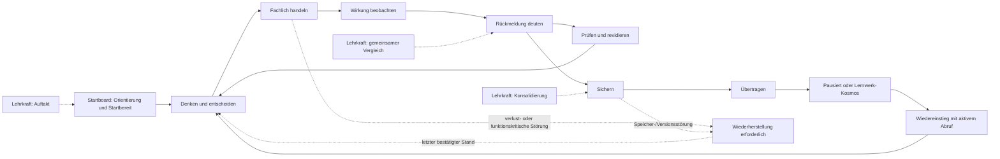

# IuM-Lernwerk – Vertikale Referenzentwürfe der Learning Experience

- **Task:** LXP03 Vertikale Referenzsituationen entwerfen und vergleichen
- **Status:** in Ausarbeitung
- **Fassung:** 0.1
- **Datum:** 5. August 2026
- **Geltungsbereich:** IuM-Lernwerk, Gymnasium Baden-Württemberg, Klassen 5–7, Niveau E
- **Ausgangsstand:** lokaler `main` auf `f2a9d3c`; `origin/main` auf `3498838`
- **Arbeitsgrenze:** konkrete codefreie Referenzentwürfe; kein Produktcode, kein wiederverwendbares Designsystem, keine reale Erprobung

## Entscheidung und Zweck

LXP03 übersetzt die freigegebene LXP01-Experience-Strategie und die normative LXP02-Produktarchitektur in drei konkrete, zusammenhängende und vergleichbare Referenzentwürfe:

1. Einstieg und Orientierung;
2. interaktive Kernlernhandlung mit Feedback und Revision;
3. Sicherung, Transfer und anschlussfähiger Wiedereinstieg.

Die drei Entwürfe bilden einen gemeinsamen End-to-End-Lernweg am fachlichen Belastungsfall `IUM-5-CORE-05 – Präzise Abläufe ausführbar machen`. Sie werden nicht zu drei isolierten Bildschirmideen und nicht zu Varianten desselben Screens verkürzt. Jeder Entwurf schließt eine andere fachliche Entscheidungseinheit, verwendet aber denselben Objekt-, Zustands-, Begriffs-, Daten- und Rollenvertrag. Dadurch werden Übergaben, Fortschrittsbedeutung, Lehrkraftorchestrierung und Wiedereinstieg tatsächlich prüfbar.

IUM5 ist Konkretisierung, nicht globale Vorlage. Ein Portabilitätscheck prüft deshalb zusätzlich, welche Beziehungen auf Quellen-/Evidenzanalyse, Daten-/Systemmodellierung und Medienproduktrevision übertragbar sind und welche Robotik- oder Programmierdetails ausdrücklich lokal bleiben.

LXP03 erzeugt konkrete Text-Wireframes, Wide-/Schmal-Kompositionen, Wireflows, Beschriftungsbeispiele und Interaktionsabfolgen. Diese Artefakte legen keine visuelle Marke, keinen Komponentenbestand und keine technische Implementierung fest. Erst LXP04 darf nach dem Vergleich aller drei Situationen wiederverwendbare Muster, visuelle Sprache und Produktionsverträge ableiten.

## Status, Geltungsbereich und Freigabegates

Der Nutzer hat LXP03 am 5. August 2026 ausdrücklich zur vollständigen Ausführung beauftragt, Codex operative Entscheidungen übertragen und nur dokumentierte Freigabegates als Stopppunkte bestimmt. Damit sind Planung, Entwurf, Vergleich, Auswahlentscheidung, Selbstprüfung und gebündelte Reviewvorbereitung in dieser Session geöffnet.

Die folgenden Gates bleiben geschlossen:

- schriftliche Annahme der vollständigen LXP03-Spezifikation;
- Planung und Ausführung von LXP04;
- Produktcode, konkrete Komponentenimplementierung und IUM5-Neufassung;
- Preview, Deployment und reale Geräteprüfung;
- Pilotierung, LMS, Produktrelease und Statushochsetzung.

In LXP03 ausdrücklich zulässig sind:

- konkrete inhaltliche Kompositionen für weite und schmale Ansichten;
- textuelle Wireframes und Mermaid-Wireflows;
- sichtbare Beschriftungen und exemplarische Rückmeldungstexte;
- Tastatur-, Touch-, Text-/Assistive-Technology- und Reduced-Motion-Abläufe;
- konkrete Lernenden-/Lehrkraftmomente, Haltepunkte und Fallbacks;
- codefreie Local-First-, Offline-, Speicher- und Recoveryabläufe;
- Vergleich, Auswahl und Übergabe an das spätere Designsystem.

Nicht zulässig sind:

- HTML, CSS, TypeScript, Framework-, Router-, State- oder Komponentenentscheidungen;
- Design Tokens, Marken-, Typografie-, Farb-, Illustrations- oder Iconfestlegung;
- hochauflösende Produkt-Mockups, die eine nicht validierte visuelle Sprache vortäuschen;
- Änderungen an IUM5-Anwendung, Aufgabenbestand, Plattform oder Tests;
- neue Curriculumzuordnung oder Niveaudifferenzierung;
- Konto, Backend, Klassenverwaltung, Telemetrie, Diagnose, Bewertung oder automatische Personalisierung;
- Ausführung eines Preview-, Pilot-, LMS- oder Releasepfads.

Die Dokumentation bezeichnet die Entwürfe bis zur schriftlichen Nutzerfreigabe als `reviewfähig`, nicht als usability-, lernwirksamkeits-, accessibility- oder pilotgeprüft. Technische und didaktische Plausibilität ist nicht mit realer Nutzungsevidenz gleichzusetzen.

## Normative Eingaben und Vorrangregel

### Quellen der Wahrheit

| Rang | normative Eingabe | Funktion in LXP03 |
|---:|---|---|
| 1 | ausdrückliche schriftliche Nutzerentscheidungen | höchste Projektentscheidung; der Vollausführungsauftrag öffnet LXP03, nicht die Folgephasen |
| 2 | LXP01 `2026-08-04-ium-learning-experience-production-design.md`, Fassung 1.0, schriftlich freigegeben | Experience-Nordstern, Lernhandlungsloop, drei Referenzsituationen, Q1–Q8 und globale Anti-Patterns |
| 3 | LXP02 `2026-08-04-ium-learning-experience-product-architecture.md`, Fassung 1.0, schriftlich freigegeben | Räume, Objekte, Zustände, Guards, Navigation, Begriffssystem, Belegkarte, Rollen, Resilienz und sieben LXP03-Risiken |
| 4 | Fachprofil `docs/fachprofil/ium-gymnasium-5-7.md`, Status `working` | fachliche Handlungen, Aufgaben-, Repräsentations-, Hilfe-, Feedback- und Medienstandards |
| 5 | IUM5-Moduldesign `2026-08-03-ium-5-core-05-moduldesign.md` | fachlich-didaktischer Belastungsfall; keine Experience-, UI- oder Produktfreigabe |
| 6 | IBBW-WU-Exzerpte 1, 3, 6 und 9 im Workspace, Status `draft` | Orientierungsrahmen für Tiefenstruktur, Unterstützung, Aufgabenqualität und digitalen Lernmehrwert; kein Wirkungsnachweis dieser Entwürfe |
| 7 | diese LXP03-Spezifikation | nach schriftlicher Freigabe normative Eingabe für die separate Planung von LXP04 |

### Curriculare und fachliche Reifegrenze

- Basiskurs Medienbildung 2016 und Aufbaukurs Informatik Klasse 7 sind für ihre ausgewiesenen Bereiche `enacted`.
- Die Lesehilfe 2026/2027 bleibt `orientation` und wird nicht als in Kraft gesetzte Norm behandelt.
- Der Repository-Crosswalk bleibt Quelle für recordgenaue Curriculumzuordnung; LXP03 erzeugt keine neue Zuordnung.
- Das Fachprofil Informatik und Medienbildung Gymnasium 5–7 bleibt `working`.
- IUM5 bleibt `working`, `pilotRequired: true` und `device-verified: not-run`.

### Vorrang- und Konfliktregel

- Kein Referenzentwurf darf LXP01 oder LXP02 stillschweigend abschwächen.
- Ein konkreter Darstellungswunsch verliert gegen einen fachlichen Guard, Datenintegrität, Datenschutz oder gleichwertige Accessibility.
- Ein fachlich notwendiger Zusammenhang darf nicht aus reiner Oberflächenökonomie getrennt werden; die Komposition muss ihn auf weiten und schmalen Ansichten rekonstruierbar halten.
- Wenn IUM5s bestehende Oberflächenannahme dem LXP02-Vertrag widerspricht, wird sie als Legacy-Thema für LXP05 markiert; LXP03 ändert keine Produktdatei.
- Wenn ein Entwurf einen echten Architekturwiderspruch nachweist, muss LXP02 ausdrücklich revidiert werden. Styling darf den Widerspruch nicht verdecken.
- LXP04 darf nur Musterkandidaten übernehmen, die in mindestens zwei Situationen tragen und von der dritten nicht widerlegt werden.

## LXP03-Ergebnisvertrag

Während der Ausarbeitung sind die Statuswerte `specified`, `open-decision` und `not-applicable-with-rationale` zulässig. Vor dem gebündelten schriftlichen Review muss jede Zeile `specified` sein.

| LXP03-ID | erforderliches Ergebnis | normative Eingabe | Spezifikationsabschnitt | Referenzentwurfsprüfung | Reviewevidenz | Status |
|---|---|---|---|---|---|---|
| LXP03-01 | Vergleich von drei Kompositionsansätzen und Auswahlentscheidung | LXP01 §§ 8–10, 25–31; LXP02 Eigentümermatrix | Ansatzvergleich und Arbeitsentscheidung | alle drei Entwürfe | Mechanismus-/Kostenvergleich und Fail-Signale | specified |
| LXP03-02 | gemeinsames situationsübergreifendes Entwurfsraster | LXP01 §§ 24–29; LXP02 Walkthroughschema | Gemeinsames Entwurfsraster | alle drei Entwürfe | identische Prüffelder und Kontextbudget | specified |
| LXP03-03 | Wide-/Schmalentwurf Einstieg und Orientierung | LXP01 § 21; LXP02 Startboard/Einstiegsmodi | Referenzentwurf 1 | Situation 1 | Wireframes, Wireflow, Fokus- und Recoverypfad | open-decision |
| LXP03-04 | Wide-/Schmalentwurf interaktive Kernlernhandlung | LXP01 § 22; LXP02 LS-DECIDE bis LS-SECURE | Referenzentwurf 2 | Situation 2 | vier Zustandskompositionen, Rückmeldung und Revision | open-decision |
| LXP03-05 | Wide-/Schmalentwurf Sicherung, Transfer und Wiedereinstieg | LXP01 § 23; LXP02 Sicherungsraum/Belegkarte | Referenzentwurf 3 | Situation 3 | Beleg-, Transfer-, Export-, Pausen- und Abrufpfad | open-decision |
| LXP03-06 | verbundene Lernenden- und Lehrkraftspur | LXP01 §§ 12, 18, 21–24; LXP02 Lehrkraft-/Sozialformvertrag | Lehrkraftspur je Referenzentwurf | Situationen 1–3 | Haltepunkte, Rollen, gewöhnliche Evidenz und Fallback | open-decision |
| LXP03-07 | gleichwertige Bedien- und Darstellungswege | LXP01 § 19; LXP02 A11Y-01 bis A11Y-12 | Accessibility je Referenzentwurf | Situationen 1–3 | Tastatur-, Touch-, Text-/AT-, Reduced-Motion- und Reflowpfad | open-decision |
| LXP03-08 | konkrete Local-First-, Offline- und Recoveryabläufe | LXP01 § 20; LXP02 RES-INFO/LIMIT/BLOCK | Resilienz je Referenzentwurf | Situationen 1–3 | erhaltener Stand, sichere Primärhandlung und Rückweg | open-decision |
| LXP03-09 | informationshaltige Rückmeldung, Hilfe und Revision | LXP01 § 16; LXP02 Zustands-/Guardvertrag | Feedback- und Hilfevertrag | Situation 2, Übergaben 1/3 | konkrete Copy, Eskalation und Revisionsbeleg | open-decision |
| LXP03-10 | WU-Check und fachlich-didaktische Aufgabenprüfung | Fachprofil; IBBW WU 1/3/6/9 | Wirksamkeits- und Fachcheck | Situationen 1–3 | drei WU-Checks und Eigenleistungsbegründungen | open-decision |
| LXP03-11 | Q1–Q8-, Anti-Pattern- und LXP02-Risikoprüfung | LXP01 §§ 25–29; LXP02 Qualitätsurteile | Vergleichende Qualitätsprüfung | Situationen 1–3 | 24 Urteile, 7 Risikoantworten und Anti-Pattern-Scan | open-decision |
| LXP03-12 | Auswahl und präzise Übergabe an LXP04 | LXP01 § 31; LXP02 Eigentümermatrix | Auswahlentscheidung und LXP04-Übergabe | situationsübergreifend | Musterkandidaten, Nicht-Generalisierungen und Freigabegate | open-decision |

## Entscheidungsledger und kontrollierter Wortschatz

### Entscheidungsledger

| Entscheidungs-ID | Entscheidung | Begründung | Folgeprüfung | Status |
|---|---|---|---|---|
| DEC-LXP03-001 | Die drei Referenzentwürfe bilden einen zusammenhängenden IUM5-Lernweg und bleiben als Entscheidungseinheiten getrennt vergleichbar. | Nur ein durchgängiger Produkt- und Wiedereinstiegszusammenhang prüft Übergaben; isolierte Screens würden Kontinuität vortäuschen. | alle drei Wireflows; Q1, Q4, Q5 und Q6 | specified |
| DEC-LXP03-002 | IUM5 konkretisiert die Entwürfe, bestimmt aber nicht die spätere Systemtaxonomie. | Der Lernhandlungsloop muss auch Analyse, Urteil, Modellierung und Produktion tragen. | drei Portabilitätsproben; LXP04-Nicht-Generalisierungen | specified |
| DEC-LXP03-003 | Text-Wireframes und Mermaid-Wireflows sind das maximale Darstellungsniveau dieser Phase. | Sie erzwingen konkrete Informations- und Interaktionsentscheidungen, ohne visuelle Marke oder Code als validiert auszugeben. | Scopeprüfung und Repository-Diff | specified |
| DEC-LXP03-004 | Die sichtbaren Produktbegriffe stammen ausschließlich aus dem kontrollierten LXP02-Wortschatz. | Neue Synonyme würden Lernenden-, Lehrkraft-, Recovery- und AT-Pfade auseinanderführen. | Terminologieaudit aller Entwürfe | specified |
| DEC-LXP03-005 | `Fokusbühne`, `Kontextband`, `Aktionskante` und ähnliche Begriffe sind vorläufige Analysebegriffe, keine sichtbaren Produktlabels und keine Komponentennamen. | LXP03 braucht präzise Vergleichssprache, darf aber LXP04s Systembenennung nicht vorwegnehmen. | LXP04-Übergabe und sichtbare Copy-Prüfung | specified |
| DEC-LXP03-006 | Die Referenzentwürfe werden mit den Workspace-Unterrichtsgates und WU-Bänden 1, 3, 6 und 9 geprüft. | Sichtstruktur, Aufgabenqualität, Unterstützung und digitaler Lernmehrwert müssen gemeinsam tragen. | drei WU-Checks und Reifehinweise | specified |

### Kontrollierter sichtbarer Wortschatz

LXP03 übernimmt ohne semantische Änderung insbesondere:

- Räume: `Lernwerk-Kosmos`, `Startboard`, `Lernstudio`, `Sicherungsraum`, `Lehrkraftspur`;
- Lernzustände: `Orientierung`, `Startbereit`, `Denken und entscheiden`, `Fachlich handeln`, `Wirkung beobachten`, `Rückmeldung deuten`, `Prüfen und revidieren`, `Sichern`, `Übertragen`, `Pausiert`, `Wiederherstellung erforderlich`;
- Navigation: `neu beginnen`, `zum gemeinsamen Start`, `fortsetzen`, `wieder einsteigen`, `wiederherstellen`, `zurück zu …`, `zur Phasenübersicht`, `Lernweg ansehen`, `zum Lernwerk-Kosmos`, `pausieren`, `sichern`, `verwerfen`, `löschen`;
- Sicherung: `Sicherungsartefakt`, `Belegkarte`, `Belegkarte sichern`, `auf neuen Fall übertragen`;
- Resilienz: `informativ`, `handlungseinschränkend`, `blockierend`, `offline bereit`, `offline eingeschränkt`, `nicht offline verfügbar`.

Der sichtbare Auftrag verwendet fachlich konkrete Verben wie `Vorhersage festhalten`, `Algorithmus ausführen`, `erste Abweichung prüfen`, `Revision begründen` und `Belegkarte sichern`. Das generische `weiter` ist nie alleinige Primärhandlung.

## Ansatzvergleich und Arbeitsentscheidung

LXP01 hat das lehrkraftorchestrierte Lernstudio als Innenarchitektur und den offenen Lernwerk-Kosmos als Außenarchitektur festgelegt. LXP03 vergleicht deshalb keine alternativen Produktstrategien, sondern drei konkrete Arten, wie ein Lernstudiozustand als erfassbare, zugängliche und wiederaufnehmbare Situation komponiert werden kann.

| Ansatz | Lernmechanismus | Stärke | kognitiver und Accessibility-Preis | Lehrkraftfolge | Verhalten in schmaler Ansicht | Fail-Signal |
|---|---|---|---|---|---|---|
| A – Dokument-Stack | Auftrag, Repräsentation, Werkzeug, Rückmeldung, Hilfe, Sicherung und Folgehandlung stehen als lange vertikale Abschnitte untereinander. | vertraute Dokumentnavigation; lineare Lesbarkeit; technisch robuste Grundform | aktuelle Ursache, Wirkung und Rückmeldung liegen weit auseinander; viele spätere Kontrollen konkurrieren; Fokus und Screenreaderpfad werden lang | Haltepunkte stehen im Text, sind aber nicht als aktueller Unterrichtszustand erkennbar | formal guter Reflow, aber wachsende Scroll- und Gedächtnislast | Primärhandlung oder relevanter Beleg ist nur durch Scrollsuche auffindbar; spätere Werkzeuge sind vor ihrer fachlichen Relevanz fokussierbar |
| B – strikter Schritt-Wizard | jeder Lernzustand wird als isolierter Schritt mit genau einer Aktion gezeigt; Abschluss öffnet den nächsten Schritt. | geringe visuelle Konkurrenz; eindeutige Primäraktion; kurze Fokuspfade | notwendiger Kontext wird leicht verborgen; Vorhersage, Wirkung und Beleg müssen erinnert werden; Rücksprung und Gesamtkarte drohen sekundär zu werden | Lehrkraft kann Schritte gut ansagen, verliert aber flexible gemeinsame Haltepunkte und geparkte Zustände | kompakt, solange Inhalte kurz sind; komplexe Beziehungen zerfallen auf mehrere Ansichten | ein Guard wird zur bloßen Schrittfreigabe; Lernende müssen verborgenen Kontext erinnern; Rückkehr oder Gesamtkarte fehlt |
| C – stabile Fokusbühne mit rekonstruierbarem Kontext | der aktuelle Lernzustand zeigt eine fachlich vollständige Beziehung aus Auftrag, relevantem Objekt, Handlung und Kriterium; Kontext, Hilfe, Gesamtkarte und Datenbereich bleiben gezielt erreichbar. | Ursache–Wirkung und Produktvergleich bleiben zusammen; eine Primärhandlung; Lehrkraft-/Lernendenlabels und sichere Rückkehr sind sichtbar | erfordert sorgfältige Informationspriorisierung, semantische Reihung und zustandsspezifische Komposition; nicht jede Situation sieht gleich aus | gemeinsame Haltepunkte, Rollen und Rückkehrzustände können am gleichen Lernbegriff verankert werden | keine bloße Verkleinerung: dieselbe Beziehung wird in eine feste logische Reihenfolge überführt | Eingabe, Wirkung oder Rückmeldung verliert ihren Bezug; sekundäre Navigation konkurriert; Text-/AT-Pfad verlangt eine andere Lernhandlung |

### Auswahlentscheidung

Gewählt wird **Ansatz C – stabile Fokusbühne mit rekonstruierbarem Kontext**.

Die Entscheidung beruht nicht auf einem ästhetischen Stilurteil. Ansatz C kann als einziger gleichzeitig:

- LXP02-Zustände als fachliche Bedeutung statt als Seite behandeln;
- eine zentrale Denkhandlung fokussieren, ohne Ziel, Kriterium und Rückweg zu verbergen;
- Ursache, Wirkung, Beleg und Revision im jeweils nötigen Zusammenhang halten;
- Wide-, Schmal-, Tastatur-, Touch- und Text-/AT-Pfade aus derselben semantischen Reihenfolge ableiten;
- Lehrkrafthaltepunkte und lokale Lernendenarbeit ohne Fernsteuerung verbinden;
- RES-INFO, RES-LIMIT und RES-BLOCK dort sichtbar machen, wo sie die Handlung tatsächlich verändern;
- Kontext und Gesamtkarte rekonstruierbar halten, ohne den Kosmos als zweiten Arbeitsraum zu öffnen.

Die Arbeitsentscheidung ist eine zu prüfende Projektentscheidung, kein Usability- oder Wirkungsnachweis. LXP06 muss später zeigen, ob Lernende die relevanten Beziehungen tatsächlich schneller verstehen, ob der schmale Pfad ohne zusätzliche Gedächtnislast funktioniert und ob Lehrkräfte die Haltepunkte ohne parallele Notizen nutzen können.

### Begrenzte Übernahme verworfener Elemente

- Der Dokument-Stack bleibt für lange Lehrkraftreferenzen, Quellen und Lizenzinformationen geeignet, nicht als primärer Lernendenarbeitsraum.
- Ein kurzer Dialogschritt ist für Löschung, inkompatiblen Import oder andere irreversible beziehungsweise blockierende Entscheidungen zulässig, wenn Ausgang, Risiko, sichere Primärhandlung und Abbruch vollständig sichtbar sind.
- Eine lineare Abfolge darf einen echten fachlichen Guard ausdrücken, aber nie bloß Seitenbesuch oder Zeitablauf.

## Gemeinsames Entwurfsraster

### Funktion des Rasters

Alle drei Referenzentwürfe verwenden dasselbe Prüfraster. Das Raster normiert keine Bildschirmkomponente. Es zwingt jeden Entwurf, Lernfunktion, sichtbare Beziehung, Interaktion, Unterrichtsorchestrierung, Persistenz und Ausfallgrenze gemeinsam zu beantworten.

| Prüffeld | verpflichtende Antwort je Referenzentwurf |
|---|---|
| Zweck und fachlicher Zielzustand | Was verstehen, entscheiden, erklären, herstellen, prüfen oder revidieren Lernende danach besser? |
| konkreter Fall und Lernprodukt | Welcher IUM5-Fall wird bearbeitet und welche Produktspur entsteht? |
| Ausgangszustand und Zielzustand | Welche LXP02-Zustände, Guards und verbotenen Übergänge gelten? |
| Lernendenmoment | Was ist als Ziel, Objekt, Handlung, Kriterium, Rückmeldung und nächster Schritt sichtbar? |
| Lehrkraftmoment | Welcher Auftakt, Haltepunkt, gewöhnliche Evidenz, Rückfrage, Sozialformwechsel und Fallback trägt dieselbe Lernhandlung? |
| Wide-Komposition | Welche Beziehung darf in einer weiten Ansicht gleichzeitig verstanden werden? |
| Schmal-Komposition | In welcher semantischen Reihenfolge bleibt dieselbe Beziehung bei 320 CSS-Pixeln und 200 Prozent Zoom rekonstruierbar? |
| Bediengleichwertigkeit | Welche identische fachliche Entscheidung leisten Touch, Tastatur und Text-/Assistive-Technology? |
| Fokus und Statusmeldung | Wohin geht Fokus bei Zustandswechsel, Hilfe, Validierungsfehler, Recovery und Rückkehr? Was wird angekündigt? |
| lokaler Zustand | Welche bestätigte Produktspur wird gespeichert, was bleibt flüchtig und was wird ausdrücklich nicht erfasst? |
| Offline und Recovery | Welcher störungsfreie, handlungseinschränkende und blockierende Zustand tritt auf; welche Arbeit bleibt erhalten? |
| Unterstützung und Feedback | Welche konkrete Hürde adressiert eine Hilfe, welche Rückmeldung erhält die Denkhandlung und wann wird ein vollständiges Beispiel zugänglich? |
| Copy und Begriffe | Welche kontrollierten sichtbaren Labels und Ergebnisverben werden verwendet? |
| WU-Check und Qualität | Wie tragen Tiefenstruktur, Aufgabenqualität, Unterstützung, Diagnose, digitale Funktion, Q1–Q8 und Anti-Patterns? |
| Übergabe | Was ist lokaler Entwurfsbestand, was ist belastbarer Musterkandidat und was darf LXP04 nicht generalisieren? |

### Gemeinsame semantische Anatomie

Jeder Moment ordnet sechs Informationsfunktionen, ohne daraus sechs dauerhaft sichtbare Bereiche abzuleiten:

1. **Kontext:** Modul, Unterrichtseinheit/Lernphase, Ziel und Rückkehranker.
2. **Fokus:** aktueller fachlicher Auftrag und relevantes Qualitätskriterium.
3. **Arbeitsobjekt:** Fall, Modell, Produkt, Beleg oder Ausgangs-/Revisionsfassung.
4. **Handlung:** genau die aktuell erlaubte fachliche Primäraktion.
5. **Wirkung und Rückmeldung:** beobachtbarer Zustand, Beleg, Abweichung oder sichere Systemfolge.
6. **Anschluss:** nächster fachlicher Schritt, Haltepunkt, Hilfe, Pause, Gesamtkarte oder Recovery.

Die Funktionen `Wirkung und Rückmeldung` dürfen in LS-DECIDE nicht die erwartete Wirkung vorwegnehmen. `Anschluss` darf keinen verbotenen Zustandsübergang anbieten. `Kontext` und `Fokus` bleiben auch dann verständlich, wenn Hilfe, Gesamtkarte oder Datenbereich geschlossen sind.

### Kontext- und Dichtebudget

Die folgenden Werte sind interne Projektbenchmarks für LXP03, keine aus Forschung abgeleiteten Universalgrenzen:

- pro Moment genau eine primäre fachliche Handlung;
- pro Moment genau eine dominante fachliche Beziehung, zum Beispiel `Vorhersage ↔ Ausgangszustand`, `Handlung ↔ Wirkung` oder `Beleg ↔ Revision`;
- höchstens zwei direkt konkurrierende sekundäre Aktionen im Fokusbereich;
- Gesamtkarte, Hilfe und Datenbereich besitzen stabile Zugänge, aber kein gleiches visuelles oder semantisches Primat wie die Lernhandlung;
- technische Normalzustände werden nicht als eigene Fokusregion wiederholt;
- ein RES-LIMIT-Zustand steht an der betroffenen Handlung; ein RES-BLOCK-Zustand unterbricht nur den gefährdeten Pfad;
- sichtbare Lernendenarbeit wird nicht dupliziert, nur weil eine andere Darstellung geöffnet wird.

Ein Entwurf fällt durch, wenn er diese Benchmarks nur einhält, indem notwendige Kriterien, Datenfolgen, Rückwege oder fachliche Zusammenhänge versteckt werden.

### Wide- und Schmalregel

`Wide` bezeichnet keine feste Pixelbreite, sondern eine Ansicht, in der die aktuelle fachliche Beziehung räumlich nebeneinander erfasst werden kann. `Schmal` bezeichnet eine Ansicht, in der dieselbe Beziehung in eine eindeutige semantische Reihenfolge überführt werden muss.

Für alle Entwürfe gilt:

```text
Wide:   Kontext/Fokus → Arbeitsobjekt ↔ Handlung/Wirkung → Rückmeldung/Anschluss
Schmal: Kontext/Fokus → Ausgangsobjekt → Primärhandlung → Wirkung/Beleg → Rückmeldung/Anschluss
```

Der Pfeil bedeutet logische Leserichtung, nicht visuelles Layout. Das Doppelpfeilzeichen markiert eine fachliche Korrespondenz. In schmaler Ansicht bleibt der Ausgangsanker in knapper Form am Wirkungs-/Rückmeldungsabschnitt verfügbar; Lernende müssen ihn nicht aus Erinnerung rekonstruieren.

### Gemeinsamer Zustands- und Unterrichtswireflow



### Beschriftungs- und Interaktionsregel

- Primäraktionen nennen Ergebnis und Objekt: `Vorhersage festhalten`, `Algorithmus schrittweise ausführen`, `erste Abweichung prüfen`, `Revision erneut vorhersagen`, `Belegkarte sichern`.
- Sekundäraktionen nennen ihr Ziel: `Lernweg ansehen`, `Hilfe zur Blickrichtung nutzen`, `zurück zum Startboard`, `pausieren`.
- `lokal gespeichert` ist technischer Status; `sichern` ist eine fachliche Handlung.
- Eine automatische Statusmeldung bestätigt Zustand oder Datenfolge, nie Leistung oder Kompetenz.
- Hilfe öffnet kontextnah, erhält Ausgangsobjekt und Fokus-Rückkehr und speichert ihre Nutzung nicht.
- Eine schmale oder assistive Darstellung darf keine Lösung offenlegen, die im visuellen Pfad erst erarbeitet werden muss.
