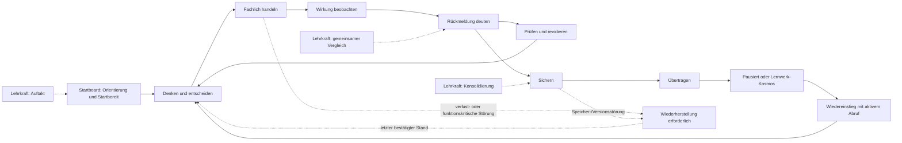
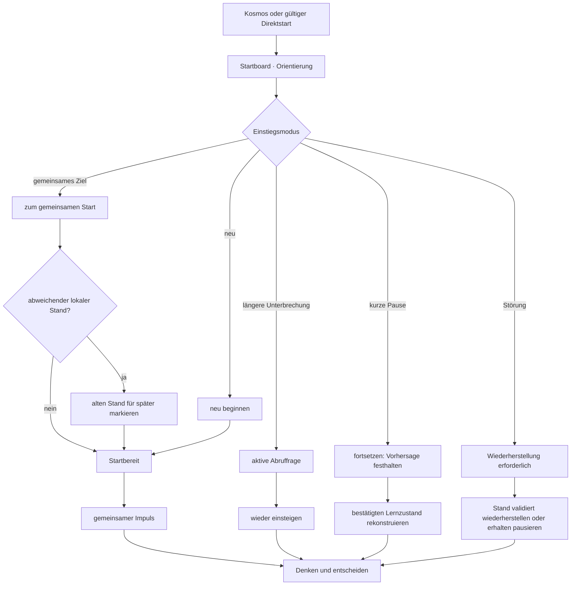
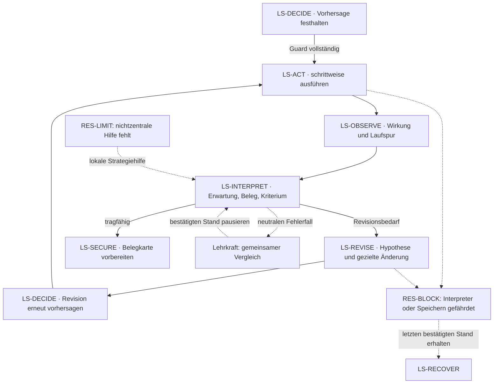
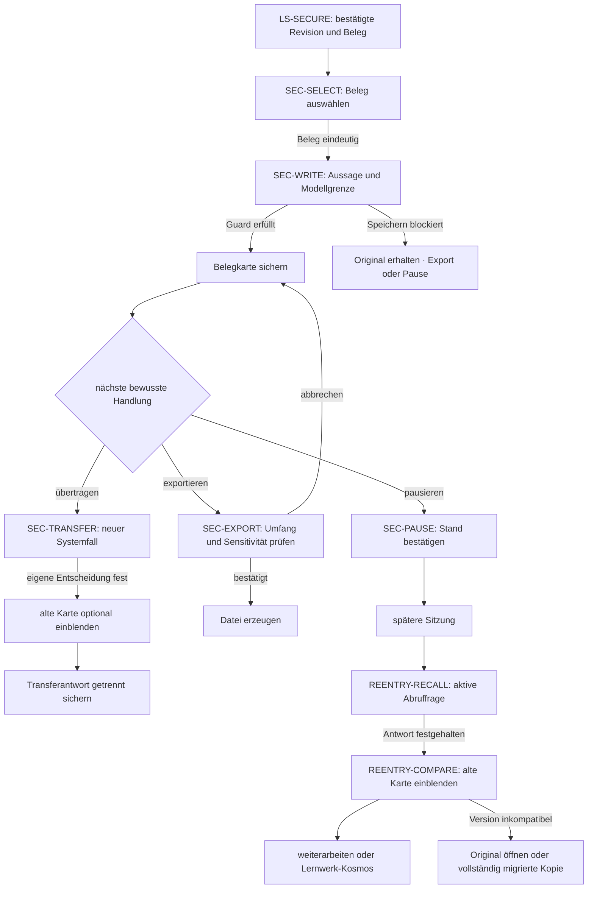

# IuM-Lernwerk – Vertikale Referenzentwürfe der Learning Experience

- **Task:** LXP03 Vertikale Referenzsituationen entwerfen und vergleichen
- **Status:** in Ausarbeitung
- **Fassung:** 0.1
- **Datum:** 5. August 2026
- **Geltungsbereich:** IuM-Lernwerk, Gymnasium Baden-Württemberg, Klassen 5–7, Niveau E
- **Ausgangsstand:** lokaler `main` auf `f2a9d3c`; `origin/main` auf `3498838`
- **Arbeitsgrenze:** konkrete codefreie Referenzentwürfe; kein Produktcode, kein wiederverwendbares Designsystem, keine reale Erprobung

## Entscheidung und Zweck

LXP03 übersetzt die freigegebene LXP01-Experience-Strategie und die normative LXP02-Produktarchitektur in drei konkrete, zusammenhängende und vergleichbare Referenzentwürfe:

1. Einstieg und Orientierung;
2. interaktive Kernlernhandlung mit Feedback und Revision;
3. Sicherung, Transfer und anschlussfähiger Wiedereinstieg.

Die drei Entwürfe bilden einen gemeinsamen End-to-End-Lernweg am fachlichen Belastungsfall `IUM-5-CORE-05 – Präzise Abläufe ausführbar machen`. Sie werden nicht zu drei isolierten Bildschirmideen und nicht zu Varianten desselben Screens verkürzt. Jeder Entwurf schließt eine andere fachliche Entscheidungseinheit, verwendet aber denselben Objekt-, Zustands-, Begriffs-, Daten- und Rollenvertrag. Dadurch werden Übergaben, Fortschrittsbedeutung, Lehrkraftorchestrierung und Wiedereinstieg tatsächlich prüfbar.

IUM5 ist Konkretisierung, nicht globale Vorlage. Ein Portabilitätscheck prüft deshalb zusätzlich, welche Beziehungen auf Quellen-/Evidenzanalyse, Daten-/Systemmodellierung und Medienproduktrevision übertragbar sind und welche Robotik- oder Programmierdetails ausdrücklich lokal bleiben.

LXP03 erzeugt konkrete Text-Wireframes, Wide-/Schmal-Kompositionen, Wireflows, Beschriftungsbeispiele und Interaktionsabfolgen. Diese Artefakte legen keine visuelle Marke, keinen Komponentenbestand und keine technische Implementierung fest. Erst LXP04 darf nach dem Vergleich aller drei Situationen wiederverwendbare Muster, visuelle Sprache und Produktionsverträge ableiten.

## Status, Geltungsbereich und Freigabegates

Der Nutzer hat LXP03 am 5. August 2026 ausdrücklich zur vollständigen Ausführung beauftragt, Codex operative Entscheidungen übertragen und nur dokumentierte Freigabegates als Stopppunkte bestimmt. Damit sind Planung, Entwurf, Vergleich, Auswahlentscheidung, Selbstprüfung und gebündelte Reviewvorbereitung in dieser Session geöffnet.

Die folgenden Gates bleiben geschlossen:

- schriftliche Annahme der vollständigen LXP03-Spezifikation;
- Planung und Ausführung von LXP04;
- Produktcode, konkrete Komponentenimplementierung und IUM5-Neufassung;
- Preview, Deployment und reale Geräteprüfung;
- Pilotierung, LMS, Produktrelease und Statushochsetzung.

In LXP03 ausdrücklich zulässig sind:

- konkrete inhaltliche Kompositionen für weite und schmale Ansichten;
- textuelle Wireframes und Mermaid-Wireflows;
- sichtbare Beschriftungen und exemplarische Rückmeldungstexte;
- Tastatur-, Touch-, Text-/Assistive-Technology- und Reduced-Motion-Abläufe;
- konkrete Lernenden-/Lehrkraftmomente, Haltepunkte und Fallbacks;
- codefreie Local-First-, Offline-, Speicher- und Recoveryabläufe;
- Vergleich, Auswahl und Übergabe an das spätere Designsystem.

Nicht zulässig sind:

- HTML, CSS, TypeScript, Framework-, Router-, State- oder Komponentenentscheidungen;
- Design Tokens, Marken-, Typografie-, Farb-, Illustrations- oder Iconfestlegung;
- hochauflösende Produkt-Mockups, die eine nicht validierte visuelle Sprache vortäuschen;
- Änderungen an IUM5-Anwendung, Aufgabenbestand, Plattform oder Tests;
- neue Curriculumzuordnung oder Niveaudifferenzierung;
- Konto, Backend, Klassenverwaltung, Telemetrie, Diagnose, Bewertung oder automatische Personalisierung;
- Ausführung eines Preview-, Pilot-, LMS- oder Releasepfads.

Die Dokumentation bezeichnet die Entwürfe bis zur schriftlichen Nutzerfreigabe als `reviewfähig`, nicht als usability-, lernwirksamkeits-, accessibility- oder pilotgeprüft. Technische und didaktische Plausibilität ist nicht mit realer Nutzungsevidenz gleichzusetzen.

## Normative Eingaben und Vorrangregel

### Quellen der Wahrheit

| Rang | normative Eingabe | Funktion in LXP03 |
|---:|---|---|
| 1 | ausdrückliche schriftliche Nutzerentscheidungen | höchste Projektentscheidung; der Vollausführungsauftrag öffnet LXP03, nicht die Folgephasen |
| 2 | LXP01 `2026-08-04-ium-learning-experience-production-design.md`, Fassung 1.0, schriftlich freigegeben | Experience-Nordstern, Lernhandlungsloop, drei Referenzsituationen, Q1–Q8 und globale Anti-Patterns |
| 3 | LXP02 `2026-08-04-ium-learning-experience-product-architecture.md`, Fassung 1.0, schriftlich freigegeben | Räume, Objekte, Zustände, Guards, Navigation, Begriffssystem, Belegkarte, Rollen, Resilienz und sieben LXP03-Risiken |
| 4 | Fachprofil `docs/fachprofil/ium-gymnasium-5-7.md`, Status `working` | fachliche Handlungen, Aufgaben-, Repräsentations-, Hilfe-, Feedback- und Medienstandards |
| 5 | IUM5-Moduldesign `2026-08-03-ium-5-core-05-moduldesign.md` | fachlich-didaktischer Belastungsfall; keine Experience-, UI- oder Produktfreigabe |
| 6 | IBBW-WU-Exzerpte 1, 3, 6 und 9 im Workspace, Status `draft` | Orientierungsrahmen für Tiefenstruktur, Unterstützung, Aufgabenqualität und digitalen Lernmehrwert; kein Wirkungsnachweis dieser Entwürfe |
| 7 | diese LXP03-Spezifikation | nach schriftlicher Freigabe normative Eingabe für die separate Planung von LXP04 |

### Curriculare und fachliche Reifegrenze

- Basiskurs Medienbildung 2016 und Aufbaukurs Informatik Klasse 7 sind für ihre ausgewiesenen Bereiche `enacted`.
- Die Lesehilfe 2026/2027 bleibt `orientation` und wird nicht als in Kraft gesetzte Norm behandelt.
- Der Repository-Crosswalk bleibt Quelle für recordgenaue Curriculumzuordnung; LXP03 erzeugt keine neue Zuordnung.
- Das Fachprofil Informatik und Medienbildung Gymnasium 5–7 bleibt `working`.
- IUM5 bleibt `working`, `pilotRequired: true` und `device-verified: not-run`.

### Vorrang- und Konfliktregel

- Kein Referenzentwurf darf LXP01 oder LXP02 stillschweigend abschwächen.
- Ein konkreter Darstellungswunsch verliert gegen einen fachlichen Guard, Datenintegrität, Datenschutz oder gleichwertige Accessibility.
- Ein fachlich notwendiger Zusammenhang darf nicht aus reiner Oberflächenökonomie getrennt werden; die Komposition muss ihn auf weiten und schmalen Ansichten rekonstruierbar halten.
- Wenn IUM5s bestehende Oberflächenannahme dem LXP02-Vertrag widerspricht, wird sie als Legacy-Thema für LXP05 markiert; LXP03 ändert keine Produktdatei.
- Wenn ein Entwurf einen echten Architekturwiderspruch nachweist, muss LXP02 ausdrücklich revidiert werden. Styling darf den Widerspruch nicht verdecken.
- LXP04 darf nur Musterkandidaten übernehmen, die in mindestens zwei Situationen tragen und von der dritten nicht widerlegt werden.

## LXP03-Ergebnisvertrag

Während der Ausarbeitung sind die Statuswerte `specified`, `open-decision` und `not-applicable-with-rationale` zulässig. Vor dem gebündelten schriftlichen Review muss jede Zeile `specified` sein.

| LXP03-ID | erforderliches Ergebnis | normative Eingabe | Spezifikationsabschnitt | Referenzentwurfsprüfung | Reviewevidenz | Status |
|---|---|---|---|---|---|---|
| LXP03-01 | Vergleich von drei Kompositionsansätzen und Auswahlentscheidung | LXP01 §§ 8–10, 25–31; LXP02 Eigentümermatrix | Ansatzvergleich und Arbeitsentscheidung | alle drei Entwürfe | Mechanismus-/Kostenvergleich und Fail-Signale | specified |
| LXP03-02 | gemeinsames situationsübergreifendes Entwurfsraster | LXP01 §§ 24–29; LXP02 Walkthroughschema | Gemeinsames Entwurfsraster | alle drei Entwürfe | identische Prüffelder und Kontextbudget | specified |
| LXP03-03 | Wide-/Schmalentwurf Einstieg und Orientierung | LXP01 § 21; LXP02 Startboard/Einstiegsmodi | Referenzentwurf 1 | Situation 1 | Wireframes, Wireflow, Fokus- und Recoverypfad | specified |
| LXP03-04 | Wide-/Schmalentwurf interaktive Kernlernhandlung | LXP01 § 22; LXP02 LS-DECIDE bis LS-SECURE | Referenzentwurf 2 | Situation 2 | vier Zustandskompositionen, Rückmeldung und Revision | specified |
| LXP03-05 | Wide-/Schmalentwurf Sicherung, Transfer und Wiedereinstieg | LXP01 § 23; LXP02 Sicherungsraum/Belegkarte | Referenzentwurf 3 | Situation 3 | Beleg-, Transfer-, Export-, Pausen- und Abrufpfad | specified |
| LXP03-06 | verbundene Lernenden- und Lehrkraftspur | LXP01 §§ 12, 18, 21–24; LXP02 Lehrkraft-/Sozialformvertrag | Lehrkraftspur je Referenzentwurf | Situationen 1–3 | Haltepunkte, Rollen, gewöhnliche Evidenz und Fallback | open-decision |
| LXP03-07 | gleichwertige Bedien- und Darstellungswege | LXP01 § 19; LXP02 A11Y-01 bis A11Y-12 | Accessibility je Referenzentwurf | Situationen 1–3 | Tastatur-, Touch-, Text-/AT-, Reduced-Motion- und Reflowpfad | open-decision |
| LXP03-08 | konkrete Local-First-, Offline- und Recoveryabläufe | LXP01 § 20; LXP02 RES-INFO/LIMIT/BLOCK | Resilienz je Referenzentwurf | Situationen 1–3 | erhaltener Stand, sichere Primärhandlung und Rückweg | open-decision |
| LXP03-09 | informationshaltige Rückmeldung, Hilfe und Revision | LXP01 § 16; LXP02 Zustands-/Guardvertrag | Feedback- und Hilfevertrag | Situation 2, Übergaben 1/3 | konkrete Copy, Eskalation und Revisionsbeleg | specified |
| LXP03-10 | WU-Check und fachlich-didaktische Aufgabenprüfung | Fachprofil; IBBW WU 1/3/6/9 | Wirksamkeits- und Fachcheck | Situationen 1–3 | drei WU-Checks und Eigenleistungsbegründungen | open-decision |
| LXP03-11 | Q1–Q8-, Anti-Pattern- und LXP02-Risikoprüfung | LXP01 §§ 25–29; LXP02 Qualitätsurteile | Vergleichende Qualitätsprüfung | Situationen 1–3 | 24 Urteile, 7 Risikoantworten und Anti-Pattern-Scan | open-decision |
| LXP03-12 | Auswahl und präzise Übergabe an LXP04 | LXP01 § 31; LXP02 Eigentümermatrix | Auswahlentscheidung und LXP04-Übergabe | situationsübergreifend | Musterkandidaten, Nicht-Generalisierungen und Freigabegate | open-decision |

## Entscheidungsledger und kontrollierter Wortschatz

### Entscheidungsledger

| Entscheidungs-ID | Entscheidung | Begründung | Folgeprüfung | Status |
|---|---|---|---|---|
| DEC-LXP03-001 | Die drei Referenzentwürfe bilden einen zusammenhängenden IUM5-Lernweg und bleiben als Entscheidungseinheiten getrennt vergleichbar. | Nur ein durchgängiger Produkt- und Wiedereinstiegszusammenhang prüft Übergaben; isolierte Screens würden Kontinuität vortäuschen. | alle drei Wireflows; Q1, Q4, Q5 und Q6 | specified |
| DEC-LXP03-002 | IUM5 konkretisiert die Entwürfe, bestimmt aber nicht die spätere Systemtaxonomie. | Der Lernhandlungsloop muss auch Analyse, Urteil, Modellierung und Produktion tragen. | drei Portabilitätsproben; LXP04-Nicht-Generalisierungen | specified |
| DEC-LXP03-003 | Text-Wireframes und Mermaid-Wireflows sind das maximale Darstellungsniveau dieser Phase. | Sie erzwingen konkrete Informations- und Interaktionsentscheidungen, ohne visuelle Marke oder Code als validiert auszugeben. | Scopeprüfung und Repository-Diff | specified |
| DEC-LXP03-004 | Die sichtbaren Produktbegriffe stammen ausschließlich aus dem kontrollierten LXP02-Wortschatz. | Neue Synonyme würden Lernenden-, Lehrkraft-, Recovery- und AT-Pfade auseinanderführen. | Terminologieaudit aller Entwürfe | specified |
| DEC-LXP03-005 | `Fokusbühne`, `Kontextband`, `Aktionskante` und ähnliche Begriffe sind vorläufige Analysebegriffe, keine sichtbaren Produktlabels und keine Komponentennamen. | LXP03 braucht präzise Vergleichssprache, darf aber LXP04s Systembenennung nicht vorwegnehmen. | LXP04-Übergabe und sichtbare Copy-Prüfung | specified |
| DEC-LXP03-006 | Die Referenzentwürfe werden mit den Workspace-Unterrichtsgates und WU-Bänden 1, 3, 6 und 9 geprüft. | Sichtstruktur, Aufgabenqualität, Unterstützung und digitaler Lernmehrwert müssen gemeinsam tragen. | drei WU-Checks und Reifehinweise | specified |

### Kontrollierter sichtbarer Wortschatz

LXP03 übernimmt ohne semantische Änderung insbesondere:

- Räume: `Lernwerk-Kosmos`, `Startboard`, `Lernstudio`, `Sicherungsraum`, `Lehrkraftspur`;
- Lernzustände: `Orientierung`, `Startbereit`, `Denken und entscheiden`, `Fachlich handeln`, `Wirkung beobachten`, `Rückmeldung deuten`, `Prüfen und revidieren`, `Sichern`, `Übertragen`, `Pausiert`, `Wiederherstellung erforderlich`;
- Navigation: `neu beginnen`, `zum gemeinsamen Start`, `fortsetzen`, `wieder einsteigen`, `wiederherstellen`, `zurück zu …`, `zur Phasenübersicht`, `Lernweg ansehen`, `zum Lernwerk-Kosmos`, `pausieren`, `sichern`, `verwerfen`, `löschen`;
- Sicherung: `Sicherungsartefakt`, `Belegkarte`, `Belegkarte sichern`, `auf neuen Fall übertragen`;
- Resilienz: `informativ`, `handlungseinschränkend`, `blockierend`, `offline bereit`, `offline eingeschränkt`, `nicht offline verfügbar`.

Der sichtbare Auftrag verwendet fachlich konkrete Verben wie `Vorhersage festhalten`, `Algorithmus ausführen`, `erste Abweichung prüfen`, `Revision begründen` und `Belegkarte sichern`. Das generische `weiter` ist nie alleinige Primärhandlung.

## Ansatzvergleich und Arbeitsentscheidung

LXP01 hat das lehrkraftorchestrierte Lernstudio als Innenarchitektur und den offenen Lernwerk-Kosmos als Außenarchitektur festgelegt. LXP03 vergleicht deshalb keine alternativen Produktstrategien, sondern drei konkrete Arten, wie ein Lernstudiozustand als erfassbare, zugängliche und wiederaufnehmbare Situation komponiert werden kann.

| Ansatz | Lernmechanismus | Stärke | kognitiver und Accessibility-Preis | Lehrkraftfolge | Verhalten in schmaler Ansicht | Fail-Signal |
|---|---|---|---|---|---|---|
| A – Dokument-Stack | Auftrag, Repräsentation, Werkzeug, Rückmeldung, Hilfe, Sicherung und Folgehandlung stehen als lange vertikale Abschnitte untereinander. | vertraute Dokumentnavigation; lineare Lesbarkeit; technisch robuste Grundform | aktuelle Ursache, Wirkung und Rückmeldung liegen weit auseinander; viele spätere Kontrollen konkurrieren; Fokus und Screenreaderpfad werden lang | Haltepunkte stehen im Text, sind aber nicht als aktueller Unterrichtszustand erkennbar | formal guter Reflow, aber wachsende Scroll- und Gedächtnislast | Primärhandlung oder relevanter Beleg ist nur durch Scrollsuche auffindbar; spätere Werkzeuge sind vor ihrer fachlichen Relevanz fokussierbar |
| B – strikter Schritt-Wizard | jeder Lernzustand wird als isolierter Schritt mit genau einer Aktion gezeigt; Abschluss öffnet den nächsten Schritt. | geringe visuelle Konkurrenz; eindeutige Primäraktion; kurze Fokuspfade | notwendiger Kontext wird leicht verborgen; Vorhersage, Wirkung und Beleg müssen erinnert werden; Rücksprung und Gesamtkarte drohen sekundär zu werden | Lehrkraft kann Schritte gut ansagen, verliert aber flexible gemeinsame Haltepunkte und geparkte Zustände | kompakt, solange Inhalte kurz sind; komplexe Beziehungen zerfallen auf mehrere Ansichten | ein Guard wird zur bloßen Schrittfreigabe; Lernende müssen verborgenen Kontext erinnern; Rückkehr oder Gesamtkarte fehlt |
| C – stabile Fokusbühne mit rekonstruierbarem Kontext | der aktuelle Lernzustand zeigt eine fachlich vollständige Beziehung aus Auftrag, relevantem Objekt, Handlung und Kriterium; Kontext, Hilfe, Gesamtkarte und Datenbereich bleiben gezielt erreichbar. | Ursache–Wirkung und Produktvergleich bleiben zusammen; eine Primärhandlung; Lehrkraft-/Lernendenlabels und sichere Rückkehr sind sichtbar | erfordert sorgfältige Informationspriorisierung, semantische Reihung und zustandsspezifische Komposition; nicht jede Situation sieht gleich aus | gemeinsame Haltepunkte, Rollen und Rückkehrzustände können am gleichen Lernbegriff verankert werden | keine bloße Verkleinerung: dieselbe Beziehung wird in eine feste logische Reihenfolge überführt | Eingabe, Wirkung oder Rückmeldung verliert ihren Bezug; sekundäre Navigation konkurriert; Text-/AT-Pfad verlangt eine andere Lernhandlung |

### Auswahlentscheidung

Gewählt wird **Ansatz C – stabile Fokusbühne mit rekonstruierbarem Kontext**.

Die Entscheidung beruht nicht auf einem ästhetischen Stilurteil. Ansatz C kann als einziger gleichzeitig:

- LXP02-Zustände als fachliche Bedeutung statt als Seite behandeln;
- eine zentrale Denkhandlung fokussieren, ohne Ziel, Kriterium und Rückweg zu verbergen;
- Ursache, Wirkung, Beleg und Revision im jeweils nötigen Zusammenhang halten;
- Wide-, Schmal-, Tastatur-, Touch- und Text-/AT-Pfade aus derselben semantischen Reihenfolge ableiten;
- Lehrkrafthaltepunkte und lokale Lernendenarbeit ohne Fernsteuerung verbinden;
- RES-INFO, RES-LIMIT und RES-BLOCK dort sichtbar machen, wo sie die Handlung tatsächlich verändern;
- Kontext und Gesamtkarte rekonstruierbar halten, ohne den Kosmos als zweiten Arbeitsraum zu öffnen.

Die Arbeitsentscheidung ist eine zu prüfende Projektentscheidung, kein Usability- oder Wirkungsnachweis. LXP06 muss später zeigen, ob Lernende die relevanten Beziehungen tatsächlich schneller verstehen, ob der schmale Pfad ohne zusätzliche Gedächtnislast funktioniert und ob Lehrkräfte die Haltepunkte ohne parallele Notizen nutzen können.

### Begrenzte Übernahme verworfener Elemente

- Der Dokument-Stack bleibt für lange Lehrkraftreferenzen, Quellen und Lizenzinformationen geeignet, nicht als primärer Lernendenarbeitsraum.
- Ein kurzer Dialogschritt ist für Löschung, inkompatiblen Import oder andere irreversible beziehungsweise blockierende Entscheidungen zulässig, wenn Ausgang, Risiko, sichere Primärhandlung und Abbruch vollständig sichtbar sind.
- Eine lineare Abfolge darf einen echten fachlichen Guard ausdrücken, aber nie bloß Seitenbesuch oder Zeitablauf.

## Gemeinsames Entwurfsraster

### Funktion des Rasters

Alle drei Referenzentwürfe verwenden dasselbe Prüfraster. Das Raster normiert keine Bildschirmkomponente. Es zwingt jeden Entwurf, Lernfunktion, sichtbare Beziehung, Interaktion, Unterrichtsorchestrierung, Persistenz und Ausfallgrenze gemeinsam zu beantworten.

| Prüffeld | verpflichtende Antwort je Referenzentwurf |
|---|---|
| Zweck und fachlicher Zielzustand | Was verstehen, entscheiden, erklären, herstellen, prüfen oder revidieren Lernende danach besser? |
| konkreter Fall und Lernprodukt | Welcher IUM5-Fall wird bearbeitet und welche Produktspur entsteht? |
| Ausgangszustand und Zielzustand | Welche LXP02-Zustände, Guards und verbotenen Übergänge gelten? |
| Lernendenmoment | Was ist als Ziel, Objekt, Handlung, Kriterium, Rückmeldung und nächster Schritt sichtbar? |
| Lehrkraftmoment | Welcher Auftakt, Haltepunkt, gewöhnliche Evidenz, Rückfrage, Sozialformwechsel und Fallback trägt dieselbe Lernhandlung? |
| Wide-Komposition | Welche Beziehung darf in einer weiten Ansicht gleichzeitig verstanden werden? |
| Schmal-Komposition | In welcher semantischen Reihenfolge bleibt dieselbe Beziehung bei 320 CSS-Pixeln und 200 Prozent Zoom rekonstruierbar? |
| Bediengleichwertigkeit | Welche identische fachliche Entscheidung leisten Touch, Tastatur und Text-/Assistive-Technology? |
| Fokus und Statusmeldung | Wohin geht Fokus bei Zustandswechsel, Hilfe, Validierungsfehler, Recovery und Rückkehr? Was wird angekündigt? |
| lokaler Zustand | Welche bestätigte Produktspur wird gespeichert, was bleibt flüchtig und was wird ausdrücklich nicht erfasst? |
| Offline und Recovery | Welcher störungsfreie, handlungseinschränkende und blockierende Zustand tritt auf; welche Arbeit bleibt erhalten? |
| Unterstützung und Feedback | Welche konkrete Hürde adressiert eine Hilfe, welche Rückmeldung erhält die Denkhandlung und wann wird ein vollständiges Beispiel zugänglich? |
| Copy und Begriffe | Welche kontrollierten sichtbaren Labels und Ergebnisverben werden verwendet? |
| WU-Check und Qualität | Wie tragen Tiefenstruktur, Aufgabenqualität, Unterstützung, Diagnose, digitale Funktion, Q1–Q8 und Anti-Patterns? |
| Übergabe | Was ist lokaler Entwurfsbestand, was ist belastbarer Musterkandidat und was darf LXP04 nicht generalisieren? |

### Gemeinsame semantische Anatomie

Jeder Moment ordnet sechs Informationsfunktionen, ohne daraus sechs dauerhaft sichtbare Bereiche abzuleiten:

1. **Kontext:** Modul, Unterrichtseinheit/Lernphase, Ziel und Rückkehranker.
2. **Fokus:** aktueller fachlicher Auftrag und relevantes Qualitätskriterium.
3. **Arbeitsobjekt:** Fall, Modell, Produkt, Beleg oder Ausgangs-/Revisionsfassung.
4. **Handlung:** genau die aktuell erlaubte fachliche Primäraktion.
5. **Wirkung und Rückmeldung:** beobachtbarer Zustand, Beleg, Abweichung oder sichere Systemfolge.
6. **Anschluss:** nächster fachlicher Schritt, Haltepunkt, Hilfe, Pause, Gesamtkarte oder Recovery.

Die Funktionen `Wirkung und Rückmeldung` dürfen in LS-DECIDE nicht die erwartete Wirkung vorwegnehmen. `Anschluss` darf keinen verbotenen Zustandsübergang anbieten. `Kontext` und `Fokus` bleiben auch dann verständlich, wenn Hilfe, Gesamtkarte oder Datenbereich geschlossen sind.

### Kontext- und Dichtebudget

Die folgenden Werte sind interne Projektbenchmarks für LXP03, keine aus Forschung abgeleiteten Universalgrenzen:

- pro Moment genau eine primäre fachliche Handlung;
- pro Moment genau eine dominante fachliche Beziehung, zum Beispiel `Vorhersage ↔ Ausgangszustand`, `Handlung ↔ Wirkung` oder `Beleg ↔ Revision`;
- höchstens zwei direkt konkurrierende sekundäre Aktionen im Fokusbereich;
- Gesamtkarte, Hilfe und Datenbereich besitzen stabile Zugänge, aber kein gleiches visuelles oder semantisches Primat wie die Lernhandlung;
- technische Normalzustände werden nicht als eigene Fokusregion wiederholt;
- ein RES-LIMIT-Zustand steht an der betroffenen Handlung; ein RES-BLOCK-Zustand unterbricht nur den gefährdeten Pfad;
- sichtbare Lernendenarbeit wird nicht dupliziert, nur weil eine andere Darstellung geöffnet wird.

Ein Entwurf fällt durch, wenn er diese Benchmarks nur einhält, indem notwendige Kriterien, Datenfolgen, Rückwege oder fachliche Zusammenhänge versteckt werden.

### Wide- und Schmalregel

`Wide` bezeichnet keine feste Pixelbreite, sondern eine Ansicht, in der die aktuelle fachliche Beziehung räumlich nebeneinander erfasst werden kann. `Schmal` bezeichnet eine Ansicht, in der dieselbe Beziehung in eine eindeutige semantische Reihenfolge überführt werden muss.

Für alle Entwürfe gilt:

```text
Wide:   Kontext/Fokus → Arbeitsobjekt ↔ Handlung/Wirkung → Rückmeldung/Anschluss
Schmal: Kontext/Fokus → Ausgangsobjekt → Primärhandlung → Wirkung/Beleg → Rückmeldung/Anschluss
```

Der Pfeil bedeutet logische Leserichtung, nicht visuelles Layout. Das Doppelpfeilzeichen markiert eine fachliche Korrespondenz. In schmaler Ansicht bleibt der Ausgangsanker in knapper Form am Wirkungs-/Rückmeldungsabschnitt verfügbar; Lernende müssen ihn nicht aus Erinnerung rekonstruieren.

### Gemeinsamer Zustands- und Unterrichtswireflow



### Beschriftungs- und Interaktionsregel

- Primäraktionen nennen Ergebnis und Objekt: `Vorhersage festhalten`, `Algorithmus schrittweise ausführen`, `erste Abweichung prüfen`, `Revision erneut vorhersagen`, `Belegkarte sichern`.
- Sekundäraktionen nennen ihr Ziel: `Lernweg ansehen`, `Hilfe zur Blickrichtung nutzen`, `zurück zum Startboard`, `pausieren`.
- `lokal gespeichert` ist technischer Status; `sichern` ist eine fachliche Handlung.
- Eine automatische Statusmeldung bestätigt Zustand oder Datenfolge, nie Leistung oder Kompetenz.
- Hilfe öffnet kontextnah, erhält Ausgangsobjekt und Fokus-Rückkehr und speichert ihre Nutzung nicht.
- Eine schmale oder assistive Darstellung darf keine Lösung offenlegen, die im visuellen Pfad erst erarbeitet werden muss.

## Referenzentwurf 1 – Einstieg und Orientierung

### Zweck und fachlicher Zielzustand

Der Entwurf macht eine Klasse ohne Vorlektüre handlungsfähig. Nach der Orientierung können Lernende in eigenen Worten benennen:

- die Leitfrage: `Wie genau muss eine Vorschrift sein, damit Mensch und digitales System denselben Ablauf ausführen?`;
- das aktuelle Zwischenprodukt: `einen präzisen Ablauf entwerfen, vorhersagen und prüfen`;
- den heutigen ersten fachlichen Schritt: `zwei Ausführungen eines mehrdeutigen Auftrags vergleichen`;
- die Arbeitsform und den ersten gemeinsamen Haltepunkt;
- den sicheren Rückweg und – falls vorhanden – die Bedeutung ihres lokalen Standes.

Die Orientierung selbst erzeugt kein Kompetenzsignal. `PROG-ORIENTED` entsteht erst, wenn Ziel, Position und nächste Handlung verstanden und die erste Denkhandlung aufgenommen wurden.

### Konkreter Einsatzfall und sichtbare Arbeitsannahmen

| Aspekt | Festlegung für den Referenzentwurf | Reifestatus |
|---|---|---|
| Lerngruppe | Klasse 5 Gymnasium, Niveau E, normale Unterrichtssituation ohne zusätzliches Kursprofil | sichtbare Arbeitsannahme; keine reale Klassenevidenz |
| Unterrichtsfunktion | Auftakt der ersten Unterrichtseinheit des IUM5-Moduls | aus Modulvertrag abgeleitet |
| Zeit | 10–15 Minuten bis zum ersten gemeinsamen Vergleich; kein individueller Restzeit-Countdown | Projektkorridor; später real zu prüfen |
| Gerät | schulisches iPad im Primärfall; Tastatur-/Desktop- und Text-/AT-Pfad gleichwertig | Zielvertrag; `device-verified: not-run` bleibt bestehen |
| Sozialform | gemeinsamer Auftakt, dann Einzelarbeit oder 1:2 mit `steuern` und `vorhersagen/prüfen` | Entwurfsentscheidung; später unterrichtlich zu prüfen |
| Material | lokal verfügbarer Kerninhalt; kein zusätzliches Analogmaterial | aus Digitalentscheidung des Moduls |
| lokaler Zustand | Varianten: kein Stand, kompatibler Fortsetzungsstand oder abweichender geparkter Stand | LXP02-Vertrag |
| Diagnose | Ziel-/Produkt-/Nächster-Schritt-Erklärung, Handzeichen oder kurze Partnererklärung | gewöhnliche nichttelemetrische Evidenz |

### Zustandsvarianten

| Varianten-ID | Ausgang | sichtbare Primärentscheidung | erhaltener lokaler Stand | Übergang |
|---|---|---|---|---|
| S1-NEW | Modul noch nicht begonnen | `neu beginnen` | keiner; Stand entsteht erst mit der ersten Denkhandlung | LS-ORIENT → LS-READY → LS-DECIDE |
| S1-TEACHER | lehrkraftgeleiteter Zielabschnitt; kein abweichender Stand | `zum gemeinsamen Start` | bestätigter Zielkontext, keine persönliche Historie | LS-ORIENT → LS-READY → LS-DECIDE |
| S1-PARK | lehrkraftgeleiteter Zielabschnitt weicht vom lokalen Fortsetzungspunkt ab | `zum gemeinsamen Start`; vorherige Arbeit bleibt als `für später markiert` erreichbar | alter Fortsetzungspunkt und Belege unverändert; neuer Unterrichtskontext getrennt | LS-ORIENT → LS-READY → LS-DECIDE |
| S1-CONTINUE | kurze Pause, gültiger und verständlicher Stand | `fortsetzen: Vorhersage festhalten` | unveränderter bestätigter Zustand; keine neue Historie | LS-PAUSE → zuletzt bestätigter Zustand |
| S1-REENTER | längere Unterbrechung mit gültiger Belegkarte | aktive Abruffrage, dann `wieder einsteigen` | alte Karte unverändert; neue Antwort als Anschluss, nicht Überschreibung | LS-ORIENT → LS-DECIDE |
| S1-RECOVER | Inhalt, Version, Speicher oder Import verhindert ehrliche Fortsetzung | `wiederherstellen`, `alte Fassung fortsetzen` oder `Export sichern` je Fall | letzter bestätigter Stand bleibt autoritativ | LS-RECOVER → bestätigter Zustand oder LS-PAUSE |

`neu beginnen`, `fortsetzen`, `wieder einsteigen` und `wiederherstellen` stehen nie gleichzeitig als gleichgewichtige Primäraktionen. Der validierte Einstiegsmodus bestimmt genau eine Primärhandlung; alternative sichere Wege werden mit ihrer Folge benannt.

### Wide-Komposition 1

```text
┌──────────────────────────────────────────────────────────────────────────────┐
│ Lernwerk-Kosmos › Algorithmen › Präzise Abläufe              Lernweg ansehen │
│ Unterrichtseinheit 1 · Orientierung                    lokal gespeichert      │
├──────────────────────────────────────────────┬───────────────────────────────┤
│ Worum geht es?                               │ Dein Start                     │
│ Wie genau muss eine Vorschrift sein,         │ Noch kein lokaler Stand         │
│ damit Mensch und digitales System            │                               │
│ denselben Ablauf ausführen?                  │ Heute: gemeinsamer Auftakt      │
│                                              │ ca. 10–15 Minuten bis zum       │
│ Danach kannst du …                           │ ersten Vergleich                │
│ einen präzisen Ablauf entwerfen,             │                               │
│ vorhersagen und prüfen.                      │ Einzelarbeit oder 1:2           │
│                                              │ Rollenwechsel am Haltepunkt     │
│ Erster Schritt                               │                               │
│ Vergleiche zwei Ausführungen eines           │ offline bereit                  │
│ mehrdeutigen Auftrags.                       │                               │
│                                              │ [neu beginnen]                  │
│ Qualitätsfrage                               │                               │
│ Welche Information braucht die ausführende  │ zurück zur Modulfamilie         │
│ Person, damit nur eine Handlung möglich ist? │                               │
├──────────────────────────────────────────────┴───────────────────────────────┤
│ Hilfe zur Arbeitsform · Accessibility und Anzeige · Lokale Daten             │
└──────────────────────────────────────────────────────────────────────────────┘
```

Die linke/rechte Anordnung ist nicht normativ. Normativ sind Informationspriorität und Beziehung: Leitfrage, erwartbare Handlungsfähigkeit und erster Schritt besitzen Primat; Startmodus, Zeit, Sozialform und Offlinebereitschaft machen die Entscheidung ausführbar. Hilfe, Anzeige und lokale Daten sind erreichbar, aber nicht gleichgewichtig.

#### Wide-Variante bei geparktem Stand

Der Bereich `Dein Start` wird nicht um einen zweiten Startknopf ergänzt, sondern ersetzt seinen Zustandskern:

```text
Heute startet die Klasse bei „Mehrdeutigkeit prüfen“.
Deine frühere Arbeit „Eigenen Ablauf revidieren“ bleibt unverändert erhalten.

[zum gemeinsamen Start]
[frühere Arbeit ansehen]
```

`frühere Arbeit ansehen` öffnet einen lesenden Orientierungskontext und mutiert weder den gemeinsamen Zielkontext noch den alten Stand. Die Folgen beider Handlungen sind vor der Entscheidung sichtbar.

### Schmal-Komposition 1

```text
Lernwerk-Kosmos › Algorithmen
Unterrichtseinheit 1 · Orientierung
[Lernweg ansehen]

Wie genau muss eine Vorschrift sein, damit Mensch und digitales System
denselben Ablauf ausführen?

Danach kannst du einen präzisen Ablauf entwerfen, vorhersagen und prüfen.

Erster Schritt
Vergleiche zwei Ausführungen eines mehrdeutigen Auftrags.
Qualitätsfrage: Welche Information fehlt für eine eindeutige Ausführung?

Dein Start
Noch kein lokaler Stand.
Heute gemeinsamer Auftakt · 10–15 Minuten · Einzelarbeit oder 1:2
offline bereit

[neu beginnen]
[zurück zur Modulfamilie]

Hilfe zur Arbeitsform
Accessibility und Anzeige
Lokale Daten
```

Die Schmal-Komposition ist keine gestapelte Vollansicht des Moduls. Sie enthält nur Startboardinformationen. Die semantische Reihenfolge lautet `Position → Leitfrage/Produkt → erster Schritt/Kriterium → lokaler Startmodus → Zeit/Sozialform/Offline → Primärhandlung → Rückweg und Hilfen`. Sticky- oder visuelle Fixierung ist keine Anforderung; Überschriften, Landmarken und Sprungziele müssen die Reihenfolge auch ohne CSS tragen.

### Wireflow 1



### Konkrete Interaktionsabfolge

1. Beim Öffnen erhält die Startboardüberschrift Fokus; eine Statusmeldung kündigt `Startboard geöffnet. Noch kein Lernfortschritt.` an.
2. Lernende lesen Leitfrage, Produkt, ersten Schritt und Qualitätsfrage.
3. Der validierte Startmodus zeigt genau eine Primäraktion.
4. `Lernweg ansehen` öffnet die Gesamtkarte lesend; beim Schließen kehrt Fokus zur auslösenden Handlung zurück.
5. `neu beginnen` oder `zum gemeinsamen Start` bestätigt zunächst den Startkontext, erzeugt aber noch kein fachliches Fortschrittssignal.
6. Der gemeinsame Impuls stellt zwei widersprechende Ausführungen desselben Auftrags gegenüber.
7. Die erste Denkhandlung verlangt eine Auswahl oder knappe Begründung, welche Information fehlt.
8. Erst ihre Bestätigung setzt den fachlichen Fortsetzungspunkt und öffnet den ersten fokussierten Studiozustand.

Die Primäraktion wird nicht deaktiviert, ohne die fehlende Bedingung textlich und programmatisch zu benennen. Bei einer behebbaren unvollständigen Eingabe bleibt Fokus am betroffenen Feld; bei einem blockierenden Offline- oder Versionsfall öffnet LS-RECOVER mit erhaltenem Stand und sicherem Abbruch.

### Tastatur-, Touch- und Text-/Assistive-Technology-Pfad

| Funktion | Tastatur | Touch | Text-/Assistive-Technology | Gleichwertigkeitsnachweis |
|---|---|---|---|---|
| Startboard erfassen | Landmarken `Navigation`, `Hauptinhalt`, `Dein Start`, `ergänzende Hilfe`; sichtbarer Fokus | identische Reihenfolge mit ausreichend großen Zielbereichen | Überschrift, Position, Leitfrage, Produkt, erster Schritt, Status und Primäraktion in derselben Reihenfolge | alle Pfade beantworten Ziel, Position, Produkt, nächste Handlung und Rückweg |
| Lernweg öffnen | Schaltfläche `Lernweg ansehen`; Fokus auf Kartenüberschrift; Escape/Schließen zurück zum Auslöser | gleiche Schaltfläche; kein Wischzwang | Kartenbeziehungen als hierarchische Liste mit aktueller Position | Kartenansicht verändert keinen Stand und zeigt dieselben Eltern-/Anschlussbeziehungen |
| Start bestätigen | Enter/Leertaste auf outcome-spezifischer Primäraktion | direkte Aktivierung; keine Geste | zugänglicher Name führt Modul und Zielhandlung mit | kein Pfad umgeht Offline-, Konflikt- oder Recoverybedingung |
| Arbeitsformhilfe | kontextnahe Schaltfläche; Rückkehr zur auslösenden Zeile | identischer Zugang | Rollen und Wechselzeitpunkt vollständig textlich | keine automatische Rollenzuweisung oder gespeicherte Hilfenutzung |
| Abbruch/Rückweg | benanntes Ziel statt Browserhistorie | identische Handlung | Ziel und Folge ungesicherter Arbeit werden vorgelesen | Stand bleibt unverändert; Fokus im Elternkontext ist definiert |

### Fokus- und Statusvertrag

| Ereignis | Fokusziel | Statusmeldung | Fokus-Rückkehr |
|---|---|---|---|
| Startboard geöffnet | Überschrift `Orientierung` | Startmodus und ob lokaler Stand vorhanden ist | nicht erforderlich |
| Gesamtkarte geöffnet | Kartenüberschrift, danach aktuelle Position | `Lernweg geöffnet. Keine Arbeit wurde verändert.` | auslösende Schaltfläche `Lernweg ansehen` |
| Hilfe geöffnet | Hilfeüberschrift und erste konkrete Option | keine Leistungsmeldung | auslösende Hilfehandlung |
| Start bestätigt | Überschrift der ersten Denkhandlung | `Gemeinsamer Start bestätigt. Deine frühere Arbeit bleibt erhalten.` nur bei S1-PARK | Primärhandlung der Denkphase |
| Validierungsfehler | Zusammenfassung oder erstes betroffenes Feld | fehlende Bedingung und sichere Korrektur | nach Korrektur am Feld/Primärziel |
| RES-BLOCK | Überschrift `Wiederherstellung erforderlich` | betroffene Arbeit, erhaltener Stand und sichere Primärhandlung | nach Abbruch zum Startboardauslöser; nach Recovery zum bestätigten Zielzustand |

Normaler Speichererfolg löst keinen Fokuswechsel und keine wiederholte Live-Region-Meldung aus. `lokal gespeichert` bleibt als erreichbarer Status verfügbar.

### Lehrkraftspur 1

| Moment | Lehrkrafthandlung | Lernendenhandlung | gewöhnliche Evidenz ohne Telemetrie | Haltepunkt/Entscheidung |
|---|---|---|---|---|
| Vorbereitung | Zielabschnitt, Zeitpfad, Geräte-/Offlinekern, Partneroption und neutralen Mehrdeutigkeitsfall prüfen | noch keine | eigener Technikcheck und Modulvertrag | bei fehlendem Kerninhalt nicht digital starten; fachlich gleichwertigen Fallback prüfen oder Phase verschieben |
| gemeinsamer Start | Leitfrage rahmen und zwei widersprechende Ausführungen zeigen | Auftrag vergleichen | mündliche Beobachtung und erste Reaktionen | keine Erklärung der Lösung vor der Erwartungshandlung |
| erste Denkhandlung | Auftrag `Welche Information fehlt?` und Qualitätsfrage geben | auswählen, ordnen oder knapp begründen | sichtbare Auswahl, Partnererklärung, Handzeichen | nach 5–10 Minuten beziehungsweise früher bei deutlicher gemeinsamer Unklarheit |
| Zwischenkontrolle | zwei Begründungen oder einen neutralen Kontrast vergleichen | eigenes Kriterium prüfen | Gespräch und bewusst gezeigte Antwort | Ziel-, Produkt- und Nächster-Schritt-Erklärung muss möglich sein |
| Sozialformwechsel | bei 1:2 Rollen `steuern` und `vorhersagen/prüfen` setzen; Wechsel am ersten Lauf | Rollenauftrag bestätigen | beide Personen erklären ihren nächsten fachlichen Beitrag | eine Person darf nicht dauerhaft nur bedienen |
| Übergang | `Denken und entscheiden` ansagen und ersten Studioauftrag öffnen | Erwartung bilden | sichtbare Arbeitsbereitschaft, nicht Systemstatus | gemeinsamer Haltepunkt bleibt im Lernweg markiert |

Kann eine lernende Person Ziel, Produkt oder nächsten Schritt nicht benennen, gibt die Lehrkraft einen frischen neutralen Kurzfall und lässt die drei Aussagen erneut formulieren. Der Lernweg erzeugt daraus kein Defizitprofil und keine automatische Rückstufung.

### Local First, Offline und Recovery 1

| Fall | Schwere | sichtbare Copy | erhaltener Stand | Primärhandlung | verbotene Folge |
|---|---|---|---|---|---|
| Kerninhalt vollständig lokal | RES-INFO | `offline bereit – dieser Abschnitt funktioniert ohne Netzwerk` | vorhandener lokaler Stand vollständig | normal starten/fortsetzen | Status vor Leitfrage wiederholen oder versteckte Netzanforderung |
| abweichender gültiger lokaler Stand | fachlicher Konflikthinweis, kein Fehler | `Die Klasse startet heute bei „Mehrdeutigkeit prüfen“. Deine frühere Arbeit bleibt erhalten.` | alter Punkt und Belege unverändert | `zum gemeinsamen Start` | still überschreiben, zusammenführen oder abschließen |
| erste Nutzung offline, Kern fehlt | RES-BLOCK | `Dieser Abschnitt ist auf diesem Gerät noch nicht offline verfügbar. Es wurde keine neue Arbeit angelegt.` | kein neuer Stand; vorhandene andere Arbeit unverändert | `mit Netzwerk erneut prüfen` oder lehrkraftseitig freigegebener Fallback | leeres Lernstudio öffnen oder Offlinebereitschaft vortäuschen |
| Speichern vor erster Denkhandlung nicht verfügbar | RES-LIMIT, wenn sicher flüchtig plus Export möglich; sonst RES-BLOCK | betroffene Eingabe, letzter bestätigter Stand und Folge einer flüchtigen Fortsetzung | bisheriger Stand autoritativ; aktuelle Eingabe editierbar | `flüchtig fortsetzen und Export vorbereiten` oder `pausieren` | gespeicherten Erfolg behaupten oder Eingabe verlieren |
| inkompatibler Fortsetzungsstand | RES-BLOCK | `Dieser Stand kann nicht sicher mit der aktuellen Fassung verbunden werden. Deine Datei und dein letzter bestätigter Stand bleiben unverändert.` | Original und aktiver Stand getrennt | `Export sichern` oder `Wiederherstellung öffnen` | Teilimport oder automatische Migration |

### Konkrete sichtbare Copy

**Neueinstieg:**

> Du beginnst diesen Lernweg neu. Deine erste Aufgabe ist, zwei verschiedene Ausführungen desselben Auftrags zu vergleichen. Noch wird keine Lösung bewertet.

**Geparkter Stand:**

> Die Klasse startet heute bei „Mehrdeutigkeit prüfen“. Deine bisherige Arbeit „Eigenen Ablauf revidieren“ bleibt erhalten. Du kannst später genau dort fortsetzen.

**Wiedereinstieg:**

> Darum geht es: Ausführbare Anweisungen sind in einer gegebenen Situation eindeutig. Hier warst du: Du hast eine erste Abweichung in Schritt 4 begründet. Bevor du deine Belegkarte öffnest: Welche Information muss eine ausführbare Anweisung immer eindeutig festlegen?

**Startbereitschaft:**

> Startbereit. Der Kerninhalt ist offline verfügbar. Die erste Denkhandlung beginnt mit einer Vorhersage, nicht mit der Ausführung.

### Fail-Kriterien Referenzentwurf 1

Der Entwurf fällt durch, wenn:

- Leitfrage, erwartbare Handlungsfähigkeit, erster Schritt oder Rückweg nicht ohne Scrollsuche erkennbar sind;
- mehrere Einstiegsmodi als gleichgewichtige Primäraktionen erscheinen;
- ein lehrkraftgeleiteter Start vorhandene lokale Arbeit überschreibt oder zusammenführt;
- Technikstatus die Leitfrage dominiert oder Offlinebereitschaft unpräzise bleibt;
- der Schmal-, Tastatur- oder Text-/AT-Pfad eine Bedingung, Folge oder Handlungsoption verliert;
- die Gesamtkarte zum parallelen Arbeitsraum wird oder ihr Öffnen einen Zustand verändert;
- eine Begrüßung, Animation oder Fortschrittsanzeige die erste Denkhandlung ersetzt;
- Lehrkraft und Lernende unterschiedliche Phasen- oder Aktionsbegriffe benötigen;
- die Lehrkraft für Start oder Zwischenkontrolle personenbezogene Systemdaten benötigt.

## Referenzentwurf 2 – interaktive Kernlernhandlung mit Feedback und Revision

### Zweck und fachlicher Zielzustand

Der Entwurf koppelt Vorhersage, Algorithmus, deterministische Ausführung, Laufspur, erste Abweichung, Reparaturhypothese und Revision so, dass Ausprobieren ohne Vergleich nicht zur tragenden Strategie wird.

Nach der Situation können Lernende:

- einen grafischen Algorithmus auf einen konkreten Startzustand beziehen;
- Endposition, Blickrichtung und Auftragserfolg vor der Ausführung vorhersagen;
- Handlung und beobachtete Zustandsänderung schrittweise verbinden;
- die erste fachlich relevante Abweichung lokalisieren;
- eine gezielte Reparaturhypothese bilden, revidieren und erneut prüfen;
- anhand eines benannten Qualitätskriteriums erklären, was an der Revision tragfähiger ist.

Der Entwurf bewertet keine Person und erzeugt kein Kompetenzniveau. Ein korrekter erster Lauf überspringt die Revisionshandlung nicht, sondern öffnet den im IUM5-Vertrag vorgesehenen neutralen Einzelfehlerfall.

### Konkreter Fall und Lernprodukt

**Fall `LIEFER-C4-01`:**

- Raster: 5 × 5;
- Start: Roboter auf `B4`, Blickrichtung Osten;
- Gut: auf `C4`;
- Ziel: `E2`;
- Hindernis: `D3`;
- erlaubte Befehle: `Gehe`, `Drehe links`, `Drehe rechts`, `Nimm auf`, `Lege ab`, `Wiederhole n-mal`;
- Lernzielgrenze: keine Verzweigung, Variable, bedingte oder verschachtelte Schleife.

Der konkrete Kartenfall ist Spezifikationsmaterial. Vor Produktimplementierung muss LXP05 ihn gegen Szenariovalidierung, curricularen Detailvertrag und tatsächliche Schwierigkeit prüfen; LXP03 behauptet keine erprobte Altersangemessenheit.

Das sichtbare Lernprodukt besteht aus:

1. bestätigter Ausgangsfassung des Algorithmus;
2. strukturierter Vorhersage;
3. ausgewählter Laufspur bis zum Abschluss oder zur ersten Abweichung;
4. kurzer Reparaturhypothese;
5. revidierter Fassung;
6. neuer Vorhersage und bestätigtem Prüfergebnis;
7. knapper Begründung der Änderung und der Schleifenentscheidung.

Nicht gespeichert werden Zeitbedarf, Klickfolge, Zahl der Versuche, Hilfenutzung, Fokuswechsel oder vollständige Zwischenläufe.

### Fachliche Zustandskomposition

| Moment | LXP02-Zustand | dominante Beziehung | sichtbarer Kontext | primäre Handlung | Guard |
|---|---|---|---|---|---|
| Erwartung bilden | LS-DECIDE | `Ausgangszustand ↔ Vorhersage` | Auftrag, erlaubte Befehle, Qualitätskriterium, aktueller Entwurf | `Vorhersage festhalten` | Endposition, Blickrichtung und Erfolg `ja/nein/unsicher` sind vollständig, aber unbewertet |
| gezielt ausführen | LS-ACT | `Algorithmusblock ↔ betroffener Zustand` | bestätigte Vorhersage, aktueller Befehl, Szene, Stopp-/Schrittregel | `nächsten Schritt ausführen` | Vorhersage liegt vor; Interpreter und Szenario sind lokal validiert |
| Wirkung beobachten | LS-OBSERVE | `auslösender Schritt ↔ Vorher-/Nachherzustand` | ursprüngliche Vorhersage, Laufspur, Ziel und Kriterium | `relevanten Schritt auswählen` | Wirkung ist textlich/semantisch vollständig zugänglich |
| Rückmeldung deuten | LS-INTERPRET | `Erwartung ↔ Beleg ↔ Kriterium` | erste Abweichung oder erfolgreicher Abschluss, ausgewählte Spur | `erste Abweichung prüfen` beziehungsweise `Beleg prüfen` | Beobachtung wurde der Handlung zugeordnet; Lösung bleibt verborgen |
| gezielt revidieren | LS-REVISE | `Ausgangsfassung ↔ Beleg ↔ Änderung` | Hypothese, Kriterium und Rückkehr zur alten Fassung | `Revision begründen` | Änderung bezieht sich auf die lokalisierte Abweichung |
| erneut prüfen | LS-DECIDE → LS-ACT → LS-OBSERVE → LS-INTERPRET | `neue Vorhersage ↔ neue Wirkung` | beide Fassungen bleiben unterscheidbar | `Revision erneut vorhersagen` | neue Erwartung liegt vor; kein Direktlauf nach Änderung |
| Sicherung vorbereiten | LS-INTERPRET → LS-SECURE | `Ausgang ↔ Beleg ↔ Revision ↔ Kriterium` | Modellgrenze und Schleifenentscheidung | `Belegkarte vorbereiten` | Ergebnis ist gedeutet; notwendige Revision abgeschlossen |

### Wide-Komposition 2

Die weite Ansicht hält nicht die gesamte Lernreise gleichzeitig offen. Sie verändert die dominante Beziehung mit dem Lernzustand und erhält ein stabiles Kontextband.

#### LS-DECIDE – Vorhersage

```text
┌──────────────────────────────────────────────────────────────────────────────┐
│ Lernstudio · Denken und entscheiden · Lieferauftrag C4       Lernweg ansehen │
│ Ziel: präzisen Ablauf vorhersagen und prüfen       Haltepunkt: vor Ausführung │
├──────────────────────────────────────────────┬───────────────────────────────┤
│ Ausgangsfall                                 │ Dein Algorithmus               │
│ Raster/alternative Textszene                 │ 1 Gehe                         │
│ Roboter B4 → Osten                           │ 2 Nimm auf                     │
│ Gut C4 · Ziel E2 · Hindernis D3              │ 3 Gehe                         │
│                                              │ 4 Drehe links                  │
│ Qualitätskriterium                           │ 5 Gehe …                       │
│ Jede Anweisung ist im Zustand eindeutig.     │ [Algorithmus bearbeiten]       │
├──────────────────────────────────────────────┴───────────────────────────────┤
│ Vorhersage                                                                  │
│ Endposition [  ] · Blickrichtung [  ] · Auftrag erfüllt [ja/nein/unsicher] │
│ [Vorhersage festhalten]                Hilfe zur Blickrichtung               │
└──────────────────────────────────────────────────────────────────────────────┘
```

Die Ausführung ist in diesem Zustand nicht fokussierbar. Ihre spätere Verfügbarkeit wird als Folge der Vorhersage verständlich angekündigt, nicht als deaktivierter rätselhafter Knopf.

#### LS-ACT und LS-OBSERVE – Ausführung und Wirkung

```text
┌──────────────────────────────────────────────────────────────────────────────┐
│ Lernstudio · Fachlich handeln / Wirkung beobachten          Lernweg ansehen │
│ Vorhersage: E2 · Norden · ja                      [Vorhersage in Kurzform]   │
├──────────────────────────────────────────────┬───────────────────────────────┤
│ Ausführungszustand                           │ Algorithmus                    │
│ Raster/alternative Textszene                 │ 1 Gehe                erledigt │
│ Roboter C4 → Osten · trägt Gut               │ 2 Nimm auf            erledigt │
│ Aktueller Schritt: 3 Gehe                    │ 3 Gehe                aktuell  │
│                                              │ 4 Drehe links                  │
│ [nächsten Schritt ausführen] [Lauf pausieren]│ 5 Gehe …                       │
├──────────────────────────────────────────────┴───────────────────────────────┤
│ Laufspur: Schritt 2 · Befehl Nimm auf · B4/Osten/leer → B4/Osten/trägt      │
│ Statusmeldung: Gut aufgenommen. Der nächste Befehl ist „Gehe“.              │
└──────────────────────────────────────────────────────────────────────────────┘
```

Aktueller Befehl, betroffener Zustand und Laufspurzeile stammen aus derselben semantischen Quelle. Die visuelle Szene ist nicht autoritativ gegenüber der Textdarstellung.

#### LS-INTERPRET – Rückmeldung deuten

```text
┌──────────────────────────────────────────────────────────────────────────────┐
│ Lernstudio · Rückmeldung deuten                              Lernweg ansehen │
│ Prüfe die erste Abweichung, bevor du etwas änderst.                          │
├──────────────────────────────────────────────┬───────────────────────────────┤
│ Deine Vorhersage                             │ Beobachteter Lauf              │
│ Ziel E2 · Norden · Auftrag erfüllt           │ Stopp in Schritt 5             │
│                                              │ Roboter vor Hindernis D3        │
│ Qualitätskriterium                           │ erste relevante Abweichung:     │
│ Die Änderung bezieht sich auf den ersten     │ Blickrichtung nach Schritt 4    │
│ verursachenden Schritt.                      │ [Schritt 4 in Spur prüfen]      │
├──────────────────────────────────────────────┴───────────────────────────────┤
│ Rückmeldung: Der Auftrag endet in Schritt 5 vor dem Hindernis.              │
│ Vergleiche die Blickrichtung nach Schritt 4 mit deiner Vorhersage.          │
│ Welche einzelne Änderung möchtest du zuerst prüfen?                         │
│ [erste Abweichung prüfen]       [strategische Hilfe öffnen]                  │
└──────────────────────────────────────────────────────────────────────────────┘
```

#### LS-REVISE – Revision

```text
┌──────────────────────────────────────────────────────────────────────────────┐
│ Lernstudio · Prüfen und revidieren                          Lernweg ansehen │
│ Hypothese: „Wenn ich Schritt 4 ändere, führt der nächste Weg am Hindernis…“ │
├──────────────────────────────────────────────┬───────────────────────────────┤
│ Ausgangsfassung · lesend                     │ Revisionsfassung · bearbeitbar │
│ 3 Gehe                                       │ 3 Gehe                         │
│ 4 Drehe links  ← erster Prüfpunkt            │ 4 Drehe rechts                 │
│ 5 Gehe                                       │ 5 Gehe                         │
│ [Ausgangsfassung vollständig ansehen]        │ [Änderung zurücknehmen]         │
├──────────────────────────────────────────────┴───────────────────────────────┤
│ Begründung: Meine Änderung prüft …, weil die Laufspur in Schritt … zeigt …  │
│ [Revision begründen]                                                        │
│ Danach: neue Vorhersage festhalten; keine direkte Ausführung.                │
└──────────────────────────────────────────────────────────────────────────────┘
```

### Schmal-Komposition 2

Die schmale Ansicht verwendet je Zustand dieselbe semantische Reihenfolge, ersetzt aber räumliche Gleichzeitigkeit durch knappe Anker und gezielte Rückverweise.

#### LS-DECIDE

```text
Denken und entscheiden
Lieferauftrag C4 · Haltepunkt vor Ausführung

Ausgangsfall
Roboter B4, Blick Osten. Gut C4. Ziel E2. Hindernis D3.
[Textszene vollständig öffnen]

Dein Algorithmus
1 Gehe · 2 Nimm auf · 3 Gehe · 4 Drehe links · 5 Gehe …
[Algorithmus bearbeiten]

Qualitätskriterium
Jede Anweisung ist im Zustand eindeutig.

Vorhersage
Endposition … · Blickrichtung … · Auftrag erfüllt …
[Vorhersage festhalten]

Hilfe zur Blickrichtung · Lernweg ansehen · pausieren
```

#### LS-ACT/LS-OBSERVE

```text
Fachlich handeln · Schritt 3 von 8
Vorhersage in Kurzform: E2 · Norden · ja

Aktueller Zustand
C4 · Osten · trägt Gut
Aktueller Befehl: Gehe

[nächsten Schritt ausführen]
[Lauf pausieren]

Wirkung
Position D4 · Osten · trägt Gut
Laufspur Schritt 3: C4/Osten/trägt → D4/Osten/trägt

[bisherige Laufspur öffnen] · [Algorithmus in Kurzform]
```

#### LS-INTERPRET/LS-REVISE

```text
Rückmeldung deuten
Vorhersage in Kurzform: E2 · Norden · ja

Beobachtung
Stopp in Schritt 5 vor Hindernis D3.
Erste relevante Abweichung: Blickrichtung nach Schritt 4.
[Laufspur an Schritt 4 öffnen]

Qualitätskriterium
Die Änderung bezieht sich auf den ersten verursachenden Schritt.

Welche einzelne Änderung möchtest du zuerst prüfen?
[erste Abweichung prüfen]

Prüfen und revidieren
Ausgang: 4 Drehe links
Revision: 4 Drehe rechts
Begründung …
[Revision begründen]
Danach öffnet sich „Revision erneut vorhersagen“.
```

Beim Übergang von Beobachtung zu Interpretation wird die Vorhersage in Kurzform wiederholt; beim Übergang zur Revision werden relevante Laufspur und Ausgangsbefehl erneut verfügbar gemacht. Dadurch entsteht keine Gedächtnisprüfung aus verstecktem Kontext.

### Wireflow 2



### Interaktionsgleichwertigkeit 2

| Lernhandlung | Touchpfad | Tastaturpfad | Text-/Assistive-Technology-Pfad | gemeinsamer Beleg |
|---|---|---|---|---|
| Algorithmus bearbeiten | beschriftete Einfüge-, Nach-oben-, Nach-unten- und Löschaktionen; Drag optional | identische Schaltflächen; keine Dragpflicht; Fokus bleibt am verschobenen Block mit neuer Position | geordnete Liste; jeder Block nennt Position, Befehl und Schleifenzugehörigkeit | bestätigte Ausgangs- oder Revisionsfassung |
| Vorhersage bilden | strukturierte Auswahlfelder | native/semantische Auswahl und klarer Validierungsfokus | Feldset mit Legende, drei benannten Antworten und Status | Endposition, Blickrichtung, Erfolg `ja/nein/unsicher` |
| schrittweise ausführen | Schaltfläche `nächsten Schritt ausführen`; keine Wischgeste | Enter/Leertaste; Fokus bleibt an Kontrolle, Status wird angekündigt | aktueller Befehl, Vorher-/Nachherzustand und Ergebnis werden in logischer Reihenfolge angekündigt | dieselbe deterministische Laufspur |
| Laufspur prüfen | Zeile auswählen; Szene und Zeile korrespondieren | Zeilen-/Schrittsteuerung mit zugänglichem Namen | Tabelle/Liste mit Schritt, Befehl, Vorher, Nachher, Ergebnis | ausgewählter relevanter Schritt |
| erste Abweichung bestimmen | Schritt auswählen und Hypothese öffnen | identische Auswahl; Fokus zum Hypothesenauftrag | keine Vorauswahl durch Screenreadertext; gleicher Vergleichsauftrag | lokalisierter Beleg und knappe Hypothese |
| revidieren | beschriftete Blockaktionen | identische Aktionen und Undo | Ausgangs- und Revisionsliste mit unterscheidbaren Bezeichnungen | revidierte Fassung plus Begründung |

Der Text-/AT-Pfad ist keine Lösungsliste. Er beschreibt Szene, Zustand und Laufspur vollständig, verlangt aber dieselbe Vorhersage, Belegauswahl, Hypothese und Revision.

### Reduced Motion

Reduced Motion deaktiviert automatische Bewegung und Übergangsanimationen. Standard bleibt ohnehin schrittweise Ausführung. Der Pfad erhält:

- dieselbe Reihenfolge der Grundbefehle;
- denselben Vorher-/Nachherzustand;
- dieselbe Laufspur;
- dieselbe Möglichkeit, Schritt und relevante Abweichung auszuwählen;
- dieselben Statusankündigungen und Guards.

Eine optionale Gesamtlaufdarstellung darf bei reduziertem Bewegungswunsch nicht schneller, informationsärmer oder lösungsoffener sein. Sie ersetzt niemals die erste schrittweise Beobachtung.

### Fokus- und Statusvertrag 2

| Ereignis | Fokusziel | Ankündigung | Rückkehr/Erhalt |
|---|---|---|---|
| Vorhersage bestätigt | Überschrift `Fachlich handeln`, danach `nächsten Schritt ausführen` | `Vorhersage festgehalten. Sie wurde nicht bewertet.` | Vorhersage bleibt in Kurzform erreichbar |
| Schritt ausgeführt | Fokus bleibt an Schrittsteuerung, sofern kein Fehler | aktueller Befehl und relevanter neuer Zustand einmalig | Algorithmusblock und Spurzeile programmatisch zugeordnet |
| erster fachlicher Fehler | Überschrift/Fehlerzusammenfassung in LS-OBSERVE, dann relevanter Schritt | Ergebnis, verursachender Schritt, erhaltener Zustand | keine automatische Fokusverschiebung zur Lösung/Hilfe |
| Hilfe geöffnet | konkrete Hilfeüberschrift | keine Bewertung, keine Nutzungsprotokollierung | Rückkehr zur auslösenden Handlung und zum gleichen Produktstand |
| gemeinsamer Vergleich | nach bestätigtem Pausieren auf Haltepunktinformation | `Arbeit pausiert. Dein bestätigter Stand bleibt lokal erhalten.` | `fortsetzen` rekonstruiert den vorherigen LS-INTERPRET-/LS-REVISE-Kontext |
| Revision bestätigt | Überschrift `Denken und entscheiden` für neue Vorhersage | `Revision festgehalten. Prüfe jetzt ihre erwartete Wirkung.` | Ausgangs- und Revisionsfassung bleiben erreichbar |
| RES-BLOCK | Überschrift `Wiederherstellung erforderlich` | betroffene Arbeit, letzter bestätigter Stand, sichere Handlung | Original bleibt autoritativ; Rückkehr nach validierter Recovery |

### Feedback- und Hilfevertrag

#### Rückmeldungsstaffel

| Stufe | Funktion | konkrete Copy | öffnet noch nicht |
|---|---|---|---|
| Ergebnis | beobachtbaren Zustand benennen | `Der Auftrag ist noch nicht erfüllt. Der Lauf endet in Schritt 5 vor dem Hindernis.` | Ursache, Reparatur oder Lösung |
| Prozess | relevante Stelle lokalisieren | `Bis Schritt 4 stimmt die Laufspur mit deiner Vorhersage überein. Prüfe die Blickrichtung nach Schritt 4.` | konkrete Ersatzanweisung |
| Strategie | nächsten Prüfschritt anbieten | `Vergleiche, wohin der Roboter nach „Drehe links“ blickt und auf welches Feld „Gehe“ dann führen würde.` | vollständige Befehlsfolge |
| Kriterium | Produktbezug klären | `Deine Änderung ist erst begründet, wenn sie sich auf die erste gefundene Abweichung bezieht.` | Person- oder Kompetenzurteil |
| Modell | Fachgrenze sichern | `Die Laufspur zeigt die Ausführung dieses Rastermodells. Reale Roboter können zusätzlich Sensoren und Unsicherheiten berücksichtigen.` | Verallgemeinerung auf alle Systeme |

#### Hilfeschichten

1. **Begriffs-/Bedienhilfe:** Blickrichtung, Koordinate, Befehl oder beschriftete Bedienaktion klären.
2. **Darstellungshilfe:** Textszene, ausgeschriebene Schleife oder Laufspurtabelle öffnen.
3. **Strategische Hilfe:** Frage zur ersten Abweichung oder zu einem einzelnen Zustandsvergleich.
4. **Teilweise Vorgabe:** nur den fachlich begründeten Ausschnitt vorgeben, zum Beispiel einen unveränderten Präfix.
5. **Vollständiges bearbeitetes Beispiel:** erst nach bewusster Eskalation; verlangt danach Vorhersage, Erklärung oder Vergleich und wird nicht zur kopierbaren Endlösung des aktuellen Falls.

Jede Hilfe nennt die adressierte Hürde. Hilfen erscheinen nicht automatisch aufgrund von Zeit, Fehlversuchen oder Klicks. Nutzung wird weder gespeichert noch exportiert. Die Lehrkraft kann auf dieselben Hilfen verweisen, ohne eine Person im System zu markieren.

### Partnerarbeit, Zwischenkontrolle und gemeinsamer Haltepunkt

Bei 1:2-Geräteverhältnis gelten fachlich symmetrische Rollen:

- `steuern`: führt nur die gemeinsam benannte und erwartete Aktion aus und liest den neuen Zustand vor;
- `vorhersagen/prüfen`: formuliert Erwartung, vergleicht Laufspur und benennt den nächsten Prüfpunkt.

Nach jedem abgeschlossenen Aufgabenfall wechseln die Rollen. Vor der Revision muss die steuernde Person die Reparaturhypothese in eigenen Worten wiedergeben; die prüfende Person muss die betroffene Laufspurzeile zeigen. Damit bleibt Verantwortung individuell sichtbar, ohne zwei getrennte Produktdateien zu erzeugen.

**Zwischenkontrolle nach 5–10 Minuten oder früher bei einem gemeinsamen Muster:**

- Minimalprodukt pro Paar: bestätigte Vorhersage plus genau eine ausgewählte Laufspurzeile mit kurzer Begründung;
- Lehrkraftfrage: `Welche Beobachtung hat eure ursprüngliche Erwartung bestätigt oder verändert?`;
- Zusammenführung: neutraler Fehlerfall oder ausdrücklich ausgewählter Ausschnitt, keine automatische Projektion;
- Fallback bei fehlendem Produkt: frischer kurzer Fall mit drei Befehlen; beide Personen sagen Endzustand und ersten Prüfpunkt voraus;
- Rückkehr: `fortsetzen` zum erhaltenen LS-INTERPRET- oder LS-REVISE-Zustand.

### Lehrkraftspur 2

| Moment | Lehrkrafthandlung | gewöhnliche Evidenz | mögliche Intervention | Ausstiegskriterium |
|---|---|---|---|---|
| Vorbereitung | neutralen Fehlerfall, Rollen, Kriterien, Hilfen und Haltepunkt prüfen | statischer Fachvertrag | fehlenden Offlinekern vor Unterricht klären | Kernfunktion und Alternativen sind ehrlich verfügbar |
| Vorhersage | Vorhersage vor Ausführung rahmen | Partnererklärung, sichtbare strukturierte Auswahl | Ziel/Kriterium klären, nicht Ergebnis vorsagen | Lernende können Erwartung und nächsten Prüfschritt benennen |
| Ausführung | gewöhnlich beobachten | bewusst gezeigte Szene/Laufspur, Gespräch | bei Bedienhürde konkrete Bedienhilfe, bei fachlicher Hürde strategische Frage | Handlung bleibt bei Lernenden |
| Rückmeldung | gemeinsamen Vergleich am neutralen/gewählten Fall setzen | lokalisierte Spur und Begründung | zur ersten Abweichung zurückführen | Beleg und Hypothese sind verbunden |
| Revision | Fassungen gegen Kriterium vergleichen lassen | Ausgang, Änderung, neue Erwartung | teilweise Vorgabe nur bei konkreter Hürde | Änderung ist erneut prüfbar |
| Sicherungsübergang | Kernaussage und Modellgrenze vorbereiten | ausgewählter Beleg, frischer Kurzfall | fehlende Evidenz durch neuen Fall, nicht durch Versuchsdaten ersetzen | Ergebnis ist gedeutet, Revision belegt |

### Local First, Offline und Recovery 2

| Fall | Schwere | sichtbare Bedeutung | erhaltener Stand | Primärhandlung | fachliche Folge |
|---|---|---|---|---|---|
| Interpreter, Szene und Hilfen lokal | RES-INFO | `offline bereit` bleibt nachrangig | Ausgang, Vorhersage, Beleg und Revision lokal | normal weiterarbeiten | identische deterministische Kernhandlung |
| nichtzentrale animierte Darstellung fehlt, Text-/Schrittpfad vollständig | RES-LIMIT | `Die Animation ist offline nicht verfügbar. Schrittweise Ausführung und Laufspur sind vollständig nutzbar.` | gesamter bestätigter Stand | `schrittweise ausführen` | gleichwertig, weil Entscheidung, Wirkung, Beleg und Revision erhalten bleiben |
| strategisches Zusatzbeispiel fehlt, lokale Frage vorhanden | RES-LIMIT | konkrete fehlende Hilfe und lokale Alternative | Beleg und offene Interpretation | `lokale Strategiehilfe nutzen` oder `für später markieren` | Kernhandlung bleibt vollständig; keine Sofortlösung |
| Interpreter oder Szenariovalidierung fehlt | RES-BLOCK | `Der Algorithmus kann auf diesem Gerät nicht fachlich zuverlässig ausgeführt werden.` | letzter bestätigter Entwurf/Vorhersage | `pausieren und Stand erhalten` oder unterstütztes Ziel nutzen | kein analoger Ersatz mit behaupteter Gleichwertigkeit |
| Speichern nach Revision schlägt fehl | RES-BLOCK vor Verlassen/Weiterlauf, RES-LIMIT bei sicherem flüchtigem Exportpfad | betroffene Revision und autoritative Ausgangsfassung werden benannt | letzter bestätigter Stand plus editierbare Revision im Arbeitsspeicher | erneut speichern, vollständigen Export erzeugen oder pausieren | keine neue Ausführung, wenn ihre Evidenz nicht sicher dem Revisionsstand zugeordnet werden kann |
| Inhaltsversion änderte Szenariosemantik | RES-BLOCK | alte/neue Fassung und betroffene Belege werden erklärt | Originalzustand und alte Belegspur unverändert | alte Fassung sicher fortsetzen oder Export sichern; Migration nur vollständig validiert | kein Vergleich von nicht isomorphen Laufspuren |

### Fail-Kriterien Referenzentwurf 2

Der Entwurf fällt durch, wenn:

- Ausführung ohne erforderliche Vorhersage möglich ist;
- Algorithmus, aktueller Befehl, Zustand oder Laufspur fachlich auseinanderlaufen;
- eine Animation die Wirkung vorwegnimmt oder der Text-/AT-Pfad die Lösung verrät;
- schmale Ansicht Ursache, Wirkung und Rückmeldung nur über Erinnerung verbindet;
- Rückmeldung nur `richtig/falsch`, Personlob oder Sofortlösung liefert;
- Revision ohne ausgewählten Beleg oder ohne neue Vorhersage erneut ausgeführt werden kann;
- Hilfen die Kernhandlung übernehmen, automatisch personalisiert werden oder ihre Nutzung gespeichert wird;
- Partnerarbeit eine dauerhafte Bedien- und Zuschauerrolle erzeugt;
- der gemeinsame Haltepunkt private Arbeit automatisch projiziert oder lokalen Stand verliert;
- Offline- oder Speicherzustand eine nicht verfügbare Handlung als funktionsfähig zeigt;
- Trial-and-error, Versuchszahl, Punkte oder ein grüner Lauf als fachlicher Fortschritt gelten;
- die Lehrkraft ein Fehlerranking, Gerätefeed oder personenbezogenes Dashboard benötigt.

## Referenzentwurf 3 – sichern, übertragen und später wieder einsteigen

### Zweck und fachlicher Zielzustand

Der dritte Entwurf beginnt nicht mit einer leeren Reflexionsseite, sondern mit dem realen, in Referenzentwurf 2 bestätigten Arbeitsstand. Lernende verdichten diesen Stand zu einer **Belegkarte**: Sie wählen eine fachlich tragende Spur, deuten sie, ordnen die Revision zu und formulieren, was der Fall zeigt und wo das verwendete Modell endet. Danach prüfen sie die Aussage an einem neuen, nicht robotischen Grenzfall. In einer späteren Sitzung beantworten sie zuerst eine kurze aktive Abruffrage; erst anschließend dürfen sie die alte Karte vollständig einblenden.

Der fachliche Zielzustand lautet:

> Ich kann eine Aussage über einen Algorithmus mit Ausgangsfassung, Laufspur und Revision belegen, auf einen neuen Systemfall übertragen und die Grenze meines Modells benennen.

Eine private Reflexion, ein Portfolioeintrag oder eine zweite vollständige Nacherzählung ist nicht erforderlich. Die Belegkarte ist die minimale fachliche Produktform; ihre Bestandteile werden aus bereits erzeugten Artefakten ausgewählt und nur dort ergänzt, wo eine neue Deutung nötig ist.

### Konkreter Sicherungsgegenstand `BELEG-LIEFER-C4-01`

| Feld | Quelle | sichtbarer Inhalt | Lernhandlung | Mindestkriterium |
|---|---|---|---|---|
| Ausgangsalgorithmus | bestätigter Stand vor Revision | unveränderte Befehlsfolge und Szenarioversion | als Ausgang auswählen, nicht abschreiben | fachlich derselbe Stand wie in der gewählten Laufspur |
| ausgewählter Beleg | lokalisierte Laufspur aus LS-OBSERVE | Schritte bis zur ersten Abweichung plus Zustand | einen tragenden Ausschnitt markieren | Ursache und Wirkung bleiben prüfbar verbunden |
| Interpretation | eigene Deutung aus LS-INTERPRET | `Die Abweichung beginnt bei …, weil …` | Beleg und Hypothese verbinden | mehr als reine Ablaufwiedergabe |
| Revision | bestätigte neue Fassung | konkrete Änderung mit neuer Vorhersage | Änderung dem Beleg zuordnen | Änderung ist fachlich motiviert und erneut geprüft |
| Schleifenentscheidung | Vergleich Ausgang/Revision | `wiederholen`, `ändern` oder `sichern` mit Grund | nächsten fachlichen Schritt begründen | Entscheidung folgt aus Evidenz, nicht aus Laufstatus |
| gesicherte Aussage | neue Kurzfassung | höchstens drei Sätze | Aussage formulieren und bestätigen | auf einen weiteren Fall anwendbar |
| Modellgrenze | neuer Grenzhinweis | `Das Rastermodell zeigt …; es zeigt nicht …` | Reichweite begrenzen | keine Übertragung der Rasterannahmen auf alle Systeme |

Die Karte speichert Referenzen auf Ausgang und Revision sowie einen vollständigen, unveränderbaren Beleg-Snapshot. Sie ersetzt weder die autoritativen Artefakte noch führt sie diese zusammen. Änderungen an der Aussage erzeugen eine neue Kartenfassung; Ausgangsalgorithmus und Laufspur bleiben erhalten.

### Zustandskomposition 3

| Zustand | Leitfrage | Fokusbühne | Kontextband | Aktionskante | Guard |
|---|---|---|---|---|---|
| SEC-SELECT | Welcher Beleg trägt meine Aussage? | Ausgang, Laufspur und Revision in prüfbarer Beziehung | Ziel, Kriterien, Herkunft | `Beleg übernehmen` | ein eindeutiger Belegausschnitt ist ausgewählt |
| SEC-WRITE | Was zeigt der Beleg – und was nicht? | Belegausschnitt neben editierbarer Aussage und Modellgrenze | ausgewählte Herkunft bleibt sichtbar | `Belegkarte sichern` | Aussage verweist auf Beleg; Modellgrenze ist ausgefüllt |
| SEC-TRANSFER | Trägt die Aussage in einem neuen Systemfall? | neue Fallbeschreibung, eigene Entscheidung und Bezug zur Karte | Karte zunächst eingeklappt | `auf neuen Fall übertragen` | eigene Entscheidung vor vollständigem Kartenzugriff |
| SEC-EXPORT | Welche Daten verlässt dieses Gerät? | Exportumfang, Sensitivität, Vorschau und Zielhandlung | Kartenfassung und lokale Eigentümerschaft | `exportieren` oder `abbrechen` | bewusste Bestätigung; kein voreingestelltes Teilen |
| SEC-PAUSE | Ist der bestätigte Stand sicher? | Speicherstatus und nächster Einstieg | letzte bestätigte Kartenfassung | `pausieren` oder `zum Lernwerk-Kosmos` | kein unbestätigter Stand wird als gespeichert ausgegeben |
| REENTRY-RECALL | Was erinnerst du vor dem Nachsehen? | kurze aktive Abruffrage mit eigener Antwort | Thema und ursprüngliches Ziel, nicht die Lösung | `Antwort festhalten` | Antwort wird getrennt gespeichert, bevor alte Karte sichtbar wird |
| REENTRY-COMPARE | Was bleibt tragfähig, was muss sich ändern? | eigene Abrufantwort neben vollständiger alter Karte | Kartenfassung, Datum, Inhaltsversion | `weiterarbeiten`, `exportieren` oder `zum Lernwerk-Kosmos` | Vergleich ist möglich; keine automatische Verschmelzung |

### Wide-Komposition 3

#### Zustand SEC-SELECT

```text
┌ Kontextband: Ziel · Belegkarte 1 von 1 · Kriterien · lokal gespeichert ┐
├──────────────────────────────┬───────────────────────────────────────────┤
│ AUSGANG UND REVISION         │ LAUFSPUR / BELEG                          │
│ Ausgang: …                   │ Schritt 1 …                               │
│ Revision: …                  │ Schritt 2 …                               │
│ Änderung markiert            │ Schritt 3: erste Abweichung [ausgewählt] │
│ [Fassungen vergleichen]      │ Zustand vorher / Befehl / Zustand nachher│
├──────────────────────────────┴───────────────────────────────────────────┤
│ Warum trägt dieser Ausschnitt? [eigene Kurzbegründung]                  │
├──────────────────────────────────────────────────────────────────────────┤
│ Aktionskante: [Beleg übernehmen] [anderen Beleg wählen] [pausieren]     │
└──────────────────────────────────────────────────────────────────────────┘
```

#### Zustand SEC-WRITE

```text
┌ Kontextband: Belegkarte · Kriterium: Aussage + Grenze · lokal gespeichert ┐
├───────────────────────────────────┬────────────────────────────────────────┤
│ GEWÄHLTER BELEG                   │ DEINE AUSSAGE                           │
│ Ausgang → Schritt 3 → Abweichung  │ [Die Abweichung beginnt …, weil …]     │
│ Revision: Änderung an Befehl 2    │                                        │
│ neue Vorhersage / bestätigte Spur │ MODELLGRENZE                           │
│ [Quelle vollständig ansehen]      │ [Das Rastermodell zeigt …; nicht …]    │
├───────────────────────────────────┴────────────────────────────────────────┤
│ Aktionskante: [Belegkarte sichern] [auf neuen Fall übertragen] [pausieren]│
└────────────────────────────────────────────────────────────────────────────┘
```

#### Zustand SEC-TRANSFER

```text
┌ Kontextband: Transferfall · eigene Entscheidung zuerst · Karte eingeklappt ┐
├───────────────────────────────────┬─────────────────────────────────────────┤
│ NEUER FALL                        │ DEINE ENTSCHEIDUNG                       │
│ Sortieranlage: Sensor, Regel,      │ [Ist das System ein Algorithmus?]       │
│ Förderband, menschliche Freigabe. │ ( ) ja  ( ) nein  ( ) nur teilweise    │
│ Zwei gleiche Eingaben führen bei  │ Begründung: [ … ]                       │
│ verschiedener Freigabe zu         │ Welcher Teil deiner Aussage trägt? [ … ]│
│ verschiedenen Ausgaben.           │ Wo endet das Rastermodell? [ … ]        │
├───────────────────────────────────┴─────────────────────────────────────────┤
│ [alte Karte einblenden] erst nach eigener Entscheidung                     │
│ Aktionskante: [auf neuen Fall übertragen] [Belegkarte bearbeiten]          │
└─────────────────────────────────────────────────────────────────────────────┘
```

#### Zustand REENTRY-RECALL und REENTRY-COMPARE

```text
VOR DEM NACHSEHEN
┌ Thema · ursprüngliches Ziel · aktive Abruffrage ─────────────────────────┐
│ Woran erkennst du in einer Laufspur die erste Ursache einer Abweichung?  │
│ [eigene Antwort]                                                         │
│ [Antwort festhalten] [später fortsetzen]                                 │
└───────────────────────────────────────────────────────────────────────────┘

NACH DEM FESTHALTEN
┌ DEINE HEUTIGE ANTWORT ────────────┬ ALTE BELEGKARTE · Fassung 2 ─────────┐
│ unverändert, getrennt gespeichert │ Aussage · Beleg · Revision · Grenze  │
│ [bearbeitbare Ergänzung]           │ [Quelle vollständig ansehen]         │
├────────────────────────────────────┴───────────────────────────────────────┤
│ Was bleibt tragfähig? [ … ]  Was muss sich ändern? [ … ]                 │
│ [weiterarbeiten] [exportieren] [zum Lernwerk-Kosmos]                     │
└────────────────────────────────────────────────────────────────────────────┘
```

### Schmal-Komposition 3

Die schmale Ansicht erhält dieselben Informationsbeziehungen, aber zeigt jeweils nur einen vollständigen Arbeitszusammenhang. Quellenkontext und Beleg stehen vor dem Editieren; die Aktionskante bleibt am Ende des aktuellen Zusammenhangs.

```text
SEC-WRITE
[Ziel · Kriterium · lokal gespeichert]
[Gewählter Beleg: Ausgang → Schritt 3 → Abweichung]
[Revision + neue Vorhersage]
[Quelle vollständig ansehen]
[Deine Aussage]
[Modellgrenze]
[Belegkarte sichern]
[auf neuen Fall übertragen] [pausieren]

SEC-TRANSFER
[Neuer Fall vollständig]
[Ist das System ein Algorithmus?]
[eigene Entscheidung + Begründung]
[tragender Teil] [Modellgrenze]
[auf neuen Fall übertragen]
[alte Karte einblenden]

REENTRY
[Thema · ursprüngliches Ziel]
[aktive Abruffrage]
[eigene Antwort]
[Antwort festhalten]
── danach ──
[deine heutige Antwort]
[alte Belegkarte vollständig]
[bleibt tragfähig / muss sich ändern]
[weiterarbeiten] [exportieren] [zum Lernwerk-Kosmos]
```

Der Quellbeleg darf auf schmalen Geräten horizontal nicht abgeschnitten werden. Tabellen werden zu vollständigen Schrittgruppen umgebrochen; Befehl, Vorzustand und Nachzustand bleiben in einer Gruppe. Weder Transferfall noch Abruffrage verschwinden hinter einem dauerhaft eingeblendeten Navigationspanel.

### Wireflow 3



### Bediengleichwertigkeit 3

| Handlung | Touch | Tastatur | Text-/Assistive-Technology | Gleichwertigkeitskriterium |
|---|---|---|---|---|
| Beleg auswählen | vollständige Schrittgruppe antippen, Auswahl bestätigen | Schrittgruppe fokussieren, `Leertaste`, Bestätigung | Gruppe mit Schritt, Vorzustand, Befehl und Nachzustand; Auswahlzustand angesagt | identischer Belegausschnitt und identische Begründung |
| Quelle vergleichen | explizite Schaltfläche, kein Hover | Schaltfläche, Fokus bleibt bei Ursprung | benannte Beziehung `Ausgang`, `Revision`, `Änderung` | kein Weg benötigt räumliche Nähe allein |
| Aussage bearbeiten | Standardtexteingabe | Standardtexteingabe mit sichtbarem Fokus | Feldname, Kriterium und Fehlermeldung programmatisch verbunden | keine Vorschlagsautomatik schreibt die Aussage |
| Transfer entscheiden | große Auswahlflächen | Radiogruppe und Tabreihenfolge | Gruppentitel, Optionen und gewählte Antwort angesagt | alte Karte bleibt bis zur eigenen Entscheidung eingeklappt |
| Abruf festhalten | Schaltfläche nach Eingabe | Schaltfläche; `Strg+Enter` nur als dokumentierte Alternative | Statusmeldung `Antwort festgehalten. Alte Belegkarte kann jetzt eingeblendet werden.` | heutige Antwort bleibt von alter Karte getrennt |
| exportieren | Exportdialog mit sicherem Abbruch | Fokusfalle nur im geöffneten Dialog; `Esc` bricht ab | Titel, Umfang, Sensitivität und Zielhandlung angesagt | kein Export durch Wischgeste oder bloßes Schließen |

### Reduced Motion 3

Beim Einblenden der alten Karte, beim Fassungsvergleich und beim Wechsel zwischen Beleg und Transferfall gibt es keine zwingende Bewegung. Standard ist ein unmittelbarer Zustandswechsel mit aktualisierter Überschrift und Fokus. Falls LXP04 später eine Übergangsbewegung vorsieht, muss `prefers-reduced-motion` sie vollständig deaktivieren; Informationsreihenfolge und Statusmeldung bleiben identisch.

### Fokus- und Statusvertrag 3

- Nach `Beleg übernehmen` liegt der Fokus auf der Überschrift `Deine Aussage`; die Quelle bleibt davor erreichbar.
- Bei fehlender Modellgrenze wird nicht gespeichert; Fokus geht auf `Modellgrenze`, die Meldung erklärt das fachliche Kriterium ohne Lösungssatz.
- Nach `Belegkarte sichern` wird `Belegkarte lokal gespeichert, Fassung 2` in einer Statusregion angekündigt; Fokus bleibt auf der auslösenden Handlung.
- Nach `Antwort festhalten` geht der Fokus auf `Alte Belegkarte einblenden`, nicht automatisch in die alte Karte.
- Nach dem Einblenden geht der Fokus auf die Überschrift der alten Karte; `zur heutigen Antwort` führt exakt zurück.
- Ein abgebrochener Export kehrt zu `exportieren` zurück und verändert weder Karte noch lokale Exporthistorie.
- Bei Versionskonflikt beginnt der Fokus auf der Problemerklärung; Original öffnen, vollständig migrierte Kopie erzeugen und Export sichern sind explizite Geschwisterhandlungen.

### Export, Eigentümerschaft und Sensitivität

Vor jedem Export steht sichtbar:

> **Die Datei gehört dir.** Sie enthält deinen Algorithmus, den gewählten Laufspur-Ausschnitt, deine Deutung, deine Revision und die Modellgrenze. Prüfe vor dem Weitergeben, ob Namen oder Angaben zu anderen Personen enthalten sind. Das Lernwerk teilt nichts automatisch.

Der Dialog zeigt:

- Kartenfassung und Inhaltsversion;
- enthaltene Felder und Dateiformat;
- ob ein lokal eingetragener Name enthalten ist;
- dass Export eine Kopie erzeugt und die lokale Karte nicht löscht;
- `exportieren` und `abbrechen` als gleichrangig verständliche, nicht vorausgewählte Handlungen.

Ein System-Share-Sheet darf erst nach `exportieren` geöffnet werden. Abbruch bleibt folgenlos. Eine Lehrkraft erhält Dateien ausschließlich durch eine bewusste Übergabe außerhalb des Lernwerks; es gibt keine automatische Sammlung, keinen Klassenordner und keine Uploadpflicht.

### Löschen und Versions-Recovery

| Fall | sichtbare Erklärung | Erhaltung | erlaubte Handlung | verbotene Abkürzung |
|---|---|---|---|---|
| einzelne Belegkarte löschen | betroffene Karte und Fassung werden benannt | Ausgangsalgorithmus, Laufspur und Revision bleiben | Sicherheitsdialog, `Belegkarte löschen` oder `abbrechen`; Fokus kehrt bei Abbruch zurück | Löschen durch Wegwischen oder implizit mit Modulstand |
| gesamtes lokales Lernwerk löschen | Umfang einschließlich aller Karten wird vorab aufgelistet | vorheriger Export bleibt außerhalb des Lernwerks | getrennte, bewusste Löschhandlung aus Verwaltung | Kopplung an `zum Lernwerk-Kosmos` oder Logout |
| ältere kompatible Kartenfassung | Versionshinweis mit Daten, kein Alarmton | Original unverändert | nur lesen, exportieren oder explizit als neue Fassung weiterarbeiten | stilles Überschreiben |
| inkompatible Inhaltsversion | betroffene Semantik und fehlende Zuordnung werden benannt | Originalkarte und vollständiger Snapshot unverändert | Original sicher öffnen/exportieren oder vollständig validierte Kopie migrieren | partielle Feldverschmelzung, stille Rekonstruktion oder Umdeutung alter Belege |
| Migration scheitert | `Die Kopie konnte nicht vollständig geprüft werden.` | Original bleibt autoritativ | Original öffnen, Export sichern, später erneut versuchen | teilweise migrierte Karte als bestätigt anzeigen |

### Lehrkraftspur 3

| Moment | Lehrkrafthandlung | gewöhnliche Evidenz | mögliche Intervention | Diagnose-Fallback / Ausstiegskriterium |
|---|---|---|---|---|
| Belegauswahl | Belegkriterium und kurze Arbeitszeit setzen | gewählte Spur, Partnerbegründung | `Welche Stelle zeigt erstmals eine andere Wirkung?` | neutralen Beispielausschnitt gemeinsam prüfen; danach eigene Auswahl |
| Aussage | eine gemeinsame Satzstruktur anbieten, keine Musterlösung | Verbindung aus Beleg, Ursache und Änderung | Belegreferenz einfordern, Fachwort klären | mündlich formulieren und selbst eintippen/diktieren; Aussage bleibt Lernendenprodukt |
| gemeinsame Sicherung | neutralen oder freiwillig gewählten Beleg und Modellgrenze vergleichen | zwei begründete Kartenbestandteile | Unterschiede zwischen Aussage und Modellgrenze markieren | keine Sammlungspflicht; vorbereiteter neutraler Fall, wenn niemand teilen möchte |
| Transfer | Abstimmung erst nach Einzelentscheidung | Entscheidung und Begründung, nicht nur Option | Gegenbeispiel oder Grenzfrage geben | vereinfachter Textfall mit derselben Klassifikationsentscheidung |
| späterer Abruf | Abruffrage ohne alte Karte eröffnen | heutige Antwort und späterer Vergleich | Zeit zum Erinnern, dann Kartenfreigabe | mündliche Antwort oder Symbolauswahl mit anschließender Begründung |
| Folgepunkt | nächsten Abrufzeitpunkt fachlich ankündigen | lokale Karte bleibt bei Lernenden | keine Geräteübersicht nötig | Lernende bringen Export freiwillig mit oder arbeiten an neutralem Fall |

Der gemeinsame Sicherungsmoment darf eine fachliche Kernaussage und eine Modellgrenze festhalten, aber keine private Karte automatisch projizieren oder einsammeln. Die Lehrkraft kann das Erreichen des Haltepunkts durch ein Handzeichen, eine freiwillig gezeigte Ansicht oder ein kurzes Gespräch erkennen; ein Dashboard ist nicht erforderlich.

### Local First, Offline und Recovery 3

| Fall | Schwere | sichtbare Bedeutung | erhaltener Stand | Primärhandlung | fachliche Folge |
|---|---|---|---|---|---|
| Belegkarte und Transferfall lokal verfügbar | RES-INFO | `offline bereit` bleibt nachrangig | vollständige Karte, Transfer- und Abrufantworten | normal sichern und wieder einsteigen | identische Kernhandlung ohne Konto |
| Exportziel oder System-Share-Sheet offline | RES-LIMIT | `Export kann vorbereitet, aber gerade nicht an ein externes Ziel übergeben werden.` | Karte und lokal erzeugbare Datei | lokale Datei erzeugen oder später exportieren | Sicherung und Transfer bleiben vollständig |
| Zusatzmedien des Transferfalls fehlen, Textfall vollständig | RES-LIMIT | fehlendes Medium und gleichwertiger Textpfad werden benannt | Karte und eigene Entscheidung | Textfall verwenden | gleiche Klassifikations- und Begründungsleistung |
| Kartenindex beschädigt, autoritative Snapshots lesbar | RES-LIMIT | `Einige Karten werden neu geordnet; deine Originale bleiben erhalten.` | unveränderte Snapshots | Index lokal rekonstruieren, Originale nur lesen | keine fachliche Umdeutung oder Datenzusammenführung |
| Karte kann nicht bestätigt gespeichert werden | RES-BLOCK | ungesicherte Felder und letzte bestätigte Fassung werden benannt | letzte bestätigte Karte plus editierbarer flüchtiger Stand | erneut speichern, vollständigen Export erzeugen oder pausieren | kein Verlassen mit falscher Erfolgsmeldung |
| inkompatible Inhaltsversion | RES-BLOCK für Bearbeitung, RES-INFO für sicheren Lese-/Exportmodus | Unterschiede und Grenzen werden erklärt | Originalkarte unverändert | Original lesen/exportieren oder vollständig validierte Kopie erzeugen | keine partielle Migration |
| Löschvorgang unterbrochen | RES-BLOCK bis autoritativer Zustand geklärt | `Löschen wurde nicht bestätigt. Die Karte bleibt erhalten.` | Originalkarte | zur Karte zurückkehren oder Löschdialog erneut öffnen | niemals halbe Karte oder fehlende Quellenreferenz |

### Fail-Kriterien Referenzentwurf 3

Der Entwurf fällt durch, wenn:

- Lernende ihren Arbeitsweg ein zweites Mal vollständig abschreiben müssen;
- eine Belegkarte Aussage, Quelle und Revision nur nebeneinander zeigt, aber nicht fachlich verbindet;
- `Belegkarte sichern`, `auf neuen Fall übertragen`, `exportieren`, `pausieren` oder `zum Lernwerk-Kosmos` als gleichbedeutendes `weiter` verschwimmen;
- der Transferfall nur Roboteroberflächen austauscht oder ohne eigene Vorentscheidung die alte Lösung zeigt;
- die aktive Abruffrage die alte Karte vor dem Festhalten der neuen Antwort vollständig offenlegt;
- Abrufantwort, alte Karte oder migrierte Fassung still zusammengeführt werden;
- Export automatisch teilt, Eigentümerschaft verschleiert oder einen Namen ungeprüft übernimmt;
- Löschen ohne genaue Reichweite, sicheren Abbruch oder Fokus-Rückkehr möglich ist;
- eine inkompatible Fassung teilweise migriert, überschrieben oder als fachlich bestätigt ausgegeben wird;
- die Lehrkraft alle Karten einsammeln, private Gerätestände beobachten oder öffentliche Preisgabe erzwingen muss;
- Offlinezustand, Speicherfehler oder beschädigter Index den Erhalt des autoritativen Originals nur behauptet;
- die Belegkarte als generisches Portfolio, Bewertungspunkt oder personenbezogene Langzeitakte verwendet wird.
